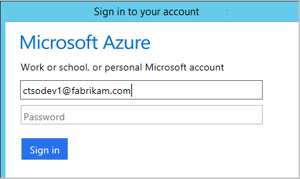
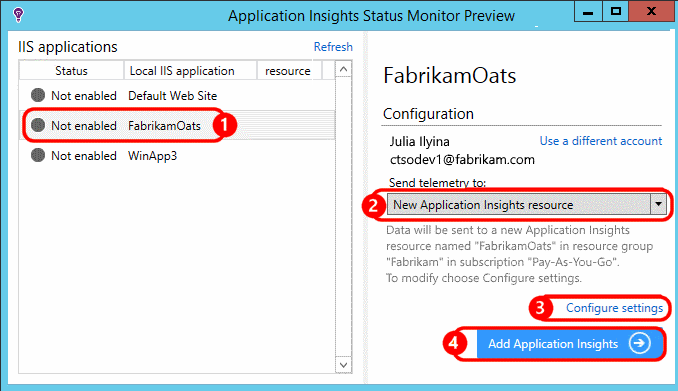
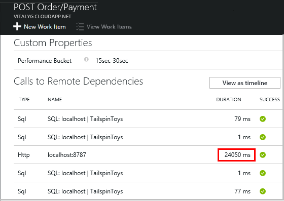
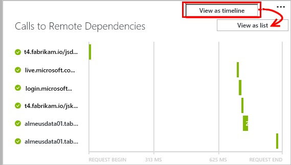

<properties 
    pageTitle="Tenere traccia nell'applicazione approfondimenti dipendenze" 
    description="Analisi utilizzo, la disponibilità e le prestazioni del locale o applicazione web di Microsoft Azure con informazioni dettagliate sui applicazione." 
    services="application-insights" 
    documentationCenter=".net"
    authors="alancameronwills" 
    manager="douge"/>

<tags 
    ms.service="application-insights" 
    ms.workload="tbd" 
    ms.tgt_pltfrm="ibiza" 
    ms.devlang="na" 
    ms.topic="article" 
    ms.date="10/24/2016" 
    ms.author="awills"/>


# <a name="set-up-application-insights-dependency-tracking"></a>Configurazione dell'applicazione Approfondimenti: la registrazione delle dipendenze


[AZURE.INCLUDE [app-insights-selector-get-started-dotnet](../../includes/app-insights-selector-get-started-dotnet.md)]


Una *dipendenza* è un componente esterno che viene chiamato tramite l'app. In genere è un servizio denominato utilizzando HTTP, o un database o un file system. In Visual Studio applicazione approfondimenti, è possibile vedere facilmente il tempo di attesa l'applicazione delle dipendenze e con quale frequenza una chiamata dipendenza ha esito negativo.


Il monitor della casella dipendenza report attualmente chiamate a questi tipi di relazioni tra:

* ASP.NET
 * Database SQL
 * Servizi WCF che utilizzano associazioni basate su HTTP e web ASP.NET
 * Chiamate HTTP locale o remote
 * Azure DocumentDb, tabella, archiviazione blob e coda
* Java
 * Chiamate a un database tramite un driver [JDBC](http://docs.oracle.com/javase/7/docs/technotes/guides/jdbc/) , ad esempio MySQL, SQL Server, PostgreSQL o SQLite.
* JavaScript nelle pagine web - della [pagina web SDK](app-insights-javascript.md) registra automaticamente le chiamate Ajax come dipendenze.

È possibile scrivere chiamate SDK per monitorare altre dipendenze tramite l' [API TrackDependency](app-insights-api-custom-events-metrics.md#track-dependency).


## <a name="to-set-up-dependency-monitoring"></a>Per impostare il monitoraggio della dipendenza

È necessario un abbonamento a [Microsoft Azure](http://azure.com) .

### <a name="if-your-app-runs-on-your-iis-server"></a>Se l'app viene eseguita nel server IIS

Se un'app web viene eseguito su .NET 4.6 o versione successiva, è possibile [installare SDK approfondimenti applicazione di](app-insights-asp-net.md) uno dei due nell'app, o installare applicazione approfondimenti stato Monitor. Non è necessario entrambe.

Installare in caso contrario, controllo dello stato di applicazione informazioni approfondite sul server:

1. Nel server web IIS, eseguire l'accesso con le credenziali di amministratore.
2. Scaricare ed eseguire il [programma di installazione di controllo dello stato](http://go.microsoft.com/fwlink/?LinkId=506648).
4. Nell'installazione guidata, accedere a Microsoft Azure.

    

    *Errori di connessione? Vedere [risoluzione dei problemi](#troubleshooting).*

5. Selezionare l'applicazione web installati o sito Web che si desidera eseguire il monitoraggio e quindi configurare la risorsa in cui si desidera visualizzare i risultati nel portale di informazioni approfondite dell'applicazione.

    

    In genere si sceglie di configurare una nuova risorsa e un [gruppo di risorse][roles].

    In caso contrario, utilizzare una risorsa esistente se è già stato configurato [test web] [ availability] per un sito o [monitoraggio dei client web][client].

6. Riavviare IIS.

    

    Verrà interrotto il servizio web per un po' di tempo breve.

6. Si noti che ApplicationInsights.config è stato inserito in web App che si desidera eseguire il monitoraggio.

    

   Esistono alcune modifiche relative alla config.

#### <a name="want-to-reconfigure-later"></a>Se si vuole (re) configurare in un secondo momento?

Dopo aver completato la procedura guidata, è possibile configurare nuovamente l'agente di ogni volta che vuole. È anche possibile utilizzare questo se è stato installato l'agente ma si è verificato un caso di problemi con l'installazione e configurazione iniziali.


### <a name="if-your-app-runs-as-an-azure-web-app"></a>Se l'app viene eseguito come un'App Web di Azure

Nel Pannello di controllo dell'App Web Azure, aggiungere l'estensione approfondimenti applicazione.


### <a name="if-its-an-azure-cloud-services-project"></a>Se si tratta di un progetto di servizi cloud Azure

[Aggiungere gli script ai ruoli web e di lavoro](app-insights-cloudservices.md#dependencies). Oppure [installare .NET framework 4.6 o versione successiva](../cloud-services/cloud-services-dotnet-install-dotnet.md).

## <a name="diagnosis"></a>Diagnosticare i problemi di prestazioni delle dipendenze

Per valutare le prestazioni delle richieste del server, aprire e il prestazioni e scorrere fino a osservare la griglia di richieste di tipo:


Quello superiore sta impiegando molto tempo. Vediamo se è possibile conoscere nel punto in cui il tempo.

Fare clic su tale riga per visualizzare gli eventi singola richiesta:


Fare clic su tutte le istanze di esecuzione prolungata per esaminare ulteriormente.

Scorrere fino a chiamate remote dipendenza correlate alla richiesta:



La maggior parte delle ora la manutenzione che della richiesta dedicata in una chiamata a un servizio locale avrà l'aspetto. 


Selezionare la riga per ottenere ulteriori informazioni:


I dati di dettaglio include informazioni sufficienti per identificare il problema.


In caso diverso, alcuna chiamata dipendenza non è lunga, ma passando alla visualizzazione sequenza temporale, è possibile vedere nel punto in cui il ritardo durante l'elaborazione interno:





## <a name="failures"></a>Errori

Se sono richieste non riuscite, fare clic sul grafico.


Fare clic su tramite un tipo di richiesta e l'istanza richiesta, per trovare una chiamata non riuscita a una dipendenza remota.


## <a name="custom-dependency-tracking"></a>Tenere traccia delle dipendenze personalizzate

Il modulo la registrazione delle dipendenze standard rileva automaticamente le relazioni esterne, ad esempio database e le API REST. Ma è consigliabile alcuni componenti aggiuntivi considerati nello stesso modo. 

È possibile scrivere codice per l'invio di informazioni sulle dipendenze, utilizzando la stessa [API TrackDependency](app-insights-api-custom-events-metrics.md#track-dependency) utilizzato da moduli standard.

Ad esempio, se si genera codice a un assembly che non si è scrivere personalmente, si potrebbero ora tutte le chiamate a, per scoprire quali contributo rende i tempi di risposta. Per questi dati visualizzati nei grafici dipendenza nell'applicazione approfondimenti, inviarlo tramite `TrackDependency`.

```C#

            var startTime = DateTime.UtcNow;
            var timer = System.Diagnostics.Stopwatch.StartNew();
            try
            {
                success = dependency.Call();
            }
            finally
            {
                timer.Stop();
                telemetry.TrackDependency("myDependency", "myCall", startTime, timer.Elapsed, success);
            }
```

Se si desidera disattivare il modulo di verifica dipendenze standard, rimuovere il riferimento alla DependencyTrackingTelemetryModule [ApplicationInsights.config](app-insights-configuration-with-applicationinsights-config.md).

## <a name="troubleshooting"></a>Risoluzione dei problemi

*Success dipendenza contrassegnare sempre Mostra true o false.*

* Eseguire l'aggiornamento alla versione più recente di SDK. Se la versione di .NET è inferiore a 4.6, installare il [controllo dello stato](app-insights-monitor-performance-live-website-now.md).

## <a name="next-steps"></a>Passaggi successivi

- [Eccezioni](app-insights-asp-net-exceptions.md)
- [Dati utente e pagina][client]
- [Disponibilità](app-insights-monitor-web-app-availability.md)


<!--Link references-->

[api]: app-insights-api-custom-events-metrics.md
[apikey]: app-insights-api-custom-events-metrics.md#ikey
[availability]: app-insights-monitor-web-app-availability.md
[azure]: ../insights-perf-analytics.md
[client]: app-insights-javascript.md
[diagnostic]: app-insights-diagnostic-search.md
[metrics]: app-insights-metrics-explorer.md
[netlogs]: app-insights-asp-net-trace-logs.md
[portal]: http://portal.azure.com/
[qna]: app-insights-troubleshoot-faq.md
[redfield]: app-insights-asp-net-dependencies.md
[roles]: app-insights-resources-roles-access-control.md

 
