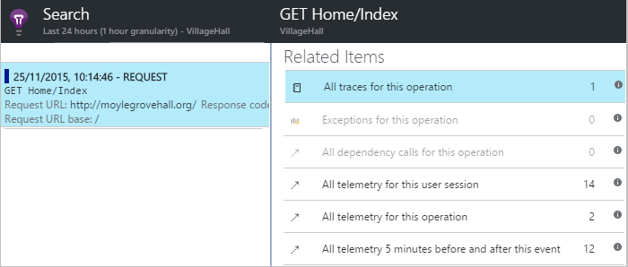

<properties 
    pageTitle="Diagnosticare errori ed eccezioni nelle applicazioni ASP.NET con informazioni dettagliate sui applicazione" 
    description="Acquisire le eccezioni da ASP.NET apps insieme telemetria richiesta." 
    services="application-insights" 
    documentationCenter=".net"
    authors="alancameronwills" 
    manager="douge"/>

<tags 
    ms.service="application-insights" 
    ms.workload="tbd" 
    ms.tgt_pltfrm="ibiza" 
    ms.devlang="na" 
    ms.topic="article" 
    ms.date="10/27/2016" 
    ms.author="awills"/>


# <a name="set-up-application-insights-diagnose-exceptions"></a>Configurazione dell'applicazione Approfondimenti: diagnosi eccezioni

[AZURE.INCLUDE [app-insights-selector-get-started-dotnet](../../includes/app-insights-selector-get-started-dotnet.md)]


Mediante il monitoraggio dell'applicazione con [Visual Studio applicazione approfondimenti][start], è possibile correlare richieste non riuscite con le eccezioni e altri eventi nel client e server, in modo che consente di individuare rapidamente le cause.

Per eseguire il monitoraggio delle applicazioni ASP.NET, è necessario [aggiungere applicazione approfondimenti SDK] [ greenbrown] per l'applicazione o [installare Monitor stato sul server IIS][redfield], o, se l'app non è un'App Web di Azure, aggiungere l' [Estensione approfondimenti dell'applicazione](app-insights-azure-web-apps.md).

## <a name="diagnosing-exceptions-using-visual-studio"></a>La diagnosi eccezioni utilizzando Visual Studio

Aprire la soluzione di app in Visual Studio per facilitare il debug.

Eseguire l'app nel server o nel computer di sviluppo utilizzando F5.

Aprire la finestra di ricerca di informazioni approfondite dell'applicazione in Visual Studio e impostarlo per visualizzare gli eventi dell'app. Mentre si esegue il debug, è possibile eseguire semplicemente facendo clic sul pulsante informazioni approfondite dell'applicazione.


Si noti che è possibile filtrare il report per visualizzare solo le eccezioni. 

*Senza eccezioni con? Vedere [acquisire le eccezioni](#exceptions).*

Fare clic su un report di un'eccezione per visualizzare la traccia dello stack.


Fare clic su un riferimento di riga nella traccia dello stack, per aprire il file pertinenti.  

## <a name="diagnosing-failures-using-the-azure-portal"></a>Diagnosi di errori nel portale di Azure

Panoramica dell'applicazione approfondimenti dell'app, il riquadro errori Mostra grafici di eccezioni e richieste HTTP, insieme a un elenco della richiesta non riuscite URL che causano errori più frequenti.


Fare clic su uno dei tipi di richiesta non riuscita nell'elenco per accedere ai singoli occorrenze dell'errore. A questo punto, fare clic su tramite le eccezioni o qualsiasi traccia dei dati:


**In alternativa,** è possibile iniziare dall'elenco di eccezioni che si trovano più in basso e l'errori. Mantenere facendo clic su fino alla fine accedere ai singoli eccezioni.


*Senza eccezioni con? Vedere [acquisire le eccezioni](#exceptions).*

Da qui è possibile esaminare la traccia dello stack e proprietà dettagliate di ogni eccezione e trovare traccia log correlati o altri eventi.


[Ulteriori informazioni sulla ricerca diagnostica][diagnostic].


## <a name="dependency-failures"></a>Errori di relazione

Una *dipendenza* è un servizio che l'applicazione chiama in genere tramite una connessione di database o API REST. [Controllo dello stato di applicazione approfondimenti] [ redfield] controlla automaticamente vari tipi di chiamata dipendenza, la misurazione durata chiamata ed esito positivo o negativo. 

Per ottenere dati sulle dipendenze, è necessario [installare controllo dello stato] [ redfield] sul server IIS o se l'app non è un'App Web di Azure, utilizzare l' [Estensione approfondimenti dell'applicazione](app-insights-azure-web-apps.md). 

Chiamate non riuscite a dipendenze sono elencate nella e errori ed è anche possibile trovarle in elementi correlati nel dettagli della richiesta e dettagli sulle eccezioni.

*Nessun errore dipendenza? Va bene. Per verificare che si ricevono dati sulle dipendenze, aprire e il prestazioni di esaminare il grafico durata relazione.*

 

## <a name="custom-tracing-and-log-data"></a>Analisi personalizzati e i dati registro

Per ottenere i dati di diagnostica specifiche per l'app, è possibile inserire codice per inviare i propri dati di telemetria. Questo visualizzate nella ricerca diagnostica insieme alla richiesta, visualizzazione della pagina e altri dati raccolti automaticamente. 

Sono disponibili diverse opzioni:

* [TrackEvent()](app-insights-api-custom-events-metrics.md#track-event) viene generalmente utilizzata per il monitoraggio dei criteri di utilizzo, ma i dati che viene inviato anche in eventi personalizzati viene visualizzato nella ricerca diagnostica. Sono denominati eventi e possono svolgere proprietà stringa e metriche numeriche in cui è possibile [filtrare le ricerche diagnostiche][diagnostic].
* [TrackTrace()](app-insights-api-custom-events-metrics.md#track-trace) consente di inviare più dati, ad esempio informazioni sull'inserimento.
* [TrackException()](#exceptions) invia tracce dello stack. [Altre informazioni sulle eccezioni](#exceptions).
* Se si usa già una struttura di registrazione come Log4Net o NLog, è possibile [raccogliere i registri] [ netlogs] e visualizzarle in ricerca diagnostica insieme a richiesta ed eccezione i dati.

Per visualizzare questi eventi, aprire [ricerca][diagnostic], aprire filtro e quindi scegliere eventi personalizzati, traccia o eccezione.


> [AZURE.NOTE] Se l'app genera molte telemetria, il modulo di esempio adattata automaticamente consente di ridurre il volume viene inviato al portale di inviando solo una frazione rappresentanza degli eventi. Gli eventi che fanno parte della stessa operazione verranno selezionati o deselezionati a livello di gruppo, in modo che è possibile spostarsi tra gli eventi correlati. [Informazioni sui campioni.](app-insights-sampling.md)

### <a name="how-to-see-request-post-data"></a>Come visualizzare i dati della richiesta POST

Dettagli della richiesta non include i dati inviati all'app in una chiamata POST. Per questi dati segnalati:

* [Installare SDK] [ greenbrown] di un progetto di applicazione.
* Inserire codice nell'applicazione di chiamare [Microsoft.ApplicationInsights.TrackTrace()][api]. Inviare i dati POST nel parametro message. Esiste un limite per la dimensione consentita, è consigliabile inviare solo i dati essenziali.
* Quando si analizza una richiesta non riuscita, trovare tracce associate.  




## <a name="exceptions"></a>Acquisizione eccezioni e dati di diagnostica correlati

Inizialmente non verrà visualizzata nel portale di tutte le eccezioni che causano errori nell'app. Si noterà eccezioni browser (se si sta utilizzando [JavaScript SDK] [ client] nelle pagine web). La maggior parte delle eccezioni server vengono rilevate dal IIS ma è necessario scrivere un po' di codice per una visione.

Si può:

* **Registrare le eccezioni in modo esplicito** mediante l'inserimento di codice in eccezioni per segnalare le eccezioni.
* Configurare il framework ASP.NET **acquisire automaticamente le eccezioni** . Le aggiunte necessarie sono diverse per diversi tipi di framework.

## <a name="reporting-exceptions-explicitly"></a>Segnalazione di eccezioni in modo esplicito

Il modo più semplice consiste nel inserire una chiamata a TrackException() in un gestore eccezioni.

JavaScript

    try 
    { ...
    }
    catch (ex)
    {
      appInsights.trackException(ex, "handler loc",
        {Game: currentGame.Name, 
         State: currentGame.State.ToString()});
    }

C#

    var telemetry = new TelemetryClient();
    ...
    try 
    { ...
    }
    catch (Exception ex)
    {
       // Set up some properties:
       var properties = new Dictionary <string, string> 
         {{"Game", currentGame.Name}};

       var measurements = new Dictionary <string, double>
         {{"Users", currentGame.Users.Count}};

       // Send the exception telemetry:
       telemetry.TrackException(ex, properties, measurements);
    }

VISUAL BASIC

    Dim telemetry = New TelemetryClient
    ...
    Try
      ...
    Catch ex as Exception
      ' Set up some properties:
      Dim properties = New Dictionary (Of String, String)
      properties.Add("Game", currentGame.Name)

      Dim measurements = New Dictionary (Of String, Double)
      measurements.Add("Users", currentGame.Users.Count)
  
      ' Send the exception telemetry:
      telemetry.TrackException(ex, properties, measurements)
    End Try

I parametri di proprietà e le misure sono facoltativi, ma sono utili per [il filtraggio e aggiunta di] [ diagnostic] informazioni aggiuntive. Se si dispone di un'app che è possibile eseguire giochi diversi, ad esempio, è possibile trovare tutti i report di eccezione correlati a un determinato gioco. È possibile aggiungere tutti gli elementi in una tabella per ciascun dizionario.

## <a name="browser-exceptions"></a>Eccezioni browser

La maggior parte dei browser eccezioni sono segnalato.

Se la pagina web include i file di script reti per la distribuzione del contenuto o altri domini, assicurarsi che il tag script abbia l'attributo ```crossorigin="anonymous"```, e che il server invia [intestazioni CORS](http://enable-cors.org/). Sarà possibile ottenere una traccia dello stack e dettaglio per le eccezioni JavaScript dalle risorse seguenti.

## <a name="web-forms"></a>Moduli per Web

Per i moduli del web, il modulo HTTP saranno in grado di raccogliere le eccezioni quando non esistono reindirizzamenti configurati con CustomErrors.

Ma se si dispone di reindirizzamenti attivi, aggiungere le seguenti righe alla funzione Application_Error Global.asax.cs. Aggiungere un file asax se non si dispone già uno.

*C#*

    void Application_Error(object sender, EventArgs e)
    {
      if (HttpContext.Current.IsCustomErrorEnabled && Server.GetLastError  () != null)
      {
         var ai = new TelemetryClient(); // or re-use an existing instance

         ai.TrackException(Server.GetLastError());
      }
    }


## <a name="mvc"></a>MVC

Se la configurazione [CustomErrors](https://msdn.microsoft.com/library/h0hfz6fc.aspx) `Off`, quindi eccezioni sarà disponibile per il [Modulo HTTP](https://msdn.microsoft.com/library/ms178468.aspx) per la raccolta. Tuttavia, se si tratta di `RemoteOnly` (impostazione predefinita) o `On`, quindi l'eccezione sarà deselezionata e non è disponibile per informazioni dettagliate sui applicazione per la raccolta di automaticamente. È possibile correggere che si esegue l'override della [classe System.Web.Mvc.HandleErrorAttribute](http://msdn.microsoft.com/library/system.web.mvc.handleerrorattribute.aspx)e applicando classi override come illustrato per le diverse versioni MVC sotto ([origine github](https://github.com/AppInsightsSamples/Mvc2UnhandledExceptions/blob/master/MVC2App/Controllers/AiHandleErrorAttribute.cs)):

    using System;
    using System.Web.Mvc;
    using Microsoft.ApplicationInsights;

    namespace MVC2App.Controllers
    {
      [AttributeUsage(AttributeTargets.Class | AttributeTargets.Method, Inherited = true, AllowMultiple = true)] 
      public class AiHandleErrorAttribute : HandleErrorAttribute
      {
        public override void OnException(ExceptionContext filterContext)
        {
            if (filterContext != null && filterContext.HttpContext != null && filterContext.Exception != null)
            {
                //If customError is Off, then AI HTTPModule will report the exception
                if (filterContext.HttpContext.IsCustomErrorEnabled)
                {   //or reuse instance (recommended!). see note above  
                    var ai = new TelemetryClient();
                    ai.TrackException(filterContext.Exception);
                } 
            }
            base.OnException(filterContext);
        }
      }
    }

#### <a name="mvc-2"></a>MVC 2

Sostituire l'attributo HandleError con il nuovo attributo di controller di.

    namespace MVC2App.Controllers
    {
       [AiHandleError]
       public class HomeController : Controller
       {
    ...

[Esempio](https://github.com/AppInsightsSamples/Mvc2UnhandledExceptions)

#### <a name="mvc-3"></a>MVC 3

Eseguire la registrazione `AiHandleErrorAttribute` come filtro globale in Global.asax.cs:

    public class MyMvcApplication : System.Web.HttpApplication
    {
      public static void RegisterGlobalFilters(GlobalFilterCollection filters)
      {
         filters.Add(new AiHandleErrorAttribute());
      }
     ...

[Esempio](https://github.com/AppInsightsSamples/Mvc3UnhandledExceptionTelemetry)


#### <a name="mvc-4-mvc5"></a>MVC 4, MVC5

Registrare AiHandleErrorAttribute come filtro globale in FilterConfig.cs:

    public class FilterConfig
    {
      public static void RegisterGlobalFilters(GlobalFilterCollection filters)
      {
        // Default replaced with the override to track unhandled exceptions
        filters.Add(new AiHandleErrorAttribute());
      }
    }

[Esempio](https://github.com/AppInsightsSamples/Mvc5UnhandledExceptionTelemetry)

## <a name="web-api-1x"></a>API Web 1. x


Ignorare System.Web.Http.Filters.ExceptionFilterAttribute:

    using System.Web.Http.Filters;
    using Microsoft.ApplicationInsights;

    namespace WebAPI.App_Start
    {
      public class AiExceptionFilterAttribute : ExceptionFilterAttribute
      {
        public override void OnException(HttpActionExecutedContext actionExecutedContext)
        {
            if (actionExecutedContext != null && actionExecutedContext.Exception != null)
            {  //or reuse instance (recommended!). see note above 
                var ai = new TelemetryClient();
                ai.TrackException(actionExecutedContext.Exception);    
            }
            base.OnException(actionExecutedContext);
        }
      }
    }

Si può aggiungere questo attributo override controller specifico o aggiungerla alla configurazione del filtro globale nella classe WebApiConfig: 

    using System.Web.Http;
    using WebApi1.x.App_Start;

    namespace WebApi1.x
    {
      public static class WebApiConfig
      {
        public static void Register(HttpConfiguration config)
        {
            config.Routes.MapHttpRoute(name: "DefaultApi", routeTemplate: "api/{controller}/{id}",
                defaults: new { id = RouteParameter.Optional });
            ...
            config.EnableSystemDiagnosticsTracing();

            // Capture exceptions for Application Insights:
            config.Filters.Add(new AiExceptionFilterAttribute());
        }
      }
    }

[Esempio](https://github.com/AppInsightsSamples/WebApi_1.x_UnhandledExceptions)

Sono disponibili molti casi i filtri di eccezione non gestiscono da. Per esempio:

* Eccezioni generate da costruttori controller. 
* Eccezioni generate da gestori di messaggi. 
* Eccezioni durante il routing. 
* Eccezioni generate durante la serializzazione del contenuto di risposta. 

## <a name="web-api-2x"></a>API Web 2. x

Aggiungere un'implementazione di IExceptionLogger:

    using System.Web.Http.ExceptionHandling;
    using Microsoft.ApplicationInsights;

    namespace ProductsAppPureWebAPI.App_Start
    {
      public class AiExceptionLogger : ExceptionLogger
      {
        public override void Log(ExceptionLoggerContext context)
        {
            if (context !=null && context.Exception != null)
            {//or reuse instance (recommended!). see note above 
                var ai = new TelemetryClient();
                ai.TrackException(context.Exception);
            }
            base.Log(context);
        }
      }
    }

Aggiungere i servizi di WebApiConfig:

    using System.Web.Http;
    using System.Web.Http.ExceptionHandling;
    using ProductsAppPureWebAPI.App_Start;

    namespace WebApi2WithMVC
    {
      public static class WebApiConfig
      {
        public static void Register(HttpConfiguration config)
        {
            // Web API configuration and services

            // Web API routes
            config.MapHttpAttributeRoutes();

            config.Routes.MapHttpRoute(
                name: "DefaultApi",
                routeTemplate: "api/{controller}/{id}",
                defaults: new { id = RouteParameter.Optional }
            );
            config.Services.Add(typeof(IExceptionLogger), new AiExceptionLogger()); 
        }
      }
  }

[Esempio](https://github.com/AppInsightsSamples/WebApi_2.x_UnhandledExceptions)

In alternativa, è possibile:

2. Sostituire ExceptionHandler solo con un'implementazione personalizzata di IExceptionHandler. Questo comando si chiama solo quando il framework è ancora possibile scegliere quale messaggio di risposta da inviare (non quando la connessione viene annullata, ad esempio) 
3. Filtri eccezioni (come descritto nella sezione dei controller di 1. x API Web precedenti) - non è stati chiamati in tutti i casi.


## <a name="wcf"></a>WCF

Aggiungere una classe che estende attributo e implementazione IErrorHandler e IServiceBehavior.

    using System;
    using System.Collections.Generic;
    using System.Linq;
    using System.ServiceModel.Description;
    using System.ServiceModel.Dispatcher;
    using System.Web;
    using Microsoft.ApplicationInsights;

    namespace WcfService4.ErrorHandling
    {
      public class AiLogExceptionAttribute : Attribute, IErrorHandler, IServiceBehavior
      {
        public void AddBindingParameters(ServiceDescription serviceDescription,
            System.ServiceModel.ServiceHostBase serviceHostBase,
            System.Collections.ObjectModel.Collection<ServiceEndpoint> endpoints,
            System.ServiceModel.Channels.BindingParameterCollection bindingParameters)
        {
        }

        public void ApplyDispatchBehavior(ServiceDescription serviceDescription, 
            System.ServiceModel.ServiceHostBase serviceHostBase)
        {
            foreach (ChannelDispatcher disp in serviceHostBase.ChannelDispatchers)
            {
                disp.ErrorHandlers.Add(this);
            }
        }

        public void Validate(ServiceDescription serviceDescription, 
            System.ServiceModel.ServiceHostBase serviceHostBase)
        {
        }

        bool IErrorHandler.HandleError(Exception error)
        {//or reuse instance (recommended!). see note above 
            var ai = new TelemetryClient();

            ai.TrackException(error);
            return false;
        }

        void IErrorHandler.ProvideFault(Exception error, 
            System.ServiceModel.Channels.MessageVersion version, 
            ref System.ServiceModel.Channels.Message fault)
        {
        }
      }
    }

Aggiungere l'attributo implementazioni del servizio:

    namespace WcfService4
    {
        [AiLogException]
        public class Service1 : IService1 
        { 
         ...

[Esempio](https://github.com/AppInsightsSamples/WCFUnhandledExceptions)

## <a name="exception-performance-counters"></a>Per prestazioni eccezioni

Se è installato, [Controllo dello stato] [ redfield] sul server, è possibile ottenere un grafico del tasso di eccezioni, da .NET. Include le eccezioni .NET gestite e non gestite.

Aprire una pala Explorer unità di misura metriche, aggiungere un nuovo grafico e selezionare **tasso eccezione**elencata con contatori delle prestazioni. 

.NET framework calcola il tasso di conteggio del numero di eccezioni in un intervallo e dividendo per la durata dell'intervallo. 

Si noti che questo sia diverso da conteggio 'Eccezioni' calcolato dal portale di applicazione approfondimenti contando TrackException report. Gli intervalli di campioni sono diversi e SDK di non invia report TrackException per l'intero gestito e non gestite.

<!--Link references-->

[api]: app-insights-api-custom-events-metrics.md
[client]: app-insights-javascript.md
[diagnostic]: app-insights-diagnostic-search.md
[greenbrown]: app-insights-asp-net.md
[netlogs]: app-insights-asp-net-trace-logs.md
[redfield]: app-insights-monitor-performance-live-website-now.md
[start]: app-insights-overview.md

 
