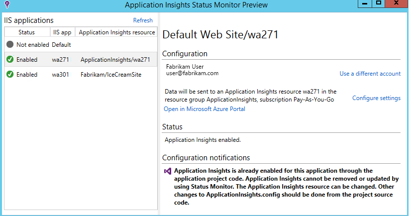
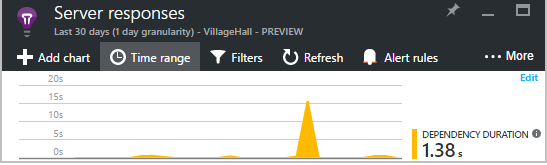
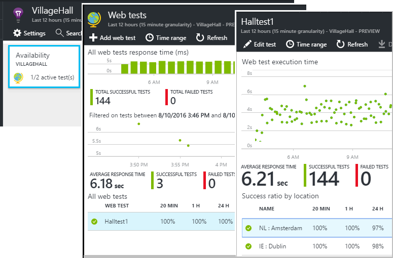

<properties 
    pageTitle="Sfruttare al meglio approfondimenti applicazione | Microsoft Azure" 
    description="Dopo la Guida introduttiva a informazioni dettagliate sui applicazione, di seguito è riportato un riepilogo delle caratteristiche è possibile esplorare." 
    services="application-insights" 
    documentationCenter=".net"
    authors="alancameronwills" 
    manager="douge"/>

<tags 
    ms.service="application-insights" 
    ms.workload="tbd" 
    ms.tgt_pltfrm="ibiza" 
    ms.devlang="na" 
    ms.topic="article" 
    ms.date="10/27/2016" 
    ms.author="awills"/>

# <a name="more-telemetry-from-application-insights"></a>Ulteriori telemetria dall'applicazione approfondimenti

Dopo avere [aggiunto approfondimenti applicazione al codice ASP.NET](app-insights-asp-net.md), esistono alcune operazioni da eseguire per ottenere ulteriori telemetria. 

## <a name="if-your-app-runs-on-your-iis-server-"></a>Se l'app viene eseguita nel server IIS...

Se l'app viene ospitato nel server IIS nel controllo, installare il controllo dello stato di applicazione approfondimenti sui server. Se è già installato, non occorre fare nulla.

1. In ogni server web IIS, accedere con le credenziali di amministratore.
2. Scaricare ed eseguire il [programma di installazione di controllo dello stato](http://go.microsoft.com/fwlink/?LinkId=506648).
3. Nell'installazione guidata, accedere a Microsoft Azure.

Non è necessario eseguire altre operazioni, ma è possibile verificare che il monitoraggio sia abilitato per l'app.



(È possibile anche utilizzare controllo dello stato per [attivare il monitoraggio in fase di esecuzione](app-insights-monitor-performance-live-website-now.md), anche se non si è dotare le App in Visual Studio.)

### <a name="what-do-you-get"></a>Cosa viene visualizzato?

Se controllo dello stato è installato nel computer server, si riceverà alcune telemetria aggiuntiva:

* Telemetria dipendenza (chiamate SQL e chiamate resto effettuate dall'app) per le applicazioni .NET 4.5. (Nelle versioni successive di .NET, controllo dello stato non è necessario per telemetria dipendenza.) 
* Analisi dello stack eccezione per visualizzare ulteriori dettagli.
* Contatori delle prestazioni. In applicazione approfondimenti, questi contatori vengono visualizzati e il server. 


Per visualizzare più o meno contatori, [modificare i tipi di grafici](app-insights-metrics-explorer.md). Se il contatore delle prestazioni desiderato non è nell'insieme disponibile, è possibile [aggiungerlo al set di raccolti dal modulo di indicatore di prestazioni](app-insights-performance-counters.md).

## <a name="if-its-an-azure-web-app-"></a>Se si tratta di un'app web Azure...

Se l'app viene eseguita come un'app web Azure, passare al pannello di controllo Azure per app o macchine Virtuali e aprire e l'approfondimenti applicazione. 

### <a name="what-do-you-get"></a>Cosa viene visualizzato?

* Analisi dello stack eccezione per visualizzare ulteriori dettagli.
* Telemetria dipendenza (chiamate SQL e chiamate resto effettuate dall'app) per le applicazioni .NET 4.5. (Nelle versioni successive di .NET, l'estensione non è necessario per telemetria dipendenza.) 



(È possibile anche utilizzare questo metodo per [abilitare in fase di esecuzione di monitoraggio delle prestazioni](app-insights-monitor-performance-live-website-now.md), anche se non si è dotare l'app in Visual Studio.)

## <a name="client-side-monitoring"></a>Monitoraggio lato client

È stato installato SDK che invia dati di telemetria dal server (back-end) dell'applicazione. A questo punto è possibile aggiungere il monitoraggio lato client. In questo modo si dati gli utenti, sessioni, visualizzazioni delle pagine e le eccezioni o anomalo che si verifica nel browser. Inoltre, sarà possibile scrivere codice personalizzato per tenere traccia di funzionamento agli utenti con l'app, a destra fino al livello dettagliato delle pressioni di tasti.

Aggiungere il frammento di codice JavaScript approfondimenti applicazione a ogni pagina web, per ottenere telemetria dal browser client.

1. In Azure, aprire la risorsa applicazione approfondimenti per l'app.
2. Aprire Guida introduttiva, sul lato Client Monitor e copiare il frammento di codice.
3. Incollare il codice in modo che venga visualizzato nell'intestazione della pagina web, in genere che è possibile eseguire questa operazione incollata nella pagina layout schema.


Si noti che il codice contiene la chiave strumentazione che identifica la risorsa dell'applicazione.

### <a name="what-do-you-get"></a>Cosa viene visualizzato?

* È possibile scrivere JavaScript per l'invio di [telemetria personalizzato da pagine web](app-insights-api-custom-events-metrics.md), ad esempio tenere traccia di pulsanti.
* [Analitica](app-insights-analytics.md), dati in `pageViews` e dati AJAX in `dependencies`. 
* [Client dati sulle prestazioni e l'uso](app-insights-javascript.md) in e il browser.


[Ulteriori informazioni sulla pagina web verifica.](app-insights-web-track-usage.md)


## <a name="track-application-version"></a>Versione di tenere traccia dell'applicazione

Assicurarsi che `buildinfo.config` viene generato dal processo MSBuild. Nel file csproj aggiungere:  

```XML

    <PropertyGroup>
      <GenerateBuildInfoConfigFile>true</GenerateBuildInfoConfigFile>    <IncludeServerNameInBuildInfo>true</IncludeServerNameInBuildInfo>
    </PropertyGroup> 
```

Quando è stato modificato le informazioni, il modulo web approfondimenti applicazione aggiunge automaticamente **versione dell'applicazione** come proprietà su tutti gli elementi di telemetria. Consente di filtrare in base al versione durante l'esecuzione di [ricerche diagnostiche](app-insights-diagnostic-search.md) o quando [esplorazione metriche](app-insights-metrics-explorer.md). 

Tuttavia, si noterà che il numero di versione build generato solo da Build MS, non tramite la compilazione di sviluppo in Visual Studio.


## <a name="availability-web-tests"></a>Test web disponibilità

Inviare un'app web di richieste HTTP a intervalli regolari da tutto il mondo. È un avviso se la risposta è lenta o non affidabili.

In risorse di applicazione approfondimenti per l'app, fare clic sul riquadro disponibilità per aggiungere, modificare e visualizzare i test web.

È possibile aggiungere più test in esecuzione in più posizioni.



[Ulteriori informazioni](app-insights-monitor-web-app-availability.md)

## <a name="custom-telemetry-and-logging"></a>Registrazione e telemetria personalizzato

I pacchetti di applicazione approfondimenti aggiunti al codice forniscono un'API che è possibile chiamare dall'applicazione in uso.

* [Generare il proprio metriche ed eventi](app-insights-api-custom-events-metrics.md), ad esempio per contare gli eventi di business o monitoraggio delle prestazioni.
* [Le tracce di log di acquisizione](app-insights-asp-net-trace-logs.md) da Log4Net, NLog o System.Diagnostics.Trace.
* [Filtrare, modificare, o per migliorare](app-insights-api-filtering-sampling.md) la standard telemetria inviato dell'App scrivendo telemetria processori. 


## <a name="powerful-analysis-and-presentation"></a>Presentazione e analisi potenti

Esistono diverse soluzioni per esplorare i dati. Se è stata avviata recente con informazioni dettagliate sui applicazione, consultare i seguenti articoli:

||
|---|---
|[**Ricerca di diagnostica, ad esempio dati**](app-insights-visual-studio.md)<br/>Ricerca e filtro eventi, ad esempio richieste, eccezioni, le chiamate dipendenza, accedere tracce e visualizzazioni della pagina. In Visual Studio, passare al codice da tracce dello stack.|
|[**Esplora metriche per i dati aggregati**](app-insights-metrics-explorer.md)<br/>Esplorare, filtrare e segmento dati aggregati, ad esempio tassi di richieste, gli errori ed eccezioni; tempi di risposta, i tempi di caricamento della pagina.|
|[**Dashboard**](app-insights-dashboards.md#dashboards)<br/>Eseguire il mashup di dati da più risorse e condividerlo con altri utenti. Ideale per le applicazioni più componente e per la visualizzazione continua nella sala del team.  |
|[**Flusso metriche Live**](app-insights-metrics-explorer.md#live-metrics-stream)<br/>Quando si distribuisce una nuova compilazione, guardare questi indicatori di prestazioni vicino tempo reale per assicurarsi che tutto funzioni come previsto.|
|[**Analitica**](app-insights-analytics.md)<br/>Risposte alle domande più difficili sulle prestazioni e l'utilizzo dell'app utilizzando questo linguaggio di query avanzate.|
|[**Avvisi automatici e manuali**](app-insights-alerts.md)<br/>Avvisi automatici adatta ai modelli normale dell'applicazione di telemetria e condizione di attivazione quando si è verificato un esterne motivo comune. È anche possibile impostare avvisi sui livelli particolari di metriche personalizzate o standard.|

## <a name="data-management"></a>Gestione dei dati

|||
|---|---|
|[**Esportazione continuo**](app-insights-export-telemetry.md)<br/>Copiare tutte le telemetria lo spazio di archiviazione in modo che è possibile analizzare in altro modo.|
|**API di accesso ai dati**<br/>Prossimamente.|
|[**Esempio**](app-insights-sampling.md)<br/>Consente di ridurre la velocità e consente di non superare il limite del livello prezzo.|