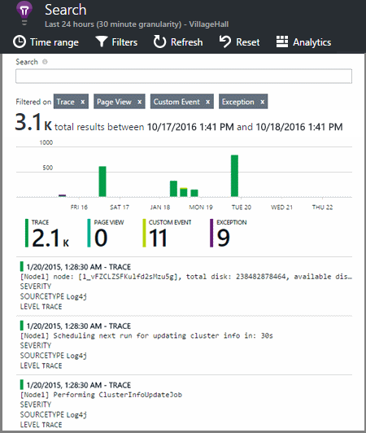

<properties 
    pageTitle="Esplorare i registri di traccia .NET nell'applicazione approfondimenti" 
    description="Log di ricerca generati con traccia, NLog o Log4Net." 
    services="application-insights" 
    documentationCenter=".net"
    authors="alancameronwills" 
    manager="douge"/>

<tags 
    ms.service="application-insights" 
    ms.workload="tbd" 
    ms.tgt_pltfrm="ibiza" 
    ms.devlang="na" 
    ms.topic="article" 
    ms.date="07/21/2016" 
    ms.author="awills"/>
 
# <a name="explore-net-trace-logs-in-application-insights"></a>Esplorare i registri di traccia .NET nell'applicazione approfondimenti  

Se si usa NLog log4Net o System.Diagnostics.Trace per analisi diagnostica nell'applicazione ASP.NET è possibile impostare i registri inviati a [Informazioni dettagliate sui applicazione di Visual Studio][start], in cui è possibile esplorare ed eseguire ricerche nelle. Verranno uniti i log di telemetria di provenienti da un'applicazione, in modo che è possibile identificare le tracce associate a ogni richiesta dell'utente di manutenzione e metterle con altri eventi e un report sulle eccezioni.


> [AZURE.NOTE] Il modulo di acquisizione di log è necessario? Si tratta di una scheda utile per festa 3o logger, ma se non si usa già NLog, log4Net o System.Diagnostics.Trace, provare a solo chiamare direttamente [Applicazione approfondimenti TrackTrace()](app-insights-api-custom-events-metrics.md#track-trace) .


## <a name="install-logging-on-your-app"></a>Installare l'accesso l'app

Installare il framework di registrazione scelta di un progetto. Questo causerà una voce nell'App o Web. config.

Se si usa System.Diagnostics.Trace, è necessario aggiungere una voce config:

```XML

    <configuration>
     <system.diagnostics>
       <trace autoflush="false" indentsize="4">
         <listeners>
           <add name="myListener" 
             type="System.Diagnostics.TextWriterTraceListener" 
             initializeData="TextWriterOutput.log" />
           <remove name="Default" />
         </listeners>
       </trace>
     </system.diagnostics>
   </configuration>
```

## <a name="configure-application-insights-to-collect-logs"></a>Configurare l'applicazione approfondimenti per raccogliere i registri

**[Aggiungere informazioni dettagliate sui applicazione al progetto](app-insights-asp-net.md)** se si è già fatto che ancora. Sarà disponibile un'opzione per includere il raccoglitore log.

O **Configurare approfondimenti applicazione** facendo clic con il progetto in Esplora soluzioni. Selezionare l'opzione per **la raccolta di traccia Configura**.

*Nessuna opzione di Raccoglitore menu o il registro applicazione approfondimenti?* Provare [la risoluzione dei problemi](#troubleshooting).


## <a name="manual-installation"></a>Installazione manuale

Utilizzare questo metodo se il tipo di progetto non è supportato dal programma di installazione approfondimenti applicazione (ad esempio un desktop progetto Windows). 

1. Se si prevede di utilizzare log4Net o NLog, installarlo in un progetto. 
2. In Esplora soluzioni mouse sul progetto e scegliere **Gestisci pacchetti NuGet**.
3. Ricerca di "Applicazione approfondimenti"

    

4. Selezionare il pacchetto appropriato - uno dei:
  + Microsoft.ApplicationInsights.TraceListener (per acquisire System.Diagnostics.Trace chiamate)
  + Microsoft.ApplicationInsights.NLogTarget
  + Microsoft.ApplicationInsights.Log4NetAppender

Pacchetto NuGet installa assembly necessari e consente di modificare anche config o App.

## <a name="insert-diagnostic-log-calls"></a>Inserire le chiamate del log diagnostici

Se si usa System.Diagnostics.Trace, dovrebbero essere una tipica chiamata:

    System.Diagnostics.Trace.TraceWarning("Slow response - database01");

Se si preferisce log4net o NLog:

    logger.Warn("Slow response - database01");


## <a name="using-the-trace-api-directly"></a>Utilizzare la traccia API direttamente

È possibile chiamare direttamente la traccia di applicazione approfondimenti API. Le schede di registrazione utilizzano questa API. 

Per esempio:

    var telemetry = new Microsoft.ApplicationInsights.TelemetryClient();
    telemetry.TrackTrace("Slow response - database01");

Il vantaggio di TrackTrace è che è possibile inserire dati relativamente lunghi nel messaggio. Ad esempio, si potrebbero codificare sono i dati di POST. 

Inoltre, è possibile aggiungere un livello di gravità al messaggio. E, ad esempio altri telemetria, è possibile aggiungere i valori di proprietà che è possibile utilizzare per filtrare o per la ricerca per diversi set di tracce. Per esempio:


    var telemetry = new Microsoft.ApplicationInsights.TelemetryClient();
    telemetry.TrackTrace("Slow database response",
                   SeverityLevel.Warning,
                   new Dictionary<string,string> { {"database", db.ID} });

In questo modo, in [ricerca][diagnostic], per applicare un filtro con facilità tutti i messaggi di un livello particolare gravità relative a un determinato database.

## <a name="explore-your-logs"></a>Esplorare i log

Eseguire l'app in modalità di debug o distribuire live.

In blade panoramica dell'app nel [portale di applicazione approfondimenti][portal], scegliere [Cerca][diagnostic].




È possibile, ad esempio:

* Filtrare le tracce di log o a elementi con proprietà specifiche
* Esaminare un elemento specifico in modo dettagliato.
* Trovare altri telemetria relative alla richiesta di utente stesso (vale a dire con la stessa OperationId) 
* Salvare la configurazione di questa pagina ai Preferiti

> [AZURE.NOTE] **Esempio.** Se l'applicazione invia una grande quantità di dati e si utilizza SDK approfondimenti di applicazione per ASP.NET versione 2.0.0-beta3 o versioni successive, la caratteristica di adattamento campioni potrebbe funzionare e inviare solo una percentuale del telemetria. [Ulteriori informazioni su campioni.](app-insights-sampling.md)

## <a name="next-steps"></a>Passaggi successivi

[Diagnosticare errori ed eccezioni ASP.NET][exceptions]

[Ulteriori informazioni sulla ricerca][diagnostic].


## <a name="troubleshooting"></a>Risoluzione dei problemi

### <a name="how-do-i-do-this-for-java"></a>Come faccio questo per Java?

Usare le [schede del Registro di linguaggio](app-insights-java-trace-logs.md).

### <a name="theres-no-application-insights-option-on-the-project-context-menu"></a>Non è approfondimenti applicazione nel menu di scelta rapida di progetto

* Selezionare Strumenti approfondimenti applicazione è installato nel computer di sviluppo. In Visual Studio dal menu Strumenti, estensioni e aggiornamenti, cercare applicazione approfondimenti strumenti. Se non è nella scheda installazione, aprire la scheda Online e installarlo.
* Può trattarsi di un tipo di progetto non è supportata dagli strumenti approfondimenti applicazione. Utilizzare [l'installazione manuale](#manual-installation).

### <a name="no-log-adapter-option-in-the-configuration-tool"></a>Opzione Nessun scheda log nello strumento di configurazione

* È necessario installare prima di tutto la struttura di registrazione.
* Se si usa System.Diagnostics.Trace, verificare che si [configurandolo in `web.config` ](https://msdn.microsoft.com/library/system.diagnostics.eventlogtracelistener.aspx).
* È stato ottenuto la versione più recente degli strumenti applicazione approfondimenti? Nel menu **Strumenti** di Visual Studio, scegliere **estensioni e aggiornamenti**e aprire la scheda **aggiornamenti** . Se strumenti approfondimenti applicazione è presente, fare clic su per eseguire l'aggiornamento.


### <a name="emptykey"></a>Viene visualizzato un messaggio di errore "strumentazione chiave non può essere vuota"

Simile è installato il pacchetto di Nuget scheda registrazione senza installare approfondimenti applicazione.

In Esplora soluzioni fare doppio clic `ApplicationInsights.config` e scegliere **Aggiorna applicazione approfondimenti**. Si riceverà una finestra di dialogo che richiede di accedere a Azure e creare una risorsa applicazione approfondimenti o riutilizzare uno esistente. Che deve risolvere il problema.

### <a name="i-can-see-traces-in-diagnostic-search-but-not-the-other-events"></a>È possibile visualizzare le tracce in ricerca diagnostica, ma non altri eventi

Alcuni casi potrebbe richiedere qualche minuto per tutti gli eventi e le richieste di passano attraverso la pipeline.

### <a name="limits"></a>Viene mantenuta la quantità di dati?

Fino a 500 eventi al secondo da ogni applicazione. Eventi vengono conservati per sette giorni.

### <a name="im-not-seeing-some-of-the-log-entries-that-i-expect"></a>Non vengono visualizzate alcune delle voci di log che sta aspettando

Se l'applicazione invia una grande quantità di dati e si utilizza SDK approfondimenti di applicazione per ASP.NET versione 2.0.0-beta3 o versioni successive, la caratteristica di adattamento campioni potrebbe funzionare e inviare solo una percentuale del telemetria. [Ulteriori informazioni su campioni.](app-insights-sampling.md)

## <a name="add"></a>Passaggi successivi

* [Configurare la disponibilità e i test di velocità di risposta][availability]
* [Risoluzione dei problemi][qna]


<!--Link references-->

[availability]: app-insights-monitor-web-app-availability.md
[diagnostic]: app-insights-diagnostic-search.md
[exceptions]: app-insights-asp-net-exceptions.md
[portal]: https://portal.azure.com/
[qna]: app-insights-troubleshoot-faq.md
[start]: app-insights-overview.md

 
