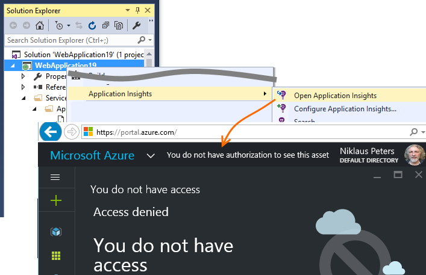

<properties 
    pageTitle="Risoluzione dei problemi senza dati - approfondimenti applicazione per .NET" 
    description="Non vengono visualizzate dati in Visual Studio applicazione approfondimenti? Provare qui." 
    services="application-insights" 
    documentationCenter=".net"
    authors="alancameronwills" 
    manager="douge"/>

<tags 
    ms.service="application-insights" 
    ms.workload="mobile" 
    ms.tgt_pltfrm="ibiza" 
    ms.devlang="na" 
    ms.topic="article" 
    ms.date="10/24/2016" 
    ms.author="awills"/>
 
# Risoluzione dei problemi senza dati - approfondimenti applicazione per .NET

## Alcune delle personale telemetria mancante

*In applicazione approfondimenti, vengono visualizzati solo una frazione degli eventi generati dall'app.*

* Se si visualizzano in modo coerente la stessa frazione, è probabile che adattata [campioni](app-insights-sampling.md). Per verificarlo, aprire ricerca (da e il panoramica) ed esaminare un'istanza di una richiesta o un altro evento. Nella parte inferiore della sezione Proprietà fare clic su "…" per ottenere informazioni dettagliate sulla proprietà completo. Se richiedere Count > 1, quindi campioni sono in esecuzione. 
* In caso contrario, è possibile si sta raggiungere un [limitare velocità dati](app-insights-pricing.md#limits-summary) per il piano di prezzo. Questi limiti vengono applicati al minuto.

## Nessun dato dal server

*Sul server web è stata installata app e non sono visibili qualsiasi telemetria da essa. Sarà stata eseguita correttamente OK sul mio computer dev.*

* Probabilmente un problema di firewall. [Impostare le eccezioni firewall per informazioni dettagliate sui applicazione inviare i dati](app-insights-ip-addresses.md).

*È [installato controllo dello stato](app-insights-monitor-performance-live-website-now.md) sul server web per eseguire il monitoraggio delle App esistente. Non è visualizzato alcun risultato.*

* Vedere [risoluzione dei problemi di controllo dello stato](app-insights-monitor-performance-live-website-now.md#troubleshooting). 

## Nessuna opzione 'Aggiungi applicazione approfondimenti' in Visual Studio

*Quando crea un nuovo progetto in Visual Studio o fa clic con il pulsante destro un progetto esistente in Esplora soluzioni, non è visualizzato le opzioni di informazioni approfondite dell'applicazione.*

+ Non tutti i tipi di progetto .NET supportati dagli strumenti. Progetti WCF e Web sono supportati. Per altri tipi di progetto, ad esempio le applicazioni desktop o servizio, è possibile [aggiungere manualmente un SDK approfondimenti applicazione al progetto](app-insights-windows-desktop.md).
+ Accertarsi di avere [aggiornamento di Visual Studio 2013 3 o versione successiva](http://go.microsoft.com/fwlink/?LinkId=397827). Sono preinstallato con gli strumenti approfondimenti applicazione.
+ Selezionare **Strumenti**, **estensioni e aggiornamenti** e verificare che **l'Applicazione approfondimenti strumenti** sia installato e abilitato. In caso affermativo, fare clic su **aggiornamenti** per verificare se è disponibile un aggiornamento.
+ Aprire la finestra di dialogo Nuovo progetto e scegliere applicazione Web ASP.NET. Se viene visualizzato l'opzione applicazione approfondimenti sono, vengono installati gli strumenti. In caso contrario, provare a disinstallare e reinstallare gli strumenti di informazioni approfondite dell'applicazione.

## Impossibile aggiungere informazioni dettagliate sui applicazione

*Quando si crea un nuovo progetto web o quando si tenta di aggiungere informazioni dettagliate sui applicazione a un progetto esistente, viene visualizzato un messaggio di errore.*

Possibili cause:

* Comunicazione con il portale di informazioni dettagliate sui applicazione non è riuscita. o
* Esiste un problema con l'account Azure;
* È sufficiente [accesso in lettura per l'abbonamento o il gruppo in cui si stava cercando di creare la nuova risorsa](app-insights-resources-roles-access-control.md).

Correzione:

+ Selezionare specificato credenziali di accesso per l'account Azure verso destra. 
+ Nel browser, verificare di avere accesso al [portale di Azure](https://portal.azure.com). Aprire impostazioni e controllare se è presente nessuna restrizione.
+ [Aggiungere informazioni dettagliate sui applicazione al progetto esistente](app-insights-asp-net.md): In Esplora soluzioni fare clic con il pulsante destro del progetto e scegliere "Aggiungi applicazione approfondimenti".
+ Se continua a non funzionare, seguire la [procedura manuale](app-insights-windows-services.md) per aggiungere una risorsa nel portale e quindi aggiungere il SDK al progetto. 

## Viene visualizzato un messaggio di errore "strumentazione chiave non può essere vuota"

Probabilmente si è verificato un problema mentre si stava installazione applicazione approfondimenti o cercando una scheda di registrazione.

In Esplora soluzioni fare doppio clic `ApplicationInsights.config` e scegliere **Configura approfondimenti applicazione**. Si riceverà una finestra di dialogo che richiede di accedere a Azure e creare una risorsa applicazione approfondimenti o riutilizzare uno esistente.

##"I pacchetti NuGet mancano" sul server genera

*Tutti gli elementi compila OK quando sta il debug nel computer di sviluppo, ma viene visualizzato un errore NuGet sul server di compilazione.*

Vedere [Ripristinare pacchetto NuGet](http://docs.nuget.org/Consume/Package-Restore) e [Ripristino automatico pacchetto](http://docs.nuget.org/Consume/package-restore/migrating-to-automatic-package-restore).

## Comando di menu mancanti per aprire l'applicazione approfondimenti da Visual Studio

*Quando rapida del progetto Esplora, non è possibile vedere tutti i comandi di applicazione approfondimenti o non è visualizzato un comando approfondimenti applicazione aperta.*

Possibili cause:

* Se è stata creata la risorsa applicazione approfondimenti manualmente o se il progetto è di un tipo non è supportato dagli strumenti di applicazione approfondimenti.
* Gli strumenti di applicazione approfondimenti sono disabilitati nel Visual Studio.
* Il Visual Studio è meno aggiornamento 2013 3.

Correzione:

* Assicurarsi che la versione di Visual Studio è aggiornamento 2013 3 o versione successiva.
* Selezionare **Strumenti**, **estensioni e aggiornamenti** e verificare che **l'Applicazione approfondimenti strumenti** sia installato e abilitato. In caso affermativo, fare clic su **aggiornamenti** per verificare se è disponibile un aggiornamento.
* Pulsante destro del mouse sul progetto in Esplora soluzioni. Se viene visualizzato il comando **Configurare applicazione approfondimenti**, usarlo per connettere il progetto per la risorsa nel servizio approfondimenti applicazione.

In caso contrario, il tipo di progetto non è supportato direttamente dagli strumenti di applicazione approfondimenti. Per visualizzare il telemetria, accedere al [portale di Azure](https://portal.azure.com), scegliere informazioni dettagliate sui applicazione sulla barra di spostamento a sinistra e selezionare l'applicazione.

## "Accesso negato" all'apertura dell'applicazione approfondimenti da Visual Studio

*Il comando di menu 'Apri applicazione approfondimenti' viene visualizzata al portale di Azure, ma viene visualizzato un messaggio di errore "accesso negato".*

Accesso aggiuntivo Microsoft ultimo usato nel browser predefinito non ha accesso alla [risorsa che è stata creata quando approfondimenti applicazione è stata aggiunta per questa app](app-insights-asp-net.md). Esistono due motivi probabili: 

* Si dispone di più account di Microsoft - forse un ufficio che un account Microsoft personale? Accesso aggiuntivo che è stato usato ultimo nel browser predefinito è stato per un account diverso da quello che ha accesso per [aggiungere informazioni dettagliate sui applicazione al progetto](app-insights-asp-net.md). 

 * Correzione: Selezionare il proprio nome in alto a destra della finestra del browser ed eseguire la disconnessione. Quindi accedere con l'account che dispone di accesso. Sulla barra di spostamento sinistra, fare clic su applicazione approfondimenti quindi selezionare l'app.

* Informazioni dettagliate sui applicazione di un'altra persona aggiunta al progetto e hanno dimenticato concedere [l'accesso al gruppo di risorse](app-insights-resources-roles-access-control.md) in cui è stato creato. 

 * Correzione: Se utilizzati un account dell'organizzazione, possono aggiungere si al team; oppure si può concedere l'accesso individuale al gruppo di risorse.

## "Bene non trovato" all'apertura dell'applicazione approfondimenti da Visual Studio

*Il comando di menu 'Apri applicazione approfondimenti' viene visualizzata al portale di Azure, ma viene visualizzato un messaggio di errore "risorse non trovato".*

Possibili cause:

* Risorsa applicazione approfondimenti per l'applicazione è stata eliminata; o
* Il tasto strumentazione è stato impostato o modificato in ApplicationInsights.config modificandolo direttamente, senza aggiornare il file di progetto. 

Chiave strumentazione nei controlli ApplicationInsights.config nel punto in cui verrà inviata le telemetria. Una riga nel file di progetto controlla la risorsa che viene aperto quando si utilizza il comando in Visual Studio. 

Correzione:

* In Esplora soluzioni fare clic sul progetto e scegliere applicazione approfondimenti, configurare approfondimenti applicazione. Nella finestra di dialogo, è possibile scegliere di inviare telemetria a una risorsa esistente o crearne uno nuovo. O:
* Aprire la risorsa direttamente. Accedere al [portale di Azure](https://portal.azure.com), fare clic su applicazione approfondimenti sulla barra di spostamento a sinistra e quindi selezionare l'app.

## In informazioni personali telemetria

*Effettuato l'accesso al [portale di Microsoft Azure](https://portal.azure.com)e ricerca di dashboard di casa Azure. In modo in cui si trovano i dati dell'applicazione approfondimenti?*

* Sulla barra di spostamento sinistra, fare clic su informazioni dettagliate sui applicazione e quindi il nome app. Se tutti i progetti non è presente, è necessario [aggiungere o configurare approfondimenti applicazione di un progetto web](app-insights-asp-net.md).

    Si noterà sono alcuni riepilogativo. È possibile fare clic su scorrerle per visualizzare più dettagli.

* In Visual Studio, mentre si esegue il debug l'app, fare clic sul pulsante informazioni approfondite dell'applicazione.

## Nessun dato server (o nessun dato tutti)

*Eseguito app e quindi si apre il servizio di applicazione approfondimenti in Microsoft Azure, ma tutti i grafici mostrano "Informazioni su come raccogliere..." o "Non è configurato."* Oppure *solo i dati di visualizzazione della pagina e utente, ma senza dati server.*

+ Eseguire l'applicazione in modalità di debug in Visual Studio (F5). Usare l'applicazione in modo da generare alcuni telemetria. Verificare che è possibile visualizzare gli eventi registrati nella finestra di output Visual Studio. 

    

+ Nel portale approfondimenti applicazione aprire [Ricerca diagnostica](app-insights-diagnostic-search.md). Dati in genere viene visualizzato qui prima di tutto.
+ Fare clic sul pulsante Aggiorna. E il viene automaticamente aggiornato periodicamente, ma è anche possibile farlo manualmente. L'intervallo di aggiornamento contiene più per gli intervalli di tempo più grandi.
+ Controllare che le chiavi strumentazione corrispondono. In e il principale per l'app nel portale di applicazione approfondimenti, nell'elenco a discesa **Essentials** osservare **chiave strumentazione**. Quindi, in un progetto in Visual Studio, aprire ApplicationInsights.config e individuare il `<instrumentationkey>`. Verificare che le due chiavi sono uguali. In caso contrario:
 + Nel portale, fare clic su applicazione approfondimenti e cercare la risorsa app con il tasto destro; o
 + In Esplora soluzioni Visual Studio, fare clic sul progetto e scegliere applicazione approfondimenti, configurato automaticamente. Reimpostare l'app per l'invio di telemetria per la risorsa appropriata.
 + Se non si riesce a trovare le chiavi corrispondenti, verificare che si utilizza le stesse credenziali di accesso in Visual Studio come al portale.

    
    
+ Nel [dashboard principale di Microsoft Azure](https://portal.azure.com), esaminare il mapping di integrità dei servizi. Se esistono alcune indicazioni degli avvisi, attendere finché non vengono restituiti su OK e quindi chiudere e riaprire il blade applicazione approfondimenti applicazione.
+ Controllare inoltre [il blog di stato](http://blogs.msdn.com/b/applicationinsights-status/).
+ È stato scritto il codice per [SDK sul lato server](app-insights-api-custom-events-metrics.md) che potrebbero essere modificati il tasto strumentazione in `TelemetryClient` istanze o in `TelemetryContext`? O è stato scritto una [Configurazione filtro o campioni](app-insights-api-filtering-sampling.md) che potrebbero essere filtrare fuori eccessivo?
+ Se è stato modificato ApplicationInsights.config, controllare attentamente la configurazione di [TelemetryInitializers e TelemetryProcessors](app-insights-api-filtering-sampling.md). Un parametro o un tipo denominato in modo non corretto può causare SDK inviare senza dati.

## Senza dati sull'utilizzo del browser, visualizzazioni delle pagine

*Vengono visualizzati dati nei grafici tempi di risposta Server e le richieste di Server, ma senza dati in fase di caricamento della visualizzazione pagina o in pale Browser o l'uso.*

I dati provengono da script nelle pagine web. 

+ Se è stato aggiunto a un progetto web esistente, [che è necessario aggiungere manualmente gli script](app-insights-javascript.md)approfondimenti applicazione.
+ Assicurarsi che Internet Explorer non sono visualizzati i siti in modalità compatibilità.
+ Usare funzionalità di debug del browser (F12 in alcuni browser, quindi scegliere rete) per verificare che i dati vengono inviati a `dc.services.visualstudio.com`.

## Nessun dato dipendenza o eccezione

Vedere [telemetria dipendenza](app-insights-asp-net-dependencies.md) e [telemetria eccezione](app-insights-asp-net-exceptions.md).

## Nessun dato sulle prestazioni

Dati sulle prestazioni (CPU, frequenza IO e così via) è disponibile per [i servizi web Java](app-insights-java-collectd.md), [le applicazioni desktop di Windows](app-insights-windows-desktop.md), [IIS web App e servizi se si installa controllo dello stato](app-insights-monitor-performance-live-website-now.md)e [Servizi Cloud Windows Azure](app-insights-azure.md). è possibile trovarla nella sezione Impostazioni server.

Non è disponibile per i siti Web Azure.

## Nessun dato (server) poiché l'app è stato pubblicato al server

+ Verificare che sono stati copiati in realtà tutti di Microsoft. DLL ApplicationInsights sul server, insieme a Microsoft.Diagnostics.Instrumentation.Extensions.Intercept.dll
+ Nel firewall, potrebbe essere necessario [aprire alcune porte TCP](app-insights-ip-addresses.md#data-access-api).
+ Se è necessario utilizzare un proxy per inviare fuori rete aziendale, impostare [defaultProxy](https://msdn.microsoft.com/library/aa903360.aspx) in config
+ Windows Server 2008: Assicurarsi di avere installato gli aggiornamenti seguenti: [KB2468871](https://support.microsoft.com/kb/2468871), [KB2533523](https://support.microsoft.com/kb/2533523) [KB2600217](https://support.microsoft.com/kb/2600217).

## Utilizzato per visualizzare dati, ma è stata interrotta

* Controllare il [blog di stato](http://blogs.msdn.com/b/applicationinsights-status/).
* È stato raggiunto il quota mensile di punti dati? Aprire impostazioni/quote e prezzi per scoprire. In caso affermativo, è possibile aggiornare il piano o pagare capacità aggiuntiva. Vedere i [prezzi combinazione](https://azure.microsoft.com/pricing/details/application-insights/).

## Non è visualizzato tutti i dati che sta previsto

Se l'applicazione invia una grande quantità di dati e si utilizza SDK approfondimenti di applicazione per ASP.NET versione 2.0.0-beta3 o versioni successive, la caratteristica di [adattamento campioni](app-insights-sampling.md) potrebbe funzionare e inviare solo una percentuale del telemetria. 

È possibile disabilitarlo, ma non è consigliabile. Esempio è progettata in modo che telemetria correlato viene trasmesso correttamente, per diagnostica. 

## Dati geografici errati di telemetria utente

La città, paese e dimensioni paese provengono da indirizzi IP e non sono sempre accurate.

## Eccezione "metodo non trovato" in esecuzione in servizi Cloud Windows Azure

.NET 4.6 è creare? 4.6 non è supportata automaticamente ruoli servizi Cloud Windows Azure. [Installare 4.6 su ogni ruolo](../cloud-services/cloud-services-dotnet-install-dotnet.md) prima di eseguire l'app.

## Continua a non funzionare...

* [Forum approfondimenti applicazione](https://social.msdn.microsoft.com/Forums/vstudio/en-US/home?forum=ApplicationInsights)

