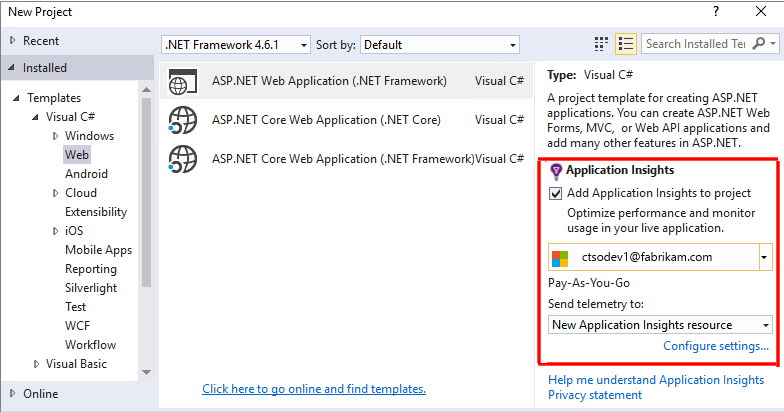
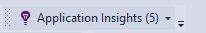
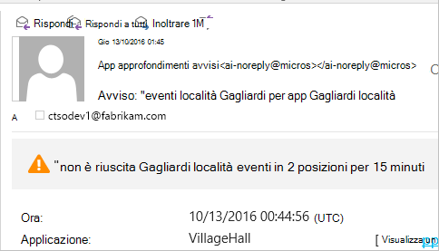
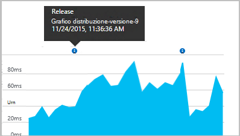
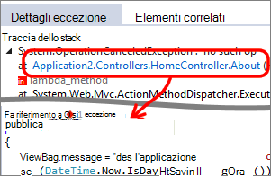
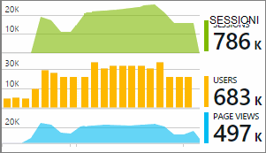

<properties 
    pageTitle="Configurare analitica app web per ASP.NET con informazioni dettagliate sui applicazione | Microsoft Azure" 
    description="Configurare le prestazioni, disponibilità e analitica l'utilizzo del sito Web ASP.NET, ospitato in locale o in Azure." 
    services="application-insights" 
    documentationCenter=".net"
    authors="NumberByColors" 
    manager="douge"/>

<tags 
    ms.service="application-insights" 
    ms.workload="tbd" 
    ms.tgt_pltfrm="ibiza" 
    ms.devlang="na" 
    ms.topic="get-started-article" 
    ms.date="10/13/2016" 
    ms.author="awills"/>


# <a name="set-up-application-insights-for-aspnet"></a>Configurare applicazione approfondimenti per ASP.NET

[Visual Studio applicazione approfondimenti](app-insights-overview.md) esegue il monitoraggio dell'applicazione live per [rilevare e diagnosticare i problemi di prestazioni ed eccezioni](app-insights-detect-triage-diagnose.md)e [individuare il modo in cui viene utilizzato l'app](app-insights-overview-usage.md).  Funziona per le applicazioni che sono ospitate su server IIS locale o su cloud macchine virtuali, nonché Azure web app.


## <a name="before-you-start"></a>Prima di iniziare

Hai bisogno:

* Visual Studio 2013 aggiornamento 3 o versione successiva. In un secondo momento è migliore.
* Una sottoscrizione a [Microsoft Azure](http://azure.com). Se il team o l'organizzazione ha un abbonamento a Azure, il proprietario possibile aggiungervi si, con il proprio [account Microsoft](http://live.com). 

Sono disponibili articoli alternativi per esaminare se si è interessati:

* [Strumentazione un'app web in fase di esecuzione](app-insights-monitor-performance-live-website-now.md)
* [Servizi Cloud Azure](app-insights-cloudservices.md)

## <a name="ide"></a>1. aggiungere informazioni dettagliate sui applicazione SDK


### <a name="if-its-a-new-project"></a>Se si tratta di un nuovo progetto...

Verificare che sia selezionata approfondimenti applicazione quando si crea un nuovo progetto in Visual Studio. 





### <a name="-or-if-its-an-existing-project"></a>... o se si tratta di un progetto esistente

Fare clic sul progetto in Esplora soluzioni e scegliere **Aggiungi applicazione approfondimenti telemetria** o **Configurare approfondimenti applicazione**.


* Progetto ASP.NET di base? - [Seguire queste istruzioni per la risoluzione alcune righe di codice](https://github.com/Microsoft/ApplicationInsights-aspnetcore/wiki/Getting-Started#add-application-insights-instrumentation-code-to-startupcs). 


## <a name="run"></a>2. eseguire l'app

Eseguire l'applicazione con F5 e provare: aprire pagine diverse per generare alcuni telemetria.

In Visual Studio, viene visualizzato un numero di eventi che è stato eseguito. 



## <a name="3-see-your-telemetry"></a>3. vedere il telemetria...

### <a name="-in-visual-studio"></a>... in Visual Studio

Aprire la finestra dell'applicazione approfondimenti in Visual Studio: fare clic sul pulsante applicazione approfondimenti o mouse sul progetto in Esplora soluzioni:


Questa visualizzazione Mostra telemetria generata sul lato server dell'app. Sperimentare i filtri e fare clic su un evento per visualizzare ulteriori dettagli.

[Altre informazioni sugli strumenti di applicazione approfondimenti in Visual Studio](app-insights-visual-studio.md).

<a name="monitor"></a> 
### <a name="-in-the-portal"></a>… nel portale

A meno che non si è scelto di *Installare SDK solo,* è inoltre possibile visualizzare telemetria portale approfondimenti applicazione web. 

Il portale ha più grafici, strumenti di analisi e dashboard rispetto a Visual Studio. 


Aprire la risorsa applicazione approfondimenti nel [portale di Azure](https://portal.azure.com/).


Consente di aprire il portale in una visualizzazione di telemetria dell'App:

* Primo telemetria viene visualizzata nel [flusso metriche in diretta](app-insights-metrics-explorer.md#live-metrics-stream).
* Singoli eventi vengono visualizzate nella **ricerca** (1). Dati possono richiedere alcuni minuti. Fare clic su un evento per visualizzare le relative proprietà. 
* Metrica aggregata vengono visualizzate nei grafici (2). Potrebbe richiedere un o due minuti per i dati da visualizzare qui. Fare clic su uno di essi per aprire una pala con dettagliatamente più avanti.

[Ulteriori informazioni sull'utilizzo dell'applicazione approfondimenti nel portale di Azure](app-insights-dashboards.md).

## <a name="4-publish-your-app"></a>4. pubblicare l'app

Pubblicare l'app al server IIS o su Azure. Guardare [Live metriche flusso](app-insights-metrics-explorer.md#live-metrics-stream) per assicurarsi che tutti gli elementi viene eseguito senza problemi.

Verrà visualizzato il telemetria compilando nel portale di applicazione approfondimenti, in cui è possibile monitorare metriche, cercare il telemetria e impostare i [Dashboard](app-insights-dashboards.md). È anche possibile utilizzare potenti [Analitica linguaggio di query](app-insights-analytics.md) per l'analisi di utilizzo e le prestazioni o trovare eventi specifici. 

È anche possibile continuare analizzare il telemetria in [Visual Studio](app-insights-visual-studio.md) con strumenti come ricerca diagnostica e [le tendenze](app-insights-visual-studio-trends.md).

> [AZURE.NOTE] Se l'app invia abbastanza telemetria approccio [limitazioni](app-insights-pricing.md#limits-summary), automatica [campioni](app-insights-sampling.md) cambia della. Esempio consente di ridurre la quantità di telemetria inviato dell'App, mantenendo i dati correlati per diagnostica.


##<a name="land"></a>Cosa è stato 'Aggiungi applicazione approfondimenti'

Informazioni dettagliate sui applicazione invia telemetria dell'App al portale di applicazione approfondimenti (che è ospitato in Microsoft Azure):


In modo che il comando ha tre elementi:

1. Aggiungere il pacchetto di applicazione approfondimenti Web SDK NuGet al progetto. Per visualizzarlo in Visual Studio, il pulsante destro del progetto e scegliere Gestisci pacchetti NuGet.
2. Creare una risorsa applicazione approfondimenti nel [portale di Azure](https://portal.azure.com/). Si tratta in cui verrà visualizzato i dati. Recupera la *chiave strumentazione,* che identifica la risorsa.
3. Inserisce il tasto strumentazione in `ApplicationInsights.config`, in modo che il SDK può inviare telemetria al portale.

Se si desidera, è possibile eseguire manualmente la procedura seguente per [ASP.NET 4](app-insights-windows-services.md) o [ASP.NET di base](https://github.com/Microsoft/ApplicationInsights-aspnetcore/wiki/Getting-Started).

### <a name="to-upgrade-to-future-sdk-versions"></a>Eseguire l'aggiornamento a versioni future SDK

Per eseguire l'aggiornamento a una [nuova versione di SDK](https://github.com/Microsoft/ApplicationInsights-dotnet-server/releases), aprire Gestione pacchetti NuGet nuovamente e applicare il filtro dei pacchetti installati. Selezionare Microsoft.ApplicationInsights.Web e scegliere l'aggiornamento.

Se è stata ApplicationInsights.config tutte le personalizzazioni, salvare una copia prima di eseguire l'aggiornamento e successivamente unire le modifiche nella nuova versione.

## <a name="add-more-telemetry"></a>Aggiungere ulteriori telemetria

### <a name="web-pages-and-single-page-apps"></a>App pagine singole e pagine Web

1. [Aggiungere il frammento di codice JavaScript](app-insights-javascript.md) alle pagine web per accendere pale Browser e l'uso con i dati sulle visualizzazioni di una pagina, i tempi di caricamento, eccezioni browser, le prestazioni delle chiamate AJAX, conteggi utente e sessione.
2. [Eventi personalizzati di codice](app-insights-api-custom-events-metrics.md) a un conteggio, ora o azioni dell'utente di misura.

### <a name="dependencies-exceptions-and-performance-counters"></a>Dipendenze, le eccezioni e contatori delle prestazioni

[Installare controllo dello stato](app-insights-monitor-performance-live-website-now.md) su ciascun computer server per ottenere ulteriore telemetria sull'app. Ecco cosa viene visualizzato:

* [Contatori](app-insights-performance-counters.md) - 
CPU, memoria, disco e altri contatori relativi all'app. 
* [Eccezioni](app-insights-asp-net-exceptions.md) - telemetria più dettagliata per alcune eccezioni.
* [Dipendenze](app-insights-asp-net-dependencies.md) - chiamate ai servizi API REST o SQL. Scoprire se lente risposte dai componenti esterni causano problemi di prestazioni nell'app. (Se l'app viene eseguito su .NET 4.6, non è necessario monitorare lo stato per ottenere questo telemetria.)

### <a name="diagnostic-code"></a>Codice di diagnostica

Se si ha un problema? Se si desidera inserire codice nell'app di diagnosticare essa, sono disponibili diverse opzioni:

* [Le tracce di acquisizione log](app-insights-asp-net-trace-logs.md): se si utilizza già Log4N, NLog o System.Diagnostics.Trace per registrare gli eventi di traccia, quindi l'output può essere inviato a informazioni dettagliate sui applicazione in modo che è possibile correlare le richieste di, eseguire una ricerca attraversata e analizzarli. 
* [Metrica e gli eventi personalizzati](app-insights-api-custom-events-metrics.md): usare TrackEvent() e TrackMetric() nel server o codice della pagina web.
* [Telemetria tag con proprietà aggiuntive](app-insights-api-filtering-sampling.md#add-properties)

Usare la [ricerca](app-insights-diagnostic-search.md) per trovare e correlare eventi specifici e [Analitica](app-insights-analytics.md) per eseguire query più efficaci.

## <a name="alerts"></a>Avvisi

Sono i primi sapere se l'app con problemi a livello. (Non attendere indicare agli utenti!) 

* [Test web crea](app-insights-monitor-web-app-availability.md) per assicurarsi che il sito è visibile sul web.
* [Diagnostica preventiva](app-insights-proactive-diagnostics.md) eseguire automaticamente (se l'applicazione ha un determinato periodo minimo di traffico). Non è necessario eseguire alcuna operazione per configurarli. Indicano se l'applicazione ha una tariffa insolita di richieste non riuscite.
* [Impostare avvisi metrici](app-insights-alerts.md) di avviso se una metrica supera una soglia. È possibile impostare loro sui dati statistici relativi personalizzato il codice in un'applicazione.

Per impostazione predefinita, le notifiche di avviso vengono inviate al proprietario della sottoscrizione Azure. 



## <a name="version-and-release-tracking"></a>Versione e rilascio rilevamento modifiche

### <a name="track-application-version"></a>Versione di tenere traccia dell'applicazione

Assicurarsi che `buildinfo.config` viene generato dal processo MSBuild. Nel file csproj aggiungere:  

```XML

    <PropertyGroup>
      <GenerateBuildInfoConfigFile>true</GenerateBuildInfoConfigFile>    <IncludeServerNameInBuildInfo>true</IncludeServerNameInBuildInfo>
    </PropertyGroup> 
```

Quando è stato modificato le informazioni, il modulo web approfondimenti applicazione aggiunge automaticamente **versione dell'applicazione** come proprietà su tutti gli elementi di telemetria. Consente di filtrare in base al versione durante l'esecuzione di [ricerche diagnostiche](app-insights-diagnostic-search.md) o quando [esplorazione metriche](app-insights-metrics-explorer.md). 

Tuttavia, si noterà che il numero di versione build generato solo da Build MS, non tramite la compilazione di sviluppo in Visual Studio.

### <a name="release-annotations"></a>Rilasciare annotazioni

Se si utilizza Visual Studio Team Services, è possibile [ottenere un indicatore di annotazione](app-insights-annotations.md) aggiunte ai grafici ogni volta che si rilascia una nuova versione.




## <a name="next-steps"></a>Passaggi successivi

| | 
|---|---
|**[Utilizzo di applicazione approfondimenti in Visual Studio](app-insights-visual-studio.md)**<br/>Il debug con telemetria diagnostica eseguire una ricerca, il drill-through al codice.|
|**[Utilizzo del portale approfondimenti applicazione del](app-insights-dashboards.md)**<br/>È possibile esportare i dashboard, potenti strumenti di diagnostici e analitici, avvisi, una mappa dinamica dipendenza dell'applicazione e telemetria. |
|**[Aggiungere altri dati](app-insights-asp-net-more.md)**<br/>Monitorare l'utilizzo, disponibilità, dipendenze, eccezioni. Integrare tracce da Framework di registrazione. Scrivere telemetria personalizzato. | 


