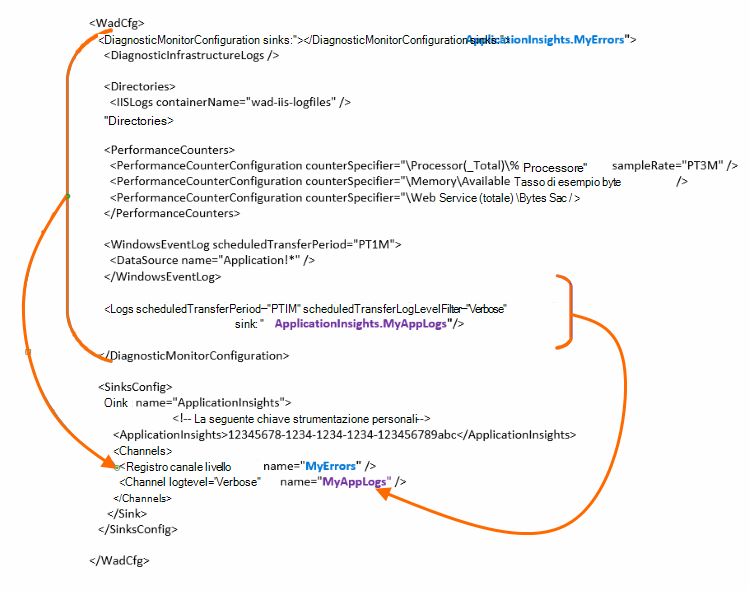

<properties
    pageTitle="Invio dei log diagnostici Azure a informazioni dettagliate sui applicazione"
    description="Configurare i dettagli dei registri diagnostici servizi Cloud Windows Azure che vengono inviati al portale di informazioni approfondite dell'applicazione."
    services="application-insights"
    documentationCenter=".net"
    authors="sbtron"
    manager="douge"/>

<tags
    ms.service="application-insights"
    ms.workload="tbd"
    ms.tgt_pltfrm="ibiza"
    ms.devlang="na"
    ms.topic="article"
    ms.date="11/17/2015"
    ms.author="awills"/>

# <a name="configure-azure-diagnostic-logging-to-application-insights"></a>Configurare la registrazione diagnostica Azure a informazioni dettagliate sui applicazione

Quando si imposta un progetto di servizi Cloud oppure una macchina virtuale in Microsoft Azure [Azure può generare un file di log diagnostici](../vs-azure-tools-diagnostics-for-cloud-services-and-virtual-machines.md). È possibile impostare questa inviati a informazioni dettagliate sui applicazione in modo che è possibile analizzare insieme Diagnostics e l'uso di telemetria inviato dall'interno dell'app da SDK approfondimenti applicazione. Registro Azure include gli eventi per la gestione dell'applicazione, ad esempio inizio, tabulazioni, si blocca, nonché contatori. Il log include anche le chiamate nell'app per System.Diagnostics.Trace.

Questo articolo descrive la configurazione di acquisizione della diagnostica in modo dettagliato.

È necessario Azure SDK 2,8 installato in Visual Studio.

## <a name="get-an-application-insights-resource"></a>Ottenere una risorsa applicazione approfondimenti

Per la migliore esperienza, [aggiungere SDK approfondimenti di applicazione per ogni ruolo dell'app servizi Cloud](app-insights-cloudservices.md)o [a qualsiasi app verrà eseguita nel corso di una macchina virtuale](app-insights-overview.md). È quindi possibile inviare i dati di diagnostica per analizzare e visualizzata la stessa risorsa approfondimenti applicazione.

In alternativa, se non si desidera utilizzare SDK - ad esempio, se l'app non è già live - è possibile solo [creare una nuova risorsa approfondimenti applicazione](app-insights-create-new-resource.md) nel portale di Azure. Scegliere **Diagnostica Azure** come tipo di applicazione.


## <a name="send-azure-diagnostics-to-application-insights"></a>Inviare diagnostica Windows Azure a informazioni dettagliate sui applicazione

Se si è possibile aggiornare il progetto di app, quindi in Visual Studio selezionare ogni ruolo, scegliere Proprietà e nella scheda configurazione, selezionare **Invia diagnostica a informazioni dettagliate sui applicazione**.

Se l'app è già attivo, utilizzare Visual Studio Esplora Server o servizi Cloud Esplora per aprire la finestra delle proprietà dell'app. Selezionare **Invia diagnostica a informazioni dettagliate sui applicazione**.

In ogni caso verrà chiesto per i dettagli della risorsa approfondimenti applicazione creata.

[Altre informazioni sull'impostazione di applicazione approfondimenti per un'app di servizi Cloud](app-insights-cloudservices.md).

## <a name="configuring-the-azure-diagnostics-adapter"></a>Configurazione della scheda diagnostica Windows Azure

In sola lettura se si desidera selezionare parti del log inviati a informazioni dettagliate sui applicazione. Per impostazione predefinita, tutti gli elementi viene inviato, compresi: eventi di Microsoft Azure. contatori; tenere traccia delle chiamate da app a System.Diagnostics.Trace.

Diagnostica Windows Azure archivia i dati di tabelle di archiviazione Azure. Tuttavia, è anche possibile barra verticale tutti o un sottoinsieme di dati a informazioni dettagliate sui applicazione configurando "sink" e "canali" nella configurazione quando si utilizza diagnostica Azure estensione 1.5 o versioni successive.

### <a name="configure-application-insights-as-a-sink"></a>Configurare l'applicazione approfondimenti come Sink

Quando si utilizzano le proprietà del ruolo per impostare "Invia dati a informazioni dettagliate sui applicazione", Azure SDK (2,8 o versioni successive) aggiunge un `<SinksConfig>` elemento al pubblico [Azure diagnostica file di configurazione](https://msdn.microsoft.com/library/azure/dn782207.aspx) del ruolo.

`<SinksConfig>`definisce il sink aggiuntivo in cui possono essere inviati i dati di diagnostica Windows Azure.  Un esempio `SinksConfig` ha un aspetto simile al seguente:

```xml

    <SinksConfig>
     <Sink name="ApplicationInsights">
      <ApplicationInsights>{Insert InstrumentationKey}</ApplicationInsights>
      <Channels>
        <Channel logLevel="Error" name="MyTopDiagData"  />
        <Channel logLevel="Verbose" name="MyLogData"  />
      </Channels>
     </Sink>
    </SinksConfig>

```

Il `ApplicationInsights` elemento specifica la chiave strumentazione che identifica la risorsa applicazione approfondimenti in cui verranno inviati i dati di diagnostica Windows Azure. Quando si seleziona la risorsa, viene automaticamente creato in base la `APPINSIGHTS_INSTRUMENTATIONKEY` di configurazione del servizio. (Se si desidera impostare manualmente, ottenere la chiave dall'elenco a discesa nozioni di base della risorsa.)

`Channels`definire i dati inviati al sink. Il canale si comporta come un filtro. Il `loglevel` attributo consente di specificare il livello di registrazione che verrà inviato il canale. I valori disponibili sono: `{Verbose, Information, Warning, Error, Critical}`.

### <a name="send-data-to-the-sink"></a>Inviare dati a sink

Inviare dati a informazioni dettagliate sui applicazione elaborare aggiungendo l'attributo sink sotto il nodo DiagnosticMonitorConfiguration. Aggiungere l'elemento sink a ciascun nodo specifica che si desidera dati raccolti da tale nodo e qualsiasi sotto di esso devono essere inviati sink specificato.

Ad esempio, il valore predefinito creato da Azure SDK è a inviare tutti i dati di diagnostici Azure:

```xml

    <DiagnosticMonitorConfiguration overallQuotaInMB="4096" sinks="ApplicationInsights">
```

Ma se si desidera inviare solo i registri di errori, specificare il nome sink con un nome di canale:

```xml

    <DiagnosticMonitorConfiguration overallQuotaInMB="4096" sinks="ApplicationInsights.MyTopDiagdata">
```

Si noti che si utilizza il nome del Sink che è stato definito, insieme al nome di un canale è definite in precedenza.

Se si desidera inviare i registri di applicazione dettagliato a informazioni dettagliate sui applicazione quindi aggiungere l'attributo sink per il `Logs` nodo.

```xml

    <Logs scheduledTransferPeriod="PT1M" scheduledTransferLogLevelFilter="Verbose" sinks="ApplicationInsights.MyLogData"/>
```

È anche possibile includere più sink nella configurazione a diversi livelli della gerarchia. In questo caso il sink specificato nella parte superiore della gerarchia funge un'impostazione globale e quello specificato nella funzione elemento singolo elemento di un override di tale impostazione globale.

Ecco un esempio completo del file di configurazione pubblico che invia tutti gli errori a informazioni dettagliate sui applicazione (specificato nel `DiagnosticMonitorConfiguration` nodo) e livello di dettaglio inoltre registri per i registri applicazioni (specificato nel `Logs` nodo).

```xml

    <WadCfg>
     <DiagnosticMonitorConfiguration overallQuotaInMB="4096"
       sinks="ApplicationInsights.MyTopDiagData"> <!-- All info below sent to this channel -->
      <DiagnosticInfrastructureLogs />
      <PerformanceCounters>
        <PerformanceCounterConfiguration counterSpecifier="\Processor(_Total)\% Processor Time" sampleRate="PT3M" sinks="ApplicationInsights.MyLogData/>
        <PerformanceCounterConfiguration counterSpecifier="\Memory\Available MBytes" sampleRate="PT3M" />
        <PerformanceCounterConfiguration counterSpecifier="\Web Service(_Total)\Bytes Total/Sec" sampleRate="PT3M" />
      </PerformanceCounters>
      <WindowsEventLog scheduledTransferPeriod="PT1M">
        <DataSource name="Application!*" />
      </WindowsEventLog>
      <Logs scheduledTransferPeriod="PT1M" scheduledTransferLogLevelFilter="Verbose"
            sinks="ApplicationInsights.MyLogData"/>
       <!-- This specific info sent to this channel -->
     </DiagnosticMonitorConfiguration>

     <SinksConfig>
      <Sink name="ApplicationInsights">
        <ApplicationInsights>{Insert InstrumentationKey}</ApplicationInsights>
        <Channels>
          <Channel logLevel="Error" name="MyTopDiagData"  />
          <Channel logLevel="Verbose" name="MyLogData"  />
        </Channels>
      </Sink>
     </SinksConfig>
    </WadCfg>
```



Esistono alcune limitazioni da tenere in considerazione questa funzionalità:

* I canali sono solo semplici per lavorare con contatori non e il tipo di log. Se si specifica un canale con un elemento del contatore prestazioni verrà ignorata.
* Il livello di registrazione per un canale non può superare il livello di registrazione di informazioni raccolte da diagnostica Windows Azure. Ad esempio: non è possibile raccogliere gli errori di registro delle applicazioni nell'elemento registri e provano a inviare dettagliato dei registri per la sincronizzazione di comprendere l'applicazione. L'attributo scheduledTransferLogLevelFilter deve raccogliere sempre uguale o più registri rispetto ai registri che si desidera inviare a un sink.
* Per inviare i dati blob raccolti dall'estensione diagnostica Windows Azure a informazioni dettagliate sui applicazione. Ad esempio qualsiasi elemento specificato nel nodo Directory. Per anomalo l'arresto anomalo effettivo viene comunque inviata nell'archiviazione blob e verrà inviata solo una notifica che l'arresto anomalo è stato generato a informazioni dettagliate sui applicazione.

## <a name="related-topics"></a>Argomenti correlati

* [Monitoraggio dei servizi Cloud Azure con informazioni dettagliate sui applicazione](app-insights-cloudservices.md)
* [Uso di PowerShell per inviare diagnostica Windows Azure a informazioni dettagliate sui applicazione](app-insights-powershell-azure-diagnostics.md)
* [File di configurazione di diagnostica Azure](https://msdn.microsoft.com/library/azure/dn782207.aspx)
