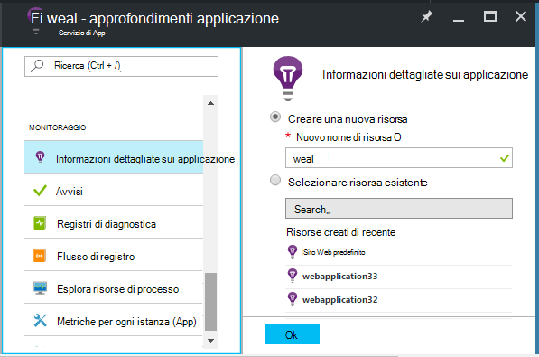
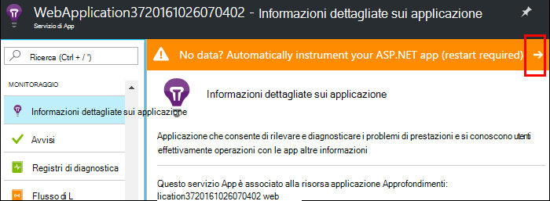
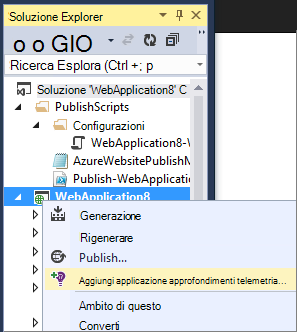
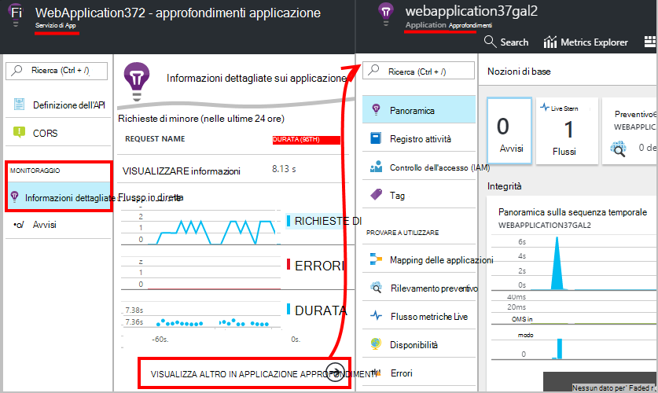
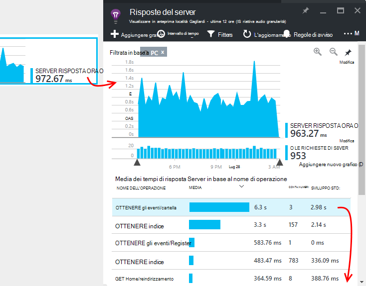
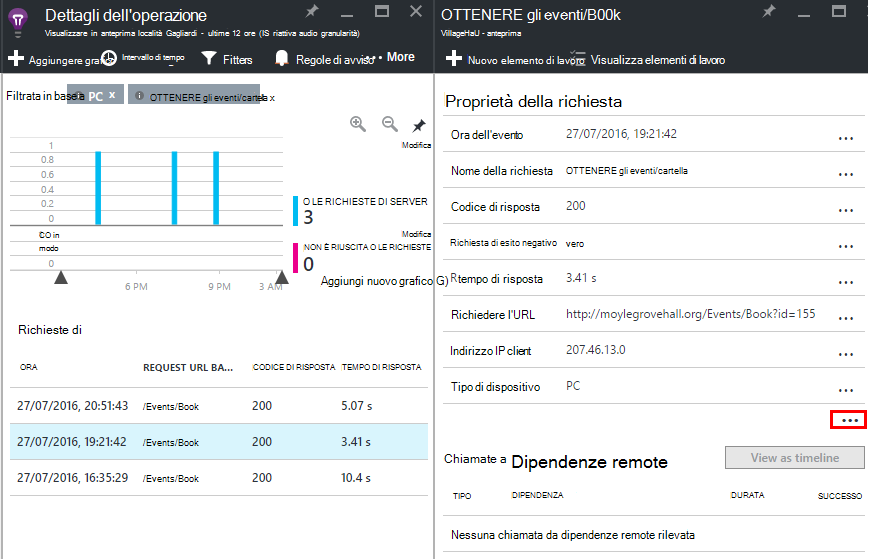

<properties
    pageTitle="Eseguire il monitoraggio delle prestazioni dell'applicazione web Azure | Microsoft Azure"
    description="Applicazione monitoraggio delle prestazioni per Azure web app. Carico e tempi di risposta, le informazioni sulle dipendenze e impostare avvisi sulle prestazioni del grafico."
    services="application-insights"
    documentationCenter=".net"
    authors="alancameronwills"
    manager="douge"/>

<tags
    ms.service="azure-portal"
    ms.workload="na"
    ms.tgt_pltfrm="na"
    ms.devlang="na"
    ms.topic="article"
    ms.date="10/24/2016"
    ms.author="awills"/>

# Monitoraggio delle prestazioni di Azure web app

Nel [Portale di Azure](https://portal.azure.com) è possibile impostare il monitoraggio delle prestazioni di applicazioni per le [applicazioni web Azure](../app-service-web/app-service-web-overview.md). [Visual Studio applicazione approfondimenti](app-insights-overview.md) strumenti l'app per inviare il servizio di applicazione approfondimenti, in cui è archiviato e analizzato telemetria sulle proprie attività. Grafici metrici e strumenti di ricerca, possono essere utilizzati per diagnosticare i problemi, migliorare le prestazioni e valutare l'utilizzo.

## Fase di esecuzione o creare ora

È possibile configurare il monitoraggio tramite la strumentazione dell'app in uno dei due modi:

* **Fase di esecuzione** , è possibile selezionare delle prestazioni monitoraggio estensione quando un'applicazione web è già live. Non è necessario ricreare o reinstallare l'app. È possibile ottenere un insieme standard di pacchetti che controllano i tempi di risposta, percentuali di successo, eccezioni, dipendenze e così via. 
 
* **Creare ora** - è possibile installare un pacchetto dell'applicazione in fase di sviluppo. Questa opzione è più versatile. Oltre a degli stessi pacchetti standard, è possibile scrivere codice per personalizzare il telemetria o per inviare il proprio telemetria. È possibile registrare attività specifiche o eventi di record in base alla semantica del dominio app. 

## Eseguire strumentazione ora con informazioni dettagliate sui applicazione

Se si sta già eseguendo un'app web di Azure, viene già visualizzato alcune monitoraggio: tariffe richiesta e di errore. Aggiungere informazioni dettagliate sui applicazione per ottenere ulteriori, ad esempio i tempi di risposta, il monitoraggio delle connessioni alle dipendenze, rilevamento intelligente e Analitica potente linguaggio di query. 

1. **Selezionare approfondimenti applicazioni** nel Pannello di controllo Azure per un'app web.

    

 * Scegliere per creare una nuova risorsa, a meno che non è già stata configurata una risorsa applicazione approfondimenti per questa app da un altro percorso.

2. **Strumento un'app web** dopo l'installazione di applicazione approfondimenti. 

    

3. **Monitorare le app**.  [Expore i dati](#explore-the-data).

In un secondo momento, è possibile compilare e ridistribuire le app con informazioni dettagliate sui applicazione se si desidera.

*Come rimuovere informazioni dettagliate sui applicazione, o passare all'invio a un'altra risorsa?*

* Aprire e il controllo di app web di Azure e **le estensioni**in strumenti di sviluppo. Eliminare l'estensione approfondimenti applicazione. Quindi in monitoraggio, scegliere informazioni dettagliate sui applicazione e creare o selezionare la risorsa desiderata.

## Creare app con informazioni dettagliate sui applicazione

Approfondimenti applicazione possono fornire informazioni più dettagliata telemetria installando un SDK in un'applicazione. In particolare, è possibile raccogliere i registri traccia, [scrivere telemetria personalizzato](../application-insights/app-insights-api-custom-events-metrics.md)e ottenere informazioni più dettagliate report sulle eccezioni.

1. **In Visual Studio** (aggiornamento 2013 2 o versione successiva), aggiungere il SDK approfondimenti applicazione al progetto.

    

    Se viene richiesto di accedere, utilizzare le credenziali dell'account Azure.

    L'operazione ha due effetti:

 1. Crea una risorsa applicazione approfondimenti in Azure, in cui telemetria è archiviato, analizzato e visualizzato.
 2. Aggiunge il pacchetto di applicazione approfondimenti NuGet al codice e configurarlo per l'invio di telemetria per la risorsa Azure.

2. **Test di telemetria** eseguendo l'app in computer di sviluppo (F5).

3. **Pubblica l'app** in Azure nel modo consueto. 

*Come si passa a inviare a un'altra risorsa approfondimenti applicazione?*

* In Visual Studio, fare clic sul progetto, scegliere **applicazione approfondimenti > Configura** e scegliere la risorsa desiderata. È possibile ottenere l'opzione per creare una nuova risorsa. Rigenerare e ridistribuire.

## Esplorare i dati

1. E l'approfondimenti applicazione del Pannello di controllo di web app è disponibile la metrica Live che mostra le richieste e gli errori all'interno di un secondo o due delle quali si verifichi. È molto utile visualizzato se si sta ripubblicare l'app, è possibile visualizzare immediatamente gli eventuali problemi.

2. Fare clic su tramite la risorsa applicazione approfondimenti completo.

    
    

    È anche possibile accedere sono direttamente dalla struttura di spostamento di Azure delle risorse.

2. Fare clic su tramite qualsiasi del grafico per visualizzare ulteriori dettagli:

    

    È possibile [personalizzare pale metriche](../application-insights/app-insights-metrics-explorer.md).

3. Scorrere per vedere singoli eventi e le relative proprietà:

    

    Si noti la "…" creare un collegamento per visualizzare tutte le proprietà.

    È possibile [personalizzare le ricerche](../application-insights/app-insights-diagnostic-search.md).

Per le ricerche più potenti sopra il telemetria, utilizzare il [linguaggio di query Analitica](../application-insights/app-insights-analytics-tour.md).

## Passaggi successivi

* [Abilitare Azure diagnostica](app-insights-azure-diagnostics.md) da inviare a informazioni dettagliate sui applicazione.
* [Metrica integrità dei servizi monitor](../monitoring-and-diagnostics/insights-how-to-customize-monitoring.md) per verificare che il servizio è disponibile e rispondere.
* [Ricevere notifiche di avviso](../monitoring-and-diagnostics/insights-receive-alert-notifications.md) ogni volta che si verificano gli eventi operativi o metriche incrociato una determinata soglia.
* Usare [Applicazione approfondimenti per App JavaScript e pagine web](app-insights-web-track-usage.md) per ottenere telemetria client dal browser che visita una pagina web.
* [Impostare i test web disponibilità](app-insights-monitor-web-app-availability.md) per essere informati se il sito è bloccato.
