<properties
   pageTitle="Informazioni dettagliate sui applicazione per i servizi Cloud Azure"
   description="Monitorare i ruoli web e di lavoro in modo efficiente con informazioni dettagliate sui applicazione"
   services="application-insights"
   documentationCenter=""
   authors="soubhagyadash"
   manager="douge"
   editor="alancameronwills"/>

<tags
   ms.service="application-insights"
   ms.devlang="na"
   ms.tgt_pltfrm="ibiza"
   ms.topic="article"
   ms.workload="tbd"
   ms.date="03/02/2016"
   ms.author="sdash"/>

# <a name="application-insights-for-azure-cloud-services"></a>Informazioni dettagliate sui applicazione per i servizi Cloud Azure


*Informazioni dettagliate sui applicazione è in anteprima*

Per [Informazioni dettagliate sui applicazione di Visual Studio] è possibile monitorare [le applicazioni di servizio Cloud di Microsoft Azure](https://azure.microsoft.com/services/cloud-services/) [ start] di disponibilità, prestazioni, errori e l'uso. Con i commenti che viene visualizzato sulle prestazioni ed efficacia dell'app in azione, è possibile effettuare scelte consapevoli sulla direzione del progetto in ogni ciclo di vita di sviluppo.

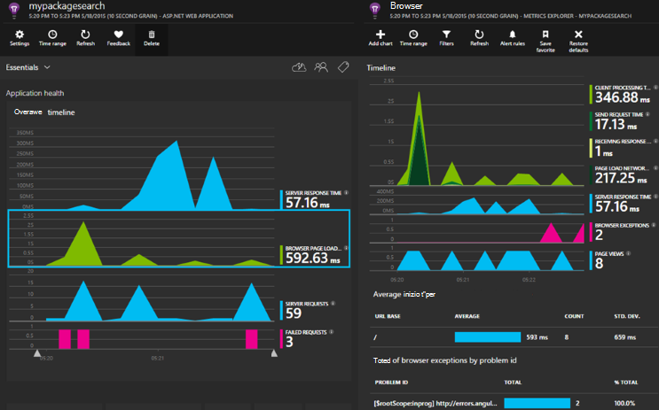

È necessario un abbonamento con [Microsoft Azure](http://azure.com). Accedere con un account Microsoft, è possibile avere per Windows, XBox Live o altri servizi cloud Microsoft. 


#### <a name="sample-application-instrumented-with-application-insights"></a>Applicazione di esempio fornito con informazioni dettagliate sui applicazione

Esaminare l' [applicazione di esempio](https://github.com/Microsoft/ApplicationInsights-Home/tree/master/Samples/AzureEmailService) in cui approfondimenti applicazione viene aggiunto a un servizio cloud con due i ruoli di lavoro ospitati in Azure. 

Di seguito viene descritto come adattare progetto servizio cloud nello stesso modo.

## <a name="create-an-application-insights-resource-for-each-role"></a>Creazione di una risorsa applicazione approfondimenti per ogni ruolo

Una risorsa applicazione approfondimenti è nel punto in cui verranno analizzati e visualizzati i dati di telemetria.  

1.  Nel [portale di Azure][portal], creare una nuova risorsa approfondimenti applicazione. Tipo di applicazione scegliere app ASP.NET. 

    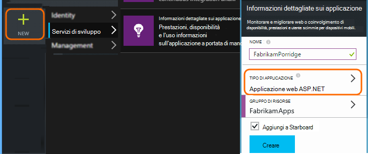

2.  Richiedere una copia della chiave strumentazione. È necessario più avanti per configurare SDK.

    


In genere è [preferibile creare una risorsa distinta per i dati da ogni ruolo web e di lavoro](app-insights-separate-resources.md). 

In alternativa, è possibile inviare i dati da tutti i ruoli a una sola risorsa, ma impostare una [proprietà predefinita] [ apidefaults] in modo che non è possibile filtrare o raggruppare i risultati di ogni ruolo.

## <a name="sdk"></a>Installare SDK in ogni progetto


1. In Visual Studio, modificare i pacchetti NuGet del progetto app cloud.

    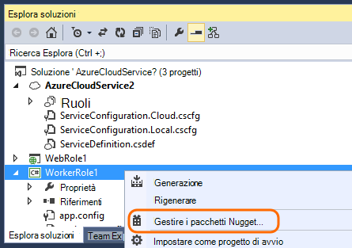


2. Per i ruoli web, aggiungere il pacchetto NuGet [Approfondimenti applicazione Web](http://www.nuget.org/packages/Microsoft.ApplicationInsights.Web) . Questa versione di SDK include i moduli che aggiungere il contesto di server, ad esempio le informazioni sui ruoli. Per i ruoli di lavoro, usare [Approfondimenti per Windows Server delle applicazioni](https://www.nuget.org/packages/Microsoft.ApplicationInsights.WindowsServer/).

    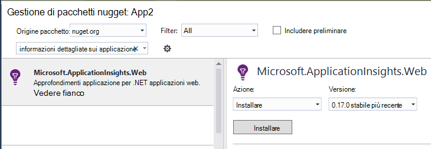


3. Configurare SDK per inviare dati alla risorsa approfondimenti applicazione.

    Impostare la chiave strumentazione come un'impostazione di configurazione nel file `ServiceConfiguration.Cloud.cscfg`. ([Codice](https://github.com/Microsoft/ApplicationInsights-Home/blob/master/Samples/AzureEmailService/AzureEmailService/ServiceConfiguration.Cloud.cscfg)).
 
    ```XML
     <Role name="WorkerRoleA"> 
      <Setting name="APPINSIGHTS_INSTRUMENTATIONKEY" value="YOUR IKEY" /> 
     </Role>
    ```
 
    In una funzione di avvio adatto, impostare la chiave strumentazione dall'impostazione della configurazione:

    ```C#
     TelemetryConfiguration.Active.InstrumentationKey = RoleEnvironment.GetConfigurationSettingValue("APPINSIGHTS_INSTRUMENTATIONKEY");
    ```

    Nota, lo stesso nome `APPINSIGHTS_INSTRUMENTATIONKEY` della configurazione verrà utilizzata l'impostazione dalla diagnostica Azure dei report. 


    Ripetere l'operazione per ogni ruolo all'interno dell'applicazione. Vedere gli esempi:
 
 * [Ruolo Web](https://github.com/Microsoft/ApplicationInsights-Home/blob/master/Samples/AzureEmailService/MvcWebRole/Global.asax.cs#L27)
 * [Ruolo di lavoro](https://github.com/Microsoft/ApplicationInsights-Home/blob/master/Samples/AzureEmailService/WorkerRoleA/WorkerRoleA.cs#L232)
 * [Per le pagine web](https://github.com/Microsoft/ApplicationInsights-Home/blob/master/Samples/AzureEmailService/MvcWebRole/Views/Shared/_Layout.cshtml#L13)   

4. Impostare il file ApplicationInsights.config da copiare sempre nella directory di output. 

    (Nel file config verrà visualizzato i messaggi in cui viene richiesto per posizionare il tasto strumentazione non esiste. Tuttavia, per le applicazioni cloud è preferibile impostare dal file cscfg. In questo modo che il ruolo viene identificato correttamente nel portale.)


#### <a name="run-and-publish-the-app"></a>Eseguire e pubblicare l'app

Eseguire l'app e accedere a Azure. Aprire le risorse approfondimenti applicazione creata e verrà visualizzato singole coordinate visualizzate nella [ricerca](app-insights-diagnostic-search.md)e aggregare dati in [Unità di misura metriche Esplora](app-insights-metrics-explorer.md). 

Aggiungere ulteriori telemetria: vedere le sezioni seguenti - e quindi pubblicare l'app per ricevere commenti e suggerimenti live Diagnostics e l'uso. 


#### <a name="no-data"></a>Nessun dato?

* Aprire la [ricerca] [ diagnostic] riquadro per visualizzare i singoli eventi.
* Usare l'applicazione, apertura di pagine differenti in modo che generi alcuni telemetria.
* Attendere alcuni secondi e fare clic su Aggiorna.
* Vedere [risoluzione dei problemi][qna].


## <a name="more-telemetry"></a>Ulteriori telemetria

Nelle sezioni seguenti viene illustrato come ottenere ulteriore telemetria da diversi aspetti dell'applicazione.


## <a name="track-requests-from-worker-roles"></a>Richieste di tenere traccia di ruoli di lavoro

Ruoli web, il modulo richieste automaticamente raccoglie dati sulle richieste HTTP. Per vedere l' [esempio MVCWebRole](https://github.com/Microsoft/ApplicationInsights-Home/tree/master/Samples/AzureEmailService/MvcWebRole) esempi di come è possibile ignorare il comportamento di raccolta predefinito. 

È possibile acquisire le prestazioni di chiamate per i ruoli di lavoro registrando loro nello stesso modo richieste HTTP. In applicazione approfondimenti, il tipo di telemetria richiesta misura un'unità di lavoro sul lato server denominato che è possibile programmare in modo indipendente esito positivo o negativo. Mentre le richieste HTTP vengono acquisite automaticamente da SDK, è possibile inserire codice personalizzato per tenere traccia delle richieste di ruoli di lavoro.

Visualizzare due ruoli di lavoro di esempio forniti alle richieste di report: [WorkerRoleA](https://github.com/Microsoft/ApplicationInsights-Home/tree/master/Samples/AzureEmailService/WorkerRoleA) e [WorkerRoleB](https://github.com/Microsoft/ApplicationInsights-Home/tree/master/Samples/AzureEmailService/WorkerRoleB)

## <a name="azure-diagnostics"></a>Diagnostica Windows Azure

Dati di [Azure diagnostica](../vs-azure-tools-diagnostics-for-cloud-services-and-virtual-machines.md) includono eventi di gestione ruolo, contatori e registri delle applicazioni. È possibile impostare queste inviati a informazioni dettagliate sui applicazione in modo da poterli vedere insieme a tutte le altre applicazioni del telemetria semplificate diagnosticare i problemi.

Diagnostica Windows Azure è particolarmente utile se un ruolo di un errore imprevisto o non è possibile avviare.

1. Pulsante destro del mouse sul ruolo (non il progetto!) per visualizzare le relative proprietà e selezionare **Abilita diagnostica**, **inviare la diagnostica per informazioni dettagliate sui applicazione**.

    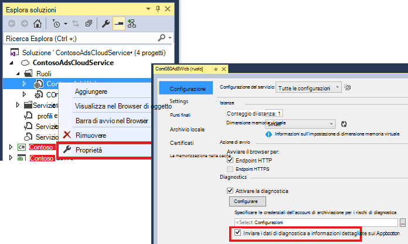

    **O se l'app non è già stato pubblicato e in esecuzione**, aprire Esplora Server o Cloud Explorer rapida l'app e selezionare l'opzione stessa.

3.  Selezionare la stessa risorsa applicazione approfondimenti come le altre telemetria.

    Se si desidera, è possibile impostare un'altra risorsa in configurazioni di servizi diversa (Cloud, locale) allo scopo di mantenere i dati di sviluppo separate da dati reali.

3. Facoltativamente, è possibile [escludere alcuni diagnostica Windows Azure](app-insights-azure-diagnostics.md) che si desidera essere inoltrate a informazioni dettagliate sui applicazione. Il valore predefinito è tutto.

### <a name="view-azure-diagnostic-events"></a>Visualizzare gli eventi di diagnostici Azure

Dove trovare i test di diagnostica:

* Contatori vengono visualizzati come metriche personalizzate. 
* I registri eventi di Windows vengono visualizzati come tracce ed eventi personalizzati.
* Log applicazioni, i registri ETW e gli eventuali log di infrastruttura diagnostica vengono visualizzati come tracce.

Per visualizzare contatori e i conteggi relativi eventi, aprire [Esplora metriche](app-insights-metrics-explorer.md) e aggiungere un nuovo grafico:


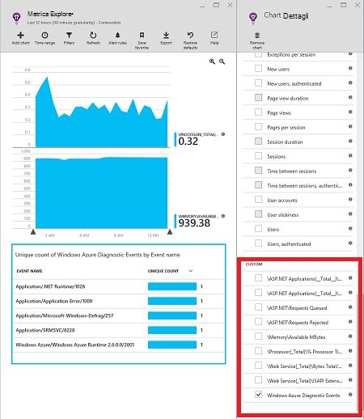

Usare la [ricerca](app-insights-diagnostic-search.md) per cercare tra i vari registri di traccia provenienti dai Azure diagnostica. Ad esempio se si dispone di un'eccezione unhanded in un ruolo che ha causato il ruolo di arresto anomalo Cestino, che le informazioni verranno visualizzati nell'applicazione canale di registro eventi di Windows. È possibile utilizzare la funzionalità di ricerca per esaminare l'errore registro eventi di Windows e ottenere la traccia dello stack completo per l'eccezione che consente di individuare la causa del problema.


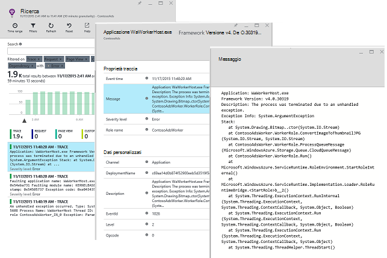

## <a name="app-diagnostics"></a>Diagnostica App

Diagnostica Windows Azure include automaticamente voci di log che l'app genera utilizzando System.Diagnostics.Trace. 

Ma se si usa già Framework Log4N o NLog, è anche possibile [acquisire le tracce log][netlogs].

[Tenere traccia di eventi personalizzati e metriche] [ api] nel client o server o entrambe, per altre informazioni sull'utilizzo e le prestazioni dell'applicazione.

## <a name="dependencies"></a>Dipendenze

Applicazione approfondimenti SDK segnalare chiamate che rendono l'app per le relazioni esterne, ad esempio SQL Server e le API REST. Consente di vedere se una specifica dipendenza provoca risposte lente o errori.

Se l'applicazione utilizza .NET framework 4.6 o versione successiva, non è necessario eseguire altre operazioni. 

In caso contrario, impostare il ruolo web/lavoro con l' [Agente approfondimenti](app-insights-monitor-performance-live-website-now.md) noto anche come "controllo dello stato".

Per utilizzare l'agente di approfondimenti applicazione con i ruoli di web/lavoro:

* Aggiungere la cartella [AppInsightsAgent](https://github.com/Microsoft/ApplicationInsights-Home/tree/master/Samples/AzureEmailService/WorkerRoleA/AppInsightsAgent) e i due file al suo interno i progetti di ruolo web/lavoro. Assicurarsi di impostare le proprietà di compilazione in modo che vengono sempre copiati nella directory di output. Questi file installare l'agente.
* Aggiungere le attività di avvio al file CSDEF come illustrato [di seguito](https://github.com/Microsoft/ApplicationInsights-Home/tree/master/Samples/AzureEmailService/AzureEmailService/ServiceDefinition.csdef#L18).
* Nota: *Ruoli di lavoro* richiedono tre variabili di ambiente come illustrato [di seguito](https://github.com/Microsoft/ApplicationInsights-Home/tree/master/Samples/AzureEmailService/AzureEmailService/ServiceDefinition.csdef#L44). Questa operazione non è necessaria per i ruoli di web.

### <a name="dependency-reports"></a>Report sulle dipendenze

Ecco un esempio di vedere portale approfondimenti applicazione:

* RTF diagnostica con richieste automaticamente correlate e le dipendenze:

    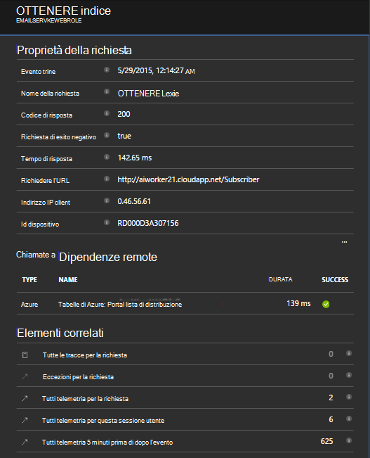

* Prestazioni del ruolo web, con informazioni sulle dipendenze:

    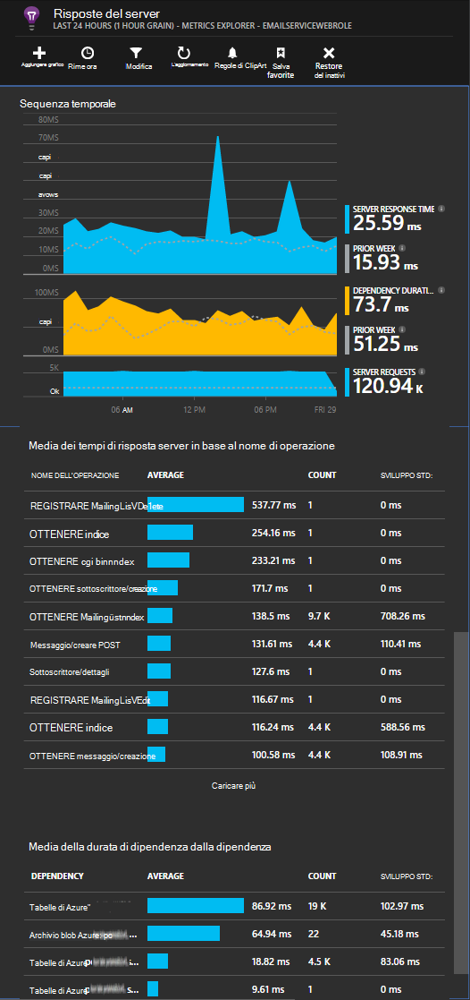

* Ecco una schermata richieste e le informazioni sulle dipendenze per un ruolo di lavoro:

    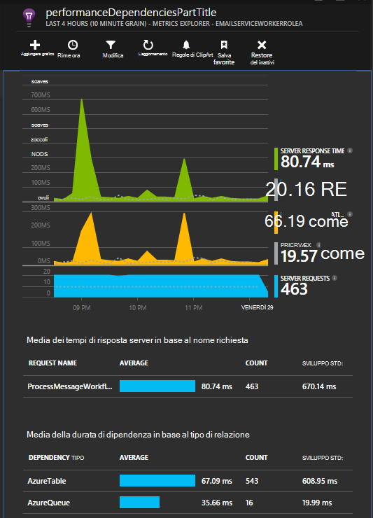

## <a name="exceptions"></a>Eccezioni

Per informazioni su come è possibile raccogliere le eccezioni non gestite dai tipi di applicazioni web diverso, vedere [Monitoraggio eccezioni nell'applicazione approfondimenti](app-insights-asp-net-exceptions.md) .

Il ruolo di web esempio ha controller MVC5 e Web API 2. Le eccezioni non gestite da 2 acquisite con le operazioni seguenti:

* [AiHandleErrorAttribute](https://github.com/Microsoft/ApplicationInsights-Home/blob/master/Samples/AzureEmailService/MvcWebRole/Telemetry/AiHandleErrorAttribute.cs) impostare [qui](https://github.com/Microsoft/ApplicationInsights-Home/blob/master/Samples/AzureEmailService/MvcWebRole/App_Start/FilterConfig.cs#L12) per MVC5 controller
* [AiWebApiExceptionLogger](https://github.com/Microsoft/ApplicationInsights-Home/blob/master/Samples/AzureEmailService/MvcWebRole/Telemetry/AiWebApiExceptionLogger.cs) impostare [qui](https://github.com/Microsoft/ApplicationInsights-Home/blob/master/Samples/AzureEmailService/MvcWebRole/App_Start/WebApiConfig.cs#L25) per controller Web API 2

Per i ruoli di lavoro, esistono due modi per tenere traccia delle eccezioni.

* TrackException(ex)
* Se è stato aggiunto il pacchetto di NuGet comunicare ascoltatore traccia approfondimenti applicazione, è possibile utilizzare System.Diagnostics.Trace per registrare le eccezioni. [Esempio di codice.](https://github.com/Microsoft/ApplicationInsights-Home/blob/master/Samples/AzureEmailService/WorkerRoleA/WorkerRoleA.cs#L107)

## <a name="performance-counters"></a>Contatori delle prestazioni

I seguenti contatori sono stati raccolti per impostazione predefinita:

    * \Process(??APP_WIN32_PROC??)\% tempo processore
    * \Memory\Available byte
    * \.NET CLR Exceptions(??APP_CLR_PROC??)\# di eccezioni generata / sec
    * \Processo (??. APP_WIN32_PROC??) \Private byte
    * \Processo (??. APP_WIN32_PROC??) \IO dati byte/sec
    * \Processor(_Total)\% tempo processore

Inoltre, di seguito vengono raccolte anche per i ruoli di web:

    * \ASP.NET applicazioni (??. APP_W3SVC_PROC??) \Requests/sec    
    * \ASP.NET applicazioni (??. APP_W3SVC_PROC??) Tempo di esecuzione \Request
    * \ASP.NET applicazioni (??. APP_W3SVC_PROC??) \Requests nella coda dell'applicazione

È possibile specificare altre personalizzata o altre contatori windows come illustrato [di seguito](https://github.com/Microsoft/ApplicationInsights-Home/blob/master/Samples/AzureEmailService/WorkerRoleA/ApplicationInsights.config#L14)

  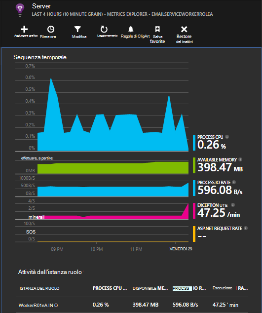

## <a name="correlated-telemetry-for-worker-roles"></a>Telemetria correlato per i ruoli di lavoro

È un'esperienza diagnostica quando è possibile vedere che cos'è a una richiesta di latenza elevata o non riuscito. Con i ruoli di web SDK configura automaticamente correlazione tra telemetria correlato. Per i ruoli di lavoro, è possibile utilizzare un inizializzatore di telemetria personalizzato per impostare un attributo di contesto Operation.Id comune per tutti i telemetria eseguire questa operazione. In questo modo sarà possibile vedere se il problema di latenza/errore era causato a causa di una dipendenza o il codice a colpo d'occhio! 

Ecco come:

* Impostare l'Id di correlazione in una CallContext come illustrato [di seguito](https://github.com/Microsoft/ApplicationInsights-Home/blob/master/Samples/AzureEmailService/WorkerRoleA/WorkerRoleA.cs#L36). In questo caso, si utilizza l'ID richiesta come l'id di correlazione
* Aggiungere un'implementazione TelemetryInitializer personalizzata, che consente di impostare il Operation.Id correlationId impostato in precedenza. Qui: [ItemCorrelationTelemetryInitializer](https://github.com/Microsoft/ApplicationInsights-Home/blob/master/Samples/AzureEmailService/WorkerRoleA/Telemetry/ItemCorrelationTelemetryInitializer.cs#L13)
* Aggiungere inizializzatore di telemetria personalizzato. È Impossibile eseguire che nel file ApplicationInsights.config o nel codice come illustrato [qui](https://github.com/Microsoft/ApplicationInsights-Home/blob/master/Samples/AzureEmailService/WorkerRoleA/WorkerRoleA.cs#L233)

Questo è tutto! L'esperienza portale è già collegato consentono di visualizzare tutti i relativi telemetria a colpo d'occhio:

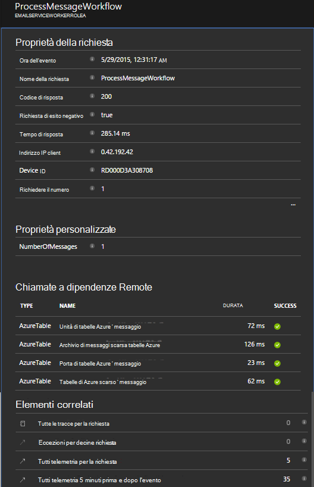


## <a name="client-telemetry"></a>Telemetria client

[Aggiungere SDK JavaScript alle pagine web] [ client] per ottenere telemetria basate su browser, ad esempio conteggi di visualizzazione pagina, tempi di caricamento delle pagine, le eccezioni di script e per consentire la scrittura personalizzato telemetria negli script di pagina.

## <a name="availability-tests"></a>Verifica disponibilità

[Impostare i test web] [ availability] per verificare che l'applicazione rimane attivo e rispondere.


## <a name="example"></a>Esempio

[Nell'esempio](https://github.com/Microsoft/ApplicationInsights-Home/tree/master/Samples/AzureEmailService) esegue il monitoraggio un servizio che dispone di un ruolo web e due i ruoli di lavoro.

## <a name="exception-method-not-found-on-running-in-azure-cloud-services"></a>Eccezione "metodo non trovato" in esecuzione in servizi Cloud Windows Azure

.NET 4.6 è creare? 4.6 non è supportata automaticamente ruoli servizi Cloud Windows Azure. [Installare 4.6 su ogni ruolo](../cloud-services/cloud-services-dotnet-install-dotnet.md) prima di eseguire l'app.

## <a name="related-topics"></a>Argomenti correlati

* [Configurare l'invio di diagnostica Azure a informazioni dettagliate sui applicazione](app-insights-azure-diagnostics.md)
* [Uso di PowerShell per inviare diagnostica Windows Azure a informazioni dettagliate sui applicazione](app-insights-powershell-azure-diagnostics.md)


[api]: app-insights-api-custom-events-metrics.md
[apidefaults]: app-insights-api-custom-events-metrics.md#default-properties
[apidynamicikey]: app-insights-separate-resources.md#dynamic-ikey
[availability]: app-insights-monitor-web-app-availability.md
[azure]: app-insights-azure.md
[client]: app-insights-javascript.md
[diagnostic]: app-insights-diagnostic-search.md
[netlogs]: app-insights-asp-net-trace-logs.md
[portal]: http://portal.azure.com/
[qna]: app-insights-troubleshoot-faq.md
[redfield]: app-insights-monitor-performance-live-website-now.md
[start]: app-insights-overview.md 
