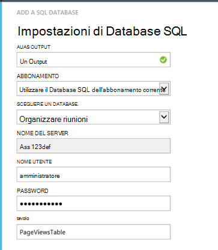

<properties 
    pageTitle="Procedura dettagliata: esportare telemetria al Database SQL dall'applicazione approfondimenti" 
    description="Esportare continuamente applicazione informazioni dettagliate sui dati in SQL utilizzando Stream Analitica." 
    services="application-insights" 
    documentationCenter=""
    authors="noamben" 
    manager="douge"/>

<tags 
    ms.service="application-insights" 
    ms.workload="tbd" 
    ms.tgt_pltfrm="ibiza" 
    ms.devlang="na" 
    ms.topic="article" 
    ms.date="03/06/2015" 
    ms.author="awills"/>
 
# <a name="walkthrough-export-to-sql-from-application-insights-using-stream-analytics"></a>Procedura dettagliata: Esportare in SQL dall'applicazione approfondimenti utilizzando Stream Analitica

In questo articolo viene illustrato come spostare i dati di telemetria da [Visual Studio applicazione approfondimenti] [ start] in un database di SQL Azure con [Esportare continuo] [ export] e [Azure flusso Analitica](https://azure.microsoft.com/services/stream-analytics/). 

Esportazione continuo entra i dati di telemetria nello spazio di archiviazione di Azure nel formato JSON. Abbiamo necessario analizzare gli oggetti JSON utilizzando Azure flusso Analitica e creare righe in una tabella di database.

(Più in generale, esportare continua è il modo per eseguire analisi di telemetria le app di inviare a informazioni dettagliate sui applicazione. È possibile adattare in questo esempio per eseguire altre operazioni con telemetria esportato, ad esempio l'aggregazione dei dati.)

Iniziamo con sul presupposto che si ha già l'app che è possibile monitorare.


In questo esempio, si inizierà a usare i dati della visualizzazione pagina, ma lo stesso modello può essere facilmente esteso ad altri tipi di dati, ad esempio eventi personalizzati e le eccezioni. 


## <a name="add-application-insights-to-your-application"></a>Aggiungere informazioni dettagliate sui applicazione all'applicazione


Per iniziare:

1. [Impostare le informazioni dettagliate sui applicazione per le pagine web](app-insights-javascript.md). 

    (In questo esempio viene illustrato l'elaborazione dei dati di visualizzazione pagina browser dei client, ma è anche possibile impostare applicazione approfondimenti per sul lato server l'app [Java](app-insights-java-get-started.md) o [ASP.NET](app-insights-asp-net.md) e richiesta di processo, dipendenza e altri telemetria server)


5. Pubblicare l'app e guardare i dati di telemetria visualizzate nella risorsa approfondimenti applicazione.


## <a name="create-storage-in-azure"></a>Creare lo spazio di archiviazione in Azure

Esportazione continua sempre invia dati a un account di archiviazione Azure, in modo che è necessario creare prima di tutto lo spazio di archiviazione.

1. Creare un account di archiviazione in abbonamento nel [portale di Azure][portal].

    

2. Creare un contenitore

    

3. Copiare il tasto di scelta di spazio di archiviazione

    È necessario prima per configurare l'input al servizio analitica flusso.

    

## <a name="start-continuous-export-to-azure-storage"></a>Avviare esportazione continua allo spazio di archiviazione Azure

1. Nel portale di Azure, passare alla risorsa approfondimenti applicazione creata per l'applicazione.

    

2. Creare un'esportazione continua.

    


    Selezionare l'account di archiviazione creata in precedenza:

    
    
    Impostare i tipi di eventi che si desidera visualizzare:

    


3. Consentire alcuni dati si accumulano. Parlare e consentire agli utenti di utilizzare l'applicazione per un po' di tempo. Telemetria venga recapitata e vengono visualizzati grafici statistici in [Esplora metrica](app-insights-metrics-explorer.md) e singoli eventi nella [ricerca diagnostica](app-insights-diagnostic-search.md). 

    E inoltre di esportazione dati allo spazio di archiviazione. 

4. Esaminare l'esportato dati nel portale - scegliere il **pulsante Sfoglia**, selezionare l'account di archiviazione e **contenitori** - o in Visual Studio. In Visual Studio, scegliere **visualizzare / Cloud Explorer**e aprire Azure / lo spazio di archiviazione. (Se non si dispone di questa opzione di menu, è necessario installare Azure SDK: aprire la finestra di dialogo Nuovo progetto e c# / Cloud / ottenere Microsoft Azure SDK per .NET.)

    

    Prendere nota della parte del nome del percorso, derivata dal tasto applicazione nome e strumentazione comune. 

Gli eventi vengono salvati i file in formato JSON blob. Ogni file può contenere uno o più eventi. In modo si desidera leggere i dati dell'evento ed escludere i campi che vogliamo. Sono disponibili tutti i tipi di operazioni che è possibile eseguire con i dati, ma il nostro piano oggi consiste nell'usare flusso Analitica per spostare i dati a un database SQL. Che renderà facile eseguire numerose query interessante.

## <a name="create-an-azure-sql-database"></a>Creare un Database SQL Azure

Avviare nuovamente dall'abbonamento nel [portale di Azure][portal], creare il database (e un nuovo server, a meno che non si ha uno) per la quale è possibile scrivere i dati.


Verificare che il server di database consente di accedere ai servizi Azure:


## <a name="create-a-table-in-azure-sql-db"></a>Creare una tabella nel database di SQL Azure

Connetti a database creato nella sezione precedente con lo strumento di gestione preferito. In questa procedura dettagliata verranno utilizzate [Strumenti di gestione di SQL Server](https://msdn.microsoft.com/ms174173.aspx) (SQL Server Management Studio).


Creare una nuova query ed eseguire il seguente T-SQL:

```SQL

CREATE TABLE [dbo].[PageViewsTable](
    [pageName] [nvarchar](max) NOT NULL,
    [viewCount] [int] NOT NULL,
    [url] [nvarchar](max) NULL,
    [urlDataPort] [int] NULL,
    [urlDataprotocol] [nvarchar](50) NULL,
    [urlDataHost] [nvarchar](50) NULL,
    [urlDataBase] [nvarchar](50) NULL,
    [urlDataHashTag] [nvarchar](max) NULL,
    [eventTime] [datetime] NOT NULL,
    [isSynthetic] [nvarchar](50) NULL,
    [deviceId] [nvarchar](50) NULL,
    [deviceType] [nvarchar](50) NULL,
    [os] [nvarchar](50) NULL,
    [osVersion] [nvarchar](50) NULL,
    [locale] [nvarchar](50) NULL,
    [userAgent] [nvarchar](max) NULL,
    [browser] [nvarchar](50) NULL,
    [browserVersion] [nvarchar](50) NULL,
    [screenResolution] [nvarchar](50) NULL,
    [sessionId] [nvarchar](max) NULL,
    [sessionIsFirst] [nvarchar](50) NULL,
    [clientIp] [nvarchar](50) NULL,
    [continent] [nvarchar](50) NULL,
    [country] [nvarchar](50) NULL,
    [province] [nvarchar](50) NULL,
    [city] [nvarchar](50) NULL
)

CREATE CLUSTERED INDEX [pvTblIdx] ON [dbo].[PageViewsTable]
(
    [eventTime] ASC
)WITH (PAD_INDEX = OFF, STATISTICS_NORECOMPUTE = OFF, SORT_IN_TEMPDB = OFF, DROP_EXISTING = OFF, ONLINE = OFF, ALLOW_ROW_LOCKS = ON, ALLOW_PAGE_LOCKS = ON)

```


In questo esempio si utilizza dati da visualizzazioni delle pagine. Per visualizzare i dati disponibili, esaminare l'output JSON e vedere [Esporta modello di dati](app-insights-export-data-model.md).

## <a name="create-an-azure-stream-analytics-instance"></a>Creare un'istanza di Azure flusso Analitica

Dal [Portale di Azure classica](https://manage.windowsazure.com/), selezionare il servizio di Azure flusso Analitica e creare un nuovo processo Analitica flusso:


Quando viene creato il nuovo processo, espandere i dettagli:


#### <a name="set-blob-location"></a>Impostare la posizione blob

Impostarlo in modo che ricevono input dal blob continuo esportare:


A questo punto è necessario la chiave primaria di accesso dall'Account di archiviazione, indicato in precedenza. Impostare questa come chiave di Account di archiviazione.


#### <a name="set-path-prefix-pattern"></a>Impostare percorso prefisso motivo 


Assicurarsi di impostare il formato della data **Gg / MM-AAAA** (con **trattini**).

Il modello di prefisso percorso specifica come flusso Analitica trova il file di input nello spazio di archiviazione. È necessario impostarlo in modo che corrispondano a come esportare continuo sono archiviati i dati. Impostarlo come segue:

    webapplication27_12345678123412341234123456789abcdef0/PageViews/{date}/{time}

In questo esempio:

* `webapplication27`è il nome della risorsa applicazione approfondimenti, **tutto in lettere minuscole**. 
* `1234...`è fondamentale strumentazione dell'applicazione approfondimenti risorse **con linee tratteggiate rimossi**. 
* `PageViews`è il tipo di dati che si desidera analizzare. I tipi disponibili dipendono dai filtri impostati in esportare continua. Esaminare i dati esportati per visualizzare altri tipi disponibili e vedere [Esporta modello di dati](app-insights-export-data-model.md).
* `/{date}/{time}`un modello è scritto in forma letterale.

Per ottenere il nome e iKey della risorsa applicazione approfondimenti, aprire nozioni di base nella relativa pagina Panoramica o aprire Impostazioni.

#### <a name="finish-initial-setup"></a>Completare la configurazione iniziale

Verificare il formato di serializzazione:


Chiudere la procedura guidata e attendere per completare l'installazione.

>[AZURE.TIP] Utilizzare la funzione di esempio per verificare di aver selezionato il percorso di input in modo corretto. In caso di errore: verificare che sia dati in spazio di archiviazione per l'intervallo di tempo di esempio si è scelto. Modificare la definizione di input e controllare si imposta l'account di archiviazione, prefisso percorso e formato data in modo corretto.

## <a name="set-query"></a>Set di query

Aprire la sezione query:


Sostituire la query predefinita con:

```SQL

    SELECT flat.ArrayValue.name as pageName
    , flat.ArrayValue.count as viewCount
    , flat.ArrayValue.url as url
    , flat.ArrayValue.urlData.port as urlDataPort
    , flat.ArrayValue.urlData.protocol as urlDataprotocol
    , flat.ArrayValue.urlData.host as urlDataHost
    , flat.ArrayValue.urlData.base as urlDataBase
    , flat.ArrayValue.urlData.hashTag as urlDataHashTag
      ,A.context.data.eventTime as eventTime
      ,A.context.data.isSynthetic as isSynthetic
      ,A.context.device.id as deviceId
      ,A.context.device.type as deviceType
      ,A.context.device.os as os
      ,A.context.device.osVersion as osVersion
      ,A.context.device.locale as locale
      ,A.context.device.userAgent as userAgent
      ,A.context.device.browser as browser
      ,A.context.device.browserVersion as browserVersion
      ,A.context.device.screenResolution.value as screenResolution
      ,A.context.session.id as sessionId
      ,A.context.session.isFirst as sessionIsFirst
      ,A.context.location.clientip as clientIp
      ,A.context.location.continent as continent
      ,A.context.location.country as country
      ,A.context.location.province as province
      ,A.context.location.city as city
    INTO
      AIOutput
    FROM AIinput A
    CROSS APPLY GetElements(A.[view]) as flat


```

Si noti che alcune proprietà prima sono specifiche di dati di visualizzazione della pagina. Esportazioni di altri tipi di telemetria avrà proprietà diverse. Vedere la [dettagliate riferimento del modello di dati per i tipi di proprietà e i valori.](app-insights-export-data-model.md)

## <a name="set-up-output-to-database"></a>Configurare output a database

Selezionare SQL come output.


Specificare il database SQL.




Chiudere la procedura guidata e attendere che una notifica che informa che l'output è stata impostata.

## <a name="start-processing"></a>Avviare l'elaborazione

Avviare il processo della barra delle azioni:


È possibile scegliere se si desidera avviare l'elaborazione dei dati a partire da adesso o tipi di dati per iniziare con precedente. Quest'ultimo è utile se si è avuto continuo esportare già in esecuzione per un po' di tempo.


Dopo alcuni minuti, tornare agli strumenti di gestione di SQL Server e controllare i flusso di dati in. Ad esempio, utilizzare una query come segue:

    SELECT TOP 100 *
    FROM [dbo].[PageViewsTable]


## <a name="related-articles"></a>Articoli correlati

* [Esportare in SQL utilizzando un ruolo di lavoro](app-insights-code-sample-export-telemetry-sql-database.md)
* [Esporta per ottenere informazioni tramite Analitica flusso](app-insights-export-power-bi.md)
* [Guida di riferimento per i tipi di proprietà e i valori del modello di dati di dettagliati.](app-insights-export-data-model.md)
* [Esportazione continua nell'applicazione approfondimenti](app-insights-export-telemetry.md)
* [Informazioni dettagliate sui applicazione](https://azure.microsoft.com/services/application-insights/)

<!--Link references-->

[diagnostic]: app-insights-diagnostic-search.md
[export]: app-insights-export-telemetry.md
[metrics]: app-insights-metrics-explorer.md
[portal]: http://portal.azure.com/
[start]: app-insights-overview.md

 