<properties 
    pageTitle="Esempio: analizzare i dati esportati dall'applicazione approfondimenti" 
    description="Codice analisi di telemetria di applicazione approfondimenti utilizzando la funzionalità di esportazione continua. Salvare i dati di SQL." 
    services="application-insights" 
    documentationCenter=""
    authors="mazharmicrosoft" 
    manager="douge"/>

<tags 
    ms.service="application-insights" 
    ms.workload="tbd" 
    ms.tgt_pltfrm="ibiza" 
    ms.devlang="na" 
    ms.topic="article" 
    ms.date="01/05/2016" 
    ms.author="awills"/>
 
# Esempio: analizzare i dati esportati dall'applicazione approfondimenti

In questo articolo viene illustrato come elaborare dati JSON esportati da approfondimenti applicazione. Ad esempio, è possibile scrivere codice per spostare i dati di telemetria da [Visual Studio applicazione approfondimenti] [ start] in un database di SQL Azure con [Esportare continuo][export]. (È possibile ottenere questo [utilizzando Stream Analitica](app-insights-code-sample-export-sql-stream-analytics.md), ma l'obiettivo di seguito è illustrato il codice) 

Esportazione continuo entra il telemetria nello spazio di archiviazione di Azure nel formato JSON, in modo che è necessario scrivere codice per analizzare gli oggetti JSON e creare righe in una tabella di database.

Più in generale, esportare continua è il modo per eseguire analisi di telemetria le app di inviare a informazioni dettagliate sui applicazione. È possibile adattare in questo esempio per eseguire altre operazioni con telemetria esportato.

Iniziamo con sul presupposto che si ha già l'app che è possibile monitorare.

## Aggiungere informazioni dettagliate sui applicazione SDK

Per monitorare l'applicazione, l' [aggiunta di un SDK approfondimenti applicazione] [ start] all'applicazione. Esistono diversi SDK e strumenti di supporto per piattaforme diverse, IDE e lingue. È possibile monitorare le pagine web, Java o ASP.NET Server web e dispositivi mobili tipi diversi. Tutti gli SDK inviare telemetria al [portale di informazioni dettagliate sui applicazione][portal], in cui è possibile utilizzare il nostro analisi potenti e strumenti di diagnostica ed esportare i dati allo spazio di archiviazione.

Per iniziare:

1. È possibile ottenere un [account di Microsoft Azure](https://azure.microsoft.com/pricing/).
2. Nel [portale di Azure][portal], aggiungere una nuova risorsa applicazione approfondimenti per l'app:

    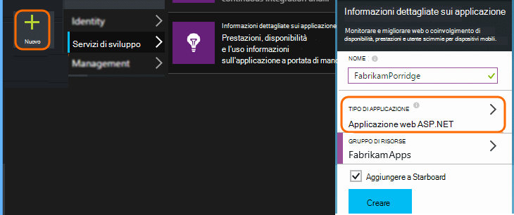

    (Il tipo di app e sottoscrizione potrebbero essere diversi.)
3. Aprire la Guida introduttiva per trovare come configurare SDK per il tipo di app.

    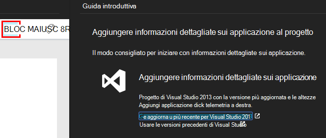

    Se non è elencato il tipo di app, consultare la [Guida introduttiva] [ start] pagina.

4. In questo esempio viene eseguito il monitoraggio un'app web in modo che è possibile utilizzare gli strumenti di Azure in Visual Studio per installare SDK. È necessario specificare la il nome della risorsa nostro approfondimenti applicazione:

    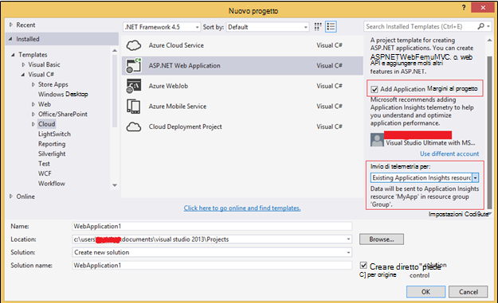

## Creare lo spazio di archiviazione in Azure

Dati di applicazione approfondimenti vengono esportati sempre a un account di archiviazione Azure nel formato JSON. È che il codice leggerà i dati da questo spazio di archiviazione.

1. Creare un account di archiviazione "classico" nell'abbonamento nel [portale di Azure][portal].

    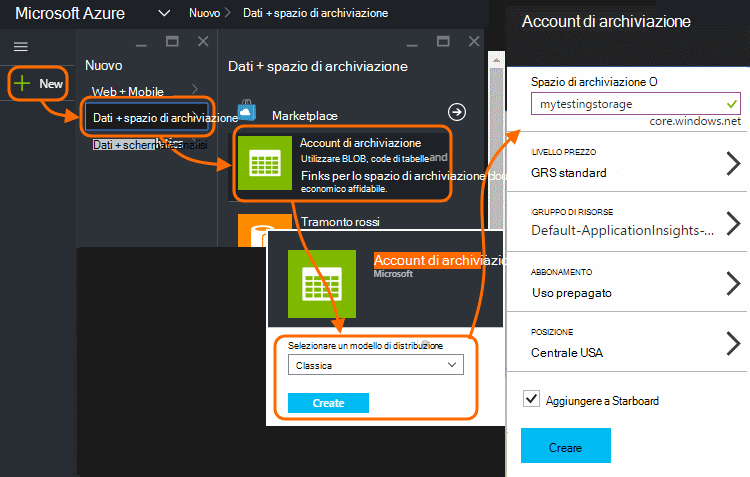

2. Creare un contenitore

    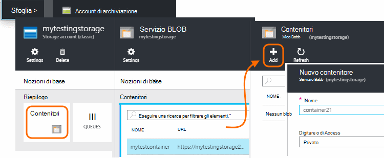

## Avviare esportazione continua allo spazio di archiviazione Azure

1. Nel portale di Azure, passare alla risorsa approfondimenti applicazione creata per l'applicazione.

    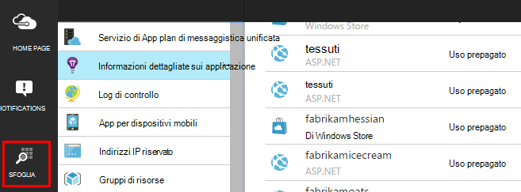

2. Creare un'esportazione continua.

    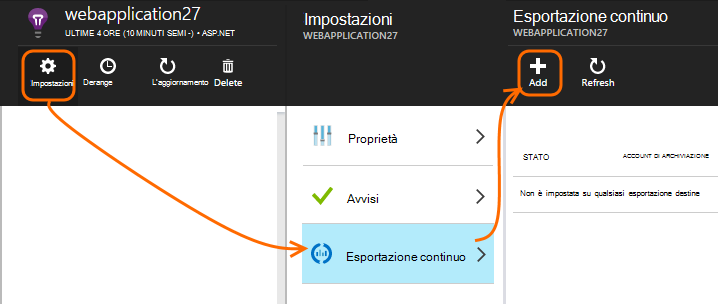

    Selezionare l'account di archiviazione creata in precedenza:

    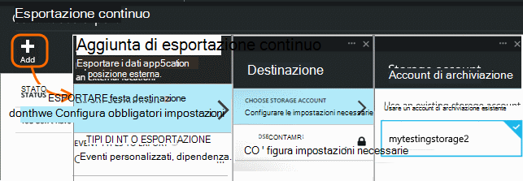
    
    Impostare i tipi di eventi che si desidera visualizzare:

    

3. Consentire alcuni dati si accumulano. Parlare e consentire agli utenti di utilizzare l'applicazione per un po' di tempo. Telemetria venga recapitata e vengono visualizzati grafici statistici in [Esplora metrica](app-insights-metrics-explorer.md) e singoli eventi nella [ricerca diagnostica](app-insights-diagnostic-search.md). 

    E inoltre di esportazione dati allo spazio di archiviazione. 

4. Esaminare i dati esportati. In Visual Studio, scegliere **visualizzare / Cloud Explorer**e aprire Azure / lo spazio di archiviazione. (Se non si dispone di questa opzione di menu, è necessario installare Azure SDK: aprire la finestra di dialogo Nuovo progetto e c# / Cloud / ottenere Microsoft Azure SDK per .NET.)

    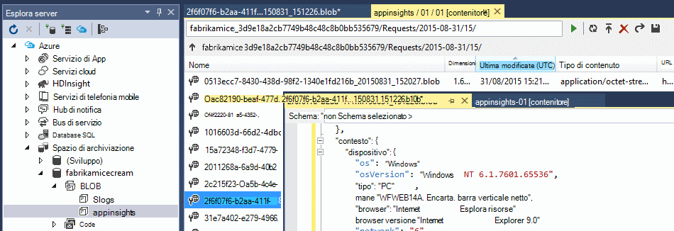

    Prendere nota della parte del nome del percorso, derivata dal tasto applicazione nome e strumentazione comune. 

Gli eventi vengono salvati i file in formato JSON blob. Ogni file può contenere uno o più eventi. In modo si desidera leggere i dati dell'evento ed escludere i campi che vogliamo. Sono disponibili tutti i tipi di operazioni che è possibile eseguire con i dati, ma il nostro piano oggi è scrivere codice per spostare i dati a un database SQL. Che renderà facile eseguire numerose query interessante.

## Creare un Database SQL Azure

In questo esempio, è necessario scrivere codice per inviare i dati in un database.

Avviare nuovamente dall'abbonamento nel [portale di Azure][portal], creare il database (e un nuovo server, a meno che non si ha uno) per la quale è possibile scrivere i dati.

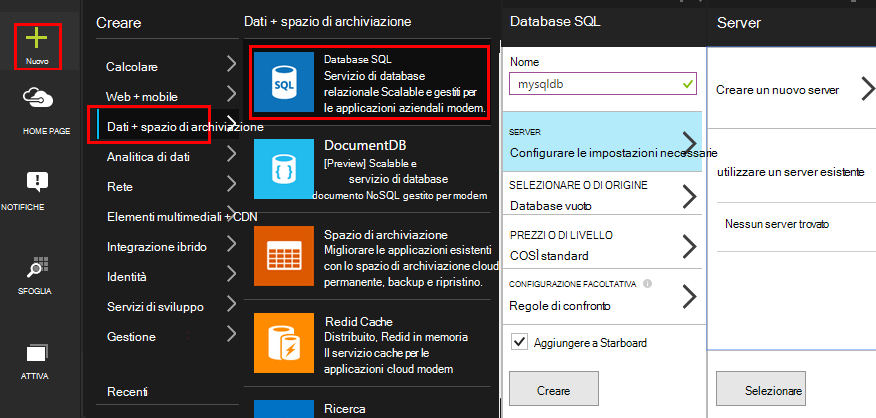

Verificare che il server di database consente di accedere ai servizi Azure:

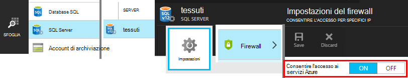

## Creare un ruolo di lavoro 

Ora per l'ultima è possibile scrivere [codice](https://sesitai.codeplex.com/) per l'analisi JSON nei blob esportato e creare record nel database. Poiché l'archivio di esportazione e il database sia in Azure, si eseguirà il codice di un ruolo di lavoro Azure.

Questo codice estrae automaticamente le proprietà sono presente nel JSON. Per le descrizioni delle proprietà, vedere [esportare il modello di dati](app-insights-export-data-model.md).

#### Creazione di progetto di ruolo di lavoro

In Visual Studio, creare un nuovo progetto per il ruolo di lavoro:

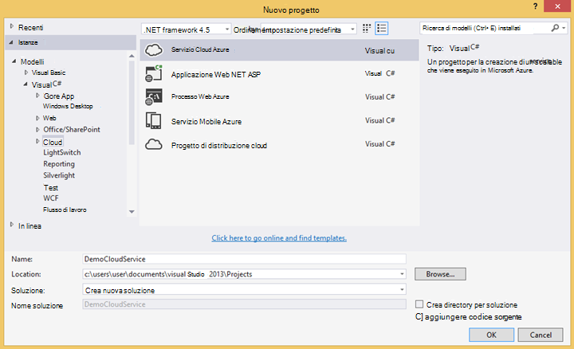

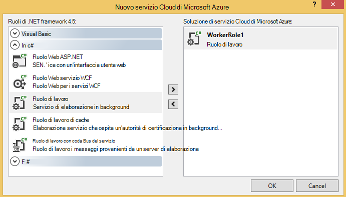

#### Connettersi all'account di archiviazione

In Azure, ottenere la stringa di connessione dal proprio account di archiviazione:

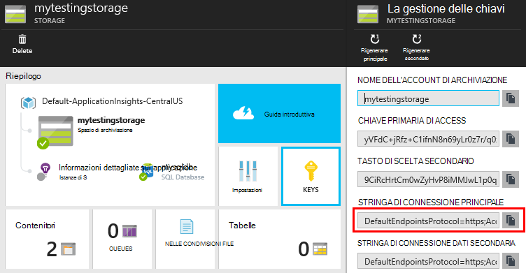

In Visual Studio, configurare le impostazioni di ruolo di lavoro con la stringa di connessione di account di archiviazione:

#### Pacchetti

In Esplora soluzioni fare clic sul progetto il ruolo di lavoro e scegliere Gestisci pacchetti NuGet.
Cercare e installare questi pacchetti: 

 * EntityFramework 6.1.2 o successivamente, questa verrà utilizzata per generare lo schema di tabella DB in tempo reale, in base al contenuto di JSON nel blob.
 * JsonFx - useremo questo per la conversione della JSON alle proprietà di classe c#.

Utilizzare questo strumento per generare classe c# indietro il nostro singolo documento JSON. Richiede l'esecuzione di alcune modifiche minori come unire matrici JSON in c# singola proprietà in attiva una singola colonna nella tabella DB (ex. urlData_port) 

 * [Generatore di classi c# JSON](http://jsonclassgenerator.codeplex.com/)

## Codice 

È possibile inserire questo codice `WorkerRole.cs`.

#### Importa

    using Microsoft.WindowsAzure.Storage;

    using Microsoft.WindowsAzure.Storage.Blob;

#### Recuperare la stringa di connessione di spazio di archiviazione

    private static string GetConnectionString()
    {
      return Microsoft.WindowsAzure.CloudConfigurationManager.GetSetting("StorageConnectionString");
    }

#### Eseguire il lavoro a intervalli regolari

Sostituire il metodo di esecuzione esistente e scegliere l'intervallo desiderato. Deve trattarsi di almeno un'ora, poiché la funzionalità di esportazione completa un oggetto JSON in un'ora.

    public override void Run()
    {
      Trace.TraceInformation("WorkerRole1 is running");

      while (true)
      {
        Trace.WriteLine("Sleeping", "Information");

        Thread.Sleep(86400000); //86400000=24 hours //1 hour=3600000
                
        Trace.WriteLine("Awake", "Information");

        ImportBlobtoDB();
      }
    }

#### Inserire ogni oggetto JSON come una riga di tabella

    public void ImportBlobtoDB()
    {
      try
      {
        CloudStorageAccount account = CloudStorageAccount.Parse(GetConnectionString());

        var blobClient = account.CreateCloudBlobClient();
        var container = blobClient.GetContainerReference(FilterContainer);

        foreach (CloudBlobDirectory directory in container.ListBlobs())//Parent directory
        {
          foreach (CloudBlobDirectory subDirectory in directory.ListBlobs())//PageViewPerformance
          {
            foreach (CloudBlobDirectory dir in subDirectory.ListBlobs())//2015-01-31
            {
              foreach (CloudBlobDirectory subdir in dir.ListBlobs())//22
              {
                foreach (IListBlobItem item in subdir.ListBlobs())//3IAwm6u3-0.blob
                {
                  itemname = item.Uri.ToString();
                  ParseEachBlob(container, item);
                  AuditBlob(container, directory, subDirectory, dir, subdir, item);
                } //item loop
              } //subdir loop
            } //dir loop
          } //subDirectory loop
        } //directory loop
      }
      catch (Exception ex)
      {
        //handle exception
      }
    }

#### Analizzare ogni blob

    private void ParseEachBlob(CloudBlobContainer container, IListBlobItem item)
    {
      try
      {
        var blob = container.GetBlockBlobReference(item.Parent.Prefix + item.Uri.Segments.Last());
    
        string json;
    
        using (var memoryStream = new MemoryStream())
        {
          blob.DownloadToStream(memoryStream);
          json = System.Text.Encoding.UTF8.GetString(memoryStream.ToArray());
    
          IEnumerable<string> entities = json.Split('\n').Where(s => !string.IsNullOrWhiteSpace(s));
    
          recCount = entities.Count();
          failureCount = 0; //resetting failure count
    
          foreach (var entity in entities)
          {
            var reader = new JsonFx.Json.JsonReader();
            dynamic output = reader.Read(entity);
    
            Dictionary<string, object> dict = new Dictionary<string, object>();
    
            GenerateDictionary((System.Dynamic.ExpandoObject)output, dict, "");
    
            switch (FilterType)
            {
              case "PageViewPerformance":
    
              if (dict.ContainsKey("clientPerformance"))
                {
                  GenerateDictionary(((System.Dynamic.ExpandoObject[])dict["clientPerformance"])[0], dict, "");
                }
    
              if (dict.ContainsKey("context_custom_dimensions"))
              {
                if (dict["context_custom_dimensions"].GetType() == typeof(System.Dynamic.ExpandoObject[]))
                {
                  GenerateDictionary(((System.Dynamic.ExpandoObject[])dict["context_custom_dimensions"])[0], dict, "");
                }
              }
    
            PageViewPerformance objPageViewPerformance = (PageViewPerformance)GetObject(dict);
    
            try
            {
              using (var db = new TelemetryContext())
              {
                db.PageViewPerformanceContext.Add(objPageViewPerformance);
                db.SaveChanges();
              }
            }
            catch (Exception ex)
            {
              failureCount++;
            }
            break;
    
            default:
            break;
          }
        }
      }
    }
    catch (Exception ex)
    {
      //handle exception 
    }
    }

#### Preparare un dizionario per ogni documento JSON

    private void GenerateDictionary(System.Dynamic.ExpandoObject output, Dictionary<string, object> dict, string parent)
        {
            try
            {
                foreach (var v in output)
                {
                    string key = parent + v.Key;
                    object o = v.Value;

                    if (o.GetType() == typeof(System.Dynamic.ExpandoObject))
                    {
                        GenerateDictionary((System.Dynamic.ExpandoObject)o, dict, key + "_");
                    }
                    else
                    {
                        if (!dict.ContainsKey(key))
                        {
                            dict.Add(key, o);
                        }
                    }
                }
            }
            catch (Exception ex)
            {
            //handle exception 
            }
        }

#### Eseguire il cast documento JSON in c# proprietà oggetto telemetria classe

     public object GetObject(IDictionary<string, object> d)
        {
            PropertyInfo[] props = null;
            object res = null;

            try
            {
                switch (FilterType)
                {
                    case "PageViewPerformance":

                        props = typeof(PageViewPerformance).GetProperties();
                        res = Activator.CreateInstance<PageViewPerformance>();
                        break;

                    default:
                        break;
                }

                for (int i = 0; i < props.Length; i++)
                {
                    if (props[i].CanWrite && d.ContainsKey(props[i].Name))
                    {
                        props[i].SetValue(res, d[props[i].Name], null);
                    }
                }
            }
            catch (Exception ex)
            {
            //handle exception 
            }

            return res;
        }

#### File di classe PageViewPerformance generato indietro documento JSON

    public class PageViewPerformance
    {
        [DatabaseGenerated(DatabaseGeneratedOption.Identity)]
        public Guid Id { get; set; }

        public string url { get; set; }

        public int urlData_port { get; set; }

        public string urlData_protocol { get; set; }

        public string urlData_host { get; set; }

        public string urlData_base { get; set; }

        public string urlData_hashTag { get; set; }

        public double total_value { get; set; }

        public double networkConnection_value { get; set; }

        public double sendRequest_value { get; set; }

        public double receiveRequest_value { get; set; }

        public double clientProcess_value { get; set; }

        public string name { get; set; }

        public string internal_data_id { get; set; }

        public string internal_data_documentVersion { get; set; }

        public DateTime? context_data_eventTime { get; set; }

        public string context_device_id { get; set; }

        public string context_device_type { get; set; }

        public string context_device_os { get; set; }

        public string context_device_osVersion { get; set; }

        public string context_device_locale { get; set; }

        public string context_device_userAgent { get; set; }

        public string context_device_browser { get; set; }

        public string context_device_browserVersion { get; set; }

        public string context_device_screenResolution_value { get; set; }

        public string context_user_anonId { get; set; }

        public string context_user_anonAcquisitionDate { get; set; }

        public string context_user_authAcquisitionDate { get; set; }

        public string context_user_accountAcquisitionDate { get; set; }

        public string context_session_id { get; set; }

        public bool context_session_isFirst { get; set; }

        public string context_operation_id { get; set; }

        public double context_location_point_lat { get; set; }

        public double context_location_point_lon { get; set; }

        public string context_location_clientip { get; set; }

        public string context_location_continent { get; set; }

        public string context_location_country { get; set; }

        public string context_location_province { get; set; }

        public string context_location_city { get; set; }
    }

#### DBcontext per l'interazione SQL da entità Framework

    public class TelemetryContext : DbContext
    {
        public DbSet<PageViewPerformance> PageViewPerformanceContext { get; set; }
        public TelemetryContext()
            : base("name=TelemetryContext")
        {
        }
    }

Aggiungere la stringa di connessione DB con nome `TelemetryContext` in `app.config`.

## Schema (solo informazioni)

Si tratta dello schema per la tabella generati per PageView.

> [AZURE.NOTE] Non è necessario eseguire lo script. Gli attributi di JSON determinano le colonne della tabella.

    CREATE TABLE [dbo].[PageViewPerformances](
    [Id] [uniqueidentifier] NOT NULL,
    [url] [nvarchar](max) NULL,
    [urlData_port] [int] NOT NULL,
    [urlData_protocol] [nvarchar](max) NULL,
    [urlData_host] [nvarchar](max) NULL,
    [urlData_base] [nvarchar](max) NULL,
    [urlData_hashTag] [nvarchar](max) NULL,
    [total_value] [float] NOT NULL,
    [networkConnection_value] [float] NOT NULL,
    [sendRequest_value] [float] NOT NULL,
    [receiveRequest_value] [float] NOT NULL,
    [clientProcess_value] [float] NOT NULL,
    [name] [nvarchar](max) NULL,
    [User] [nvarchar](max) NULL,
    [internal_data_id] [nvarchar](max) NULL,
    [internal_data_documentVersion] [nvarchar](max) NULL,
    [context_data_eventTime] [datetime] NULL,
    [context_device_id] [nvarchar](max) NULL,
    [context_device_type] [nvarchar](max) NULL,
    [context_device_os] [nvarchar](max) NULL,
    [context_device_osVersion] [nvarchar](max) NULL,
    [context_device_locale] [nvarchar](max) NULL,
    [context_device_userAgent] [nvarchar](max) NULL,
    [context_device_browser] [nvarchar](max) NULL,
    [context_device_browserVersion] [nvarchar](max) NULL,
    [context_device_screenResolution_value] [nvarchar](max) NULL,
    [context_user_anonId] [nvarchar](max) NULL,
    [context_user_anonAcquisitionDate] [nvarchar](max) NULL,
    [context_user_authAcquisitionDate] [nvarchar](max) NULL,
    [context_user_accountAcquisitionDate] [nvarchar](max) NULL,
    [context_session_id] [nvarchar](max) NULL,
    [context_session_isFirst] [bit] NOT NULL,
    [context_operation_id] [nvarchar](max) NULL,
    [context_location_point_lat] [float] NOT NULL,
    [context_location_point_lon] [float] NOT NULL,
    [context_location_clientip] [nvarchar](max) NULL,
    [context_location_continent] [nvarchar](max) NULL,
    [context_location_country] [nvarchar](max) NULL,
    [context_location_province] [nvarchar](max) NULL,
    [context_location_city] [nvarchar](max) NULL,
    CONSTRAINT [PK_dbo.PageViewPerformances] PRIMARY KEY CLUSTERED 
    (
     [Id] ASC
    )WITH (PAD_INDEX = OFF, STATISTICS_NORECOMPUTE = OFF, IGNORE_DUP_KEY = OFF, ALLOW_ROW_LOCKS = ON, ALLOW_PAGE_LOCKS = ON) ON [PRIMARY]
    ) ON [PRIMARY] TEXTIMAGE_ON [PRIMARY]

    GO

    ALTER TABLE [dbo].[PageViewPerformances] ADD  DEFAULT (newsequentialid()) FOR [Id]
    GO

Per visualizzare in questo esempio in azione, [scaricare](https://sesitai.codeplex.com/) il codice di lavoro completata, modificare il `app.config` impostazioni e pubblicare il ruolo di lavoro in Azure.

## Articoli correlati

* [Esportare in SQL utilizzando un ruolo di lavoro](app-insights-code-sample-export-telemetry-sql-database.md)
* [Esportazione continua nell'applicazione approfondimenti](app-insights-export-telemetry.md)
* [Informazioni dettagliate sui applicazione](https://azure.microsoft.com/services/application-insights/)
* [Esportazione del modello di dati](app-insights-export-data-model.md)
* [Ulteriori esempi e procedure dettagliate](app-insights-code-samples.md)

<!--Link references-->

[diagnostic]: app-insights-diagnostic-search.md
[export]: app-insights-export-telemetry.md
[metrics]: app-insights-metrics-explorer.md
[portal]: http://portal.azure.com/
[start]: app-insights-overview.md

 
