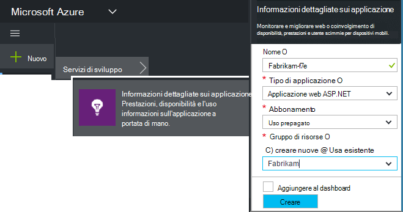
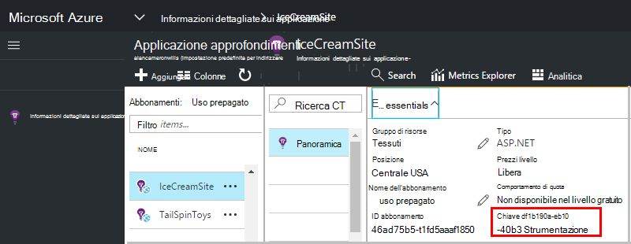

<properties 
    pageTitle="Creare una nuova risorsa applicazione approfondimenti | Microsoft Azure" 
    description="Impostare le informazioni dettagliate sui applicazione monitoraggio per una nuova applicazione live. Approccio basato sul Web." 
    services="application-insights" 
    documentationCenter=""
    authors="alancameronwills" 
    manager="douge"/>

<tags 
    ms.service="application-insights" 
    ms.workload="tbd" 
    ms.tgt_pltfrm="ibiza" 
    ms.devlang="na" 
    ms.topic="article" 
    ms.date="08/26/2016" 
    ms.author="awills"/>

# Creazione di una risorsa applicazione approfondimenti

Visual Studio applicazione approfondimenti Visualizza dati sull'applicazione di Microsoft Azure *delle risorse*. La creazione di una nuova risorsa è pertanto parte [dell'impostazione applicazione approfondimenti per monitorare una nuova applicazione][start]. In molti casi, questa può essere eseguita automaticamente dall'IDE e che è il modo consigliato in cui è disponibile. Ma in alcuni casi, si crea una risorsa manualmente.

Dopo aver creato la risorsa, ottenere la chiave strumentazione e che consente di configurare SDK nell'applicazione. Invia di telemetria alla risorsa.

## Iscriversi a Microsoft Azure

Se si non si ha un account [Microsoft account, ottenerne uno ora](http://live.com). (Se si utilizzano i servizi come Outlook.com, OneDrive, Windows Phone o XBox Live, si dispone già di un account Microsoft.)

Inoltre, è necessario un abbonamento a [Microsoft Azure](http://azure.com). Se il team o l'organizzazione ha un abbonamento a Azure, il proprietario possibile aggiungervi si, utilizzando il Windows Live ID.

Oppure è possibile creare un nuovo abbonamento. Account gratuito permette di provare a tutti gli elementi in Azure. Dopo il periodo di valutazione scade, è possibile trovare l'abbonamento in appropriato, come si non addebitati gratuitamente servizi. 

Quando si ha accesso a un abbonamento, accedere a informazioni dettagliate sui applicazione in [http://portal.azure.com](https://portal.azure.com)e usare il proprio Live ID di accesso.

## Creazione di una risorsa applicazione approfondimenti
  

In [portal.azure.com](https://portal.azure.com), aggiungere una risorsa approfondimenti applicazione:

* **Tipo di applicazione** viene applicata a visualizzare e il panoramica e le proprietà disponibili in [Esplora metrica][metrics]. Se il tipo di app non è visibile, scegliere ASP.NET.
* **Gruppo di risorse** risulta utile per la gestione delle proprietà come il controllo di accesso. Se è già stato creato altre risorse Azure, è possibile scegliere di inserire questa nuova risorsa nello stesso gruppo.
* **Sottoscrizione** è un account di pagamento in Azure.
* Deve **trovarsi** nel punto in cui è mantenere i dati. Attualmente non può essere modificato.
* **Aggiungi a startboard** inserisce un riquadro di accesso rapido per la risorsa nella pagina Home Azure. È consigliabile.

Quando l'app è stata creata, viene aperta una nuova pala. Si tratta in cui verrà visualizzato dati sulle prestazioni e l'uso sull'app. 

Per ottenere indietro a tale la volta successiva in login in Azure, cercare per riquadro avvio rapido dell'applicazione sulla scheda start (schermata iniziale). Oppure fare clic su Sfoglia per individuarlo.

## Copiare la chiave Strumentazione

Il tasto strumentazione identifica la risorsa che è stato creato. È necessario per concedere a SDK.

## Installare SDK nell'app

Installare l'applicazione approfondimenti SDK nell'app. Questo passaggio dipende il tipo di applicazione. 

Usare il tasto strumentazione per configurare [SDK l'installazione dell'applicazione][start].

il SDK include moduli standard che inviano telemetria senza che sia necessario scrivere codice. Per tenere traccia di azioni dell'utente o diagnosticare i problemi in modo più dettagliato, [utilizzare l'API] [ api] per inviare il proprio telemetria.

## Visualizzare i dati di telemetria

Chiudere e l'introduttive per tornare alla blade applicazione nel portale di Azure.

Fare clic sul riquadro di ricerca per vedere [Ricerca diagnostica][diagnostic], in cui verranno visualizzato i primo eventi. 

Se si aspetta altri dati, fare clic su Aggiorna dopo alcuni secondi.

## Creazione automatica di una risorsa

È possibile scrivere uno [script di PowerShell](app-insights-powershell-script-create-resource.md) per creare automaticamente una risorsa.

## Passaggi successivi

* [Creare un dashboard](app-insights-dashboards.md)
* [Ricerca di diagnostica](app-insights-diagnostic-search.md)
* [Esplorare le metriche](app-insights-metrics-explorer.md)
* [Scrivere query Analitica](app-insights-analytics.md)

<!--Link references-->

[api]: app-insights-api-custom-events-metrics.md
[diagnostic]: app-insights-diagnostic-search.md
[metrics]: app-insights-metrics-explorer.md
[start]: app-insights-overview.md

 