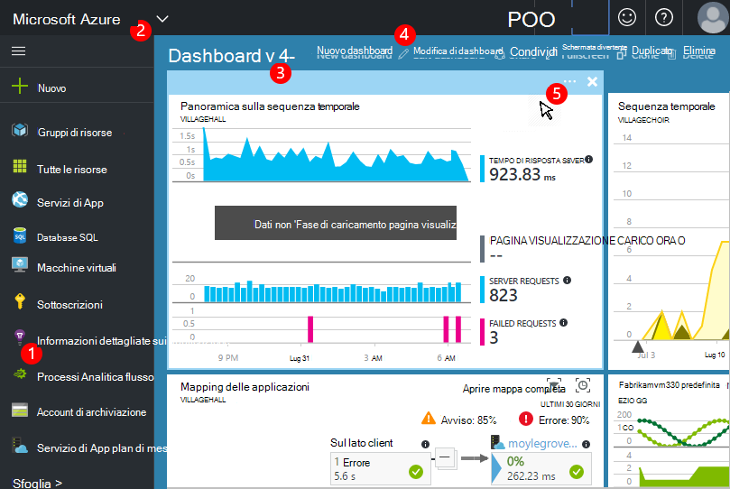

<properties
    pageTitle="Dashboard e spostamento nel portale di applicazione approfondimenti | Microsoft Azure"
    description="Creare visualizzazioni dei grafici APM chiavi e query."
    services="application-insights"
    documentationCenter=""
    authors="alancameronwills"
    manager="douge"/>

<tags
    ms.service="application-insights"
    ms.workload="tbd"
    ms.tgt_pltfrm="ibiza"
    ms.devlang="multiple"
    ms.topic="article" 
    ms.date="10/18/2016"
    ms.author="awills"/>

# Spostamento e dashboard nel portale di applicazione approfondimenti

Dopo aver configurato [applicazione informazioni approfondite sul progetto](app-insights-overview.md), i dati di telemetria sulle prestazioni e l'utilizzo dell'app verranno visualizzati nella risorsa approfondimenti applicazione del progetto nel [portale di Azure](https://portal.azure.com).

## Trovare il telemetria

Accedere al [portale di Azure](https://portal.azure.com) e passare alla risorsa approfondimenti applicazione creata per l'app.

E il Panoramica (pagina) per l'app viene visualizzato un riepilogo di valutazione di diagnostica chiave dell'app e un gateway per le altre caratteristiche del portale.

È possibile personalizzare qualsiasi gli altri grafici e aggiungerli a un dashboard. In questo modo, è possibile unire i grafici chiavi da varie app.

## Dashboard

La prima cosa che viene visualizzato dopo l'accesso al [portale di Microsoft Azure](https://portal.azure.com) è un dashboard. Qui è possibile unire i grafici più importanti per l'utente attraverso tutte le risorse Azure, tra cui telemetria da [Visual Studio applicazione approfondimenti](app-insights-overview.md).
 

1. **Passare a risorse specifiche** , ad esempio l'app in applicazione Approfondimenti: usare la barra a sinistra.
2. **Tornare al dashboard corrente**o passare ad altre visualizzazioni recenti: usare il menu a discesa nella parte superiore sinistra.
3. **Dashboard di parametro**: usare il menu a discesa sul titolo del dashboard
4. **Creare, modificare e condividere dashboard** nella barra degli strumenti del dashboard.
5. **Modificare il dashboard**: passare il mouse su un riquadro e quindi usare la barra superiore per spostare, personalizzare o rimuoverlo.

## Aggiungere a un dashboard

Quando si analizzano in un set di grafici che è particolarmente interessante o blade, è possibile aggiungere una copia al dashboard. Verrà visualizzato successivo che vi ritorna.

1. Grafico PIN per dashboard. Una copia del grafico viene visualizzata nel dashboard.
2. Aggiungere e il tutto a dashboard: viene visualizzata nel dashboard di come un riquadro che è possibile scegliere tra.
3. Fare clic su nell'angolo superiore sinistro per tornare al dashboard corrente. È quindi possibile utilizzare il menu di scelta rapida per tornare alla visualizzazione corrente.

Si noti che i grafici sono raggruppati in sezioni: un riquadro può contenere più di un grafico. È bloccare il riquadro intero al dashboard.

### Bloccare tutte le query in Analitica

È inoltre possibile [pin Analitica](app-insights-analytics-using.md#pin-to-dashboard) grafici a un dashboard [condiviso](#share-dashboards-with-your-team) . In questo modo è possibile aggiungere grafici di tutte le query non autorizzato insieme a metriche standard. (Esiste un costo per questa caratteristica.)

## Modificare un riquadro nel dashboard

Una volta un riquadro nel dashboard, è possibile regolarne le dimensioni.

1. Aggiungere un grafico alla sezione. 
2. Impostare l'unità di misura metriche, Raggruppa per dimensione e stile (tabella, grafico) di un grafico.
3. Trascinare il diagramma per eseguire lo zoom. Fare clic sul pulsante Annulla per ripristinare il periodo di tempo; impostare le proprietà di filtro per i grafici nel riquadro.
4. Impostare il titolo di sezione.

Nelle sezioni aggiunte da pale explorer metriche disponibile più opzioni di modifiche di riquadri bloccati da un blade Panoramica.

Il riquadro originale è bloccato non viene influenzato delle modifiche.

## Spostarsi tra i dashboard

È possibile salvare più di un dashboard e passare tra di esse. Quando si aggiunge un grafico o blade, vengono sommati al dashboard di corrente.

Ad esempio, potrebbe essere un dashboard per la visualizzazione a schermo intero in sala del team e un altro per lo sviluppo generale.

Nel dashboard di blade viene visualizzata come un riquadro: fare clic su esso per passare a e il. Un grafico replica il grafico nella posizione originale.

## Condividere i dashboard

Quando si è creato un dashboard, è possibile condividere con altri utenti.

Informazioni sui [ruoli e il controllo di accesso](app-insights-resources-roles-access-control.md).

## Spostamento di App

E il panoramica è il gateway per ulteriori informazioni sull'applicazione.

* **Qualsiasi grafico o un riquadro** - fare clic su una sezione o del grafico per visualizzare informazioni più dettagliate sulle venga visualizzata.

### Pulsanti blade Panoramica

* [**Esplora metriche**](app-insights-metrics-explorer.md) - creare grafici di prestazioni e l'uso.
* [**Ricerca**](app-insights-diagnostic-search.md) - provare a utilizzare istanze specifiche di eventi, ad esempio richieste, eccezioni, o accedere tracce.
* [**Analitica**](app-insights-analytics.md) - query potenti sopra il telemetria.
* **Intervallo di tempo** - regolare l'intervallo visualizzato da tutti i grafici e il.
* **Elimina** - Elimina la risorsa applicazione approfondimenti per questa applicazione. È necessario anche rimuovere i pacchetti di applicazione approfondimenti dal codice app o modificare la [chiave strumentazione](app-insights-create-new-resource.md#copy-the-instrumentation-key) nell'app per indirizzare telemetria a una risorsa approfondimenti applicazione diversa.

### Scheda Essentials

* [Chiave strumentazione](app-insights-create-new-resource.md#copy-the-instrumentation-key) - identifica questa risorsa app. 
* Prezzi - rendere funzionalità BLOC MAIUSC disponibili e impostare il volume.

### Barra di spostamento di App

* **Panoramica** - invio a e il Panoramica app.
* **Registro attività** - avvisi ed eventi amministrativi Azure.
* [**Controllo dell'accesso**](app-insights-resources-roles-access-control.md) - fornire l'accesso ai membri del team e gli altri utenti.
* [**Tag**](../resource-group-using-tags.md) - utilizzare tag per raggruppare le app con altri utenti.

PROVARE A UTILIZZARE

* [**Mapping di applicazioni**](app-insights-app-map.md) - attiva mappa che mostra i componenti dell'applicazione, in base alle relazioni tra informazioni.
* [**Diagnostica preventiva**](app-insights-proactive-diagnostics.md) - avvisi prestazioni recenti revisione.
* [**Flusso live**](app-insights-metrics-explorer.md#live-stream) - un fissa insieme di metriche quasi immediata, utili quando si distribuisce una nuova compilazione o il debug.
* [**Disponibilità / test Web**](app-insights-monitor-web-app-availability.md) -inviare richieste regolare all'app web all'interno del mondo. * 
* [**Errori e prestazioni**](app-insights-web-monitor-performance.md) - eccezioni, riuscite e i tempi di risposta per le richieste per l'app e richieste dell'App alle [dipendenze](app-insights-asp-net-dependencies.md).
* [**Prestazioni**](app-insights-web-monitor-performance.md) - tempi di risposta, i tempi di risposta dipendenza. 
* [Server](app-insights-web-monitor-performance.md) - contatori delle prestazioni. È disponibile se si [Installa controllo dello stato](app-insights-monitor-performance-live-website-now.md).

* **Browser** - visualizzazione della pagina e le prestazioni di AJAX. È disponibile se si [dotare le pagine web](app-insights-javascript.md).
* Il conteggio di **utilizzo** - visualizzazione pagina, utente e sessione. È disponibile se si [dotare le pagine web](app-insights-javascript.md).

CONFIGURARE

* **Guida introduttiva** : esercitazione all'interno del testo.
* **Proprietà** - strumentazione chiave, sottoscrizione e id risorsa.
* [Avvisi](app-insights-alerts.md) - metrica configurazione dell'avviso.
* [Esportare continua](app-insights-export-telemetry.md) - configurare esportare di telemetria allo spazio di archiviazione Azure.
* [Verifica delle prestazioni](app-insights-monitor-web-app-availability.md#performance-tests) - consente di impostare un carico sintetico nel sito Web.
* [Quota e prezzi](app-insights-pricing.md) e [campioni di acquisizione](app-insights-sampling.md).
* **Accesso alle API** - creare [rilasciare annotazioni](app-insights-annotations.md) e per l'API di accesso di dati.
* [**Elementi di lavoro**](app-insights-diagnostic-search.md#create-work-item) - connettersi a un sistema di registrazione, in modo che è possibile creare bug durante la verifica di telemetria di lavoro.

Impostazioni

* [**Blocca**](..\resource-group-lock-resources.md) - bloccare risorse Azure
* [**Script di automazione**](app-insights-powershell.md) - esportare una definizione della risorsa Azure in modo che è possibile utilizzare come modello per creare nuove risorse.

SUPPORTO TECNICO

* **Richiesta di supporto** , è necessario un abbonamento a pagamento. Vedere anche [informazioni della Guida](app-insights-get-dev-support.md).

## Che cos'è successiva?

||
|---|---
|[Esplora metriche](app-insights-metrics-explorer.md) Metriche di filtro e segmento|
|[Ricerca di diagnostica](app-insights-diagnostic-search.md) Trovare ed esaminare gli eventi, gli eventi correlati e creare bug |
|[Analitica](app-insights-analytics.md) Linguaggio di query avanzate| 

