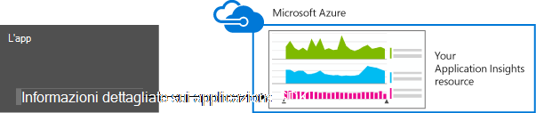
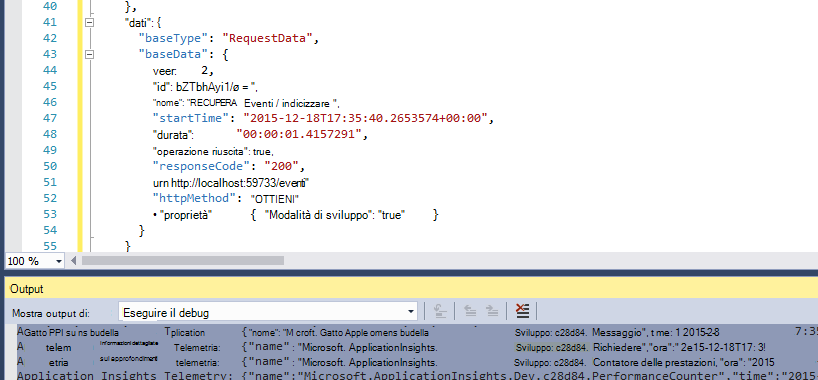
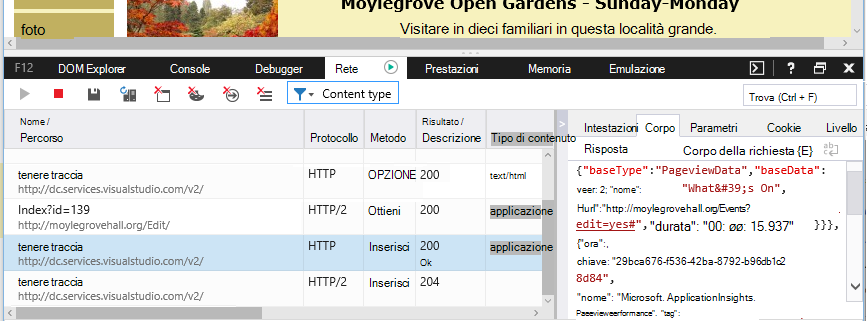

<properties 
    pageTitle="Conservazione dei dati e l'archiviazione in applicazione approfondimenti" 
    description="Informativa criteri di conservazione e la privacy" 
    services="application-insights" 
    documentationCenter=""
    authors="alancameronwills" 
    manager="douge"/>

<tags 
    ms.service="application-insights" 
    ms.workload="tbd" 
    ms.tgt_pltfrm="ibiza" 
    ms.devlang="na" 
    ms.topic="article" 
    ms.date="05/17/2016" 
    ms.author="awills"/>

# Raccolta di dati, conservazione e archiviazione in applicazione approfondimenti 

*Informazioni dettagliate sui applicazione è in anteprima.*

Quando si installa [Visual Studio applicazione approfondimenti] [ start] SDK nell'app, invia telemetria sull'app nel cloud. Naturalmente, gli sviluppatori responsabili sapere esattamente quali dati vengono inviati, cosa accade ai dati e come è possibile mantenere il controllo. In particolare, potrebbero essere inviati dati riservati, in cui è archiviato e il livello di sicurezza è? 

Prima di tutto, la risposta:

* I moduli di telemetria standard che eseguono "all'esterno della casella" sono difficilmente inviare dati riservati al servizio. Di telemetria riguarda carico, metriche di prestazioni e l'utilizzo, report sulle eccezioni e altri dati di diagnostica. I dati utente principale sarà visibili nel report diagnostici sono URL; ma l'app non deve in ogni caso inserire dati riservati in formato testo normale in un URL.
* È possibile scrivere codice per l'invio di telemetria personalizzato aggiuntiva consentono di diagnostica e l'uso di monitoraggio. (Tale possibilità è un'ottima funzionalità dell'applicazione approfondimenti). Sarebbe possibile, per errore, scrivere il codice in modo che includa personali e di altri dati riservati. Se l'applicazione funziona con tali dati, è necessario applicare i processi di revisione sicuro a tutto il codice che scritto.
* Mentre si sviluppare e testare l'app, è facile da ispezionare ciò che viene inviato da SDK. I dati vengono visualizzati nelle finestre di output debug della IDE e browser. 
* I dati sono contenuti nel server di [Microsoft Azure](http://azure.com) negli Stati Uniti. (Ma l'app può eseguire ovunque). [Sicurezza avanzata elabora e soddisfa una vasta gamma di standard di conformità](https://azure.microsoft.com/support/trust-center/)Azure. Solo il team designato avere accesso ai dati. Personale Microsoft possono hanno limitato l'accesso solo nelle circostanze specifiche limitato con la conoscenza. Vengono crittografato durante il transito, anche se nel server.

Il resto di questo articolo vengono illustrate in modo più completo le risposte. È progettato per essere indipendenti, in modo che è possibile mostrare ai colleghi che non fanno parte del proprio team.

## Che cos'è approfondimenti applicazione?

[Visual Studio applicazione approfondimenti] [ start] è un servizio fornito da Microsoft che consente di migliorare le prestazioni e facilità di utilizzo dell'applicazione live. Controlla l'applicazione sempre questa impostazione che è in esecuzione, sia durante i test e dopo aver pubblicato o distribuita. Applicazione che consente di creare grafici e tabelle che mostrano, ad esempio, che ora del giorno viene visualizzato maggior parte degli utenti, rapidità l'app è e come viene gestita da uno o più servizi esterni da cui dipende. Se sono presenti problemi di prestazioni, errori o anomalo, è possibile cercare tramite i dati di telemetria in modo dettagliato per individuare la causa. E il servizio verrà inviati messaggi di posta elettronica se sono state apportate modifiche in verificare la disponibilità e le prestazioni dell'app.

Per ottenere questa funzionalità, si installa un'applicazione SDK approfondimenti applicazione nell'applicazione, diventa parte del codice. Quando l'applicazione è in esecuzione, SDK controlla il funzionamento e invia telemetria al servizio di informazioni approfondite dell'applicazione. Si tratta di un servizio cloud ospitato da [Microsoft Azure](http://azure.com). (Ma approfondimenti applicazione funziona per tutte le applicazioni non solo quelli che sono ospitati in Azure).

Il servizio di applicazione approfondimenti archivia e analizza di telemetria. Per visualizzare le analisi o per la ricerca tramite telemetria archiviata, accedere al proprio account Azure e aprire la risorsa applicazione approfondimenti per l'applicazione. È anche possibile condividere l'accesso ai dati con altri membri del team o con server di sottoscrizione di Azure specificati.

È possibile impostare i dati esportati dal servizio di informazioni dettagliate sui applicazione, ad esempio in un database o agli strumenti esterni. Fornire ogni strumento con un tasto speciale che si ottiene dal servizio. Se necessario, è possibile revocato il tasto. 

Applicazione approfondimenti SDK sono disponibili per un intervallo di tipi di applicazioni: servizi ospitati in J2EE o ASP.NET Server o in Azure; web Web client, vale a dire il codice in esecuzione in una pagina web. le applicazioni desktop e i servizi; App per dispositivi, ad esempio Windows Phone, iOS e Android. Inviano tutti telemetria allo stesso servizio.

## I dati raccoglie?

### Quali sono i dati raccolti

Esistono tre origini dati:

* SDK, che integrano con l'app [in fase di sviluppo](app-insights-asp-net.md) o [in fase di esecuzione](app-insights-monitor-performance-live-website-now.md). Esistono diversi SDK per diversi tipi di applicazioni. È inoltre disponibile un [SDK per le pagine web](app-insights-javascript.md), che carica nel browser dell'utente finale insieme alla pagina.

 * Ogni SDK include un numero di [moduli](app-insights-configuration-with-applicationinsights-config.md), che consente di raccogliere tipi diversi di telemetria diverse tecniche.
 * Se si installa il SDK in fase di sviluppo, è possibile utilizzare l'API per inviare il proprio telemetria, oltre ai moduli standard. Questo telemetria personalizzato è possibile includere tutti i dati da inviare.
* In alcuni server web, sono disponibili anche gli agenti che vengono eseguiti insieme all'app e inviare telemetria su CPU, memoria e all'occupazione finale di rete. Ad esempio macchine virtuali di Azure, hosts Docker e [J2EE server](app-insights-java-agent.md) possono avere detti agenti.
* [Test di disponibilità](app-insights-monitor-web-app-availability.md) sono i processi eseguiti da Microsoft che inviare richieste a un'applicazione web a intervalli regolari. I risultati vengono inviati al servizio di informazioni approfondite dell'applicazione.

### Quali tipi di dati sono stati raccolti?

Categorie principali sono:

* [Telemetria server web](app-insights-asp-net.md) - richieste HTTP.  URI, tempo per elaborare la richiesta, codice di risposta, l'indirizzo IP del client. Id della sessione.
* Conta le [pagine Web](app-insights-javascript.md) - pagina degli utenti e sessione. Tempi di caricamento delle pagine. Eccezioni. Chiamate AJAX.
* Prestazioni contatori - memoria, CPU, IO, all'occupazione finale di rete.
* Client e server contesto - OS, impostazioni locali, tipo di dispositivo, browser, risoluzione dello schermo.
* [Eccezioni](app-insights-asp-net-exceptions.md) e anomalo - **stack trasferisce**, creazione id, tipo di CPU. 
* [Dipendenze](app-insights-asp-net-dependencies.md) - chiamate a servizi esterni, ad esempio resto, SQL, AJAX. Stringa di connessione o URI, durata, esito positivo, comando.
* [Verifica disponibilità](app-insights-monitor-web-app-availability.md) - durata del test e passaggi, le risposte.
* [Tenere traccia dei registri](app-insights-search-diagnostic-logs.md) e [telemetria personalizzato](app-insights-api-custom-events-metrics.md) - **nulla codice nelle registri o telemetria**.

[Dettagliatamente più avanti](#data-sent-by-application-insights).

## Come è possibile verificare quali sono stati raccolti?

Se si sviluppano soluzioni app utilizzando Visual Studio, eseguire l'app in modalità di debug (F5). Di telemetria verrà visualizzato nella finestra di Output. A questo punto, è possibile copiarlo e formattarla come JSON per ispezione semplice. 

Nella finestra di diagnostica è inoltre disponibile una visualizzazione più leggibile.

Per le pagine web, finestra del browser debug.

### È possibile scrivere codice per filtrare la telemetria prima di inviarlo?

Questo sarebbe possibile scrivendo un [plug-in di telemetria processore](app-insights-api-filtering-sampling.md).

## Il periodo di tempo i dati da mantenere? 

Punti di dati non elaborati (ovvero elementi che è possibile esaminare in diagnostica ricerca) vengono mantenuti per 7 giorni. Se è necessario mantenere i dati più lunghi, è possibile utilizzare [esportazione continua](app-insights-export-telemetry.md) per copiare in un account di archiviazione.

Dati aggregati (vale a dire conteggi, medie e altri dati statistici che viene visualizzato in Esplora unità di misura metriche) vengono mantenuti livello di dettaglio di un minuto per 30 giorni, e 1 ora o 1 giorno (a seconda di tipo) per almeno 90 giorni.

## Chi può accedere ai dati?

I dati siano visibili per l'utente e, se si ha un account dell'organizzazione, i membri del team. 

Può essere esportato, i membri del team e potrebbe essere copiato in altre posizioni e passare ad altri utenti.

#### Cosa fare Microsoft con le informazioni che personali app Invia a informazioni dettagliate sui applicazione?

Microsoft utilizza i dati solo per fornire il servizio.

## Nel punto in cui viene mantenuti i dati? 

* Negli Stati Uniti. 

#### Possibile essere memorizzata altrove, ad esempio in Europa? 

* Non al momento. 

#### Significa che deve essere ospitati negli Stati Uniti app?

* No. L'applicazione può essere eseguita in qualsiasi posizione, il proprio host locale o nel Cloud.

## Modalità di protezione i dati sono?  

Informazioni dettagliate sui applicazione è un servizio di Azure in anteprima. Mentre in anteprima stiamo lavorando verso la protezione dei dati per i criteri descritti nel [documento Azure sicurezza, Privacy e conformità](http://go.microsoft.com/fwlink/?linkid=392408).

I dati vengono archiviati in server di Microsoft Azure. Per gli account nel portale di Azure, limitazioni account sono descritti nel [documento Azure sicurezza, Privacy e conformità](http://go.microsoft.com/fwlink/?linkid=392408). Per gli account nel portale di servizi di Visual Studio Team, si riferisce il documento di [Protezione dei dati di Visual Studio Team Services](http://download.microsoft.com/download/8/E/E/8EE6A61C-44C2-4F81-B870-A267F1DF978C/MicrosoftVisualStudioOnlineDataProtection.pdf) . 

Accesso ai dati dalla personale Microsoft è limitato. Abbiamo accedere ai dati solo con le autorizzazioni e se è necessario supportare l'uso delle informazioni dettagliate sui applicazione. 

Dati di aggregazione tra le applicazioni di tutti i clienti (ad esempio velocità e la dimensione media delle tracce) viene utilizzati per migliorare l'applicazione approfondimenti.

#### Un altro utente telemetria potrebbe interferire con dati approfondimenti applicazione?

Inviano Impossibile telemetria aggiuntivo al proprio account utilizzando i tasti strumentazione, sono disponibili nel codice delle pagine web. Con sufficiente dati aggiuntivi, le metriche non correttamente rappresenta le prestazioni e l'utilizzo dell'app.

Se si condivide codice con altri progetti, non dimenticare di rimuovere la chiave strumentazione.

## I dati vengono crittografati? 

Non all'interno di server attualmente.

Tutti i dati vengono crittografati durante lo spostamento tra data center.

#### I dati vengono crittografati durante il transito dall'applicazione ai server approfondimenti applicazione?

Sì, serve https per inviare dati al portale da quasi tutti SDK, tra cui server web, dispositivi e pagine web HTTPS. L'unica eccezione è dati inviati da normale le pagine web HTTP. 

## Informazioni personali

#### Impossibile inviare personalmente identificabili informazioni sugli invii a informazioni dettagliate sui applicazione? 

Sì, è possibile. 

Come guida generale:

* Gran parte telemetria (vale a dire telemetria inviato senza è scrivere codice) non include espliciti personali. Tuttavia, potrebbe essere possibile identificare le persone da inferenza da un insieme di eventi.
* Eccezione e traccia messaggi potrebbero contenere informazioni personali
* Telemetria personalizzato, ad esempio chiamate, ad esempio TrackEvent scrivere codice utilizzando le tracce API o log - può contenere dati che scelto.

La tabella alla fine di questo documento contiene più dettagliate dei dati raccolti.

#### Si è responsabile della conformità a e Leggi per quanto riguarda personali?

Sì. È responsabilità per assicurarsi che la raccolta e uso dei dati è conforme con e leggi e con i termini di Microsoft Online Services.

È necessario informare i clienti in modo appropriato i dati che dell'applicazione raccoglie e utilizzo dei dati.

#### Gli utenti possono disattivare approfondimenti applicazione?

Non direttamente. Non è disponibile un'opzione che gli utenti possono operare disattivare approfondimenti applicazione.

Tuttavia, è possibile implementare tale funzionalità dell'applicazione. Tutti gli SDK includono un'impostazione di API per disattivare l'insieme di telemetria. 

#### Applicazione accidentalmente raccoglie informazioni riservate. Possibile applicazione approfondimenti scorrere i dati in modo che non verrà mantenuta?

Informazioni dettagliate sui applicazione non filtrare o eliminare i dati. Si devono gestire i dati in modo appropriato ed evitare l'invio di tali dati a informazioni dettagliate sui applicazione.

## Dati inviati dall'applicazione approfondimenti

Gli SDK variano tra piattaforme e sono disponibili diversi componenti che è possibile installare. (Fare riferimento [all'applicazione approfondimenti - Guida introduttiva][start].) Ogni componente invia dati diversi.

#### Classi dei dati inviati in scenari diversi

L'azione  | Le classi di dati raccolti (vedere la tabella riportata di seguito)
---|---
[Aggiungere un progetto web .NET applicazione approfondimenti SDK][greenbrown] | Contesto del server Dedotta Contatori delle prestazioni Richieste di **Eccezioni** Sessione utenti
[Installare controllo dello stato in IIS][redfield]|Dipendenze Contesto del server Dedotta Contatori delle prestazioni
[Aggiungere un'app web di linguaggio applicazione approfondimenti SDK][java]|Contesto del server Dedotta Richiesta Sessione utenti
[Aggiungere JavaScript SDK alla pagina web][client]|ClientContext  Dedotta Pagina ClientPerf AJAX
[Definire le proprietà predefinite][apiproperties]|**Proprietà** in tutti gli eventi standard e personalizzati
[Chiamare TrackMetric][api]|Valori numerici **Proprietà**
[Chiamare traccia *][api]|Nome dell'evento **Proprietà**
[Chiamare TrackException][api]|**Eccezioni** Immagine della pila **Proprietà**
SDK non è possibile raccogliere dati. Per esempio:   -non è possibile accedere ai contatori delle prestazioni  -eccezione in inizializzatore di telemetria | Diagnostica SDK
 

Per [SDK per altre piattaforme][platforms], vedere i documenti.

#### Le classi dei dati raccolti

Dati raccolti classe | Include (non un elenco completo) 
---|---
**Proprietà**|**Eventuali dati - varia a seconda del codice**
DeviceContext |ID, IP, impostazioni locali, modello del dispositivo, rete, tipo di rete, nome OEM, risoluzione dello schermo, istanza del ruolo, il nome del ruolo, tipo di dispositivo
ClientContext |Sistema operativo, impostazioni locali, la lingua, rete, risoluzione finestra
Sessione | id sessione
Contesto del server |Il nome del computer, impostazioni locali del sistema operativo, dispositivo, sessione utente, contesto utente, operazione 
Dedotta |percorso geografico indirizzo IP, data e ora del sistema operativo, browser
Metrica | Valore e nome metriche
Eventi | Valore e nome dell'evento
PageViews | Nome di URL e pagina o dello schermo
Delle prestazioni client | Nome URL della pagina/e fase di caricamento del browser
AJAX | Chiamate da una pagina web HTTP al server
Richieste di |URL, durata, codice di risposta
Dipendenze|Tipo (SQL, HTTP,...), stringa di connessione o URI sincronizzazione/asincrono, durata, esito positivo, istruzione SQL (con stato Monitor)
**Eccezioni** | Tipo, **messaggio**, stack, numero di riga e file di origine e id thread
Determina l'arresto anomalo | Id processo, id processo padre, id thread di arresto anomalo. applicazione patch, id, compilazione;  tipo di eccezione, indirizzo, motivo; simboli offuscati e registri, gli indirizzi di inizio e fine binari, nome di file binario e percorso, tipo di cpu
Traccia | Livello di **messaggio** e la gravità
Contatori delle prestazioni | Processore, memoria disponibile, frequenza richieste, tasso eccezione, byte privati del processo, frequenza IO, corrispondente in un'altra, lunghezza coda richieste
Disponibilità | Codice di risposta del test Web, la durata di ogni passo del test, nome test, timestamp, esito positivo, tempi di risposta, un percorso del test
Diagnostica SDK | Messaggio di traccia o eccezione 

È possibile [disattivare alcuni dati dalla modifica ApplicationInsights.config][config]

## Crediti

Questo prodotto include i dati GeoLite2 creati da MaxMind, disponibile da [http://www.maxmind.com](http://www.maxmind.com).

## Video

#### Introduzione

> [AZURE.VIDEO application-insights-introduction]

#### Guida introduttiva

> [AZURE.VIDEO getting-started-with-application-insights]

<!--Link references-->

[api]: app-insights-api-custom-events-metrics.md
[apiproperties]: app-insights-api-custom-events-metrics.md#properties
[client]: app-insights-javascript.md
[config]: app-insights-configuration-with-applicationinsights-config.md
[greenbrown]: app-insights-asp-net.md
[java]: app-insights-java-get-started.md
[platforms]: app-insights-platforms.md
[pricing]: http://azure.microsoft.com/pricing/details/application-insights/
[redfield]: app-insights-monitor-performance-live-website-now.md
[start]: app-insights-overview.md

 