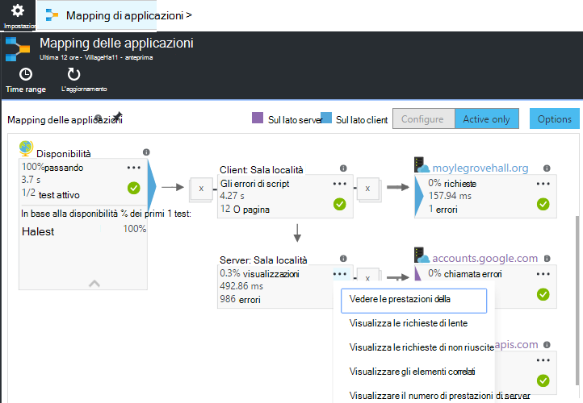
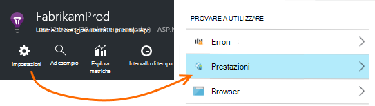
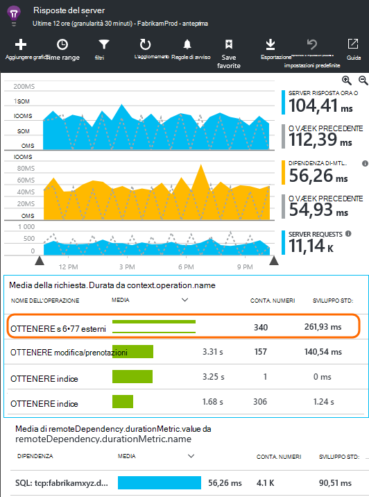
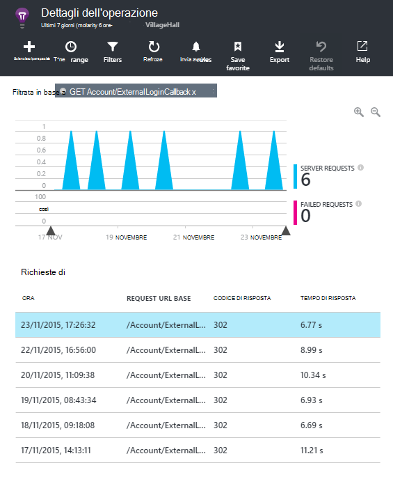
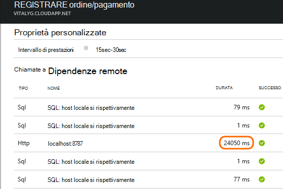
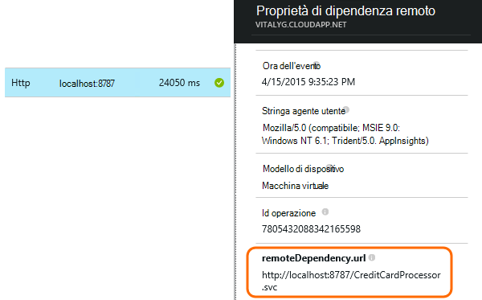
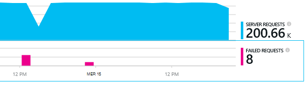
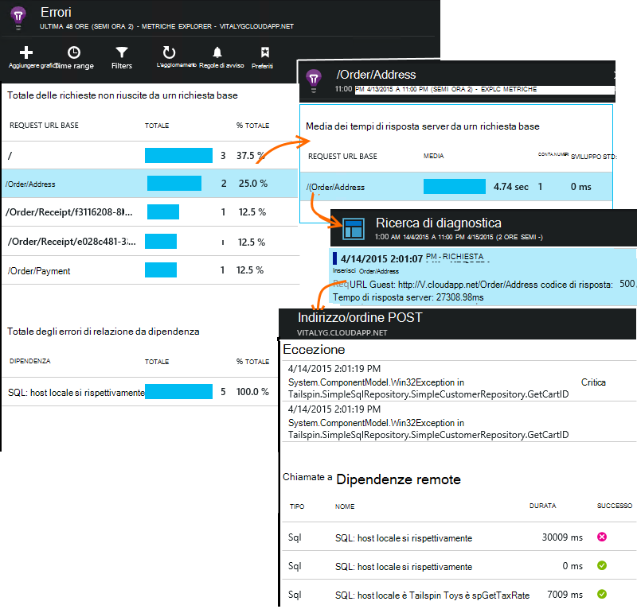

<properties 
    pageTitle="Diagnosticare i problemi con le dipendenze nell'applicazione approfondimenti" 
    description="Trovare gli errori e rallentare le prestazioni dovuti dipendenze" 
    services="application-insights" 
    documentationCenter=""
    authors="alancameronwills" 
    manager="douge"/>

<tags 
    ms.service="application-insights" 
    ms.workload="tbd" 
    ms.tgt_pltfrm="ibiza" 
    ms.devlang="na" 
    ms.topic="article" 
    ms.date="05/12/2016" 
    ms.author="awills"/>
 
# <a name="diagnosing-issues-with-dependencies-in-application-insights"></a>Diagnosticare i problemi con le dipendenze nell'applicazione approfondimenti


Una *dipendenza* è un componente esterno che viene chiamato tramite l'app. In genere è un servizio denominato utilizzando HTTP, o un database o un file system. O dello script di pagina web, può essere una chiamata AJAX al server. In Visual Studio applicazione approfondimenti, è possibile vedere facilmente il tempo di attesa l'applicazione delle dipendenze e con quale frequenza una chiamata dipendenza ha esito negativo.

## <a name="where-you-can-use-it"></a>Dove è possibile usare

All'esterno della casella è attualmente disponibile per il monitoraggio della dipendenza:

* ASP.NET web App e servizi in esecuzione in un server IIS o su Azure
* [Linguaggio web App](app-insights-java-agent.md)
* [Pagine Web](https://azure.microsoft.com/blog/ajax-collection-in-application-insights/)

Per altri tipi, ad esempio App dispositivo, è possibile scrivere il proprio monitor tramite l' [API TrackDependency](app-insights-api-custom-events-metrics.md#track-dependency).

Il monitor della casella dipendenza report attualmente chiamate a questi tipi di relazioni tra:

* ASP.NET
 * Database SQL
 * Servizi WCF che utilizzano associazioni basate su HTTP e web ASP.NET
 * Chiamate HTTP locale o remote
 * Azure DocumentDb, tabella, archiviazione blob e coda
* Java
 * Chiamate a un database tramite un driver [JDBC](http://docs.oracle.com/javase/7/docs/technotes/guides/jdbc/) , ad esempio MySQL, SQL Server, PostgreSQL o SQLite.
* Pagine Web
 * [Chiamate AJAX](app-insights-javascript.md)

Nuovo, è possibile scrivere chiamate SDK per monitorare altre dipendenze.

## <a name="to-set-up-dependency-monitoring"></a>Per impostare il monitoraggio della dipendenza

Installare l'agente appropriato per il server host.

Piattaforma | Installare
---|---
Server IIS | Per una [installare Monitor stato nel server](app-insights-monitor-performance-live-website-now.md) o [aggiornare l'applicazione in .NET framework 4.6 o versione successiva](http://go.microsoft.com/fwlink/?LinkId=528259) e installare l' [Applicazione approfondimenti SDK](app-insights-asp-net.md) nell'app.
Azure Web App | [Estensione approfondimenti applicazione](app-insights-azure-web-apps.md)
Server web Java | [Linguaggio web App](app-insights-java-agent.md)
Pagine Web | [Monitor JavaScript](app-insights-javascript.md) (Nessun installazione aggiuntive oltre il monitoraggio di pagina web)
Servizio Cloud Azure |  [Attività avvio](app-insights-cloudservices.md#dependencies) o [installare .NET framework 4.6 +](../cloud-services/cloud-services-dotnet-install-dotnet.md)  

Il controllo dello stato per i server IIS non è necessario per ricreare il progetto di origine con SDK approfondimenti applicazione. 

## <a name="application-map"></a>Mapping delle applicazioni

Mapping di applicazioni agisce come ausilio visivo per individuare le dipendenze tra i componenti dell'applicazione. 



Nelle caselle relative, è possibile passare a dipendenza pertinente e altri grafici.

Fare clic sulla piccola [x] per comprimere una sottostruttura.

Aggiungere il mapping al [dashboard](app-insights-dashboards.md), in cui sia completamente funziona.

[Altre informazioni](app-insights-app-map.md).

## <a name="diagnosis"></a>Diagnosticare i problemi di prestazioni dipendenza nel server web

Valutare le prestazioni delle richieste del server:



Scorrere fino a osservare la griglia di richieste di tipo:



Quello superiore sta impiegando molto tempo. Vediamo se è possibile conoscere nel punto in cui il tempo.

Fare clic su tale riga per visualizzare gli eventi singola richiesta:




Fare clic su tutte le istanze di esecuzione prolungata per esaminare ulteriormente.

> [AZURE.NOTE] Scorrere verso il basso un po' di selezionare una variante. Latenza nella pipeline potrebbe significa che i dati per le istanze superiore sono incompleti.

Scorrere fino a chiamate remote dipendenza correlate alla richiesta:



La maggior parte delle ora la manutenzione che della richiesta dedicata in una chiamata a un servizio locale avrà l'aspetto. 

Selezionare la riga per ottenere ulteriori informazioni:




I dati di dettaglio include informazioni sufficienti per identificare il problema.


## <a name="failures"></a>Errori

Se sono richieste non riuscite, fare clic sul grafico.



Fare clic su tramite un tipo di richiesta e l'istanza richiesta, per trovare una chiamata non riuscita a una dipendenza remota.





## <a name="custom-dependency-tracking"></a>Tenere traccia delle dipendenze personalizzate

Il modulo la registrazione delle dipendenze standard rileva automaticamente le relazioni esterne, ad esempio database e le API REST. Ma è consigliabile alcuni componenti aggiuntivi considerati nello stesso modo. 

È possibile scrivere codice per l'invio di informazioni sulle dipendenze, utilizzando la stessa [API TrackDependency](app-insights-api-custom-events-metrics.md#track-dependency) utilizzato da moduli standard.

Ad esempio, se si genera codice a un assembly che non si è scrivere personalmente, si potrebbero ora tutte le chiamate a, per scoprire quali contributo rende i tempi di risposta. Per questi dati visualizzati nei grafici dipendenza nell'applicazione approfondimenti, inviarlo tramite `TrackDependency`.

```C#

            var success = false;
            var startTime = DateTime.UtcNow;
            var timer = System.Diagnostics.Stopwatch.StartNew();
            try
            {
                success = dependency.Call();
            }
            finally
            {
                timer.Stop();
                telemetry.TrackDependency("myDependency", "myCall", startTime, timer.Elapsed, success);
            }
```

Se si desidera disattivare il modulo di verifica dipendenze standard, rimuovere il riferimento alla DependencyTrackingTelemetryModule [ApplicationInsights.config](app-insights-configuration-with-applicationinsights-config.md).


## <a name="ajax"></a>AJAX

Vedere [le pagine Web](app-insights-javascript.md).


 