<properties
    pageTitle="Rilevare, valutare, diagnosi"
    description="Analizzare anomalo per rilevare e diagnosticare i problemi di prestazioni delle applicazioni"
    authors="alancameronwills"
    services="application-insights"
    documentationCenter=""
    manager="douge"/>

<tags
    ms.service="application-insights"
    ms.workload="tbd"
    ms.tgt_pltfrm="ibiza"
    ms.devlang="na"
    ms.topic="article" 
    ms.date="11/06/2015"
    ms.author="awills"/>

# Rilevare, valutare e diagnosticare con informazioni dettagliate sui applicazione

*Informazioni dettagliate sui applicazione è in anteprima.*

Consente di approfondimenti applicazione di determinare la modalità di esecuzione dell'app e viene utilizzata quando è attivo. E se si è verificato un problema, consente di conoscere, consente valutare l'impatto e consente di determinare la causa.

Ecco un account da un team per lo sviluppo di applicazioni web:

* *"Un paio di giorni, viene distribuito un aggiornamento rapido 'secondario'. È non è stato eseguito un test generali, ma purtroppo alcune modifiche impreviste ottenuto unire payload, causa problemi di compatibilità tra l'estremità anteriore e posteriore. Immediatamente, attivato il nostro avviso eccezioni server prodotti, e si stava a conoscenza della situazione. Pochi clic fuori sede nel portale di applicazione approfondimenti, abbiamo le informazioni necessarie da eccezione stack di chiamate per limitare il problema. Abbiamo riportati immediatamente e limitato il danneggiamento. Informazioni dettagliate sui applicazione ha reso questa parte dell'attrezzi ciclo molto semplice e utilizzabili."*

Di seguito viene illustrato come un team di sviluppo web tipiche usi applicazione approfondimenti per eseguire il monitoraggio delle prestazioni. È necessario seguire il team di banca Fabrikam per lo sviluppo di sistema bancario online (OBS).

Il team lavora un ciclo alla seguente:

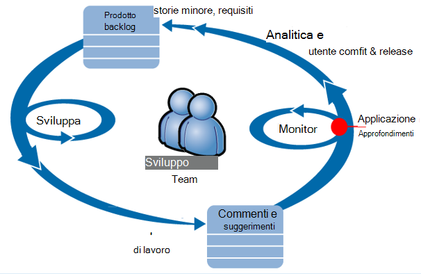

Requisiti del feed nel loro backlog sviluppo (elenco delle attività). In breve versioni funzionano sprint, che spesso offrono software di lavoro, in genere in forma di miglioramenti e le estensioni per l'applicazione esistente. L'app live spesso viene aggiornato con le nuove funzionalità. Mentre è attivo, il team lo controlla per prestazioni e l'utilizzo con l'aiuto di informazioni approfondite dell'applicazione. Questa analisi feed nel loro backlog sviluppo.

Il team Usa applicazione approfondimenti per monitorare l'applicazione web live strettamente per:
* Prestazioni. Desiderano capire come i tempi di risposta possono variare con conteggio richiesta; quantità CPU, rete, su disco e altre risorse in uso; e dove si trovano i bottiglia.
* Errori. Se sono presenti eccezioni o non è riuscita richieste, o se un contatore delle prestazioni va di fuori dell'intervallo familiarità con, il team deve conoscere rapidamente in modo da rendere azione.
* Uso. Ogni volta che viene rilasciata una nuova caratteristica, il team di sapere in che misura viene utilizzato e se gli utenti hanno difficoltà con esso.

Di seguito focalizzare l'attenzione su parte commenti e suggerimenti del ciclo di:

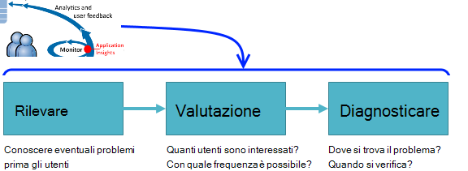

## Rilevare la disponibilità di scarsa

Marcela Markova è uno sviluppatore senior i membri del team OBS e accetta il responsabile di monitoraggio delle prestazioni in linea. Laura imposta più [test web][availability]:

* Un test singolo URL per la pagina principale per l'app http://fabrikambank.com/onlinebanking/. Anna set di criteri di codice HTTP 200 e testo "Welcome!". Se il test ha esito negativo, non esiste un compromettere seriamente il problema di rete o il server oppure forse un problema di distribuzione. (O qualcuno ha modificato benvenuto! messaggio nella pagina evitando la sua noto.)

* Una verifica più passaggio più approfondita, che esegue l'accesso e ottiene un conto corrente elencati, l'archiviazione alcuni dettagli chiave in ogni pagina. Si verifica che effettui il collegamento al database degli account. Fa clic su un id cliente fittizio: alcuni di essi vengono gestiti a scopo di testing.

Con i test di configurazione, Marcela è certo che il team saprà rapidamente su qualsiasi interruzione.  

Errori vengono visualizzati come punti rossi del grafico di test web:

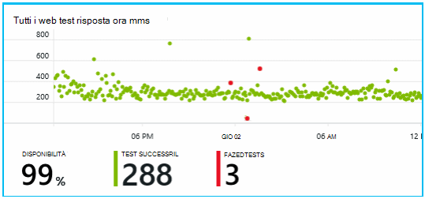

Ma soprattutto, inviato un avviso sugli eventuali errori al team di sviluppo. In questo modo, sanno affrontarlo prima quasi tutti i clienti.

## Dati sulle prestazioni monitor

Nella pagina Panoramica approfondimenti applicazione esiste un grafico che mostra una varietà di [metriche chiave][perf].

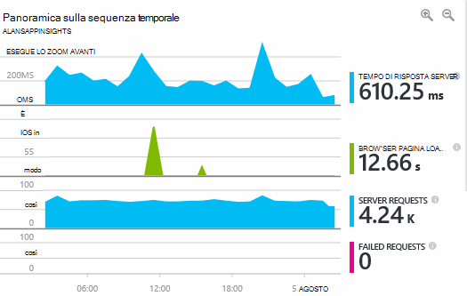

Fase di caricamento di pagina del browser dipende da telemetria inviato direttamente da pagine web. Tempo di risposta server, server richiesta conteggio e il conteggio di richiesta non riuscita tutti misurazione nel server web e inviati a informazioni dettagliate sui applicazione da tale posizione.

Marcela è leggermente in questione con grafico di risposta del server, che indica il tempo medio tra quando il server riceve una richiesta HTTP da un browser e viene restituita la risposta. Non è insolito visualizzare una variante di questo grafico come varia a carico del sistema. Ma in questo caso, sembra essere che una correlazione tra small aumentare il conteggio delle richieste e grande raggiunge i tempi di risposta. Potrebbe essere presente che il sistema funziona solo i limiti. 

Apre i tipi di grafici di server:

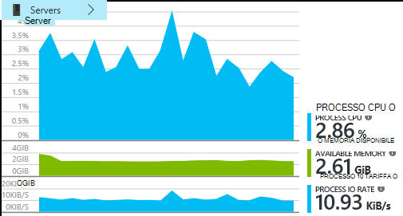

Sembra non essere cercando che irregolarità nei grafici di risposta server sono solo una coincidenza alcun segno di limitazione delle risorse.

## Avvisi

Tuttavia, Anna che vogliono tenere sotto controllo i tempi di risposta. Se va troppo alto, desidera conoscere l'immediatamente.

In modo che l'utente imposta un [avvisi][metrics], per i tempi di risposta maggiori del limite di un tipico. In questo modo la sua confidenza Anna saprà affrontarlo se i tempi di risposta sono lenti.

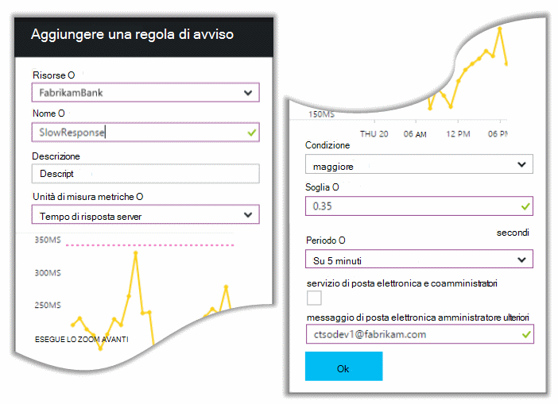

In un'ampia varietà di altre metriche, è possono impostare avvisi. Ad esempio, è possibile ricevere messaggi di posta elettronica se diventa elevato il numero totale di un'eccezione o la memoria disponibile passa bassa o se esiste un picco nelle richieste del client.

## Avvisi diagnostici preventivo

Giorno successivo, un avviso tramite posta elettronica ricevuta dall'applicazione approfondimenti. Ma quando si apre, Trova utente e non è l'avviso di tempo di risposta che ha impostata. Indica se, tuttavia, lei si è verificato un aumento inaspettato non riuscite richieste, vale a dire che ha restituito codici di errore di 500 o più.

Richieste non riuscite sono nel punto in cui gli utenti hanno visualizzato un messaggio di errore, in genere dopo un'eccezione nel codice. Forse vedrà un messaggio che indica "C'è stato possibile aggiornare i dettagli immediatamente" o, in assoluto imbarazzanti peggiore, un'immagine dello stack nella schermata dell'utente per il server web.

Questo avviso è sorprese, in quanto l'ora dell'ultima che Anna esaminata, il numero totale di richiesta non riuscita era affluenza basso. È previsto in un server occupato un numero limitato di errori. 

Era inoltre un po' di sorprese per suo conto perché Anna non è necessario configurare questo avviso. Infatti, diagnostica preventivo viene fornito automaticamente con informazioni dettagliate sui applicazione. Automaticamente regolate per motivo errore comune l'app e "viene usato per" errori in una pagina specifica, o in condizioni di carico elevato, o collegati a altre metriche. Genera l'avviso solo se è presente un aumento sopra viene aspettarsi.

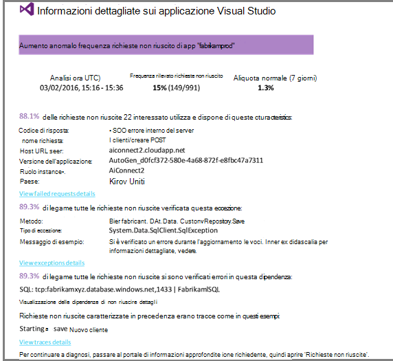

Si tratta di un messaggio di posta elettronica molto utile. Sufficiente non viene generato un avviso; Elimina gran parte di valutazione e diagnostico lavoro, viene eseguita anche.

Mostra quanti clienti sono interessati e le pagine web o operazioni. Marcela può decidere se è necessario ottenere l'intero team lavorando come un drill-down fire oppure se può essere ignorata fino a prossima settimana.

Messaggio di posta elettronica viene inoltre che una determinata eccezione si è verificato e - anche interessante - che l'errore è associato non riuscite chiamate a un determinato database. Spiega perché l'errore improvvisamente erano presenti anche se il team del Marcela non è distribuito eventuali aggiornamenti recente. 

Anna esegue il ping il responsabile del team di database. Sì, questi rilasciati correzione in passate di mezz'ora; e si noterà che cercando potrebbe essersi verificato una modifica dello schema secondarie.

Pertanto il problema è lungo il tragitto per fissa, anche prima di analisi dei registri e all'interno di 15 minuti di esso derivanti. Tuttavia, Marcela fa clic sul collegamento per aprire l'applicazione approfondimenti. Viene aperta direttamente alla richiesta non riuscita e Anna può vedere database danneggiato chiamare nell'elenco associato dipendenza chiamate. 

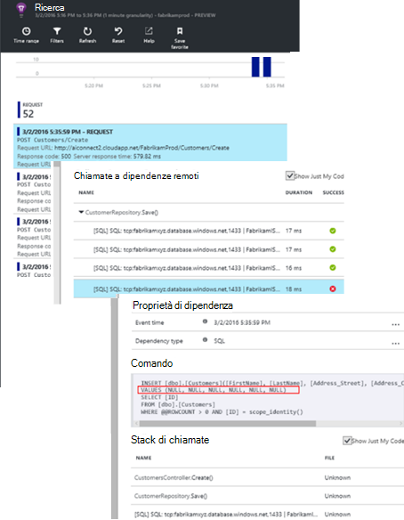

## Eccezioni vengono rilevate

Con un po' del programma di installazione, [eccezioni](app-insights-asp-net-exceptions.md) vengono segnalati a informazioni dettagliate sui applicazione automaticamente. Sono inoltre acquisire in modo esplicito mediante l'inserimento di chiamate a [TrackException()](app-insights-api-custom-events-metrics.md#track-exception) nel codice:  

    var telemetry = new TelemetryClient();
    ...
    try
    { ...
    }
    catch (Exception ex)
    {
       // Set up some properties:
       var properties = new Dictionary <string, string>
         {{"Game", currentGame.Name}};

       var measurements = new Dictionary <string, double>
         {{"Users", currentGame.Users.Count}};

       // Send the exception telemetry:
       telemetry.TrackException(ex, properties, measurements);
    }

Il team di Fabrikam banca evoluzione esercitazione di inviare sempre telemetria di un'eccezione, a meno che non esiste un ripristino più evidente.  

Infatti, strategia è persino più ampio rispetto a quelle: inviano telemetria in ogni caso in cui il cliente è scoraggiato in che cosa sono ha voluto, se corrisponde a un'eccezione nel codice o meno. Ad esempio, se il sistema esterno trasferimento bancario tra restituisce un messaggio "Impossibile completare l'operazione" per qualche motivo operativa (nessun errore del cliente) tengono traccia dell'evento.

    var successCode = AttemptTransfer(transferAmount, ...);
    if (successCode < 0)
    {
       var properties = new Dictionary <string, string>
            {{ "Code", returnCode, ... }};
       var measurements = new Dictionary <string, double>
         {{"Value", transferAmount}};
       telemetry.TrackEvent("transfer failed", properties, measurements);
    }

TrackException viene utilizzato per inviare una segnalazione eccezioni perché ne invia una copia dello stack. TrackEvent viene utilizzato per segnalare altri eventi. È possibile allegare le proprietà che potrebbero essere utili per la diagnosi.

Eccezioni ed eventi visualizzate nella [Ricerca diagnostica] [ diagnostic] blade. È possibile drill-down dei loro di visualizzare le proprietà aggiuntive e analisi dello stack.

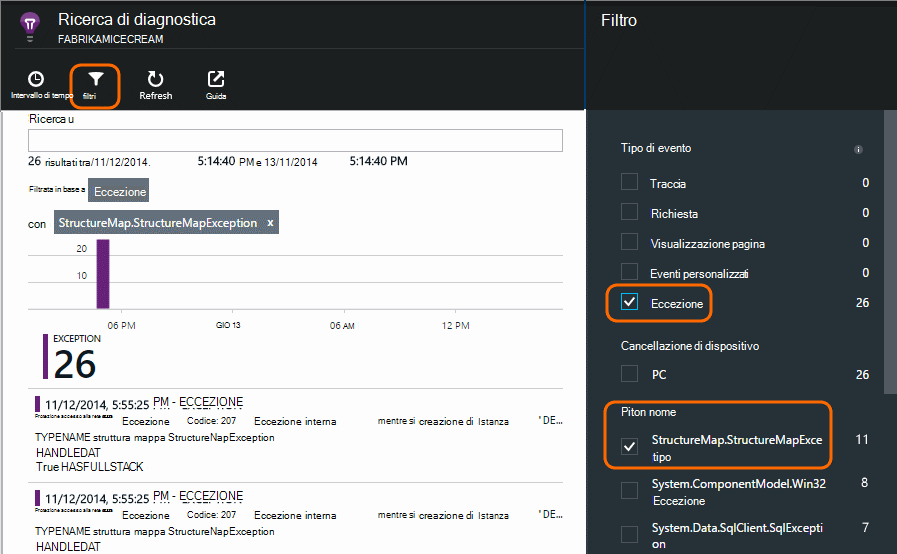

## Monitoraggio attività dell'utente

Quando il tempo di risposta è consigliabile in modo coerente ed esistono alcune eccezioni, il team di sviluppo possibile pensare su come migliorare l'esperienza degli utenti e le modalità per incoraggiare altri utenti di raggiungere gli obiettivi desiderati.

Ad esempio, un viaggio utente tipico tramite il sito web con un 'imbuto' Cancella: molti clienti esaminare le tariffe dei diversi tipi di prestito; alcune di esse compilare il modulo di offerta; e di quelli che ricevono un'offerta, alcune procedere estrarre prestito.

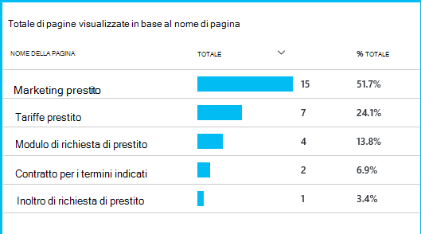

Prendendo in entrata i numeri maggiori dei clienti dell'azienda può lavorare su come ottenere altri utenti verso il basso dell'imbuto. In alcuni casi potrebbe essere un errore di esperienza utente - ad esempio, il pulsante "Avanti" è difficile da individuare o le istruzioni non sono più evidenti. Più probabilmente sono disponibili più significativi motivi aziendali per perdite di dati: ad esempio le tariffe prestito sono troppo alto.

Qualsiasi motivo, i dati contribuiscono al team di scoprire cosa stanno facendo gli utenti. È possibile inserire altre chiamate di verifica per scoprire ulteriori dettagli. TrackEvent() può essere utilizzato per contare le azioni utente, dai dati di dettaglio fitta di singoli pulsanti a obiettivi significativi, ad esempio pagamenti per un prestito.

Il team di Guida usato per avere informazioni sulle attività dell'utente. Oggi, ogni volta che si progetta una nuova caratteristica, funzionano fuori come riceverà commenti e suggerimenti sul suo utilizzo. Progettano verifica chiamate la caratteristica dall'inizio. Vengono utilizzati i commenti e suggerimenti per migliorare la funzionalità di ogni ciclo di sviluppo.

## Il monitoraggio  

Marcela non appena si trovano in attesa per gli avvisi. Subito dopo ogni ridistribuzione Anna prende in considerazione [i tempi di risposta] [ perf] -figura complessiva e sull'indice delle richieste di livello più bassa, come conteggi eccezione.  

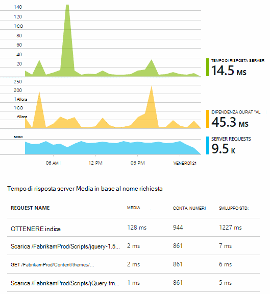

Anna possibile valutare l'effetto delle prestazioni di ogni distribuzione, in genere il confronto di ogni settimana con l'ultima. Se esiste un aggravi inaspettata, Anna genera che con gli sviluppatori pertinenti.

## Valutazione

Valutazione - valutare la gravità e l'estensione di un problema - è il primo passaggio dopo il rilevamento. Bisogna desiderata per il team di mezzanotte? O può essere lasciata finché la distanza comoda successiva nel backlog? Esistono alcune domande fondamentali di valutazione.

Qual avviene? I tipi di grafici e il Panoramica assegnare alcune prospettiva per risolvere un problema. Ad esempio, l'applicazione Fabrikam generato quattro web test avvisi una notte. Esaminando il grafico di mattina, il team di visualizzare che si sono verificati effettivamente alcuni punti rossi, se ancora la maggior parte dei test trattasse verde. Il drill-down del grafico di disponibilità, era chiaro tutti questi problemi intermittenti utilizzato dal percorso di un test. Stato evidenti un problema di rete che interessano un solo percorso e probabilmente deselezionare stesso.  

Al contrario, un aumento notevole e stabile nel grafico di eccezione conteggi o risposta volte è evidenti a panico sulle.

Una valutazione utile è provare a essa se stessi. Se si verificano il problema persiste, è possibile sapere che è real.

Quali frazione degli utenti sono interessati? Per ottenere una risposta approssimativa, divide il tasso di errore per il conteggio della sessione.

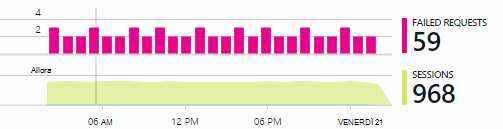

In caso di risposta, confrontare l'indice delle richieste di più lenta risponde con la frequenza di utilizzo di ogni pagina.

Come importante è lo scenario bloccato? Se si tratta di un problema funziona il blocco di una determinata storia utente, è importante molto? I clienti non è possibile pagare, si tratta grave; Se non possono modificare le preferenze di colore dello schermo, forse è possibile attendere. I dettagli dell'evento o eccezione o l'identità della pagina lenta indica nel punto in cui i clienti siano in caso di problemi.

## Diagnosi

Diagnosi non è molto diverso da quello di debug. Prima di iniziare la traccia tramite il codice, è necessario avere un'idea approssimativa del motivo, dove e quando si verifica il problema.

**Quando si verifica?** Visualizzazione cronologia fornita da grafici evento e unità di misura metriche rende più facile correlare effetti con le possibili cause. Se sono presenti picchi intermittenti tassi di tempo o eccezione di risposta, esaminare il conteggio di richiesta: se picchi contemporaneamente, quindi l'aspetto di un problema di risorse. È necessario assegnare più CPU o memoria? O una dipendenza che non è possibile gestire il carico?

**Ecco fatto Contattaci?**  Se si dispone di un elenco a discesa inaspettata prestazioni di un particolare tipo di richiesta - ad esempio quando i clienti un estratto conto, quindi è possibile può trattarsi di un sottosistema esterno anziché l'applicazione web. In Esplora metriche selezionare la frequenza di errori di relazione e tassi di durata relazione e confrontare le cronologie nel passate alcune ore o giorni con le è stato rilevato un problema. Se ci sono correlare le modifiche, un sottosistema esterno può essere colpa.  

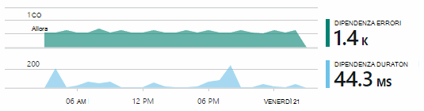

Alcuni problemi dipendenza lenta sono verificati problemi georilevazione. Banca Fabrikam utilizza Azure macchine virtuali e individuato da cui era inavvertitamente inclusi loro server web e server account paesi diversi. Prestazioni stato portato eseguendo la migrazione uno di essi.

**Cosa è stato fare?** Se il problema non viene visualizzata in una dipendenza, e se non è sempre presente, potrebbe essere dovuto a una modifica apportata. La prospettiva cronologica fornita da grafici unità di misura metriche ed evento è facile correlare le modifiche inaspettate con distribuzioni. Che consente di limitare la ricerca per il problema.

**Cosa sta succedendo?** Alcuni problemi si verificano solo raramente e possono essere difficile da individuare verificando offline. Tutto, si è tenta di acquisire il bug quando si verifica live. È possibile esaminare le immagini dello stack nei rapporti di eccezione. Inoltre, è possibile scrivere le chiamate, eseguire le tracce con la struttura di registrazione preferito o con TrackTrace() o TrackEvent().  

Fabrikam è verificato un problema intermittente bonifici tra conti, ma solo con alcuni tipi di account. Per comprendere meglio quali è stato in corso, le chiamate TrackTrace() sono inserite nei punti chiave nel codice, associare il tipo di account come proprietà a ogni chiamata. Che semplificata filtrare solo le tracce nella ricerca diagnostica. Sono collegate anche i valori dei parametri delle proprietà e misure le chiamate di analisi.

## Se

Dopo aver diagnosticare il problema, è possibile apportare un piano per risolvere il problema. Potrebbe essere necessario ripristinare una modifica apportata o cercando è sufficiente procedere e risolvere il problema. Una volta completata la correzione, applicazione approfondimenti che indica se è stata eseguita correttamente.  

Il team di sviluppo della banca Fabrikam un approccio più strutturato per la misurazione delle prestazioni rispetto alle prima utilizzati approfondimenti applicazione.

* Sono obiettivi prestazioni misure specifiche nella pagina Panoramica approfondimenti applicazione.

* Progettano misurazione delle prestazioni nell'applicazione dall'inizio, ad esempio le metriche che misurano progresso utente attraverso 'fumaioli'.  

## Uso

Informazioni dettagliate sui applicazione possono essere utilizzate anche per illustrati i vantaggi che gli utenti con un'app. Dopo aver eseguito senza problemi, il team che vogliono sapere quali caratteristiche non sono più popolari, quali utenti come o hanno difficoltà con e con quale frequenza torni. Che consente di acquisire definizione delle priorità il proprio lavoro in scadenza. E prevedono di valutare il successo di ogni caratteristica come parte del ciclo di sviluppo. [Per saperne di più][usage].

## Le applicazioni

Si tratta di come è possibile utilizzare di team approfondimenti applicazione non solo a risolvere i problemi di singoli, ma per migliorare la vita di sviluppo. Auguriamo che ha concesso alcune idee su come applicazione che consentono di migliorare le prestazioni delle applicazioni.

## Video

[AZURE.VIDEO performance-monitoring-application-insights]

<!--Link references-->

[api]: app-insights-api-custom-events-metrics.md
[availability]: app-insights-monitor-web-app-availability.md
[diagnostic]: app-insights-diagnostic-search.md
[metrics]: app-insights-metrics-explorer.md
[perf]: app-insights-web-monitor-performance.md
[usage]: app-insights-web-track-usage.md
 
