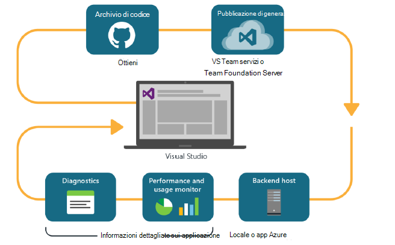
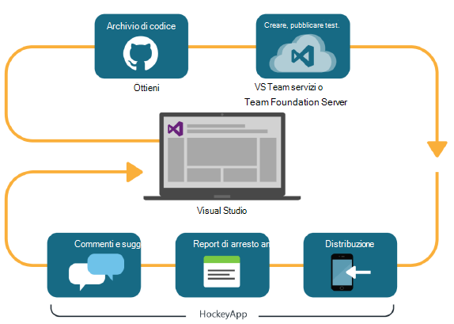

<properties
    pageTitle="Analitica per sviluppatori"
    description="Attrezzi con Visual Studio, applicazione approfondimenti e HockeyApp"
    authors="alancameronwills"
    services="application-insights"
    documentationCenter=""
    manager="douge"/>

<tags
    ms.service="application-insights"
    ms.workload="tbd"
    ms.tgt_pltfrm="ibiza"
    ms.devlang="na"
    ms.topic="article" 
    ms.date="05/18/2016"
    ms.author="awills"/>

# Sviluppo Analitica con informazioni dettagliate sui applicazione e HockeyApp

*Informazioni dettagliate sui applicazione è in anteprima.*

Molti progetti operano un ciclo [attrezzi](https://en.wikipedia.org/wiki/DevOps) rapido. Sono compilare e distribuire le applicazioni ricevere commenti e suggerimenti sulle prestazioni e cosa fare con gli utenti e quindi utilizzare tale conoscenza per pianificare ulteriori cicli di sviluppo. 

Per eseguire il monitoraggio delle prestazioni e l'uso, è importante avere telemetria dall'applicazione live, oltre che commenti e suggerimenti da direttamente dagli utenti. 

Molti sistemi sono costituiti da più componenti: un servizio web, processori back-end o archivi dati e il software client in esecuzione nel browser dell'utente o come un'app in un telefono o un altro dispositivo. Deve essere congiuntamente telemetria da questi componenti diversi.

Alcune versioni con limitate distribuzione ai tester designato; Abbiamo anche organizzata flighting (test di nuove funzionalità con i gruppi di destinatari con restrizioni) e oggetto | B test (in parallelo test dell'interfaccia utente alternativo).

Gestione delle distribuzioni e l'integrazione di monitoraggio su più componenti client e server non è un compito. Questo processo è essenziale dell'architettura dell'applicazione: è possibile creare un sistema di questo tipo senza un ciclo di sviluppo iterativo e buona gli strumenti di controllo.

In questo articolo vengono illustrate come monitoraggio aspetti del ciclo di attrezzi adatta alle altre parti del processo. 

Se si desidera esaminare un esempio specifico, non esiste [un case study interessante](http://aka.ms/mydrivingdocs) che contiene più componenti client e server.

## Un ciclo attrezzi

Visual Studio e sviluppo Analitica offrono un'esperienza integrata ben attrezzi. Ecco, ad esempio, un tipico ciclo per un'applicazione web (che può essere Java, Node o ASP.NET):

* Uno sviluppatore archivia archivio di codice o unisce ramo principale. L'archivio è fra in questa figura, ma può trattarsi identico [Controllo della versione di Team Foundation](https://www.visualstudio.com/docs/tfvc/overview).
* Le modifiche attivano un test genera e unità. Il servizio di compilazione può essere in [Visual Studio Team Services o equivalente locale, Team Foundation Server](https://www.visualstudio.com/docs/vsts-tfs-overview). 
* Una generazione completata e testare possibile [trigger di una distribuzione automatica](https://www.visualstudio.com/docs/release/author-release-definition/more-release-definition). L'host app web può essere il proprio server web o Microsoft Azure. 
* Telemetria dall'app live viene inviata a [Informazioni dettagliate sui applicazione](app-insights-overview.md), sia dal server e [dal browser client](app-insights-javascript.md). È possibile analizzare le prestazioni dei modelli di app e l'uso. Guida di potenti [Strumenti di ricerca](app-insights-analytics.md) per la diagnosi eventuali problemi. [Avvisi](app-insights-alerts.md) verificare che riconosce un problema non appena si presenti. 
* Ciclo di sviluppo del successivo viene informato tramite l'analisi di telemetria live.

### Dispositivo e desktop e applicazioni

Per dispositivi e le applicazioni desktop, la parte di distribuzione del ciclo di è leggermente diversa, poiché è non appena caricamento di uno o due server. Se, tuttavia, una generazione completata e testare possibile [trigger caricamento HockeyApp](https://support.hockeyapp.net/kb/third-party-bug-trackers-services-and-webhooks/how-to-use-hockeyapp-with-visual-studio-team-services-vsts-or-team-foundation-server-tfs). HockeyApp sovrintende ai distribuzione al team di utenti di prova (o al pubblico, se si preferisce). 

HockeyApp consente anche di raccogliere dati sulle prestazioni e l'utilizzo, nei moduli di:

* Commenti e suggerimenti utente testuale con schermate
* Report di arresto anomalo
* Telemetria personalizzato codificato dall'utente.

Quando si apportano i piani di sviluppo futuro in base al feedback acquisita ancora una volta completato il ciclo di attrezzi.

## La configurazione Analitica per sviluppatori

La procedura per ogni componente dell'applicazione - mobile o web o desktop - è praticamente uguali. Per molti tipi di app, Visual Studio esegue automaticamente alcune di queste operazioni.

1. Aggiungere l'app SDK appropriato. Per le applicazioni di dispositivo, è HockeyApp e per i servizi web è approfondimenti applicazione. Ogni sono diverse varianti per piattaforme diverse. (È anche possibile usare uno dei due SDK per le applicazioni desktop, anche se è consigliabile HockeyApp.)
2. Registrare l'app con il portale applicazione approfondimenti o HockeyApp, a seconda SDK è stato utilizzato. Si tratta in cui verrà visualizzato analitica dell'App live. È possibile ottenere un tasto strumentazione o un ID che consentono di configurare le App in modo che il SDK in grado di inviare la telemetria.
3. Aggiungere codice personalizzato (se si desidera) per registrare gli eventi o metrica, per agevolare la diagnostica o analizzare le prestazioni o l'uso. Non c'è numerose monitoraggio incorporato, in modo che non sarà necessario il ciclo di prima.
3. Per le applicazioni di dispositivo:
 * Caricare una build di debug HockeyApp. Da qui è possibile distribuirlo a un gruppo di utenti di prova. Ogni volta che si carica generazioni successive, il team, verrà visualizzato.
 * Quando si configura il continuo creare servizio, creare una definizione di rilascio che utilizza il passaggio plug-in di caricare HockeyApp.

### Analitica ed esportazione di telemetria HockeyApp

È possibile provare a utilizzare HockeyApp personalizzati e accedere usando le caratteristiche Analitica ed esportare continuo di informazioni dettagliate sui applicazione tramite [la configurazione di un bridge di](app-insights-hockeyapp-bridge-app.md)telemetria.

## Passaggi successivi
 
Ecco le istruzioni dettagliate per i diversi tipi di app:

* [App web ASP.NET](app-insights-asp-net.md) 
* [Linguaggio web app](app-insights-java-get-started.md)
* [Node web app](https://github.com/Microsoft/ApplicationInsights-node.js)
* [app iOS](https://support.hockeyapp.net/kb/client-integration-ios-mac-os-x-tvos/hockeyapp-for-ios)
* [App di Mac OS X](https://support.hockeyapp.net/kb/client-integration-ios-mac-os-x-tvos/hockeyapp-for-mac-os-x)
* [App di Android](https://support.hockeyapp.net/kb/client-integration-android/hockeyapp-for-android-sdk)
* [App universale di Windows](https://support.hockeyapp.net/kb/client-integration-windows-and-windows-phone/how-to-create-an-app-for-uwp)
* [App di Windows Phone 8 e 8.1](https://support.hockeyapp.net/kb/client-integration-windows-and-windows-phone/hockeyapp-for-windows-phone-silverlight-apps-80-and-81)
* [Windows Presentation Foundation app](https://support.hockeyapp.net/kb/client-integration-windows-and-windows-phone/hockeyapp-for-windows-wpf-apps)

