<properties 
    pageTitle="Funzionalità di ricerca diagnostica | Microsoft Azure" 
    description="Cercare e filtrare i singoli eventi, le richieste e accedere tracce." 
    services="application-insights" 
    documentationCenter=""
    authors="alancameronwills" 
    manager="douge"/>

<tags 
    ms.service="application-insights" 
    ms.workload="tbd" 
    ms.tgt_pltfrm="ibiza" 
    ms.devlang="na" 
    ms.topic="article" 
    ms.date="06/09/2016" 
    ms.author="awills"/>
 
# Funzionalità di ricerca diagnostica nell'applicazione approfondimenti

Ricerca diagnostica è una funzionalità di [Applicazione approfondimenti] [ start] utilizzato per trovare ed esplorare telemetria singoli elementi, ad esempio visualizzazioni delle pagine eccezioni o le richieste di il web. E non è possibile visualizzare log tracce ed eventi critici che è stato codificato.

## Dove si visualizzare ricerca diagnostica.

### Nel portale di Azure

È possibile aprire in modo esplicito ricerca diagnostica:

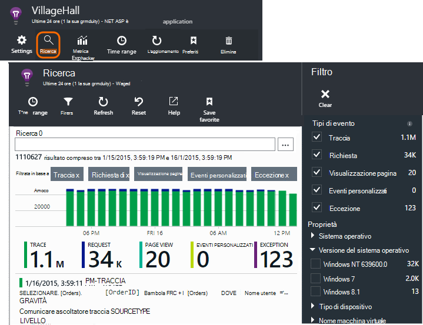

Viene aperta anche quando si fa clic mediante alcuni elementi grafici. In questo caso, i filtri pre-impostare focalizzare l'attenzione sul tipo di elemento selezionato. 

Ad esempio, se l'applicazione è un servizio web, e il panoramica viene visualizzato un grafico del volume di richieste di tipo. Fare clic su essa e viene visualizzato in un grafico più dettagliato, con un elenco con il numero di richieste è stato apportato per ogni URL. Fare clic su tutte le righe e viene visualizzato un elenco delle singole richieste per tale URL:

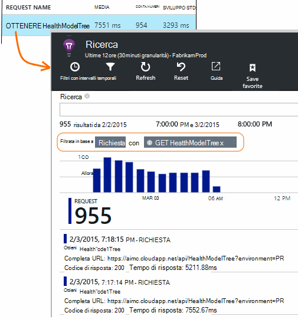

Il corpo principale di diagnostica ricerca è riportato un elenco di elementi di telemetria - richieste di server, pagina visualizzazioni, eventi personalizzati che è stato codificato e così via. Nella parte superiore dell'elenco è un riepilogo grafico che mostra il conteggio degli eventi nel tempo.

Eventi vengono in genere visualizzati nella ricerca diagnostica prima che vengano visualizzati in Esplora metrica. Sebbene e il viene automaticamente aggiornato a intervalli, è possibile fare clic su Aggiorna se si sta attendendo per un particolare evento.

### In Visual Studio

Aprire la finestra di ricerca in Visual Studio:

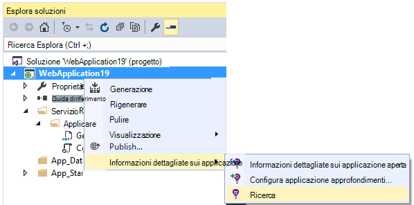

Nella finestra di ricerca sono le stesse funzionalità come il portale web:

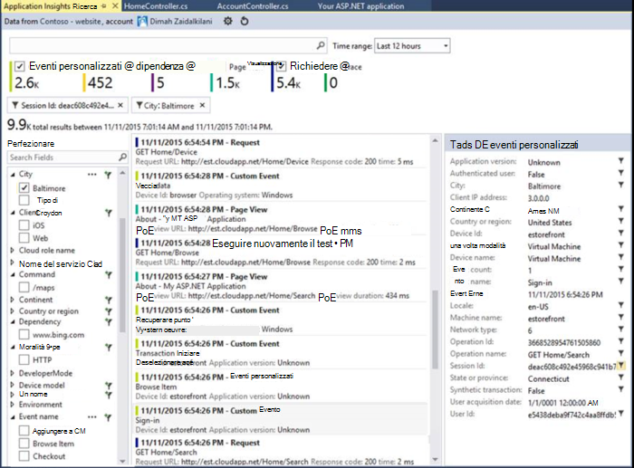

## Esempio

Se l'app genera molte telemetria (e si sta usando la 2.0.0-beta3 di versione di ASP.NET SDK o versioni successive), il modulo di esempio adattata ridurrà automaticamente il volume viene inviato al portale di inviando solo una frazione rappresentanza degli eventi. Tuttavia, gli eventi correlati alla stessa richiesta verranno selezionati o deselezionati a livello di gruppo, in modo che è possibile spostarsi tra gli eventi correlati. 

[Informazioni sui campioni](app-insights-sampling.md).

## Esaminare i singoli elementi

Selezionare qualsiasi elemento di telemetria per visualizzare i campi chiave ed elementi correlati. Se si desidera visualizzare l'elenco completo dei campi, fare clic su "…". 

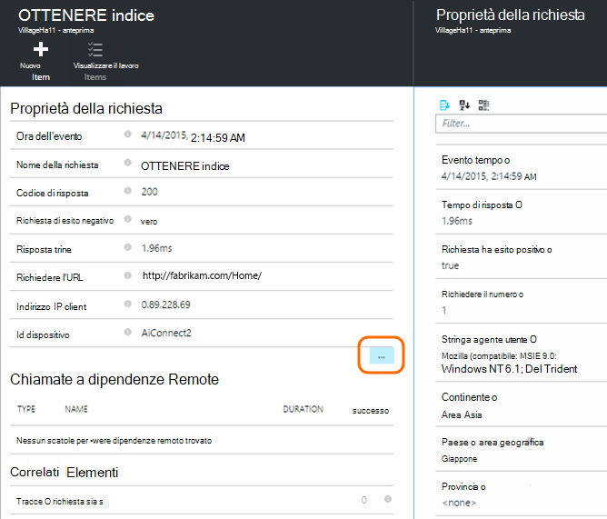

Per trovare l'elenco completo dei campi, utilizzare le stringhe semplice (senza i caratteri jolly). I campi disponibili dipendono dal tipo di telemetria.

## Creare il lavoro

È possibile creare un bug in Visual Studio Team Services con i dettagli da qualsiasi elemento di telemetria. 

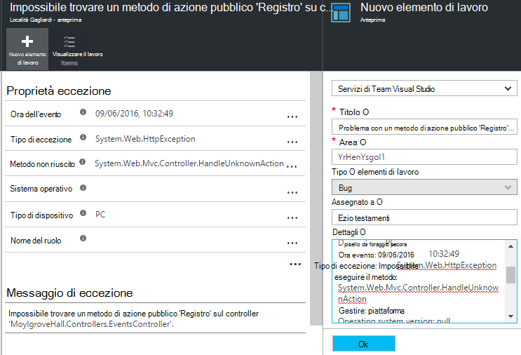

La prima volta che è possibile, è necessario configurare un collegamento all'account di servizi di Team e ai progetti.

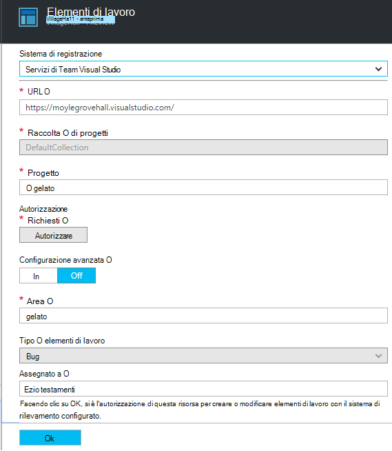

(È anche possibile ottenere e il configurazione dalle impostazioni > elementi di lavoro.)

## Filtrare i tipi di evento

Aprire e il filtro e scegliere i tipi di eventi che si desidera visualizzare. (Se in seguito, si desidera ripristinare i filtri a cui è stata aperta e il, fare clic su Reimposta).

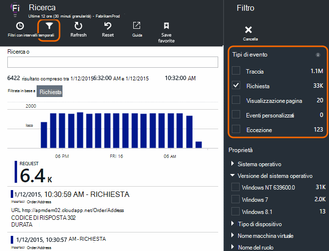

I tipi di evento sono:

* **Traccia** - registri diagnostici incluse le chiamate TrackTrace, log4Net, NLog e System.Diagnostic.Trace.
* **Richiedere** - richieste HTTP ricevute dall'applicazione server, inclusi pagine, script, immagini, file di stile e dati. Questi eventi vengono utilizzati per creare la richiesta e risposta Panoramica grafici.
* **Visualizzazione pagina** - telemetria provenienti dai client web utilizzato per creare report di visualizzazione pagina. 
* **Eventi personalizzati** : se si è inserita chiamate a TrackEvent() in ordine per [monitorare l'utilizzo][track], è possibile cercare di seguito.
* **Eccezione** - eccezioni non rilevate nel server e quelle che ci si disconnette utilizzando TrackException().

## Filtrare i valori di proprietà

È possibile filtrare gli eventi sui valori delle proprietà. Le opzioni disponibili dipendono dai tipi di evento selezionato. 

Ad esempio, selezionare le richieste con il codice specifico.

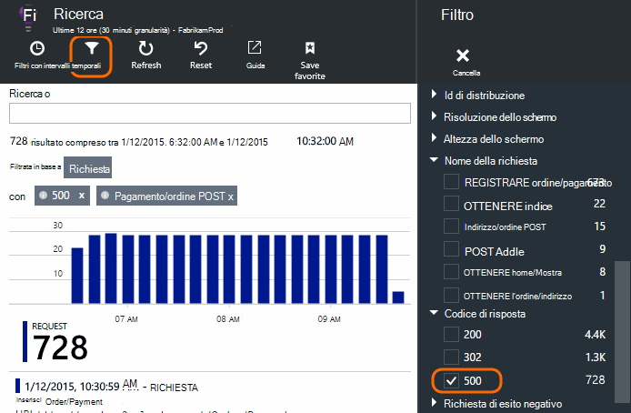

Non scelta valori di una determinata proprietà equivale a scegliere tutti i valori; Disattiva l'applicazione del filtro a tale proprietà.

### Restringere la ricerca

Si noti che i conteggi a destra dei valori di filtro illustra come numero di occorrenze nell'insieme filtrato corrente. 

In questo esempio è deselezionare che la `Reports/Employees` richiedere i risultati nella maggior parte degli 500 errori:

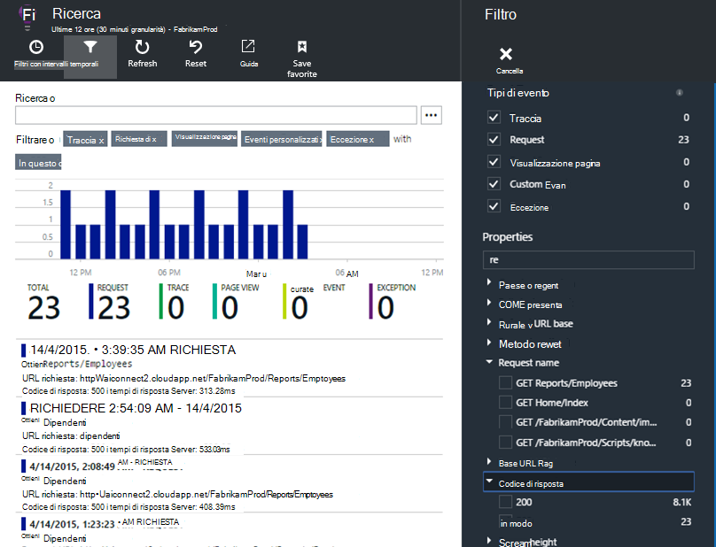

Inoltre, se si vuole vedere anche sugli altri eventi sono stati accade durante questo periodo, è possibile controllare **eventi Includi con il comando proprietà non definito**.

## Rimuovere il traffico di test bot e web

Utilizzare il filtro **il traffico reale o sintetico** e controllare **reali**.

È inoltre possibile filtrare **dall'origine del traffico sintetico**.

## Esaminare le singole occorrenze

Aggiungere il nome della richiesta per il numero di filtri ed è quindi possibile controllare singole occorrenze dell'evento.

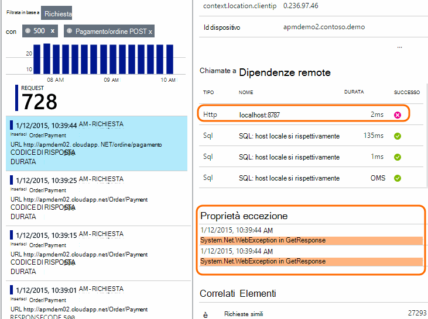

Per gli eventi richieste, i dettagli mostrano eccezioni che si sono verificati durante l'elaborazione della richiesta.

Fare clic su con un'eccezione per visualizzare i dettagli, comprese la traccia dello stack.

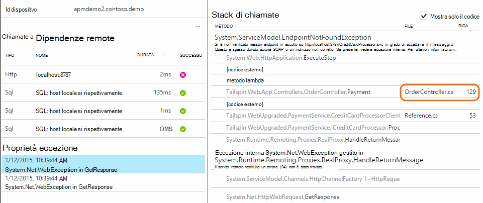

## Trovare gli eventi con la stessa proprietà

Trovare tutti gli elementi con lo stesso valore di proprietà:

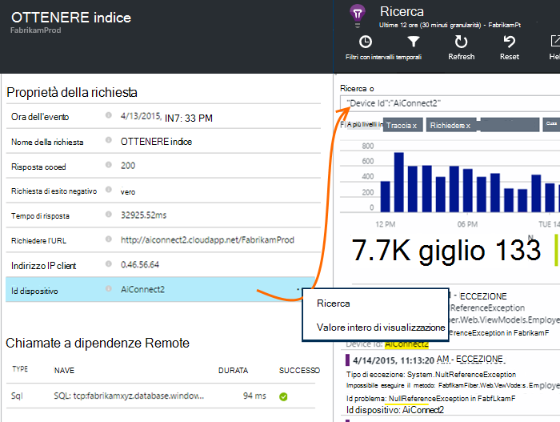

## Ricerca in base al valore di metrica

È possibile ottenere tutto il tempo di risposta > 5s di richieste.  Ora è rappresentati in segni di graduazione: 10 000 segni di graduazione = 1 ms.

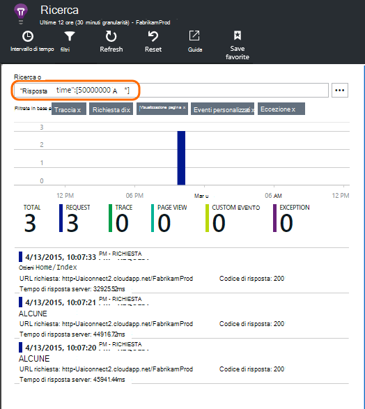

## Ricerca di dati

È possibile cercare termini in uno dei valori di proprietà. Questa operazione è particolarmente utile se è stato scritto [eventi personalizzati] [ track] con valori di proprietà. 

È consigliabile impostare un tempo di intervallo, come le ricerche di un intervallo più breve sono più rapidamente. 

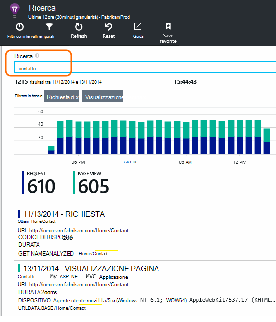

Ricerca di termini, non sottostringhe. Termini sono stringhe alfanumerica inclusi alcuni segni di punteggiatura come '. "e"_". Per esempio:

termini|*non* interviene|ma a seconda delle proprie
---|---|---
HomeController.About|sulle abitazione|h\*su abitazione\*
IsLocal|locale è \*locale|ISL\* IsLocal i\*l\*
Ritardo nuovo|d w|Nuovo ritardo n\* e d\*

Di seguito sono riportate le espressioni di ricerca che è possibile usare:

Query di esempio | Effetto 
---|---
ridurre la velocità|Trovare tutti gli eventi nell'intervallo di date con i campi includono il termine "lenta"
database??|Corrisponde a database01, databaseAB,... ? non è consentito all'inizio di un termine di ricerca.
database * |Database di corrispondenze, database01, databaseNNNN  * non è consentito all'inizio di un termine di ricerca
Apple e banane|Individuare gli eventi che contengono entrambi i termini. Utilizzare capitale "e", non "e".
Apple banana OR banana Apple|Individuare gli eventi che contengono uno dei termini. Utilizzare "O", non "o". < /br/ > Short modulo.
Apple non banana Apple-banana|Individuare gli eventi che contengono un termine ma non in altro. Forma abbreviata.
App * e banane-(grape pear)|Gli operatori logici e racchiuso tra parentesi quadre.
"Unità di misura metriche": da 0 a 500 "Unità di misura metriche": A 500 * | Individuare gli eventi che contengono la misurazione denominata all'interno dell'intervallo di valori.

## Salvare la ricerca

Dopo aver impostato tutti i filtri di cui che si desidera, è possibile salvare la ricerca ai Preferiti. Se si utilizza un account dell'organizzazione, è possibile scegliere se si desidera condividere con altri membri del team.

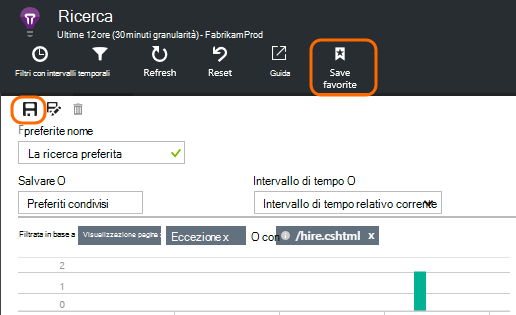

Per visualizzare la ricerca, **passare a e il Panoramica** e aprire Preferiti:

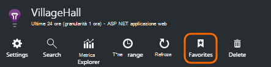

Se è stato salvato con intervallo di tempo relativo, i dati più recenti e il riaperto. Se è stato salvato con intervallo di tempo assoluto, viene visualizzato gli stessi dati ogni volta.

## Invio di telemetria ulteriori a informazioni dettagliate sui applicazione

Oltre a telemetria della casella inviato dall'applicazione approfondimenti SDK, è possibile:

* Acquisire le tracce di log dal framework registrazione Preferiti [.NET] [ netlogs] o [Java][javalogs]. Questa indica che è possibile cercare le tracce di log e metterle con visualizzazioni delle pagine, le eccezioni e altri eventi. 
* [Scrivere codice] [ track] per inviare gli eventi personalizzati, visualizzazioni delle pagine e le eccezioni. 

[Informazioni su come inviare telemetria personalizzato e registri a informazioni dettagliate sui applicazione][trace].

## Domande e risposte

### Viene mantenuta la quantità di dati?

Fino a 500 eventi al secondo da ogni applicazione. Eventi vengono conservati per sette giorni.

### Come è possibile visualizzare i dati inviati in richieste personali server?

Abbiamo non registra i dati automaticamente, ma è possibile utilizzare [le chiamate TrackTrace o log][trace]. Inserire i dati POST nel parametro message. Non è possibile filtrare il messaggio è possibile proprietà ma il limite di dimensioni più tempo.

## Passaggi successivi

* [Inviare i registri e telemetria personalizzato a informazioni dettagliate sui applicazione][trace]
* [Configurare la disponibilità e i test di velocità di risposta][availability]
* [Risoluzione dei problemi][qna]

<!--Link references-->

[availability]: app-insights-monitor-web-app-availability.md
[javalogs]: app-insights-java-trace-logs.md
[netlogs]: app-insights-asp-net-trace-logs.md
[qna]: app-insights-troubleshoot-faq.md
[start]: app-insights-overview.md
[trace]: app-insights-search-diagnostic-logs.md
[track]: app-insights-api-custom-events-metrics.md

 