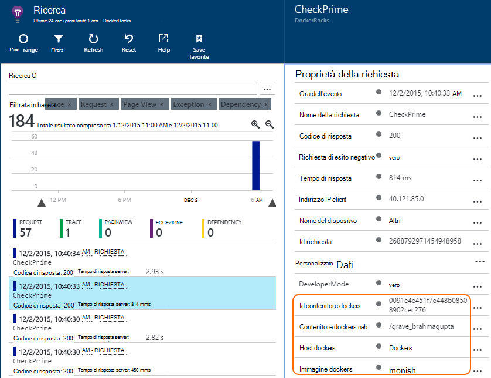

<properties 
    pageTitle="Monitorare le applicazioni di Docker nell'applicazione approfondimenti" 
    description="Eccezioni, eventi e contatori delle prestazioni docker possono essere visualizzate in applicazione approfondimenti, insieme telemetria dalle App nei contenitori." 
    services="application-insights" 
    documentationCenter=""
    authors="alancameronwills" 
    manager="douge"/>

<tags 
    ms.service="application-insights" 
    ms.workload="tbd" 
    ms.tgt_pltfrm="ibiza" 
    ms.devlang="na" 
    ms.topic="article" 
    ms.date="12/01/2015" 
    ms.author="awills"/>
 
# <a name="monitor-docker-applications-in-application-insights"></a>Monitorare le applicazioni di Docker nell'applicazione approfondimenti

Contatori dai [Docker](https://www.docker.com/) contenitori ed eventi del ciclo di vita possono essere inclusa approfondimenti applicazione. Installare l'immagine [Applicazione approfondimenti](app-insights-overview.md) in un contenitore nell'host e visualizzerà contatori per l'host, oltre che per le altre immagini.

Con Docker si distribuiscono le app di leggere e contenitori completi di tutte le dipendenze. Si eseguirà su qualsiasi computer host che esegue un motore Docker.

Quando si esegue l' [immagine applicazione approfondimenti](https://hub.docker.com/r/microsoft/applicationinsights/) sull'host Docker, si riceverà questi vantaggi:

* Ciclo di vita telemetria su tutti i contenitori in esecuzione nell'host - avviare e arrestare e così via.
* Contatori delle prestazioni per tutti i contenitori. CPU, memoria, utilizzo della rete e così via.
* Se è stato [installato applicazione approfondimenti SDK](app-insights-java-live.md) nelle App in esecuzione in contenitori, tutti di telemetria di tali applicazioni, sarà necessario proprietà aggiuntive che identifica il computer host e contenitore. Ad esempio, se si dispone di istanze di un'app in esecuzione in più di un host, facilmente sarà possibile filtrare il telemetria app dall'host.


## <a name="set-up-your-application-insights-resource"></a>Configurare la risorsa applicazione approfondimenti

1. Accedere al [Portale di Microsoft Azure](https://azure.com) e aprire la risorsa applicazione approfondimenti per l'app; o [crearne uno nuovo](app-insights-create-new-resource.md). 

    *La risorsa è utile usare?* Se le app che è in esecuzione sull'host sono state sviluppate da un altro utente, è necessario [creare una nuova risorsa approfondimenti applicazione](app-insights-create-new-resource.md). Si tratta in cui visualizzare e analizzare i telemetria. (Selezionare 'Altro' per il tipo di app).

    Ma se si è lo sviluppatore dell'App, quindi ci auguriamo che è stato [aggiunto applicazione approfondimenti SDK](app-insights-java-live.md) per ciascuno di essi. Se sono tutti realmente i componenti di un'applicazione aziendale singola, è possibile configurare tutti gli elementi per l'invio di telemetria per una risorsa e si userà la stessa risorsa per visualizzare i dati del ciclo di vita e le prestazioni di Docker. 

    Una terza situazione è che sono state sviluppate la maggior parte delle App, ma si utilizza risorse distinte per visualizzare le telemetria. In questo caso, probabilmente sarà inoltre essere necessario creare una risorsa distinta per i dati Docker. 

2.  Aggiungere il riquadro Docker: scegliere **Aggiungi sezione**, trascinare il riquadro Docker dalla raccolta e quindi fare clic su **Chiudi**. 

    


3. Fare clic su elenco a discesa **Essentials** e copiare il codice di strumentazione. Si userà per indicare dove indirizzare il telemetria SDK.


    

Come è necessario tornare a breve per esaminare le telemetria, tenere comodo, tale finestra del browser.


## <a name="run-the-application-insights-monitor-on-your-host"></a>Eseguire il monitor applicazione approfondimenti sull'host
 
Ora che hai in una posizione per la visualizzazione di telemetria, è possibile impostare l'app nei contenitori verrà raccogliere e inviarlo.

1.  Connettere il proprio host Docker. 
2.  Modificare la chiave di strumentazione in questo comando e quindi eseguire:
 
    ```

    docker run -v /var/run/docker.sock:/docker.sock -d microsoft/applicationinsights ikey=000000-1111-2222-3333-444444444
    ```

Solo un'immagine di applicazione che è necessaria per host Docker. Se l'applicazione viene distribuito su più host di Docker, quindi ripetere il comando su ogni host.

## <a name="update-your-app"></a>Aggiornare l'app

Se l'applicazione viene dotata di [Applicazione approfondimenti SDK per Java](app-insights-java-get-started.md), aggiungere la riga seguente nella sezione nel file ApplicationInsights.xml nel progetto, il `<TelemetryInitializers>` elemento:

```xml

    <Add type="com.microsoft.applicationinsights.extensibility.initializer.docker.DockerContextInitializer"/> 
```

Consente di aggiungere informazioni Docker come contenitore e id host su tutti gli elementi di telemetria inviati dall'applicazione.

## <a name="view-your-telemetry"></a>Visualizzare il telemetria

Tornare alla risorsa di applicazione approfondimenti nel portale di Azure.

Fare clic sul riquadro Docker.

Si noterà subito dati provenienti da app Docker, soprattutto se si dispone di altri contenitori in esecuzione sul motore di Docker.


Ecco alcune delle visualizzazioni che è possibile ottenere.

### <a name="perf-counters-by-host-activity-by-image"></a>Contatori delle prestazioni dall'host, attività dall'immagine


Fare clic su qualsiasi nome host o un'immagine per altri dettagli.


Per personalizzare la visualizzazione, fare clic su uno di essi, la griglia del titolo o usare aggiungere grafico. 

[Ulteriori informazioni su Esplora metriche](app-insights-metrics-explorer.md).

### <a name="docker-container-events"></a>Eventi contenitore docker


Per esaminare gli eventi singoli, fare clic su [Cerca](app-insights-diagnostic-search.md). Ricerca e filtro per trovare gli eventi desiderati. Fare clic su un evento per ottenere ulteriori dettagli.
 
### <a name="exceptions-by-container-name"></a>Eccezioni dal nome del contenitore
 


### <a name="docker-context-added-to-app-telemetry"></a>Contesto docker aggiunto al telemetria app

Richiesta di telemetria inviato dall'applicazione tramita SDK AI, migliorato con contesto Docker:



Processore e contatori delle prestazioni memoria disponibile, migliorato e raggruppati in base al nome di contenitore Docker:


## <a name="q--a"></a>Domande e risposte

*Quali informazioni dettagliate sui applicazione mi che non posso da Docker?*

* Descrizione dettagliata dei contatori contenitore e immagine.
* Integrare dati contenitore e app in un dashboard.
* [Esportazione di telemetria](app-insights-export-telemetry.md) per un'ulteriore analisi a un database, Power BI o altri dashboard.

*Come è possibile ottenere telemetria dall'app?*

* Installare l'applicazione approfondimenti SDK nell'app. Informazioni su come scrivere per: [linguaggio web apps](app-insights-java-get-started.md), [App web di Windows](app-insights-asp-net.md).
