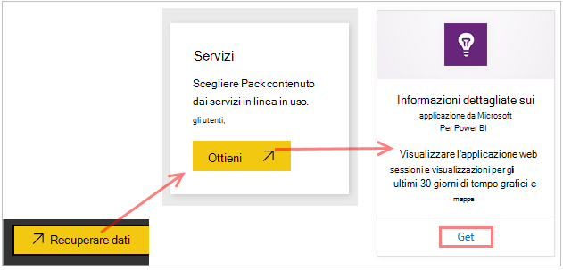
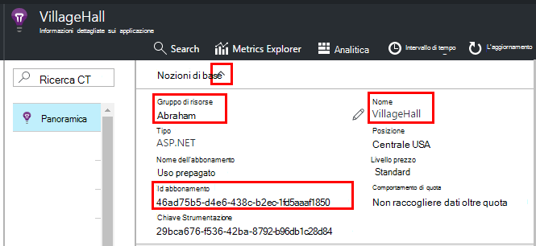
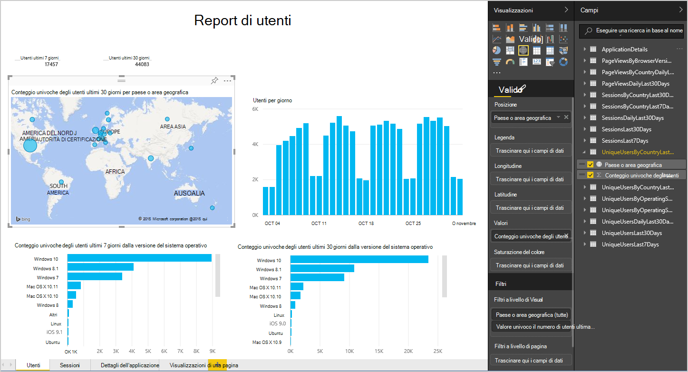
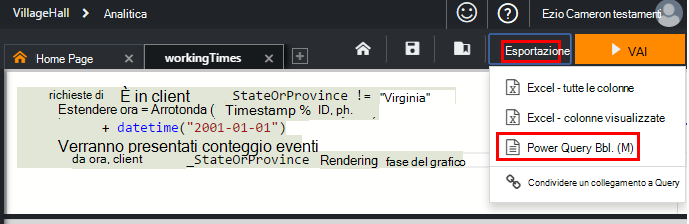
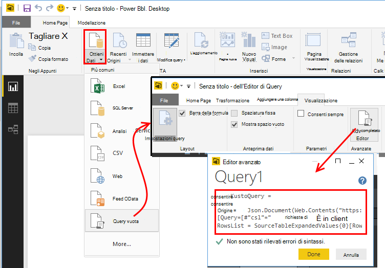
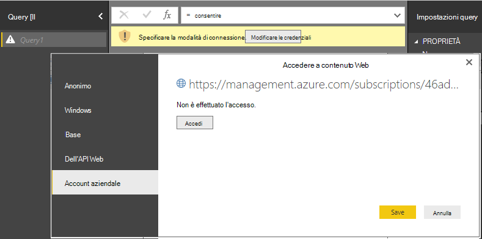
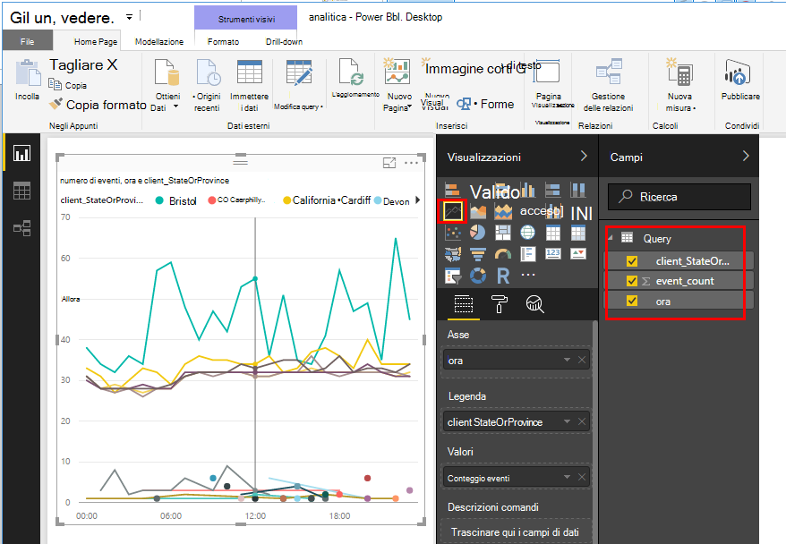
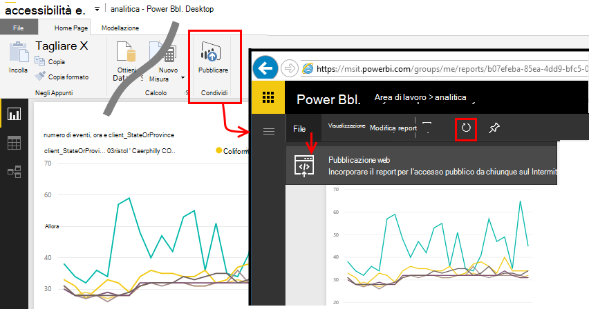

<properties 
    pageTitle="Esportare in Power BI da applicazione approfondimenti | Microsoft Azure" 
    description="Query Analitica possono essere visualizzate in Power BI." 
    services="application-insights" 
    documentationCenter=""
    authors="noamben" 
    manager="douge"/>

<tags 
    ms.service="application-insights" 
    ms.workload="tbd" 
    ms.tgt_pltfrm="ibiza" 
    ms.devlang="na" 
    ms.topic="article" 
    ms.date="10/18/2016" 
    ms.author="awills"/>

# Feed di Power BI dall'applicazione approfondimenti

[Power BI](http://www.powerbi.com/) è una famiglia di strumenti di business analitica che consentono di analizzare i dati e condividere quelle essenziali. Dashboard RTF sono disponibili in tutti i dispositivi. È possibile combinare dati da molte origini, incluse le query Analitica da [Visual Studio applicazione approfondimenti](app-insights-overview.md).

Esistono tre metodi consigliati di esportazione dei dati dell'applicazione approfondimenti in Power BI. È possibile utilizzarli separatamente o insieme.

* [**Scheda di power BI**](#power-pi-adapter) - configurare un dashboard di telemetria di completamento dell'app. Il set di grafici è predefinito, ma è possibile aggiungere le proprie query da altre origini.
* [**Esportare Analitica query**](#export-analytics-queries) - scrivere una query utilizzando Analitica ed esportare in Power BI. È possibile inserire la query in un dashboard insieme a tutti gli altri dati.
* [**Esportazione continuo e flusso Analitica**](app-insights-export-stream-analytics.md) - questa operazione comporta carico di lavoro per impostare. È utile se si desidera mantenere i dati a lungo. In caso contrario, sono consigliabile altri metodi.

## Scheda di Power BI

Questo metodo crea un dashboard di telemetria completo dell'utente. Set di dati iniziale è predefinito, ma è possibile aggiungere altri dati.

### Ottenere la scheda

1. Accedere a [Power BI](https://app.powerbi.com/).
2. Aprire **acquisire i dati**, **servizi**, **applicazione approfondimenti**

    

3. Fornire i dettagli della risorsa approfondimenti applicazione.

    

4. Attendere qualche minuto o due per i dati da importare.

    

È possibile modificare il dashboard, risultante dalla combinazione grafici applicazione approfondimenti con quelle di altre origini e con le query Analitica. Non c'è una raccolta di visualizzazione in cui è possibile ottenere più grafici e ogni grafico include un parametri personalizzabili.

Dopo l'importazione iniziale, il dashboard e i report di aggiornamento continuano a ogni giorno. È possibile controllare la pianificazione di aggiornamento per il set di dati.

## Esportare Analitica query

Questo percorso è possibile scrivere una query Analitica desiderato e quindi esportare che in un dashboard di Power BI. (È possibile aggiungere al dashboard creati tramite la scheda.)

### Una volta: installare Power BI Desktop

Per importare una query di applicazione approfondimenti, utilizzare la versione desktop di Power BI. Ma è possibile pubblicarlo sul web o nell'area di lavoro di Power BI cloud. 

Installare [Power BI Desktop](https://powerbi.microsoft.com/en-us/desktop/).

### Esportare una query Analitica

1. [Analitica aperti e scrivere la query](app-insights-analytics-tour.md).
2. Verificare e perfezionare la query fino a quando non si è soddisfatti dei risultati.
3. Scegliere **Esporta** dal menu Modifica scegliere **Power BI (M)**. Salvare il file di testo.

    
4. In Power BI Desktop selezionare **Recupera dati Query vuota** e nell'editor di query in **visualizzazione** selezionare **Editor di Query avanzate**.

    Incollare lo script M lingua esportato nell'Editor Query avanzate.

    

5. Potrebbe essere necessario fornire le credenziali per consentire a Power BI accedere a Azure. Utilizzare "account aziendale" di accedere con l'account Microsoft.

    

6. Scegliere una visualizzazione per la query e selezionare i campi per l'asse x, y e segmenti dimensione.

    

7. Pubblicare il report nell'area di lavoro di Power BI cloud. A questo punto, è possibile incorporare una versione sincronizzata in altre pagine web.

    
 
8. Aggiornare manualmente il report a intervalli o configurare un aggiornamento pianificato nella pagina delle opzioni.

## Sui campioni

Se l'applicazione invia una grande quantità di dati, la caratteristica di adattamento campioni potrebbe funzionare e inviare solo una percentuale del telemetria. Lo stesso avviene se è stata impostata manualmente campioni in SDK o acquisizione. [Ulteriori informazioni su campioni.](app-insights-sampling.md)
 

## Passaggi successivi

* [Power BI - informazioni](http://www.powerbi.com/learning/)
* [Esercitazione Analitica](app-insights-analytics-tour.md)
