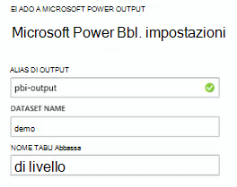

<properties 
    pageTitle="Utilizzare flusso Analitica per elaborare i dati esportati dall'applicazione approfondimenti | Microsoft Azure" 
    description="Flusso Analitica continuamente possa trasformare, filtrare e indirizzare i dati che si esportano da approfondimenti applicazione." 
    services="application-insights" 
    documentationCenter=""
    authors="noamben" 
    manager="douge"/>

<tags 
    ms.service="application-insights" 
    ms.workload="tbd" 
    ms.tgt_pltfrm="ibiza" 
    ms.devlang="na" 
    ms.topic="article" 
    ms.date="10/18/2016" 
    ms.author="awills"/>

# <a name="use-stream-analytics-to-process-exported-data-from-application-insights"></a>Consente di elaborare dati esportati da approfondimenti applicazione Analitica flusso

[Azure flusso Analitica](https://azure.microsoft.com/services/stream-analytics/) è lo strumento ideale per l'elaborazione dei dati [esportati dall'applicazione approfondimenti](app-insights-export-telemetry.md). Flusso Analitica possibile estrarre dati da diverse origini. Può trasformare e filtrare i dati e quindi inviare a una serie di sink.

In questo esempio, è necessario creare un adattatore che recupera dati dall'applicazione approfondimenti, assegnare un nuovo nome ed elabora alcuni dei campi e tubi in Power BI.

> [AZURE.WARNING] Esistono molto più efficaci e più semplice [consigliati modi per visualizzare informazioni dettagliate sui applicazione dati in Power BI](app-insights-export-power-bi.md). Il percorso illustrato di seguito è solo un esempio per illustrare la modalità di elaborazione dati esportati.


## <a name="create-storage-in-azure"></a>Creare lo spazio di archiviazione in Azure

Esportazione continua sempre invia dati a un account di archiviazione Azure, in modo che è necessario creare prima di tutto lo spazio di archiviazione.

1.  Creare un account di archiviazione "classico" nell'abbonamento nel [portale di Azure](https://portal.azure.com).

    

2. Creare un contenitore

    

3. Copiare il tasto di scelta di spazio di archiviazione

    È necessario prima per configurare l'input al servizio analitica flusso.

    

## <a name="start-continuous-export-to-azure-storage"></a>Avviare esportazione continua allo spazio di archiviazione Azure

[Continua esportare](app-insights-export-telemetry.md) i dati vengono spostati dal applicazione approfondite archiviazione Azure.

1. Nel portale di Azure, passare alla risorsa approfondimenti applicazione creata per l'applicazione.

    

2. Creare un'esportazione continua.

    


    Selezionare l'account di archiviazione creata in precedenza:

    
    
    Impostare i tipi di eventi che si desidera visualizzare:

    

3. Consentire alcuni dati si accumulano. Parlare e consentire agli utenti di utilizzare l'applicazione per un po' di tempo. Telemetria venga recapitata e vengono visualizzati grafici statistici in [Esplora metrica](app-insights-metrics-explorer.md) e singoli eventi nella [ricerca diagnostica](app-insights-diagnostic-search.md). 

    E inoltre di esportazione dati allo spazio di archiviazione. 

4. Esaminare i dati esportati. In Visual Studio, scegliere **visualizzare / Cloud Explorer**e aprire Azure / lo spazio di archiviazione. (Se non si dispone di questa opzione di menu, è necessario installare Azure SDK: aprire la finestra di dialogo Nuovo progetto e c# / Cloud / ottenere Microsoft Azure SDK per .NET.)

    

    Prendere nota della parte del nome del percorso, derivata dal tasto applicazione nome e strumentazione comune. 

Gli eventi vengono salvati i file in formato JSON blob. Ogni file può contenere uno o più eventi. In modo si desidera leggere i dati dell'evento ed escludere i campi che vogliamo. Sono disponibili tutti i tipi di operazioni che è possibile eseguire con i dati, ma il nostro piano oggi consiste nell'usare flusso Analitica per inviare i dati in Power BI.

## <a name="create-an-azure-stream-analytics-instance"></a>Creare un'istanza di Azure flusso Analitica

Dal [Portale di Azure classica](https://manage.windowsazure.com/), selezionare il servizio di Azure flusso Analitica e creare un nuovo processo Analitica flusso:


Quando viene creato il nuovo processo, espandere i dettagli:


### <a name="set-blob-location"></a>Impostare la posizione blob

Impostarlo in modo che ricevono input dal blob continuo esportare:


A questo punto è necessario la chiave primaria di accesso dall'Account di archiviazione, indicato in precedenza. Impostare questa come chiave di Account di archiviazione.


### <a name="set-path-prefix-pattern"></a>Impostare percorso prefisso motivo 


**Assicurarsi di impostare il formato della data gg / MM-AAAA (con trattini).**

Il modello di prefisso percorso specifica in cui flusso Analitica trova il file di input nello spazio di archiviazione. È necessario impostarlo in modo che corrispondano a come esportare continuo sono archiviati i dati. Impostarlo come segue:

    webapplication27_12345678123412341234123456789abcdef0/PageViews/{date}/{time}

In questo esempio:

* `webapplication27`è il nome della risorsa applicazione approfondimenti **lettere minuscole**.
* `1234...`è fondamentale strumentazione della risorsa applicazione approfondimenti, **omettendo trattini**. 
* `PageViews`è il tipo di dati da analizzare. I tipi disponibili dipendono dai filtri impostati in esportare continua. Esaminare i dati esportati per visualizzare altri tipi disponibili e vedere [Esporta modello di dati](app-insights-export-data-model.md).
* `/{date}/{time}`un modello è scritto in forma letterale.

> [AZURE.NOTE] Controlla lo spazio di archiviazione per assicurarsi che viene visualizzato il percorso di destra.

### <a name="finish-initial-setup"></a>Completare la configurazione iniziale

Verificare il formato di serializzazione:


Chiudere la procedura guidata e attendere per completare l'installazione.

> [AZURE.TIP] Utilizzare il comando di esempio per scaricare alcuni dati. Lasciarla invariata per un esempio di test per eseguire il debug la query.

## <a name="set-the-output"></a>Impostare l'output

Selezionare il processo, impostare l'output.


Specificare il **lavoro o dell'istituto di istruzione account** per autorizzare Analitica flusso per accedere alle risorse di Power BI. Creare quindi un nome per l'output e per il set di dati di destinazione di Power BI e la tabella.



## <a name="set-the-query"></a>Impostare la query

La query determina la conversione di input per generare l'output.


Utilizzare la funzione Test per verificare che si otterrà l'output di destra. È necessario che i dati di esempio che è stata eseguita dalla pagina di input. 

### <a name="query-to-display-counts-of-events"></a>Query per visualizzare il conteggio degli eventi

Incollare questa query:

```SQL

    SELECT
      flat.ArrayValue.name,
      count(*)
    INTO
      [pbi-output]
    FROM
      [export-input] A
    OUTER APPLY GetElements(A.[event]) as flat
    GROUP BY TumblingWindow(minute, 1), flat.ArrayValue.name
```

* esportazione input è l'alias che dato al flusso di input
* PBI output è l'alias di output che è stata definita
* Serve [GetElements applicare esterno](https://msdn.microsoft.com/library/azure/dn706229.aspx) perché il nome dell'evento in un arrray JSON annidate. Quindi selezionare Recupera il nome dell'evento, insieme a un conteggio del numero di istanze con lo stesso nome nel periodo di tempo. La clausola [Group By](https://msdn.microsoft.com/library/azure/dn835023.aspx) Raggruppa gli elementi in periodi di 1 minuto.


### <a name="query-to-display-metric-values"></a>Query per visualizzare valori metriche


```SQL

    SELECT
      A.context.data.eventtime,
      avg(CASE WHEN flat.arrayvalue.myMetric.value IS NULL THEN 0 ELSE  flat.arrayvalue.myMetric.value END) as myValue
    INTO
      [pbi-output]
    FROM
      [export-input] A
    OUTER APPLY GetElements(A.context.custom.metrics) as flat
    GROUP BY TumblingWindow(minute, 1), A.context.data.eventtime

``` 

* Questa query il drill-through in telemetria metriche per ottenere il valore metrico e l'ora dell'evento. I valori delle metriche sono all'interno di una matrice, pertanto abbiamo utilizzare il modello GetElements applicare esterno per estrarre le righe. "myMetric" è il nome della metrica in questo caso. 

### <a name="query-to-include-values-of-dimension-properties"></a>Query per includere i valori di proprietà dimensione

```SQL

    WITH flat AS (
    SELECT
      MySource.context.data.eventTime as eventTime,
      InstanceId = MyDimension.ArrayValue.InstanceId.value,
      BusinessUnitId = MyDimension.ArrayValue.BusinessUnitId.value
    FROM MySource
    OUTER APPLY GetArrayElements(MySource.context.custom.dimensions) MyDimension
    )
    SELECT
     eventTime,
     InstanceId,
     BusinessUnitId
    INTO AIOutput
    FROM flat

```

* Questa query include i valori delle proprietà dimensione senza a seconda di una dimensione specifica in un indice fissato nella matrice di dimensione.

## <a name="run-the-job"></a>Eseguire il processo

È possibile selezionare una data in passato per avviare il processo da. 


Attendere che il processo è in esecuzione.

## <a name="see-results-in-power-bi"></a>Visualizzare i risultati in Power BI

> [AZURE.WARNING] Esistono molto più efficaci e più semplice [consigliati modi per visualizzare informazioni dettagliate sui applicazione dati in Power BI](app-insights-export-power-bi.md). Il percorso illustrato di seguito è solo un esempio per illustrare la modalità di elaborazione dati esportati.

Aprire Power BI tutte le modifiche o dell'istituto di istruzione account e selezionare il set di dati e una tabella in cui è definito come l'output del processo di flusso Analitica.


A questo punto è possibile utilizzare questo set di dati nei report e dashboard in [Power BI](https://powerbi.microsoft.com).


## <a name="no-data"></a>Nessun dato?

* Controllare che si [Imposta il formato data](#set-path-prefix-pattern) correttamente su gg / MM-AAAA (con trattini).


## <a name="video"></a>Video

Noam Ben Zeev viene illustrato come elaborare dati esportati tramite flusso Analitica.

> [AZURE.VIDEO export-to-power-bi-from-application-insights]

## <a name="next-steps"></a>Passaggi successivi

* [Esportazione continuo](app-insights-export-telemetry.md)
* [Guida di riferimento per i tipi di proprietà e i valori del modello di dati di dettagliati.](app-insights-export-data-model.md)
* [Informazioni dettagliate sui applicazione](app-insights-overview.md)
* [Ulteriori esempi e procedure dettagliate](app-insights-code-samples.md)
 
