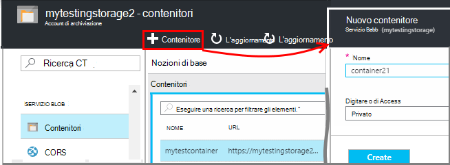
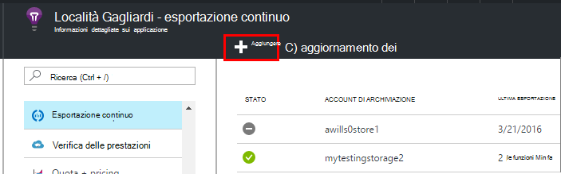
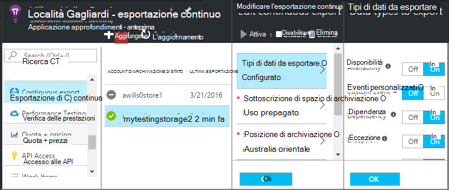
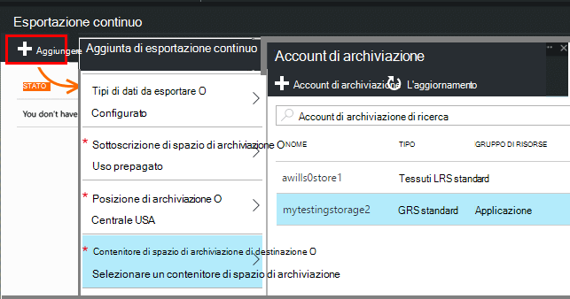
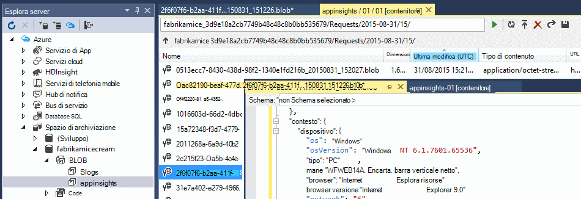
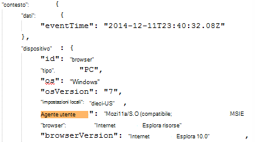
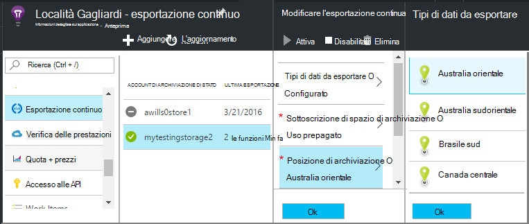

<properties 
    pageTitle="Esportare continuo di telemetria dall'applicazione approfondimenti | Microsoft Azure" 
    description="Esportare i dati di diagnostica e l'utilizzo per l'archiviazione in Microsoft Azure e scaricare da tale posizione." 
    services="application-insights" 
    documentationCenter=""
    authors="alancameronwills" 
    manager="douge"/>

<tags 
    ms.service="application-insights" 
    ms.workload="tbd" 
    ms.tgt_pltfrm="ibiza" 
    ms.devlang="na" 
    ms.topic="article" 
    ms.date="10/18/2016" 
    ms.author="awills"/>
 
# Esportazione di telemetria dall'applicazione approfondimenti

Conservare il telemetria per maggiore del periodo di conservazione standard? O elaborare in un modo specifico? Esportazione continua è ideale per l'oggetto. Gli eventi che viene visualizzato nel portale di applicazione che possono essere esportati allo spazio di archiviazione in Microsoft Azure nel formato JSON. Da qui è possibile scaricare i dati e scrivere qualsiasi tipo di codice è necessario elaborarlo.  

Esportazione continua è disponibile nel periodo di valutazione gratuito e [Standard e Premium prezzi piani](https://azure.microsoft.com/pricing/details/application-insights/).

Prima di configurare esportazione continua, esistono alcune alternative da prendere in considerazione:

* [Esportare il pulsante](app-insights-metrics-explorer.md#export-to-excel) nella parte superiore della stessa una metrica o per la ricerca e consente di trasferire tabelle e grafici in un foglio di calcolo di Excel. 
* [Analitica](app-insights-analytics.md) fornisce un linguaggio di query avanzate per telemetria e anche possibile esportare i risultati.
* Se si intende per [esplorare i dati in Power BI](http://blogs.msdn.com/b/powerbi/archive/2015/11/04/explore-your-application-insights-data-with-power-bi.aspx), è possibile farlo senza utilizzare esportare continua.

## Creare un account di archiviazione

Se si dispone già di un account di archiviazione "classico", crearla.

1. Creare un account di archiviazione in abbonamento nel [portale di Azure](https://portal.azure.com).

    

2. Creare un contenitore.

    

## Configurare esportare continuo

Sul blade panoramica dell'applicazione nel portale di applicazione approfondimenti, aprire continuo esportare: 

Aggiungere un'esportazione continua, quindi scegliere i tipi di eventi che si desidera esportare:

Scegliere o creare l' [account di archiviazione Azure](../storage/storage-introduction.md) in cui si desidera archiviare i dati:

Dopo aver creato l'esportazione, viene avviato passando. (Solo i dati che arrivano a partire dopo aver creato l'esportazione.) 

È possibile che un ritardo di circa un'ora prima che i dati vengono visualizzati nel blob.

Se si desidera modificare i tipi di evento in un secondo momento, è sufficiente modificare l'esportazione:

Per interrompere il flusso, fare clic su Disattiva. Quando si fa clic su nuovo attiva, il flusso verrà riavviato con i nuovi dati. Non è possibile ottenere i dati che si trova nel portale durante l'esportazione è stata disattivata.

Per interrompere il flusso in modo permanente, eliminare l'esportazione. In questo modo non elimina i dati dallo spazio di archiviazione.

#### Non è possibile aggiungere o modificare un'esportazione?

* Per aggiungere o modificare esportazioni, è necessario proprietario, collaboratori o applicazione approfondimenti collaboratore diritti di accesso. [Ulteriori informazioni sui ruoli][roles].

## Gli eventi che viene visualizzato?

I dati esportati sono telemetria non elaborato ricevuti dall'applicazione in uso, ad eccezione del fatto che si aggiunge dati sulla posizione che si calcolano dall'indirizzo IP del client. 

Dati che sono stati eliminati per [sondaggio](app-insights-sampling.md) non è incluso nei dati esportati.

Altre misure calcolate non sono inclusi. Ad esempio, si non Esporta Media utilizzo della CPU, ma si procederà all'esportazione di telemetria non elaborato da cui viene calcolata la Media.

I dati includono anche i risultati di qualsiasi [test web disponibilità](app-insights-monitor-web-app-availability.md) che è stata configurata. 

> [AZURE.NOTE] **Esempio.** Se l'applicazione invia una grande quantità di dati e si utilizza SDK approfondimenti di applicazione per ASP.NET versione 2.0.0-beta3 o versioni successive, la caratteristica di adattamento campioni potrebbe funzionare e inviare solo una percentuale del telemetria. [Ulteriori informazioni su campioni.](app-insights-sampling.md)

## Esaminare i dati

È possibile esaminare lo spazio di archiviazione direttamente nel portale. Fare clic su **Sfoglia**, selezionare il proprio account di archiviazione e quindi aprire **contenitori**.

Per verificare la presenza di archiviazione Azure in Visual Studio, aprire la **visualizzazione**, **Cloud Explorer**. (Se non si dispone di tale comando di menu, è necessario installare Azure SDK: aprire la finestra di dialogo **Nuovo progetto** , espandere Visual c# / Cloud e scegliere **Guida di Microsoft Azure SDK per .NET**.)

Quando si apre l'archivio blob, verrà visualizzato un contenitore con una serie di file di archivio blob. URI di ogni file derivato dal nome di risorsa applicazione approfondimenti, la chiave strumentazione, telemetria-tipo, data/ora. (Il nome della risorsa è interamente in lettere minuscole e il tasto strumentazione omette trattini)

Data e ora sono ora UTC e risultano di telemetria è stato depositato nell'archivio - non l'ora che è stato generato. Pertanto se si scrive codice per scaricare i dati, è possibile spostarsi lineare i dati.

Di seguito è il formato del percorso:

    $"{applicationName}_{instrumentationKey}/{type}/{blobDeliveryTimeUtc:yyyy-MM-dd}/{ blobDeliveryTimeUtc:HH}/{blobId}_{blobCreationTimeUtc:yyyyMMdd_HHmmss}.blob"
  
Dove 

-   `blobCreationTimeUtc`è ora di creazione blob in interno in prova lo spazio di archiviazione
-   `blobDeliveryTimeUtc`la volta quando viene copiata blob per lo spazio di archiviazione di destinazione di esportazione

## Formato dati

* Ogni blob è un file di testo contenente più ' \n'-separated righe. La presentazione contiene telemetria elaborato per un periodo di tempo di circa mezzo minuto.
* Ogni riga rappresenta un punto dati di telemetria, ad esempio una visualizzazione richiesta o della pagina.
* Ogni riga è un documento JSON non formattato. Se si desidera occupare e comincerà, aprirlo in Visual Studio e scegliere Modifica, avanzate, formato di File:

Durate presenti segni di graduazione, in cui 10 000 scatta = 1 ms. Ad esempio, questi valori mostrano un tempo di 1 ms per inviare una richiesta dal browser, 3 ms per la ricezione e 1.8s per l'elaborazione della pagina nel browser:

    "sendRequest": {"value": 10000.0},
    "receiveRequest": {"value": 30000.0},
    "clientProcess": {"value": 17970000.0}

[Guida di riferimento per i tipi di proprietà e i valori del modello di dati di dettagliati.](app-insights-export-data-model.md)

## Elaborazione dei dati

Su piccola scala, è possibile scrivere codice per estrarre dividere i dati, leggere in un foglio di calcolo e così via. Per esempio:

    private IEnumerable<T> DeserializeMany<T>(string folderName)
    {
      var files = Directory.EnumerateFiles(folderName, "*.blob", SearchOption.AllDirectories);
      foreach (var file in files)
      {
         using (var fileReader = File.OpenText(file))
         {
            string fileContent = fileReader.ReadToEnd();
            IEnumerable<string> entities = fileContent.Split('\n').Where(s => !string.IsNullOrWhiteSpace(s));
            foreach (var entity in entities)
            {
                yield return JsonConvert.DeserializeObject<T>(entity);
            }
         }
      }
    }

Per un esempio più esaustivo, vedere [utilizzo di un ruolo di lavoro][exportasa].

## Eliminare i dati precedenti
Si noti che si è responsabile della gestione della capacità di archiviazione e l'eliminazione dei dati precedenti, se necessario. 

## Se si rigenera la chiave di archiviazione...

Se si cambia la chiave allo spazio di archiviazione, esportazione continua verrà interrotte. Si verrà visualizzata una notifica nell'account Azure. 

Aprire e l'esportare continua e modificare l'esportazione. Modificare la destinazione di esportazione, ma lasciare lo stesso spazio di archiviazione selezionata. Fare clic su OK per confermare.

L'esportazione continua verrà riavviato.

## Esempi di esportazione

* [Esportare in SQL utilizzando un ruolo di lavoro][exportcode]
* [Esportare in SQL utilizzando Stream Analitica][exportasa]
* [Esempio di flusso Analitica 2](app-insights-export-stream-analytics.md)

Su scale di dimensioni maggiori, è consigliabile [HDInsight](https://azure.microsoft.com/services/hdinsight/) - cluster Hadoop nel cloud. HDInsight fornisce una varietà di tecnologie per la gestione e analisi dei dati.

## Domande e risposte

* *Ma desidera è un singolo download di un grafico.*  
 
    Sì, è possibile farlo. Nella parte superiore e il, fare clic su [Esporta dati](app-insights-metrics-explorer.md#export-to-excel).

* *Impostare un'esportazione, ma non contiene dati nell'archivio personale.*

    Informazioni dettagliate sui applicazione ricevuto qualsiasi telemetria dell'App poiché è impostata l'esportazione? Si riceverà solo i nuovi dati.

* *Prova a impostare un'esportazione, ma accesso negato*

    Se l'account è proprietario dall'organizzazione, è necessario essere membri dei gruppi di collaboratori o proprietari.

* *È possibile esportare direttamente al negozio locale?* 

    No, non puoi. Il motore di esportazione attualmente funziona solo con lo spazio di archiviazione Azure al momento.  

* *È previsto un limite per la quantità di dati da inserire in archivio personale?* 

    No. È necessario mantenere il push dei dati finché non viene eliminato l'esportazione. È necessario interrompere se si accede ai limiti di archiviazione blob, ma è notevole. Dipende da è possibile controllare quanto spazio di archiviazione è utilizzare.  

* *Quanti BLOB è consigliabile vedere nell'archivio*

 * Per ogni tipo di dati selezionata per esportare un nuovo blob viene creato ogni minuto (se sono disponibili i dati). 
 * Inoltre, per le applicazioni con traffico elevato, partizione aggiuntiva di unità assegnato. In questo caso ogni unità crea un blob minuto.

* *Non è rigenerare il tasto di spazio di archiviazione o modificato il nome del contenitore e l'esportazione non funziona.*

    Modificare l'esportazione e aprire e di destinazione l'Esporta. Lasciare stesso archivio selezionato come in precedenza e fare clic su OK per confermare. Esportazione verrà riavviato. Se la modifica era negli ultimi alcuni giorni, da non perdere dati.

* *È possibile sospendere l'esportazione?*

    Sì. Fare clic su Disattiva.

## Esempi di codice

* [Analizzare JSON esportato utilizzando un ruolo di lavoro][exportcode]
* [Esempio di flusso Analitica](app-insights-export-stream-analytics.md)
* [Esportare in SQL utilizzando Stream Analitica][exportasa]

* [Guida di riferimento per i tipi di proprietà e i valori del modello di dati di dettagliati.](app-insights-export-data-model.md)

<!--Link references-->

[exportcode]: app-insights-code-sample-export-telemetry-sql-database.md
[exportasa]: app-insights-code-sample-export-sql-stream-analytics.md
[roles]: app-insights-resources-roles-access-control.md

 
