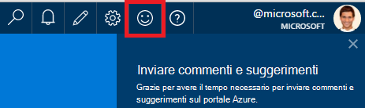
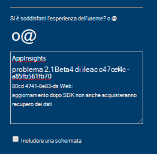
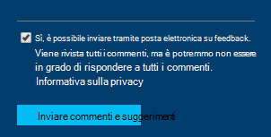

<properties 
    pageTitle="Come ottenere il supporto tecnico dal team di sviluppo di applicazioni approfondimenti | Microsoft Azure" 
    description="Quando si dispone di un caso che richiedono il supporto speciale dal team di sviluppo di applicazioni approfondimenti, si tratta di come è possibile inviare i dettagli per ottenere il supporto." 
    services="application-insights" 
    documentationCenter=""
    authors="alexbulankou" 
    manager="douge"/>
 
<tags 
    ms.service="application-insights" 
    ms.workload="tbd" 
    ms.tgt_pltfrm="ibiza" 
    ms.devlang="na" 
    ms.topic="article" 
    ms.date="06/01/2016" 
    ms.author="albulank"/>
    
# <a name="how-to-get-technical-support-from-application-insights-development-team"></a>Come ottenere il supporto tecnico dal team di sviluppo di applicazioni approfondimenti
    
Quando si dispone di un problema tecnico con [Visual Studio applicazione approfondimenti](app-insights-overview.md), ecco le opzioni di visualizzazione della Guida:

## <a name="1-check-the-documents"></a>1. verificare i documenti

* Dati mancanti? Controllo: [campioni](app-insights-sampling.md), [quote e limitazioni](app-insights-pricing.md).
* Risoluzione dei problemi: [ASP.NET](app-insights-troubleshoot-faq.md) | [Java](app-insights-java-troubleshoot.md)

## <a name="2-search-the-forums"></a>2. cercare nei forum

* [Forum MSDN](https://social.msdn.microsoft.com/Forums/vstudio/home?forum=ApplicationInsights)
* [StackOverflow](http://stackoverflow.com/questions/tagged/ms-application-insights)

## <a name="3-azure-support-plan"></a>3. piano di supporto azure?

Ci sono situazioni in cui si desidera agli sviluppatori di esaminare il caso specifico. 

Se si possiede un [piano di Microsoft Azure di supporto](https://azure.microsoft.com/support/plans/) è possibile [aprire un ticket di supporto](https://portal.azure.com/?#blade/Microsoft_Azure_Support/HelpAndSupportBlade).

## <a name="4-contact-the-application-insights-team"></a>4. contattare il team di applicazione approfondimenti

Se non si dispone di un piano di supporto, il team di sviluppo è lieta di offrire miglior supporto basata ai clienti di applicazione approfondimenti come abbiamo prepararsi per l'attività cardine disponibilità generale. È in corso Introduzione a **una nuova opzione di supporto tecnico**: È possibile descrivere il caso a Microsoft per l'invio di un modulo di commenti e suggerimenti nel portale Azure e uno sviluppatore sul contatto team applicazione approfondimenti indietro per risolvere il problema.


1. Nel [portale approfondimenti applicazione](https://portal.azure.com), fare clic su all'icona dello smile nell'angolo superiore destro:  

       

2. Nella casella commento, assicurarsi di specificare **AppInsights** come prima riga e quindi includono le seguenti informazioni:   

    ```

    AppInsights   
    ikey: <instrumentation key>   
    sdk: <SDK that you are using, including name and version>  
    issue: <please describe the problem you are having>

    ```   

       

3. Selezionare "Sì, è ok per inviare messaggi". 

      

Un tecnico i membri del team applicazione approfondimenti contattati da breve. Come Microsoft fornisce questo servizio sulla base di programmazione migliore, è non possibile assegnare a questo punto contratto di servizio formale.


