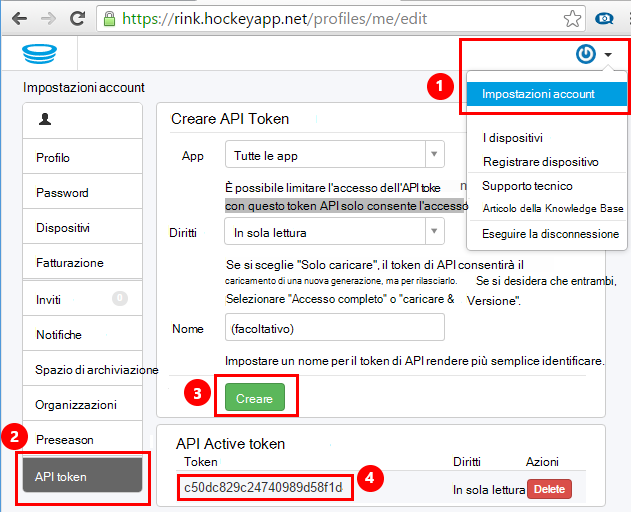
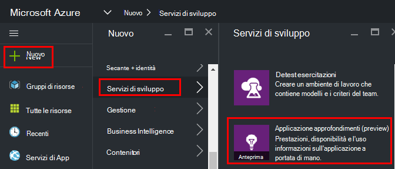
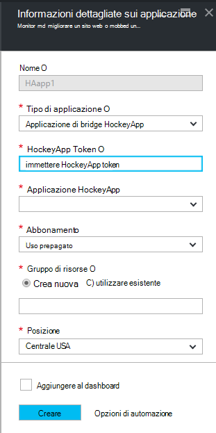
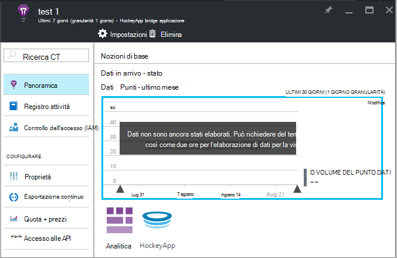
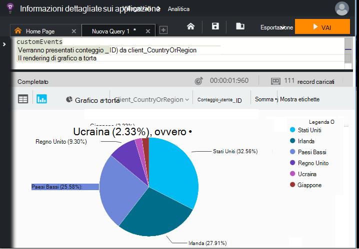

<properties 
    pageTitle="Esplorare i dati HockeyApp nell'applicazione approfondimenti | Microsoft Azure" 
    description="Analisi utilizzo e le prestazioni dell'app Azure con informazioni dettagliate sui applicazione." 
    services="application-insights" 
    documentationCenter="windows"
    authors="alancameronwills" 
    manager="douge"/>

<tags 
    ms.service="application-insights" 
    ms.workload="tbd" 
    ms.tgt_pltfrm="ibiza" 
    ms.devlang="na" 
    ms.topic="article" 
    ms.date="08/25/2016" 
    ms.author="awills"/>

#  Esplorare i dati HockeyApp nell'applicazione approfondimenti

[HockeyApp](https://azure.microsoft.com/services/hockeyapp/) è la piattaforma consigliata per il monitoraggio delle applicazioni desktop e portatili live. Da HockeyApp, è possibile inviare personalizzato e tenere traccia dei telemetria per monitorare l'utilizzo e agevolare la diagnosi (oltre il recupero dei dati di un arresto anomalo). Questo flusso di telemetria possibile eseguire una query utilizzando la funzionalità [Analitica](app-insights-analytics.md) potente strumento di [Visual Studio applicazione approfondimenti](app-insights-overview.md). Inoltre, è possibile [esportare personalizzate e tenere traccia di telemetria](app-insights-export-telemetry.md). Per abilitare queste funzionalità, impostare un bridge che consente di inoltrare i dati HockeyApp a informazioni dettagliate sui applicazione.

## App HockeyApp Bridge

L'App di Bridge HockeyApp viene eseguita la funzionalità di base che consente di accedere ai dati HockeyApp in approfondimenti applicazione tramite il Analitica e caratteristiche esportare continua. Eventuali dati raccolti dal HockeyApp dopo la creazione dell'App Bridge HockeyApp sarà accessibili da queste caratteristiche. Vediamo come configurare una di queste applicazioni Bridge.

In HockeyApp, aprire impostazioni dell'Account, [I token API](https://rink.hockeyapp.net/manage/auth_tokens). Creare un nuovo token o riutilizzare uno esistente. I diritti minimi necessari sono "di sola lettura". Richiedere una copia dell'API token.

Aprire il portale di Microsoft Azure e [creazione di una risorsa approfondimenti applicazione](app-insights-create-new-resource.md). Imposta il tipo di applicazione di "Applicazione bridge HockeyApp":

Non è necessario impostare un nome, questo verrà impostato automaticamente dal nome HockeyApp.

Vengono visualizzati i campi di bridge HockeyApp. 

Immettere il token HockeyApp indicato in precedenza. Questa azione consente di compilare il menu a discesa "HockeyApp applicazione" con tutte le applicazioni di HockeyApp. Selezionare quello che si desidera utilizzare e completare il resto dei campi. 

Aprire la nuova risorsa. 

Si noti che i dati avrà un po' di tempo per avviare il flusso.

Questo è tutto! Tutti i dati raccolti nell'app strumentazione HockeyApp da questo momento anche sono ora disponibili per l'utente Analitica ed esportare continuo delle funzionalità relative ai approfondimenti applicazione.

Brevemente Esaminiamo ogni caratteristica sono ora disponibili.

## Analitica

Analitica è uno strumento efficace per le query ad hoc dei dati, che consente di diagnosticare e analizzare i telemetria e individuare rapidamente le cause principali e modelli.

* [Ulteriori informazioni sulle Analitica](app-insights-analytics-tour.md)
* [Video introduttivo](https://channel9.msdn.com/events/Build/2016/T666)
* [Concetti avanzati video](https://channel9.msdn.com/Events/Build/2016/P591)

## Esportazione continuo

Esportazione continuo consente di esportare i dati in un contenitore di archiviazione Blob Azure. Questo è molto utile se è necessario mantenere i dati per maggiore del periodo di conservazione attualmente offerto dai approfondimenti applicazione. È possibile mantenere i dati in archiviazione blob, convertirlo in un Database SQL o i dati Preferiti deposito soluzione.

[Altre informazioni sull'esportazione continuo](app-insights-export-telemetry.md)

## Passaggi successivi

* [Applicare Analitica ai dati](app-insights-analytics-tour.md)

