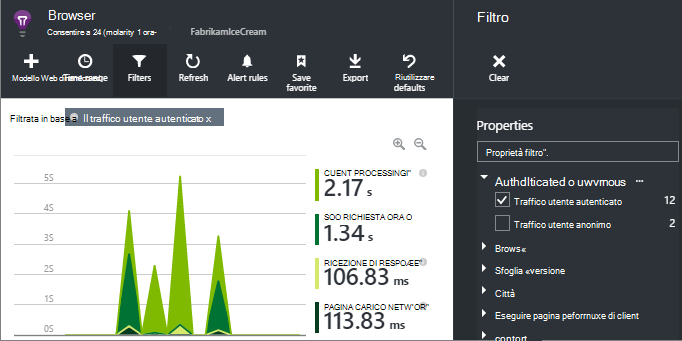

<properties 
    pageTitle="Come si … nell'applicazione approfondimenti | Microsoft Azure" 
    description="Domande frequenti in approfondimenti applicazione." 
    services="application-insights" 
    documentationCenter=""
    authors="alancameronwills" 
    manager="douge"/>

<tags 
    ms.service="application-insights" 
    ms.workload="tbd" 
    ms.tgt_pltfrm="ibiza" 
    ms.devlang="na" 
    ms.topic="article" 
    ms.date="02/05/2016" 
    ms.author="awills"/>

# <a name="how-do-i--in-application-insights"></a>Come si … in approfondimenti applicazione?

## <a name="get-an-email-when-"></a>Ottenere un messaggio di posta elettronica quando...

### <a name="email-if-my-site-goes-down"></a>Messaggio di posta elettronica se sito personale si blocca

Impostare un [test web disponibilità](app-insights-monitor-web-app-availability.md).

### <a name="email-if-my-site-is-overloaded"></a>Inviare tramite posta elettronica sovraccarico sito personale

Impostare un [avviso](app-insights-alerts.md) entro i **tempi di risposta Server**. Soglia compreso tra 1 e 2 secondi funzionerà.


L'app risulti anche segni di affaticamento visivo restituendo codici di errore. Impostare un avviso per **le richieste di non riuscita**.

Se si desidera impostare un avviso sulle **eccezioni Server**, è necessario eseguire [alcune impostazioni aggiuntive](app-insights-asp-net-exceptions.md) per vedere i dati.

### <a name="email-on-exceptions"></a>In eccezioni di posta elettronica

1. [Impostare le eccezioni di monitoraggio](app-insights-asp-net-exceptions.md)
2. [Impostare un avviso](app-insights-alerts.md) in unità di misura metriche conteggio eccezione


### <a name="email-on-an-event-in-my-app"></a>Inviare tramite posta elettronica su un evento dell'app

Si supponga che si desidera ottenere un messaggio di posta elettronica quando si verifica un evento specifico. Approfondimenti applicazione non forniscono direttamente questa funzionalità, ma è possibile [inviare un avviso quando una metrica supera una determinata soglia](app-insights-alerts.md). 

Avvisi possono essere impostati su [metriche personalizzate](app-insights-api-custom-events-metrics.md#track-metric), attraverso eventi non personalizzati. Scrivere codice per aumentare una metrica quando si verifica l'evento:

    telemetry.TrackMetric("Alarm", 10);

o:

    var measurements = new Dictionary<string,double>();
    measurements ["Alarm"] = 10;
    telemetry.TrackEvent("status", null, measurements);

Perché gli avvisi hanno due stati, è necessario inviare un valore basso quando è prendere in considerazione l'avviso verso sono scadute:

    telemetry.TrackMetric("Alarm", 0.5);

Creare un grafico in [Esplora risorse metriche](app-insights-metrics-explorer.md) per visualizzare l'avviso:


Impostare un avviso per quando l'unità di misura metriche supera un valore stringa. Estrai per un breve periodo:


Impostare il periodo di calcolo delle medie al minimo. 

Messaggi di posta elettronica viene visualizzato quando la metrica passa sopra e sotto la soglia.

Ecco alcuni punti da considerare:

* Un avviso presenta due stati ("avviso" e "integri"). Lo stato viene valutato solo quando si riceve una metrica.
* Messaggio di posta elettronica viene inviato solo quando lo stato viene modificato. Si tratta perché è necessario inviare entrambe elevato e metriche di valore minimo. 
* Per valutare l'avviso, viene accettata la media dei valori ricevuti nel periodo precedente. In tal caso ogni volta che si riceve una metrica, in modo che i messaggi di posta elettronica possono essere inviati più frequentemente il periodo di impostato.
* Poiché vengono inviati messaggi di posta elettronica sia sul "avviso" e "Integro", è consigliabile prendere in considerazione nuovamente pensare ogni singolo evento come condizione due stati. Ad esempio, invece di un evento "processo completato" dispone di una condizione "processo in corso", nel punto in cui si riceve messaggi di posta elettronica all'inizio o alla fine di un processo.

### <a name="set-up-alerts-automatically"></a>Impostare avvisi automaticamente

[Usare PowerShell per creare nuovi avvisi](app-insights-alerts.md#set-alerts-by-using-powershell)

## <a name="use-powershell-to-manage-application-insights"></a>Usare PowerShell per gestire le informazioni dettagliate sui applicazione

* [Creare nuove risorse](app-insights-powershell-script-create-resource.md)
* [Creare nuovi avvisi](app-insights-alerts.md#set-alerts-by-using-powershell)

## <a name="application-versions-and-stamps"></a>Indicatori e le versioni delle applicazioni

### <a name="separate-the-results-from-dev-test-and-prod"></a>Separare i risultati da dev, test e produzione

* Per diversi environmnents, configurare ikeys diversi
* Per diversi indicatori (dev, testare, produzione) tag telemetria con valori di proprietà diversi

[Ulteriori informazioni](app-insights-separate-resources.md)
 

### <a name="filter-on-build-number"></a>Filtro in un numero di build

Quando si pubblica una nuova versione dell'app, è consigliabile per poter separare di telemetria provenienti da build diverse.

È possibile impostare la proprietà di versione dell'applicazione in modo che è possibile filtrare i risultati di [ricerca](app-insights-diagnostic-search.md) e [metriche explorer](app-insights-metrics-explorer.md) . 


Sono disponibili diversi metodi di impostazione della proprietà di versione dell'applicazione.

* Impostare direttamente:

    `telemetryClient.Context.Component.Version = typeof(MyProject.MyClass).Assembly.GetName().Version;`

* Inserire la riga in un [inizializzatore di telemetria](app-insights-api-custom-events-metrics.md#telemetry-initializers) per garantire che tutte le istanze di TelemetryClient siano impostate in modo coerente.

* [ASP.NET] Impostare la versione nel `BuildInfo.config`. Il modulo web acquisirà la versione da nodo BuildLabel. Includere il file nel progetto, tenendo presente che impostare la proprietà Copia sempre in Esplora soluzioni.

    ```XML

    <?xml version="1.0" encoding="utf-8"?>
    <DeploymentEvent xmlns:xsi="http://www.w3.org/2001/XMLSchema-instance" xmlns:xsd="http://www.w3.org/2001/XMLSchema" xmlns="http://schemas.microsoft.com/VisualStudio/DeploymentEvent/2013/06">
      <ProjectName>AppVersionExpt</ProjectName>
      <Build type="MSBuild">
        <MSBuild>
          <BuildLabel kind="label">1.0.0.2</BuildLabel>
        </MSBuild>
      </Build>
    </DeploymentEvent>

    ```
* [ASP.NET] Generare automaticamente BuildInfo.config in MSBuild. A tale scopo, aggiungere alcune righe nel file csproj:

    ```XML

    <PropertyGroup>
      <GenerateBuildInfoConfigFile>true</GenerateBuildInfoConfigFile>    <IncludeServerNameInBuildInfo>true</IncludeServerNameInBuildInfo>
    </PropertyGroup> 
    ```

    Verrà generato un file denominato *yourProjectName*. BuildInfo.config. Il processo di pubblicazione rinominato in BuildInfo.config.

    L'etichetta di compilazione contiene un segnaposto (AutoGen_) quando si creano con Visual Studio. Ma quando compilato con MSBuild, viene popolata con numero di versione corretto.

    Per consentire a MSBuild generare i numeri di versione, impostare la versione ad esempio `1.0.*` in AssemblyReference.cs

## <a name="monitor-backend-servers-and-desktop-apps"></a>Monitoraggio dei server di back-end e le applicazioni desktop

[Usare il modulo Windows Server SDK](app-insights-windows-desktop.md).


## <a name="visualize-data"></a>Visualizzare i dati

#### <a name="dashboard-with-metrics-from-multiple-apps"></a>Dashboard con metrica da più applicazioni

* In [Esplora risorse di unità di misura metriche](app-insights-metrics-explorer.md), personalizzare il grafico e salvarlo come preferito. Aggiungerlo al dashboard di Azure.


#### <a name="dashboard-with-data-from-other-sources-and-application-insights"></a>Dashboard con i dati da altre origini e applicazione approfondimenti

* [Esportazione di telemetria di Power BI](app-insights-export-power-bi.md). 

O

* Utilizzare SharePoint come il dashboard, la visualizzazione dei dati nelle web part di SharePoint. [Utilizzare esportazione continua e Analitica flusso per esportare in SQL](app-insights-code-sample-export-sql-stream-analytics.md).  Utilizzare PowerView per esaminare il database e creare una web part di SharePoint per PowerView.


<a name="search-specific-users"></a>
### <a name="filter-out-anonymous-or-authenticated-users"></a>Filtrare gli utenti anonimi e autenticati

Se gli utenti ad accedere, è possibile impostare l' [id utente autenticato](app-insights-api-custom-events-metrics.md#authenticated-users). (Ma non viene effettuato automaticamente.) 

È possibile:

* Cercare gli ID utente specifico


* Formato di filtro per gli utenti anonimi e autenticati



## <a name="modify-property-names-or-values"></a>Modificare i nomi delle proprietà o valori

Creare un [filtro](app-insights-api-filtering-sampling.md#filtering). Consente di modificare o filtrare telemetria prima dell'invio dell'App a informazioni dettagliate sui applicazione.

## <a name="list-specific-users-and-their-usage"></a>Elenco di utenti specifici e il relativo utilizzo

Se si vuole semplicemente per [la ricerca di utenti specifici](#search-specific-users), è possibile impostare l' [id utente autenticato](app-insights-api-custom-events-metrics.md#authenticated-users).

Se si desidera un elenco di utenti con i dati, ad esempio quali pagine sono esaminare o con quale frequenza accedono, sono disponibili due opzioni:

* [Impostare autenticato id utente](app-insights-api-custom-events-metrics.md#authenticated-users), [esportare in un database](app-insights-code-sample-export-sql-stream-analytics.md) e utilizzare strumenti adatti per analizzare i dati utente sono.
* Se si dispone di un numero limitato di utenti, è possibile inviare eventi personalizzati o metriche, utilizzando i dati di interesse come nome del valore o un evento metrico e impostare l'id utente come proprietà. Per analizzare le visualizzazioni di pagina, sostituire la chiamata di trackPageView JavaScript standard. Per analizzare telemetria sul lato server, utilizzare un inizializzatore di telemetria per aggiungere l'id utente di telemetria server tutti. È anche possibile filtrare e segmento metriche e ricerche sull'id utente.


## <a name="reduce-traffic-from-my-app-to-application-insights"></a>Ridurre il traffico da app a informazioni dettagliate sui applicazione

* In [ApplicationInsights.config](app-insights-configuration-with-applicationinsights-config.md), disattivare tutti i moduli che non sono necessarie, ad esempio il raccoglitore contatore prestazioni.
* Utilizzare [campioni e applicazione di filtri](app-insights-api-filtering-sampling.md) in SDK.
* Nelle pagine web, limitare il numero di chiamate Ajax segnalato per la visualizzazione di ogni pagina. Frammento di script dopo `instrumentationKey:...` , inserire: `,maxAjaxCallsPerView:3` (o un numero).
* Se si usa [TrackMetric](app-insights-api-custom-events-metrics.md#track-metric), per calcolare l'aggregazione di batch di metrici valori prima di inviare il risultato. Esiste un overload del TrackMetric() che fornisce per cui.


Ulteriori informazioni sui [prezzi e le quote](app-insights-pricing.md).

## <a name="disable-telemetry"></a>Disattivare telemetry

Per **interrompere in modo dinamico e avviare** la raccolta e trasmissione di telemetria dal server:

```

    using  Microsoft.ApplicationInsights.Extensibility;

    TelemetryConfiguration.Active.DisableTelemetry = true;
```


Per **disabilitare raccolta standard selezionato** - ad esempio contatori, le richieste HTTP o dipendenze - eliminare o commento le righe pertinenti in [ApplicationInsights.config](app-insights-api-custom-events-metrics.md). Si può eseguire la verifica, ad esempio, se si desidera inviare i propri dati TrackRequest.


## <a name="view-system-performance-counters"></a>Contatori di prestazioni di sistema di visualizzazione

Tra le metriche è possibile visualizzare in Esplora risorse metriche è un insieme di sistema contatori. Esiste una pala predefinita intitolata **server** che consente di visualizzare diversi.


### <a name="if-you-see-no-performance-counter-data"></a>Se viene non visualizzato alcun contatore di prestazioni

* **Server IIS** nel proprio computer o in una macchina virtuale. [Installare controllo dello stato](app-insights-monitor-performance-live-website-now.md). 
* **Sito web azure** - non è supportata contatori ancora. Esistono diverse metriche è possibile ottenere come parte del Pannello di controllo Azure sito web standard.
* **Server UNIX** - [installare collectd](app-insights-java-collectd.md)

### <a name="to-display-more-performance-counters"></a>Per visualizzare ulteriori contatori delle prestazioni

* Prima di tutto, [aggiungere un nuovo grafico](app-insights-metrics-explorer.md) e verificare se contatore nel basic impostato che sono disponibili.
* In caso contrario, [aggiungere il contatore al set di raccolti dal modulo di indicatore di prestazioni](app-insights-performance-counters.md).


