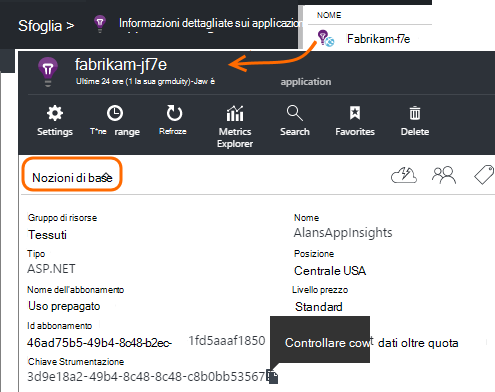
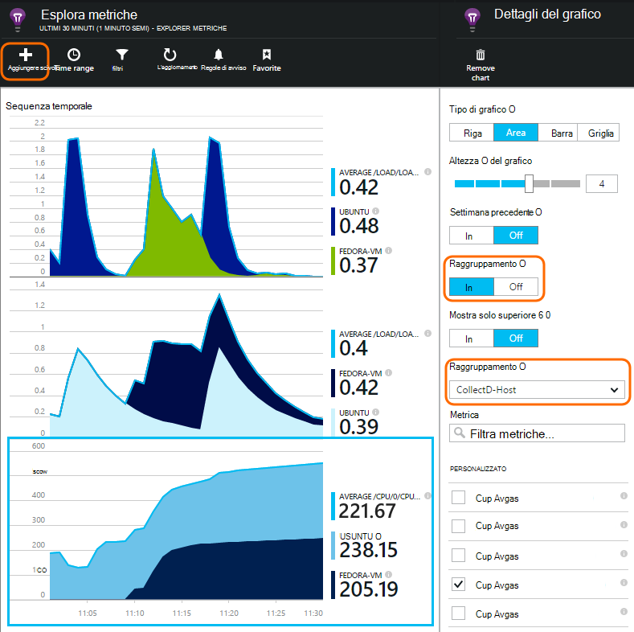

<properties 
    pageTitle="collectd: statistiche delle prestazioni per Java su Unix in applicazione approfondimenti" 
    description="Esteso il monitoraggio del sito Web Java con CollectD plug-in per informazioni dettagliate sui applicazione" 
    services="application-insights" 
    documentationCenter="java"
    authors="alancameronwills" 
    manager="douge"/>

<tags 
    ms.service="application-insights" 
    ms.workload="tbd" 
    ms.tgt_pltfrm="ibiza" 
    ms.devlang="na" 
    ms.topic="article" 
    ms.date="08/24/2016" 
    ms.author="awills"/>
 
# <a name="collectd-unix-performance-metrics-in-application-insights"></a>collectd: metriche delle prestazioni Unix nell'applicazione approfondimenti

*Informazioni dettagliate sui applicazione è in anteprima.*

Per esplorare i dati statistici sulle prestazioni di sistema di Unix [nell'Applicazione approfondimenti](app-insights-overview.md), installare [collectd](http://collectd.org/)insieme approfondimenti relativa applicazione plug-in. Questa soluzione Apri origine raccoglie le varie statistiche di sistema e di rete.

In genere si userà collectd se si dispone già [Strumentazione servizio web Java con informazioni dettagliate sui applicazione][java]. Fornisce altri dati che consentono di migliorare le prestazioni dell'app o diagnosticare i problemi. 


## <a name="get-your-instrumentation-key"></a>Ottenere il codice di strumentazione

Nel [portale di Microsoft Azure](https://portal.azure.com), aprire la risorsa [Applicazione approfondimenti](app-insights-overview.md) in cui si desidera visualizzare i dati. In alternativa, [creare una nuova risorsa](app-insights-create-new-resource.md).

Richiedere una copia della chiave strumentazione, che identifica la risorsa.




## <a name="install-collectd-and-the-plug-in"></a>Installare il plug-in e collectd

Nei server Unix:

1. Installare [collectd](http://collectd.org/) versione 5.4.0 o versione successiva.
2. Scaricare il [plug-in applicazione approfondimenti collectd writer](https://aka.ms/aijavasdk). Prendere nota del numero di versione.
3. Copia il plug-in JAR in `/usr/share/collectd/java`.
3. Modificare `/etc/collectd/collectd.conf`:
 * Assicurarsi che [il plug-in Java](https://collectd.org/wiki/index.php/Plugin:Java) sia attivato.
 * Aggiornare JVMArg per il java.class.path per includere VASO seguente. Aggiornare il numero di versione in modo che corrisponda a quello scaricato:
  * `/usr/share/collectd/java/applicationinsights-collectd-1.0.5.jar`
 * Aggiungere il frammento utilizzando la chiave strumentazione la risorsa:

```

     LoadPlugin "com.microsoft.applicationinsights.collectd.ApplicationInsightsWriter"
     <Plugin ApplicationInsightsWriter>
        InstrumentationKey "Your key"
     </Plugin>
```

Di seguito fa parte di un file di configurazione di esempio:

    ...
    # collectd plugins
    LoadPlugin cpu
    LoadPlugin disk
    LoadPlugin load
    ...

    # Enable Java Plugin
    LoadPlugin "java"

    # Configure Java Plugin
    <Plugin "java">
      JVMArg "-verbose:jni"
      JVMArg "-Djava.class.path=/usr/share/collectd/java/applicationinsights-collectd-1.0.5.jar:/usr/share/collectd/java/collectd-api.jar"

      # Enabling Application Insights plugin
      LoadPlugin "com.microsoft.applicationinsights.collectd.ApplicationInsightsWriter"
                
      # Configuring Application Insights plugin
      <Plugin ApplicationInsightsWriter>
        InstrumentationKey "12345678-1234-1234-1234-123456781234"
      </Plugin>

      # Other plugin configurations ...
      ...
    </Plugin>
.   ...

Configurare altri [plug-in collectd](https://collectd.org/wiki/index.php/Table_of_Plugins), che può raccogliere vari dati provenienti da origini diverse.

Riavviare collectd in base alla relativa [manuale](https://collectd.org/wiki/index.php/First_steps).

## <a name="view-the-data-in-application-insights"></a>Visualizzare i dati nell'applicazione approfondimenti

In risorsa applicazione approfondimenti, aprire [Explorer metriche e aggiungere grafici][metrics], selezionando le metriche si desidera visualizzare dalla categoria personalizzata.



Per impostazione predefinita, i criteri di misurazione vengono aggregati in tutti i computer host da cui sono stati raccolti i criteri di misurazione. Per visualizzare le metriche per host, e dettagli il grafico, attivare il raggruppamento e quindi scegliere per il raggruppamento CollectD Host.


## <a name="to-exclude-upload-of-specific-statistics"></a>Per escludere il caricamento di statistiche specifiche

Per impostazione predefinita, il plug-in applicazione approfondimenti invia tutti i dati raccolti da tutte le collectd abilitata leggere plug-in. 

Per escludere i dati da origini dati o plug-in specifico:

* Modificare il file di configurazione. 
* In `<Plugin ApplicationInsightsWriter>`, aggiungere righe direttiva alla seguente:

Direttiva | Effetto
---|---
`Exclude disk` | Escludere tutti i dati raccolti mediante la `disk` plug-in
`Exclude disk:read,write` | Escludere le origini denominate `read` e `write` dalla `disk` plug-in.

Direttive con una nuova riga.


## <a name="problems"></a>Problemi?

*Perché non è visibile dati nel portale*

* Aprire [ricerca] [ diagnostic] per vedere se gli eventi sono arrivati. Può succedere che vengano richiedere più tempo vengano visualizzati in metriche soluzioni.
* È possibile [impostare le eccezioni del firewall per i dati in uscita](app-insights-ip-addresses.md)
* Abilitare la traccia di plug-in approfondimenti applicazione. Aggiungere la riga all'interno di `<Plugin ApplicationInsightsWriter>`:
 *  `SDKLogger true`
* Aprire un terminale e iniziare a collectd in modalità dettagliata, per visualizzare eventuali problemi che segnala:
 * `sudo collectd -f`


<!--Link references-->

[api]: app-insights-api-custom-events-metrics.md
[apiexceptions]: app-insights-api-custom-events-metrics.md#track-exception
[availability]: app-insights-monitor-web-app-availability.md
[diagnostic]: app-insights-diagnostic-search.md
[eclipse]: app-insights-java-eclipse.md
[java]: app-insights-java-get-started.md
[javalogs]: app-insights-java-trace-logs.md
[metrics]: app-insights-metrics-explorer.md
[usage]: app-insights-web-track-usage.md

 
