<properties 
    pageTitle="Guida introduttiva a informazioni dettagliate sui applicazione con Java in Eclisse" 
    description="Consente di aggiungere le prestazioni e l'uso di monitoraggio al sito Web Java con informazioni dettagliate sui applicazione Eclisse plug-in" 
    services="application-insights" 
    documentationCenter="java"
    authors="alancameronwills" 
    manager="douge"/>

<tags 
    ms.service="application-insights" 
    ms.workload="tbd" 
    ms.tgt_pltfrm="ibiza" 
    ms.devlang="na" 
    ms.topic="article" 
    ms.date="03/02/2016" 
    ms.author="awills"/>
 
# Guida introduttiva a informazioni dettagliate sui applicazione con Java in Eclisse

Applicazione approfondimenti SDK invia telemetria dall'applicazione web Java in modo che consente di analizzare utilizzo e le prestazioni. Eclisse plug-in per informazioni dettagliate sui applicazione installa automaticamente il SDK di un progetto in modo da ottenere da telemetria casella, oltre a un'API che è possibile utilizzare per scrivere telemetria personalizzato.   

## Prerequisiti

Attualmente funziona plug-in per Maven e progetti dinamico Web in Eclisse. ([Aggiungere informazioni dettagliate sui applicazione ad altri tipi di progetto Java][java].)

È necessario:

* Oracle JRE 1.6 o versioni successive
* Una sottoscrizione a [Microsoft Azure](https://azure.microsoft.com/). (È possibile iniziare con la [versione di valutazione gratuita](https://azure.microsoft.com/pricing/free-trial/).)
* [Eclipse IDE per sviluppatori Java Edition](http://www.eclipse.org/downloads/), il o versione successiva.
* Windows 7 o versioni successive o Windows Server 2008 o versione successiva

## Installare il SDK sul Eclisse (una volta)

È necessario eseguire questo una volta al computer. Questo passaggio consente di installare un toolkit che quindi possibile aggiungere il SDK per ogni progetto Web dinamico.

1. In Eclisse, fare clic su?, installare di nuovo Software.

    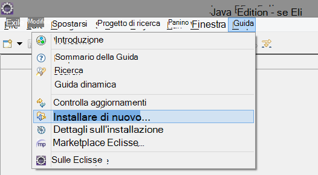

2. SDK è http://dl.windowsazure.com/eclipse in Azure Toolkit. 
3. Deselezionare **contattare tutti i siti di aggiornamento...**

    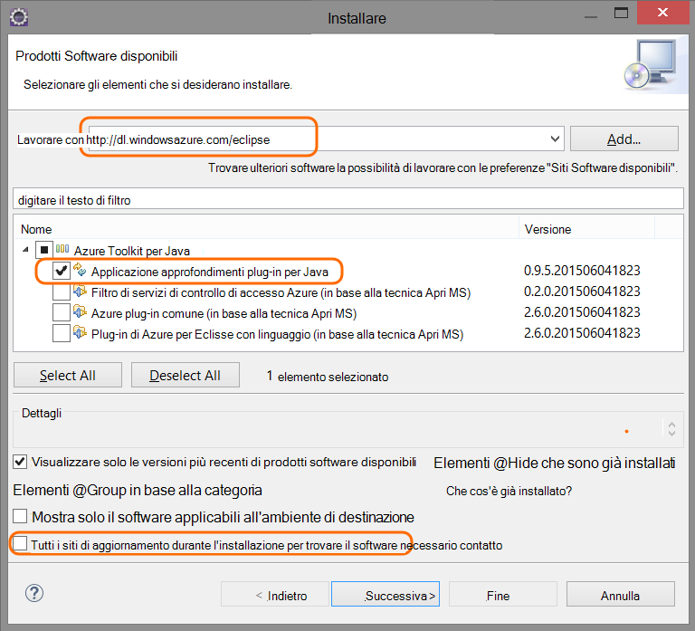

Seguire i passaggi rimanenti per ogni progetto di linguaggio.

## Creare una risorsa applicazione approfondimenti in Azure

1. Accedere al [portale di Azure](https://portal.azure.com).
2. Creare una nuova risorsa approfondimenti applicazione.  

    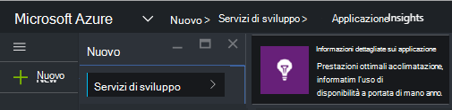  
3. Impostare il tipo di applicazione all'applicazione web Java.  

    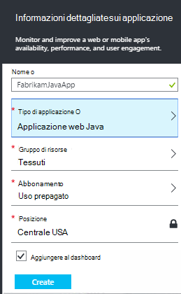  
4. Trovare la chiave strumentazione della nuova risorsa. È necessario incollare subito nel progetto di codice.  

      

## Aggiungere informazioni dettagliate sui applicazione al progetto

1. Aggiungere informazioni dettagliate sui applicazione dal menu di scelta rapida del progetto web Java.

    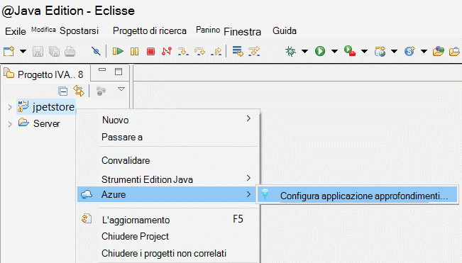

2. Incollare la chiave strumentazione ottenuto dal portale di Azure.

    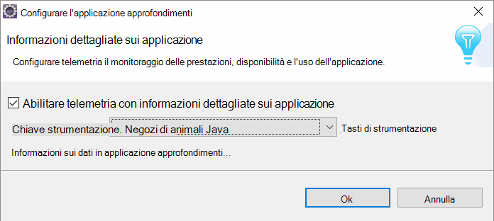

Il tasto viene inviato insieme a tutti gli elementi di telemetria e indica approfondimenti applicazione per visualizzare la risorsa.

## Eseguire l'applicazione e vedere metriche

Eseguire l'applicazione.

Tornare alla risorsa di applicazione approfondimenti in Microsoft Azure.

Dati di richieste HTTP verranno visualizzata e il Panoramica. (Se non è presente, attendere alcuni secondi e quindi fare clic su Aggiorna.)

 

Fare clic sui grafici per visualizzare informazioni più dettagliate la metrica. 

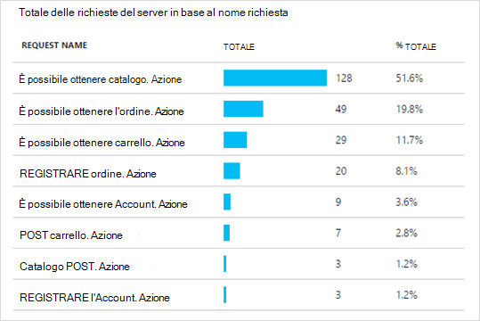

[Ulteriori informazioni sulle metriche.][metrics]

 

E quando si visualizzano le proprietà di una richiesta, è possibile visualizzare gli eventi di telemetria associati, ad esempio le richieste e le eccezioni.
 
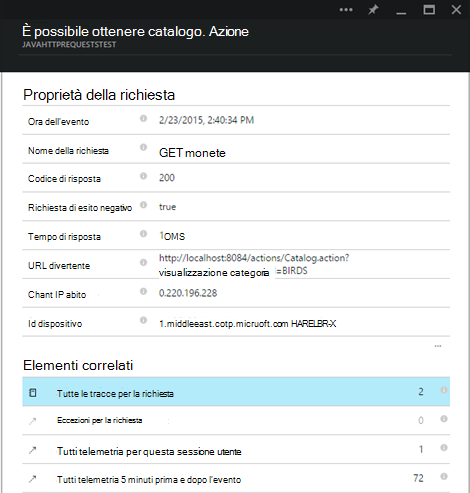

## Telemetria lato client

Fare clic su Richiedi codice per monitorare le pagine web e il Guida introduttiva: 

Inserire il frammento di codice nell'intestazione dei file HTML.

#### Visualizzare i dati sul lato client

Aprire le pagine web aggiornato e utilizzarli. Attendere qualche minuto o due, quindi tornare a informazioni dettagliate sui applicazione e aprire e il uso. (Da e il panoramica, scorrere verso il basso e fare clic su uso)

Metriche di visualizzazione, utente e sessione pagina verranno visualizzate nella e uso:

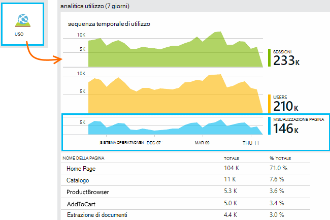

[Ulteriori informazioni sull'impostazione di telemetria lato client.][usage]

## Pubblicare l'applicazione

Pubblicare l'app nel server, utilizzare comunicare agli utenti e controllo di telemetria visualizzati nel portale di.

* Assicurarsi che il firewall consente all'applicazione di inviare telemetria alle seguenti porte:

 * DC.Services.VisualStudio.com:443
 * DC.Services.VisualStudio.com:80
 * F5.Services.VisualStudio.com:443
 * F5.Services.VisualStudio.com:80

* In Windows Server, installare:

 * [Microsoft Visual C++ Redistributable](http://www.microsoft.com/download/details.aspx?id=40784)

    (In questo modo contatori).

## Eccezioni e gli errori di richiesta

Le eccezioni non gestite vengono raccolte automaticamente:

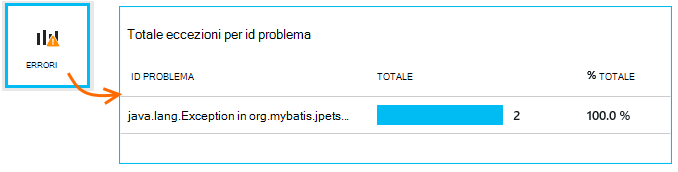

Per raccogliere dati sulle altre eccezioni, sono disponibili due opzioni:

* [Inserire le chiamate a TrackException nel codice](app-insights-api-custom-events-metrics.md#track-exception). 
* [Installare l'agente di linguaggio nel server](app-insights-java-agent.md). Specificare i metodi che si desidera controllare.

## Eseguire il monitoraggio delle chiamate e le relazioni esterne

[Installare l'agente di linguaggio](app-insights-java-agent.md) agli utenti di accedere specificati metodi interni e le chiamate eseguite tramite JDBC, con i dati dell'intervallo.

## Contatori delle prestazioni

Nella blade panoramica, scorrere verso il basso e fare clic sul riquadro **server** . Verrà visualizzato un intervallo di contatori.

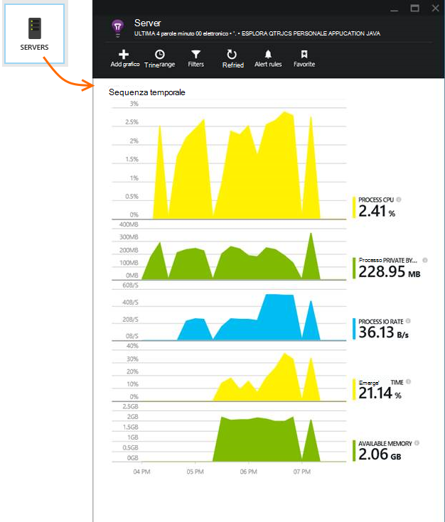

### Personalizzare la raccolta contatore prestazioni

Per disabilitare la raccolta di set di contatori standard, aggiungere il codice seguente sotto il nodo principale del file ApplicationInsights.xml:

    <PerformanceCounters>
       <UseBuiltIn>False</UseBuiltIn>
    </PerformanceCounters>

### Raccogliere contatori aggiuntivi

È possibile specificare contatori aggiuntivi da raccogliere.

#### Contatori JMX (esposti da Java Virtual Machine)

    <PerformanceCounters>
      <Jmx>
        <Add objectName="java.lang:type=ClassLoading" attribute="TotalLoadedClassCount" displayName="Loaded Class Count"/>
        <Add objectName="java.lang:type=Memory" attribute="HeapMemoryUsage.used" displayName="Heap Memory Usage-used" type="composite"/>
      </Jmx>
    </PerformanceCounters>

*   `displayName`: Il nome visualizzato nel portale di informazioni approfondite dell'applicazione.
*   `objectName`: Il nome di oggetto JMX.
*   `attribute`– L'attributo del nome dell'oggetto JMX per recuperare
*   `type`(facoltativo) - il tipo di attributo JMX dell'oggetto:
 *  Predefinito: tipo semplice, ad esempio int o long.
 *  `composite`: i dati del contatore delle prestazioni sono nel formato di 'Attribute.Data'
 *  `tabular`: i dati del contatore delle prestazioni sono nel formato di una riga di tabella

#### Contatori Windows

Ogni [contatore delle prestazioni Windows](https://msdn.microsoft.com/library/windows/desktop/aa373083.aspx) fa parte di una categoria (nello stesso modo che un campo sia un membro di una classe). Categorie può essere globale, o possono hanno numerato o istanze denominate.

    <PerformanceCounters>
      <Windows>
        <Add displayName="Process User Time" categoryName="Process" counterName="%User Time" instanceName="__SELF__" />
        <Add displayName="Bytes Printed per Second" categoryName="Print Queue" counterName="Bytes Printed/sec" instanceName="Fax" />
      </Windows>
    </PerformanceCounters>

*   displayName-nome visualizzato nel portale di informazioni approfondite dell'applicazione.
*   categoryName-categoria del (oggetto prestazioni) a cui è associato questo contatore delle prestazioni.
*   counterName: il nome del contatore delle prestazioni.
*   instanceName: il nome dell'istanza di categoria contatore di prestazioni o una stringa vuota (""), se la categoria contiene una singola istanza. Se categoryName è processo e il contatore delle prestazioni che si desidera raccogliere è dal processo JVM corrente in cui l'applicazione è in esecuzione, specificare `"__SELF__"`.

Contatori delle prestazioni sono visibili come metriche personalizzate in [Esplora metriche][metrics].

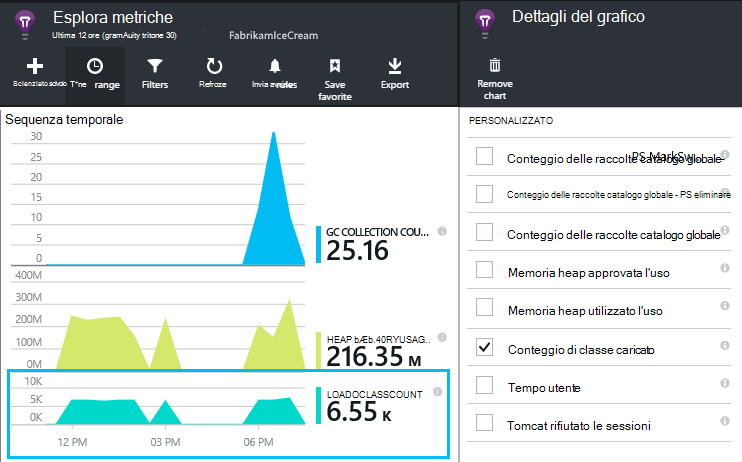

### Contatori UNIX

* [Installare collectd con il plug-in applicazione approfondimenti](app-insights-java-collectd.md) per ottenere una vasta gamma di dati di sistema e di rete.

## Test web disponibilità

Informazioni dettagliate sui applicazione è possibile testare il sito Web a intervalli regolari per verificare che la e rispondere anche. [Per impostare][availability], scorrere fino a fare clic su disponibilità.

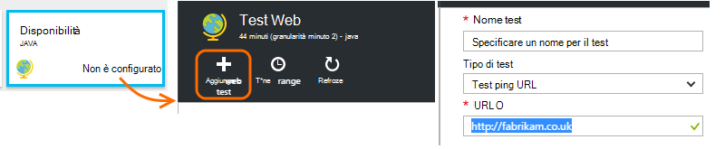

Grafici di tempi di risposta più notifiche tramite posta elettronica viene visualizzato se il sito non è raggiungibile.

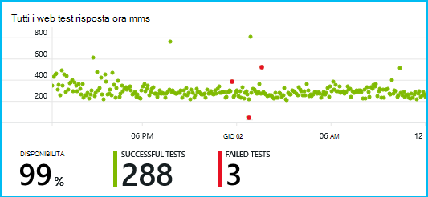

[Ulteriori informazioni sulla disponibilità web test.][availability] 

## Registri diagnostici

Se si usa Logback o Log4J (versione 1.2 o 2.0) per l'analisi, è possibile creare i registri di traccia automaticamente inviati a informazioni dettagliate sui applicazione che consente di esplorare e di eseguire una ricerca su di essi.

[Ulteriori informazioni sui registri diagnostici][javalogs]

## Telemetria personalizzato 

Inserire alcune righe di codice nell'applicazione web Java per sapere quali utenti stanno facendo usarli o di diagnosticare i problemi. 

È possibile inserire codice nella pagina web JavaScript e Java lato server.

[Informazioni sulle telemetria personalizzato][track]

## Passaggi successivi

#### Rilevare e diagnosticare i problemi

* [Aggiunta di telemetria di client web] [ usage] per ottenere telemetria prestazioni dal client web.
* [Impostare i test web] [ availability] per verificare che l'applicazione rimane attivo e rispondere.
* [Eseguire una ricerca eventi e registri] [ diagnostic] di diagnosticare i problemi.
* [Acquisire le tracce di Log4J o Logback][javalogs]

#### Tenere traccia dell'utilizzo

* [Aggiunta di telemetria di client web] [ usage] monitor pagina visualizzazioni e metriche di utente di base.
* [Tenere traccia di eventi personalizzati e metriche] [ track] per informazioni sull'utilizzo dell'applicazione, sia nel client e server.

<!--Link references-->

[availability]: app-insights-monitor-web-app-availability.md
[diagnostic]: app-insights-diagnostic-search.md
[java]: app-insights-java-get-started.md
[javalogs]: app-insights-java-trace-logs.md
[metrics]: app-insights-metrics-explorer.md
[track]: app-insights-api-custom-events-metrics.md
[usage]: app-insights-web-track-usage.md

 