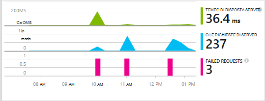
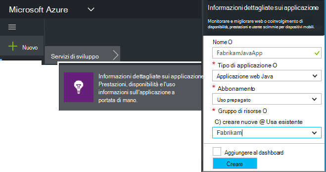
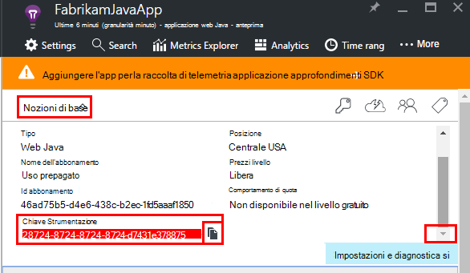
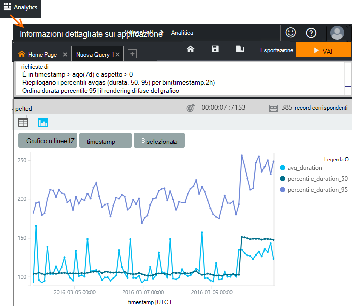
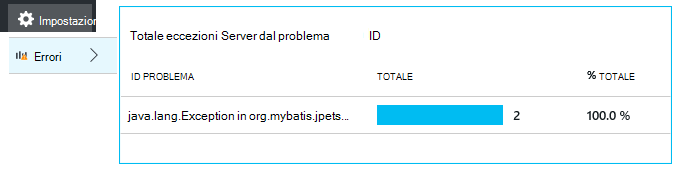
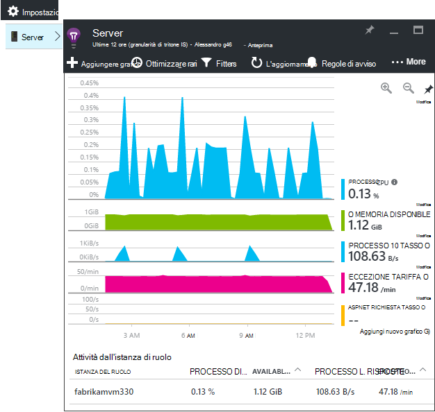
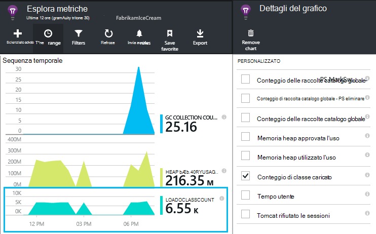
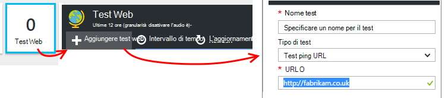
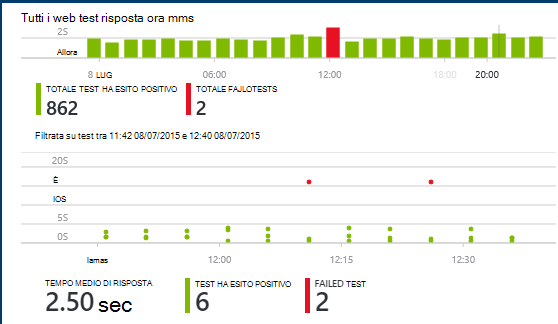

<properties
    pageTitle="Analitica app web di linguaggio con informazioni dettagliate sui applicazione | Microsoft Azure"
    description="Eseguire il monitoraggio delle prestazioni e l'uso del sito Web Java con informazioni dettagliate sui applicazione. "
    services="application-insights"
    documentationCenter="java"
    authors="alancameronwills"
    manager="douge"/>

<tags
    ms.service="application-insights"
    ms.workload="tbd"
    ms.tgt_pltfrm="ibiza"
    ms.devlang="na"
    ms.topic="get-started-article"
    ms.date="08/17/2016"
    ms.author="awills"/>

# Guida introduttiva a informazioni dettagliate sui applicazione in un progetto web Java

*Informazioni dettagliate sui applicazione è in anteprima.*

[AZURE.INCLUDE [app-insights-selector-get-started](../../includes/app-insights-selector-get-started.md)]

[Informazioni dettagliate sui applicazione](https://azure.microsoft.com/services/application-insights/) è un servizio extensible analitica che consente di comprendere le prestazioni e l'uso dell'applicazione live. Utilizzare per [rilevare e diagnosticare i problemi di prestazioni ed eccezioni](app-insights-detect-triage-diagnose.md)e [scrivere codice] [ api] per tenere traccia delle operazioni con l'app dagli utenti.

Informazioni dettagliate sui applicazione supporta le applicazioni Java in esecuzione su Linux, Unix o Windows.

Hai bisogno:

* Oracle JRE 1.6 o versioni successive oppure Zulu JRE 1.6 o versioni successive
* Una sottoscrizione a [Microsoft Azure](https://azure.microsoft.com/). (È possibile iniziare con la [versione di valutazione gratuita](https://azure.microsoft.com/pricing/free-trial/).)

*Se si dispone di un'applicazione web che è già attiva, è Impossibile eseguire la procedura alternativa aggiungere [SDK in fase di esecuzione nel server web](app-insights-java-live.md). Tale alternativa evita la ricostruzione il codice, ma non viene ricevuta l'opzione per scrivere codice per tenere traccia delle attività dell'utente.*

## 1. ottenere una chiave di strumentazione approfondimenti applicazione

1. Accedere al [portale di Microsoft Azure](https://portal.azure.com).
2. Creare una risorsa approfondimenti applicazione. Impostare il tipo di applicazione all'applicazione web Java.

    
4. Trovare la chiave strumentazione della nuova risorsa. È necessario incollare la chiave del progetto di codice subito.

    

## 2. aggiungere applicazione approfondimenti SDK per Java al progetto

*Scegliere il modo più appropriato per il progetto.*

#### Se si usa Eclisse per creare un progetto Maven o Web dinamico...

Utilizzare l' [Applicazione approfondimenti SDK per Java plug-in][eclipse].

#### Se si usa Maven...

Se il progetto è già impostato per usare Maven per creare, unire il codice seguente al file pom.xml.

Quindi, aggiornare le dipendenze di progetto per ottenere i file binari scaricati.

    <repositories>
       <repository>
          <id>central</id>
          <name>Central</name>
          <url>http://repo1.maven.org/maven2</url>
       </repository>
    </repositories>

    <dependencies>
      <dependency>
        <groupId>com.microsoft.azure</groupId>
        <artifactId>applicationinsights-web</artifactId>
        <!-- or applicationinsights-core for bare API -->
        <version>[1.0,)</version>
      </dependency>
    </dependencies>

* *Creare o checksum errori di convalida?* Provare a utilizzare una versione specifica, ad esempio: `<version>1.0.n</version>`. [Note sulla versione SDK](https://github.com/Microsoft/ApplicationInsights-Java#release-notes) o il nostro [elementi Maven](http://search.maven.org/#search%7Cga%7C1%7Capplicationinsights)troverete la versione più recente.
* *È necessario eseguire l'aggiornamento a un nuovo SDK?* Aggiornare le dipendenze del progetto.

#### Se si sta utilizzando Gradle...

Se il progetto è già impostato per usare Gradle per creare, unire il codice seguente al file build.gradle.

Quindi aggiornare le dipendenze di progetto per ottenere i file binari scaricati.

    repositories {
      mavenCentral()
    }

    dependencies {
      compile group: 'com.microsoft.azure', name: 'applicationinsights-web', version: '1.+'
      // or applicationinsights-core for bare API
    }

* Errori di convalida compilazione o checksum *? Provare a utilizzare una versione specifica, ad esempio:* `version:'1.0.n'`. *La versione più recente sono disponibili nelle [note sulla versione SDK](https://github.com/Microsoft/ApplicationInsights-Java#release-notes).*
* *Eseguire l'aggiornamento a un nuovo SDK*
 * Aggiornare le dipendenze del progetto.

#### In caso contrario...

Aggiungere manualmente la SDK:

1. Scaricare l' [applicazione approfondimenti SDK per Java](https://aka.ms/aijavasdk).
2. Estrarre i file binari dal file zip e aggiungerli al progetto.

### Domande...

* *Che cos'è la relazione tra le `-core` e `-web` componenti zip?*

 * `applicationinsights-core`offre l'API bare. È sempre necessario il componente.
 * `applicationinsights-web`Consente di metriche che tengono traccia conteggi richiesta HTTP e i tempi di risposta. È possibile omettere questo componente se non si desidera che questo telemetria raccolto automaticamente. Ad esempio, se si desidera scrivere il proprio.

* *Per aggiornare il SDK quando si pubblicano modifiche*
 * Scaricare la versione più recente [Applicazione approfondimenti SDK per Java](https://aka.ms/qqkaq6) e sostituire quelle precedenti.
 * Le modifiche sono descritti nelle [note sulla versione SDK](https://github.com/Microsoft/ApplicationInsights-Java#release-notes).

## 3. aggiungere un file XML approfondimenti applicazione

Aggiungere ApplicationInsights.xml nella cartella di risorse del progetto oppure assicurarsi che viene aggiunto al percorso di classe di distribuzione del progetto. Copiare il codice XML al suo interno.

Sostituisce il tasto strumentazione ottenuto dal portale di Azure.

    <?xml version="1.0" encoding="utf-8"?>
    <ApplicationInsights xmlns="http://schemas.microsoft.com/ApplicationInsights/2013/Settings" schemaVersion="2014-05-30">

      <!-- The key from the portal: -->

      <InstrumentationKey>** Your instrumentation key **</InstrumentationKey>

      <!-- HTTP request component (not required for bare API) -->

      <TelemetryModules>
        <Add type="com.microsoft.applicationinsights.web.extensibility.modules.WebRequestTrackingTelemetryModule"/>
        <Add type="com.microsoft.applicationinsights.web.extensibility.modules.WebSessionTrackingTelemetryModule"/>
        <Add type="com.microsoft.applicationinsights.web.extensibility.modules.WebUserTrackingTelemetryModule"/>
      </TelemetryModules>

      <!-- Events correlation (not required for bare API) -->
      <!-- These initializers add context data to each event -->

      <TelemetryInitializers>
        <Add   type="com.microsoft.applicationinsights.web.extensibility.initializers.WebOperationIdTelemetryInitializer"/>
        <Add type="com.microsoft.applicationinsights.web.extensibility.initializers.WebOperationNameTelemetryInitializer"/>
        <Add type="com.microsoft.applicationinsights.web.extensibility.initializers.WebSessionTelemetryInitializer"/>
        <Add type="com.microsoft.applicationinsights.web.extensibility.initializers.WebUserTelemetryInitializer"/>
        <Add type="com.microsoft.applicationinsights.web.extensibility.initializers.WebUserAgentTelemetryInitializer"/>

      </TelemetryInitializers>
    </ApplicationInsights>

* Il tasto strumentazione inviato con tutti gli elementi di telemetria e indica approfondimenti applicazione per visualizzare la risorsa.
* Il componente richiesta HTTP è facoltativo. Invia automaticamente telemetria su richieste e i tempi di risposta al portale.
* Correlazione eventi è un componente aggiuntivo per il componente di richiesta HTTP. Assegna un identificatore a ogni richiesta ricevuta dal server e aggiunge l'identificatore come proprietà su tutti gli elementi di telemetria come la proprietà 'Operation.Id'. Consente di correlare telemetria associato a ogni richiesta mediante l'impostazione di un filtro di [ricerca diagnostica][diagnostic].
* Il tasto applicazione che può essere passato in modo dinamico dal portale di Azure come una proprietà di sistema (-DAPPLICATION_INSIGHTS_IKEY = your_ikey). Se non c'è alcun proprietà definita, verifica la variabile di ambiente (APPLICATION_INSIGHTS_IKEY) nella sezione Impostazioni applicazione Azure. Se entrambe le proprietà sono definite, il valore predefinito InstrumentationKey viene utilizzato da ApplicationInsights.xml. Questa sequenza consente di gestire in modo dinamico InstrumentationKeys diversi per gli ambienti diversi.

### Metodi alternativi per impostare la chiave Strumentazione

Applicazione approfondimenti SDK consente di cercare il tasto in questo ordine:

1. Proprietà di sistema:-DAPPLICATION_INSIGHTS_IKEY = your_ikey
2. Variabile di ambiente: APPLICATION_INSIGHTS_IKEY
3. File di configurazione: ApplicationInsights.xml

È inoltre possibile [impostare all'interno del codice](app-insights-api-custom-events-metrics.md#ikey):

    telemetryClient.InstrumentationKey = "...";

## 4. aggiungere un filtro HTTP

L'ultimo passaggio di configurazione consente al componente di richiesta HTTP agli utenti di accedere ogni richiesta web. (Non richiesto se si vuole semplicemente l'API bare.)

Individuare e aprire il file Web di un progetto e unire il codice seguente nel nodo web app, in cui sono configurati i filtri di applicazione.

Per ottenere risultati migliori, il filtro deve essere mappato prima di tutti gli altri filtri.

    <filter>
      <filter-name>ApplicationInsightsWebFilter</filter-name>
      <filter-class>
        com.microsoft.applicationinsights.web.internal.WebRequestTrackingFilter
      </filter-class>
    </filter>
    <filter-mapping>
       <filter-name>ApplicationInsightsWebFilter</filter-name>
       <url-pattern>/*</url-pattern>
    </filter-mapping>

#### Se si usa primavera Web MVC 3.1 o versioni successive

Modificare questi elementi per includere il pacchetto di informazioni dettagliate sui applicazione:

    <context:component-scan base-package=" com.springapp.mvc, com.microsoft.applicationinsights.web.spring"/>

    <mvc:interceptors>
        <mvc:interceptor>
            <mvc:mapping path="/**"/>
            <bean class="com.microsoft.applicationinsights.web.spring.RequestNameHandlerInterceptorAdapter" />
        </mvc:interceptor>
    </mvc:interceptors>

#### Se si usa Struts 2

Aggiungere l'elemento nel file di configurazione strutture (denominata in genere struts.xml o strutture default.xml):

     <interceptors>
       <interceptor name="ApplicationInsightsRequestNameInterceptor" class="com.microsoft.applicationinsights.web.struts.RequestNameInterceptor" />
     </interceptors>
     <default-interceptor-ref name="ApplicationInsightsRequestNameInterceptor" />

(Se si dispone intercettori definiti in una pila predefinita, l'intercettore semplicemente aggiungere a tale stack.)

## 5. eseguire l'applicazione

Esecuzione in modalità di debug nel computer di sviluppo o pubblicare il server.

## 6. visualizzare il telemetria in applicazione approfondimenti

Tornare alla risorsa di applicazione approfondimenti nel [portale di Microsoft Azure](https://portal.azure.com).

Dati di richieste HTTP viene visualizzato il e il Panoramica. (Se non è presente, attendere alcuni secondi e quindi fare clic su Aggiorna.)

[Ulteriori informazioni sulle metriche.][metrics]

Fare clic sui grafici per visualizzare informazioni più dettagliate la metrica aggregata.

> Informazioni dettagliate sui applicazione presuppone che sia il formato delle richieste per le applicazioni MVC: `VERB controller/action`. Ad esempio `GET Home/Product/f9anuh81`, `GET Home/Product/2dffwrf5` e `GET Home/Product/sdf96vws` sono raggruppate in `GET Home/Product`. Il raggruppamento consente aggregazioni significative delle richieste, ad esempio il numero di richieste e tempo medio di esecuzione delle richieste.

### Dati di istanza 

Fare clic su tramite un tipo di richiesta specifica per visualizzare le singole istanze. 

Due tipi di dati vengono visualizzati nell'applicazione Approfondimenti: dati aggregati, archiviati e visualizzati come medie, conteggi e somme; e istanza dati - singoli report di richieste HTTP, eccezioni, le visualizzazioni di pagina o eventi personalizzati.

Quando si visualizzano le proprietà di una richiesta, è possibile visualizzare gli eventi di telemetria associati, ad esempio le richieste e le eccezioni.

### Analitica: Linguaggio di query avanzate

Come si accumulano altri dati, è possibile eseguire query sia per aggregare i dati e individuare le singole istanze. [Analitica]() è uno strumento efficace per entrambi per l'utilizzo e informazioni sulle prestazioni e per diagnostica.

## 7. installare l'app nel server

Pubblicare l'app nel server, utilizzare comunicare agli utenti e controllo di telemetria visualizzati nel portale di.

* Assicurarsi che il firewall consente all'applicazione di inviare telemetria alle seguenti porte:

 * DC.Services.VisualStudio.com:443
 * F5.Services.VisualStudio.com:443

* In Windows Server, installare:

 * [Microsoft Visual C++ Redistributable](http://www.microsoft.com/download/details.aspx?id=40784)

    (Questo componente consente contatori).

## Eccezioni e gli errori di richiesta

Le eccezioni non gestite vengono raccolte automaticamente:

Per raccogliere dati sulle altre eccezioni, sono disponibili due opzioni:

* [Inserire le chiamate a trackException() nel codice][apiexceptions]. 
* [Installare l'agente di linguaggio nel server](app-insights-java-agent.md). Specificare i metodi che si desidera controllare.

## Eseguire il monitoraggio delle chiamate e le relazioni esterne

[Installare l'agente di linguaggio](app-insights-java-agent.md) agli utenti di accedere specificati metodi interni e le chiamate eseguite tramite JDBC, con i dati dell'intervallo.

## Contatori delle prestazioni

Aprire **Impostazioni** **server**, per visualizzare un intervallo di contatori.

### Personalizzare la raccolta contatore prestazioni

Per disabilitare la raccolta di set di contatori standard, aggiungere il codice seguente sotto il nodo principale del file ApplicationInsights.xml:

    <PerformanceCounters>
       <UseBuiltIn>False</UseBuiltIn>
    </PerformanceCounters>

### Raccogliere contatori aggiuntivi

È possibile specificare contatori aggiuntivi da raccogliere.

#### Contatori JMX (esposti da Java Virtual Machine)

    <PerformanceCounters>
      <Jmx>
        <Add objectName="java.lang:type=ClassLoading" attribute="TotalLoadedClassCount" displayName="Loaded Class Count"/>
        <Add objectName="java.lang:type=Memory" attribute="HeapMemoryUsage.used" displayName="Heap Memory Usage-used" type="composite"/>
      </Jmx>
    </PerformanceCounters>

*   `displayName`: Il nome visualizzato nel portale di informazioni approfondite dell'applicazione.
*   `objectName`: Il nome di oggetto JMX.
*   `attribute`– L'attributo del nome dell'oggetto JMX per recuperare
*   `type`(facoltativo) - il tipo di attributo JMX dell'oggetto:
 *  Predefinito: tipo semplice, ad esempio int o long.
 *  `composite`: i dati del contatore delle prestazioni sono nel formato di 'Attribute.Data'
 *  `tabular`: i dati del contatore delle prestazioni sono nel formato di una riga di tabella

#### Contatori Windows

Ogni [contatore delle prestazioni Windows](https://msdn.microsoft.com/library/windows/desktop/aa373083.aspx) fa parte di una categoria (nello stesso modo che un campo sia un membro di una classe). Categorie può essere globale, o possono hanno numerato o istanze denominate.

    <PerformanceCounters>
      <Windows>
        <Add displayName="Process User Time" categoryName="Process" counterName="%User Time" instanceName="__SELF__" />
        <Add displayName="Bytes Printed per Second" categoryName="Print Queue" counterName="Bytes Printed/sec" instanceName="Fax" />
      </Windows>
    </PerformanceCounters>

*   displayName-nome visualizzato nel portale di informazioni approfondite dell'applicazione.
*   categoryName-categoria del (oggetto prestazioni) a cui è associato questo contatore delle prestazioni.
*   counterName: il nome del contatore delle prestazioni.
*   instanceName: il nome dell'istanza di categoria contatore di prestazioni o una stringa vuota (""), se la categoria contiene una singola istanza. Se categoryName è processo e il contatore delle prestazioni che si desidera raccogliere è dal processo JVM corrente in cui l'applicazione è in esecuzione, specificare `"__SELF__"`.

Contatori delle prestazioni sono visibili come metriche personalizzate in [Esplora metriche][metrics].

### Contatori UNIX

* [Installare collectd con il plug-in applicazione approfondimenti](app-insights-java-collectd.md) per ottenere una vasta gamma di dati di sistema e di rete.

## Recuperare dati utente e sessione

OK, si sta inviando telemetria dal server web. Per ottenere la visualizzazione di 360 gradi dell'applicazione, è ora possibile aggiungere un controllo più:

* [Aggiunta di telemetria per le pagine web] [ usage] monitor pagina visualizzazioni e metriche utente.
* [Impostare i test web] [ availability] per verificare che l'applicazione rimane attivo e rispondere.

## Acquisire le tracce di log

È possibile utilizzare applicazione approfondimenti per ridisporre i registri da Log4J, Logback o altri framework di registrazione. È possibile correlare i registri con altri telemetria e le richieste HTTP. [Informazioni su come][javalogs].

## Inviare il proprio telemetria

Ora che è stato installato il SDK, è possibile utilizzare l'API per inviare il proprio telemetria.

* [Tenere traccia di eventi personalizzati e metriche] [ api] per scoprire quali utenti stanno facendo con l'applicazione.
* [Eseguire una ricerca eventi e registri] [ diagnostic] di diagnosticare i problemi.

## Test web disponibilità

Informazioni dettagliate sui applicazione è possibile testare il sito Web a intervalli regolari per verificare che la e rispondere anche. [Per impostare][availability], fare clic su test Web.

Grafici di tempi di risposta più notifiche tramite posta elettronica viene visualizzato se il sito non è raggiungibile.

[Ulteriori informazioni sulla disponibilità web test.][availability] 

## Domande? Problemi?

[Risoluzione dei problemi di linguaggio](app-insights-java-troubleshoot.md)

## Passaggi successivi

Per ulteriori informazioni, vedere il [Centro per sviluppatori di linguaggio](/develop/java/).

<!--Link references-->

[api]: app-insights-api-custom-events-metrics.md
[apiexceptions]: app-insights-api-custom-events-metrics.md#track-exception
[availability]: app-insights-monitor-web-app-availability.md
[diagnostic]: app-insights-diagnostic-search.md
[eclipse]: app-insights-java-eclipse.md
[javalogs]: app-insights-java-trace-logs.md
[metrics]: app-insights-metrics-explorer.md
[usage]: app-insights-web-track-usage.md
