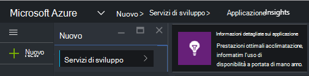
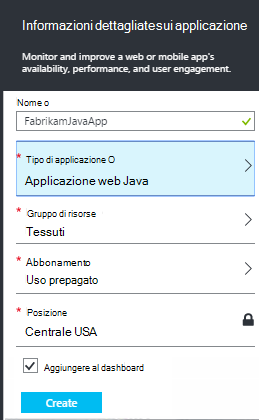
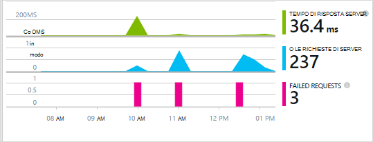
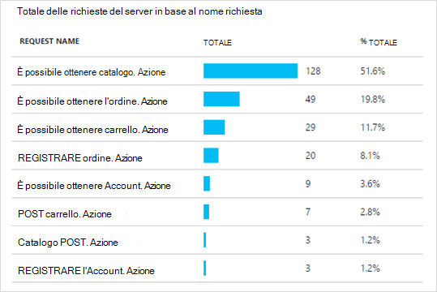
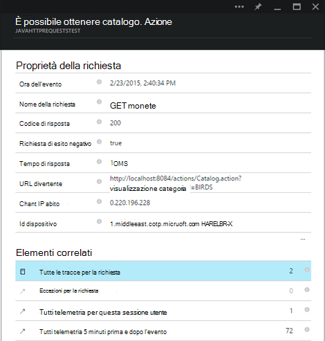

<properties 
    pageTitle="Informazioni dettagliate sui applicazione per Java web apps già presenti live" 
    description="Avviare un'applicazione web che è già in esecuzione nel server di monitoraggio" 
    services="application-insights" 
    documentationCenter="java"
    authors="alancameronwills" 
    manager="douge"/>

<tags 
    ms.service="application-insights" 
    ms.workload="tbd" 
    ms.tgt_pltfrm="ibiza" 
    ms.devlang="na" 
    ms.topic="article" 
    ms.date="08/24/2016" 
    ms.author="awills"/>
 
# Informazioni dettagliate sui applicazione per Java web apps già presenti live

*Informazioni dettagliate sui applicazione è in anteprima.*

Se si dispone di un'applicazione web che è già in esecuzione nel server J2EE, è possibile avviare Monitoraggio con [Informazioni dettagliate sui applicazione](app-insights-overview.md) senza la necessità di apportare modifiche al codice o ricompilare il progetto. Con questa opzione per informazioni su richieste HTTP inviate a server, le eccezioni non gestite e contatori.

È necessario un abbonamento a [Microsoft Azure](https://azure.com).

> [AZURE.NOTE] La procedura descritta in questa pagina aggiunge SDK all'app web in fase di esecuzione. Questa strumentazione runtime è utile se non si desidera aggiornare o ricompilare il codice sorgente. Ma, se possibile, invece è consigliabile è [aggiungere SDK al codice sorgente](app-insights-java-get-started.md) . Che offre altre opzioni, ad esempio la scrittura di codice per tenere traccia delle attività dell'utente.

## 1. ottenere una chiave di strumentazione approfondimenti applicazione

1. Accedere al [portale di Microsoft Azure](https://portal.azure.com)
2. Creare una nuova risorsa applicazione approfondimenti

    
3. Impostare il tipo di applicazione all'applicazione web Java.

    
4. Trovare la chiave strumentazione della nuova risorsa. È necessario incollare la chiave del progetto di codice subito.

    

## 2. scaricare SDK

1. Scaricare l' [applicazione approfondimenti SDK per Java](https://aka.ms/aijavasdk). 
2. Nel server, estrarre il contenuto SDK alla directory da cui vengono caricati i file binari di progetto. Se si usa Tomcat, questa directory è in genere in`webapps\<your_app_name>\WEB-INF\lib`

## 3. aggiungere un file xml approfondimenti applicazione

Creare ApplicationInsights.xml nella cartella in cui è stato aggiunto il SDK. Inserirvi XML riportato di seguito.

Sostituisce il tasto strumentazione ottenuto dal portale di Azure.

    <?xml version="1.0" encoding="utf-8"?>
    <ApplicationInsights xmlns="http://schemas.microsoft.com/ApplicationInsights/2013/Settings" schemaVersion="2014-05-30">

      <!-- The key from the portal: -->

      <InstrumentationKey>** Your instrumentation key **</InstrumentationKey>

      <!-- HTTP request component (not required for bare API) -->

      <TelemetryModules>
        <Add type="com.microsoft.applicationinsights.web.extensibility.modules.WebRequestTrackingTelemetryModule"/>
        <Add type="com.microsoft.applicationinsights.web.extensibility.modules.WebSessionTrackingTelemetryModule"/>
        <Add type="com.microsoft.applicationinsights.web.extensibility.modules.WebUserTrackingTelemetryModule"/>
      </TelemetryModules>

      <!-- Events correlation (not required for bare API) -->
      <!-- These initializers add context data to each event -->

      <TelemetryInitializers>
        <Add   type="com.microsoft.applicationinsights.web.extensibility.initializers.WebOperationIdTelemetryInitializer"/>
        <Add type="com.microsoft.applicationinsights.web.extensibility.initializers.WebOperationNameTelemetryInitializer"/>
        <Add type="com.microsoft.applicationinsights.web.extensibility.initializers.WebSessionTelemetryInitializer"/>
        <Add type="com.microsoft.applicationinsights.web.extensibility.initializers.WebUserTelemetryInitializer"/>
        <Add type="com.microsoft.applicationinsights.web.extensibility.initializers.WebUserAgentTelemetryInitializer"/>

      </TelemetryInitializers>
    </ApplicationInsights>

* Il tasto strumentazione inviato con tutti gli elementi di telemetria e indica approfondimenti applicazione per visualizzare la risorsa.
* Il componente richiesta HTTP è facoltativo. Invia automaticamente telemetria su richieste e i tempi di risposta al portale.
* Correlazione eventi è un componente aggiuntivo per il componente di richiesta HTTP. Assegna un identificatore a ogni richiesta ricevuta dal server e aggiunge l'identificatore come proprietà su tutti gli elementi di telemetria come la proprietà 'Operation.Id'. Consente di correlare telemetria associato a ogni richiesta mediante l'impostazione di un filtro di [ricerca diagnostica](app-insights-diagnostic-search.md).

## 4. aggiungere un filtro HTTP

Individuare e aprire il file Web di un progetto e unire seguente frammento di codice sotto il nodo web app in cui sono configurati i filtri di applicazione.

Per ottenere risultati migliori, il filtro deve essere mappato prima di tutti gli altri filtri.

    <filter>
      <filter-name>ApplicationInsightsWebFilter</filter-name>
      <filter-class>
        com.microsoft.applicationinsights.web.internal.WebRequestTrackingFilter
      </filter-class>
    </filter>
    <filter-mapping>
       <filter-name>ApplicationInsightsWebFilter</filter-name>
       <url-pattern>/*</url-pattern>
    </filter-mapping>

## 5. eccezioni firewall controllo

Potrebbe essere necessario [impostare le eccezioni per inviare i dati in uscita](app-insights-ip-addresses.md).

## 6. riavviare l'app web

## 7. visualizzare il telemetria in applicazione approfondimenti

Tornare alla risorsa di applicazione approfondimenti nel [portale di Microsoft Azure](https://portal.azure.com).

Viene visualizzato e il Panoramica telemetria sulle richieste HTTP. (Se non è presente, attendere alcuni secondi e quindi fare clic su Aggiorna.)

 

Fare clic sui grafici per visualizzare informazioni più dettagliate la metrica. 

 

E quando si visualizzano le proprietà di una richiesta, è possibile visualizzare gli eventi di telemetria associati, ad esempio le richieste e le eccezioni.
 

[Ulteriori informazioni sulle metriche.](app-insights-metrics-explorer.md)

## Passaggi successivi

* [Aggiungi telemetria alle pagine web](app-insights-web-track-usage.md) monitor pagina visualizzazioni e metriche utente.
* [Impostare i test web](app-insights-monitor-web-app-availability.md) per assicurarsi che l'applicazione rimane attivo e rispondere.
* [Acquisire le tracce di log](app-insights-java-trace-logs.md)
* [Log e ricerca eventi](app-insights-diagnostic-search.md) di diagnosticare i problemi.

 
