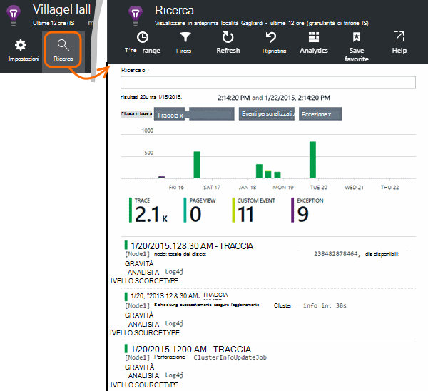

<properties 
    pageTitle="Esplorare linguaggio traccia dei registri nell'applicazione approfondimenti" 
    description="Ricerca Log4J o Logback tracce nell'applicazione approfondimenti" 
    services="application-insights" 
    documentationCenter="java"
    authors="alancameronwills" 
    manager="douge"/>

<tags 
    ms.service="application-insights" 
    ms.workload="tbd" 
    ms.tgt_pltfrm="ibiza" 
    ms.devlang="na" 
    ms.topic="article" 
    ms.date="07/12/2016" 
    ms.author="awills"/>

# Esplorare linguaggio traccia dei registri nell'applicazione approfondimenti

Se si usa Logback o Log4J (versione 1.2 o 2.0) per l'analisi, è possibile creare i registri di traccia automaticamente inviati a informazioni dettagliate sui applicazione che consente di esplorare e di eseguire una ricerca su di essi.

Installare [Applicazioni approfondimenti SDK per Java][java], se non è già che.

## Aggiungere librerie di registrazione al progetto

*Scegliere il modo più appropriato per il progetto.*

#### Se si usa Maven...

Se il progetto è già impostato per usare Maven per creare, unire uno dei seguenti frammenti di codice in un file pom.xml.

Quindi aggiornare le dipendenze di progetto per ottenere i file binari scaricati.

*Logback*

    <dependencies>
       <dependency>
          <groupId>com.microsoft.azure</groupId>
          <artifactId>applicationinsights-logging-logback</artifactId>
          <version>[1.0,)</version>
       </dependency>
    </dependencies>

*V 2.0 Log4J*

    <dependencies>
       <dependency>
          <groupId>com.microsoft.azure</groupId>
          <artifactId>applicationinsights-logging-log4j2</artifactId>
          <version>[1.0,)</version>
       </dependency>
    </dependencies>

*Versione 1.2 Log4J*

    <dependencies>
       <dependency>
          <groupId>com.microsoft.azure</groupId>
          <artifactId>applicationinsights-logging-log4j1_2</artifactId>
          <version>[1.0,)</version>
       </dependency>
    </dependencies>

#### Se si sta utilizzando Gradle...

Se il progetto è già impostato per usare Gradle per creare, aggiungere uno dei seguenti righe per il `dependencies` gruppo nel file build.gradle:

Quindi aggiornare le dipendenze di progetto per ottenere i file binari scaricati.

**Logback**

    compile group: 'com.microsoft.azure', name: 'applicationinsights-logging-logback', version: '1.0.+'

**V 2.0 Log4J**

    compile group: 'com.microsoft.azure', name: 'applicationinsights-logging-log4j2', version: '1.0.+'

**Versione 1.2 Log4J**

    compile group: 'com.microsoft.azure', name: 'applicationinsights-logging-log4j1_2', version: '1.0.+'

#### In caso contrario...

Scaricare ed estrarre appender appropriato e quindi aggiungere la raccolta appropriata al progetto:

Logger | Download | Raccolta
----|----|----
Logback|[SDK con Logback appender](https://aka.ms/xt62a4)|logback di registrazione applicationinsights
V 2.0 Log4J|[SDK con Log4J v2 appender](https://aka.ms/qypznq)|log4j2 di registrazione applicationinsights 
Versione 1.2 Log4j|[SDK con Log4J 1.2 appender](https://aka.ms/ky9cbo)|log4j1_2 di registrazione applicationinsights 

## Aggiungere il appender il framework di registrazione

Per iniziare a utilizzare le tracce, eseguire il merge importante frammento di codice per il file di configurazione Log4J o Logback: 

*Logback*

    <appender name="aiAppender" 
      class="com.microsoft.applicationinsights.logback.ApplicationInsightsAppender">
    </appender>
    <root level="trace">
      <appender-ref ref="aiAppender" />
    </root>

*V 2.0 Log4J*

    <Configuration packages="com.microsoft.applicationinsights.Log4j">
      <Appenders>
        <ApplicationInsightsAppender name="aiAppender" />
      </Appenders>
      <Loggers>
        <Root level="trace">
          <AppenderRef ref="aiAppender"/>
        </Root>
      </Loggers>
    </Configuration>

*Versione 1.2 Log4J*

    <appender name="aiAppender" 
         class="com.microsoft.applicationinsights.log4j.v1_2.ApplicationInsightsAppender">
    </appender>
    <root>
      <priority value ="trace" />
      <appender-ref ref="aiAppender" />
    </root>

Appenders approfondimenti applicazione è possibile fare riferimento da qualsiasi logger configurato e non necessariamente logger principale (come illustrato negli esempi di codice precedenti).

## Esplorare le tracce nel portale di applicazione approfondimenti

Dopo aver configurato il progetto per l'invio di tracce a informazioni dettagliate sui applicazione, è possibile visualizzare e cercare le tracce nel portale di informazioni dettagliate sui applicazione di [ricerca] [ diagnostic] blade.

## Passaggi successivi

[Ricerca di diagnostica][diagnostic]

<!--Link references-->

[diagnostic]: app-insights-diagnostic-search.md
[java]: app-insights-java-get-started.md

 
