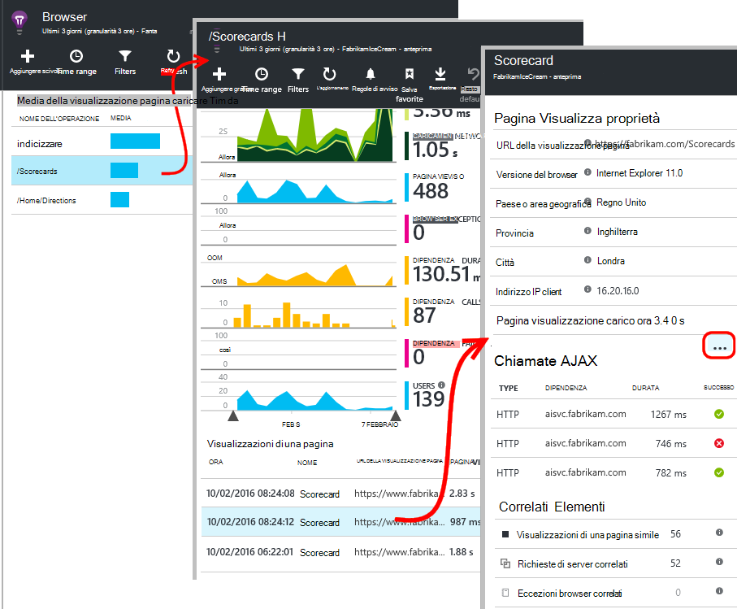
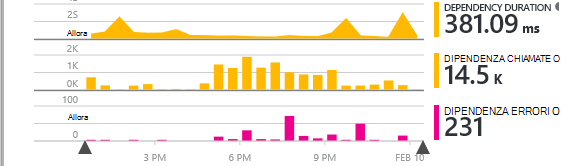

<properties
    pageTitle="Applicazione approfondimenti per JavaScript web App | Microsoft Azure"
    description="Ottenere pagina visualizzazione e sessione conteggi, dati di client web e tenere traccia dei criteri di utilizzo. Rilevare le eccezioni e problemi di prestazioni nelle pagine web JavaScript."
    services="application-insights"
    documentationCenter=""
    authors="alancameronwills"
    manager="douge"/>

<tags
    ms.service="application-insights"
    ms.workload="tbd"
    ms.tgt_pltfrm="ibiza"
    ms.devlang="na"
    ms.topic="get-started-article"
    ms.date="08/15/2016"
    ms.author="awills"/>

# Informazioni dettagliate sui applicazione per le pagine web

[AZURE.INCLUDE [app-insights-selector-get-started-dotnet](../../includes/app-insights-selector-get-started-dotnet.md)]

Scopri le prestazioni e l'uso della propria pagina web o app. Se si aggiunge Visual Studio applicazione approfondimenti allo script di pagina, è possibile ottenere gli intervalli di caricamento di pagina e le chiamate AJAX, conteggi e i dettagli degli eccezioni browser e gli errori di AJAX, nonché gli utenti e i conteggi sessione. Tutti questi elementi può essere segmentati pagina, sistema operativo del client e versione del browser, geografico posizione e le altre dimensioni. È anche possibile impostare gli avvisi sui numero di errori o ridurre la velocità di caricamento della pagina.

È possibile utilizzare l'applicazione approfondimenti tutte le pagine web: è sufficiente aggiungere brevi JavaScript. Se il servizio web [Java](app-insights-java-get-started.md) o [ASP.NET](app-insights-asp-net.md), è possibile integrare telemetria dal client e server.

È necessario un abbonamento a [Microsoft Azure](https://azure.com). Se il team dispone di una sottoscrizione dell'organizzazione, chiedere al proprietario di aggiungere l'Account Microsoft. Esiste un livello di prezzo gratuito, sviluppo e l'uso di piccole dimensioni alcun non costo.

## Configurare approfondimenti applicazione per la pagina web

Prima di tutto, è necessario aggiungere informazioni dettagliate sui applicazione alle pagine web? Si potrebbe già stato fatto. Se si sceglie di aggiungere informazioni dettagliate sui applicazione all'app web nella finestra di dialogo Nuovo progetto di Visual Studio, quindi è stato aggiunto uno. In questo caso, non è necessario eventuali altre operazioni.

In caso contrario, è necessario aggiungere un frammento di codice le pagine web, come indicato di seguito.

### Aprire una risorsa applicazione approfondimenti

La risorsa approfondimenti applicazione è in cui sono visualizzati dati sulle prestazioni e l'utilizzo della pagina. 

Accedere al [portale Azure](https://portal.azure.com).

Se è già stato configurato per l'app sul lato server di monitoraggio, si dispone già di una risorsa:

Se non si dispone di uno, crearla:

*Domande già?* [Altre informazioni sulle creazione di una risorsa](app-insights-create-new-resource.md).

### Aggiungere lo script SDK all'app o pagine web

In Guida introduttiva visualizzato lo script per le pagine web:

Inserire lo script immediatamente prima di `</head>` tag di ogni pagina che si desidera tenere traccia. Se il sito Web disponga di una pagina master, è possibile inserire lo script non esiste. Per esempio:

* In un progetto MVC ASP.NET, si preferisce pubblicarla`View\Shared\_Layout.cshtml`
* In un sito di SharePoint nel Pannello di controllo aprire [Impostazioni sito / pagina Master](app-insights-sharepoint.md).

Lo script contiene la chiave strumentazione che indirizza i dati per la risorsa approfondimenti applicazione. 

([Spiegazione più approfondita dello script.](http://apmtips.com/blog/2015/03/18/javascript-snippet-explained/))

*(Se si usa un quadro noto pagina web, cercare intorno a schede approfondimenti applicazione. Ad esempio, non esiste [un modulo AngularJS](http://ngmodules.org/modules/angular-appinsights).)*

## Dettagli della configurazione

Esistono diversi [parametri](https://github.com/Microsoft/ApplicationInsights-JS/blob/master/API-reference.md#config) personalizzabili, anche se nella maggior parte dei casi, è consigliabile non necessario. Ad esempio, è possibile disattivare o limitare il numero di chiamate Ajax riportati in visualizzazione pagina (per ridurre il traffico). Oppure è possibile impostare la modalità di debug per spostare rapidamente attraverso la pipeline senza essere batch telemetria.

Per impostare questi parametri, cercare la riga frammento di codice e aggiungere ulteriori elementi separati da virgola dopo tale voce:

    })({
      instrumentationKey: "..."
      // Insert here
    });

I [parametri disponibili](https://github.com/Microsoft/ApplicationInsights-JS/blob/master/API-reference.md#config) includono:

    // Send telemetry immediately without batching.
    // Remember to remove this when no longer required, as it
    // can affect browser performance.
    enableDebug: boolean,

    // Don't log browser exceptions.
    disableExceptionTracking: boolean,

    // Don't log ajax calls.
    disableAjaxTracking: boolean,

    // Limit number of Ajax calls logged, to reduce traffic.
    maxAjaxCallsPerView: 10, // default is 500

    // Time page load up to execution of first trackPageView().
    overridePageViewDuration: boolean,

    // Set these dynamically for an authenticated user.
    appUserId: string,
    accountId: string,

## Eseguire l'app

Eseguire un'applicazione web, Usa un po' di tempo per generare telemetria e attendere alcuni secondi. È possibile eseguirlo tramite il tasto **F5** nel computer di sviluppo o pubblicarlo e consentire agli utenti di riprodurre usarli.

Se si desidera controllare telemetria che invia all'applicazione approfondimenti un'app web, utilizzare gli strumenti di debug del browser (**F12** in molti browser). Dati vengono inviati a dc.services.visualstudio.com.

## Esplorare i dati sulle prestazioni del browser

Aprire e il browser per visualizzare dati sulle prestazioni aggregato dal browser degli utenti.

*Dati non ancora? Fare clic su * *aggiornare* * nella parte superiore della pagina. Ancora nulla? Vedere [risoluzione dei problemi](app-insights-troubleshoot-faq.md).*

E il browser è [blade metriche Explorer](app-insights-metrics-explorer.md) con le selezioni di grafico e filtri predefiniti. Se necessario, quindi Salva il risultato come preferito, è possibile modificare l'intervallo di tempo, filtri e configurazione di grafico. Fare clic su **Ripristina impostazioni predefinite** per tornare alla configurazione blade originale.

## Prestazioni di caricamento delle pagine

Nella parte superiore è un grafico segmentato dei tempi di caricamento delle pagine. L'altezza totale del grafico rappresenta il tempo medio di caricare e visualizzare le pagine dell'App nei browser degli utenti. Il tempo viene misurato da quando il browser invia la richiesta HTTP iniziale finché tutte icona del carico eventi sono stati elaborati, incluso layout e l'esecuzione di script. Non include attività asincrone, ad esempio il caricamento di web part da chiamate AJAX.

Il grafico segmenti i tempi di caricamento totale di pagine in [intervalli standard definiti da W3C](http://www.w3.org/TR/navigation-timing/#processing-model). 

Si noti che ora *la connessione di rete* spesso è inferiore a più del previsto, perché è una media su tutte le richieste dal browser al server. Molte richieste singoli hanno un tempo di connessione pari a 0 perché esiste già una connessione al server.

### Ridurre la velocità di caricamento?

Pagina lenta carichi sono una rilevante fonte problema relativo agli utenti. Se il grafico indica carichi pagina lenta, è facile eseguire alcune ricerche diagnostica.

Il grafico mostra la media di tutti i carichi di pagina nell'app. Per verificare se il problema è limitato a determinate pagine, esaminare ulteriormente verso il basso e il dove non c'è una griglia segmentata da URL della pagina:

Notare il numero totale di visualizzare pagine e la deviazione standard. Se il conteggio delle pagine è molto basso, quindi il problema non è che interessano gli utenti molto. Una deviazione standard elevata (comparabile alla media stesso) indica molte variazioni tra le misurazioni individuali.

**Applicare lo zoom in un URL e visualizzazione di una pagina.** Fare clic su qualsiasi nome della pagina per visualizzare una pala di grafici browser filtrata a tale URL. e quindi su un'istanza di una visualizzazione di pagina.

Fare clic su `...` per un elenco completo delle proprietà per l'evento o esaminare le chiamate Ajax e gli eventi correlati. Chiamate Ajax lente influenzano i tempi di caricamento pagina generale qualora siano icona del. Gli eventi correlati includono le richieste di server per lo stesso URL (se è stato configurato applicazione approfondimenti sul server web).

**Prestazioni di pagina nel tempo.** Tornare al e browser passare griglia della fase di caricamento visualizzazione pagina in un grafico a linee per verificare se si sono verificati picchi in determinati momenti:

**Segmento da altre dimensioni.** Ad esempio le pagine sono più lente da caricare in un determinato browser, sistema operativo del client o località utente? Aggiungere un nuovo grafico e sperimentare dimensione **Raggruppa per** .

## Prestazioni AJAX

Assicurarsi che le chiamate AJAX nelle pagine web sono soddisfacenti. Vengono spesso utilizzati per riempire le parti della pagina in modo asincrono. Anche se la pagina globale può caricare tempestivamente a Microsoft, gli utenti potrebbero frustrati dai veniva visualizzata vuota web part, in attesa per visualizzare i dati.

Le chiamate AJAX apportate dalla pagina web vengono visualizzate nella e browser come dipendenze.

Sono disponibili nella parte superiore della stessa e riepilogativo:

e dettagliate griglie inferiore:

Fare clic su una riga qualsiasi per informazioni dettagliate.

> [AZURE.NOTE] Se si elimina il filtro e il browser, server e le dipendenze AJAX sono inclusi in questi grafici. Fare clic su Ripristina per riconfigurare il filtro.

**Eseguire il drill-in non riuscite chiamate Ajax** scorrere fino a della griglia di errori di relazione e quindi fare clic su una riga per visualizzare le istanze specifiche.

Fare clic su `...` di telemetria completo per una chiamata Ajax.

### Nessuna chiamata Ajax segnalata?

Chiamate AJAX includono le chiamate HTTP inviate da uno script della pagina web. Se non è visibile loro segnalati, verificare che il frammento di codice non viene impostata la `disableAjaxTracking` o `maxAjaxCallsPerView` [parametri](https://github.com/Microsoft/ApplicationInsights-JS/blob/master/API-reference.md#config).

## Eccezioni browser

In e il browser, non vi è un grafico di riepilogo eccezioni e una griglia dei tipi di eccezione ulteriormente verso il basso e il.

Se le eccezioni browser segnalate non è visibile, verificare che il frammento di codice non viene impostata la `disableExceptionTracking` [parametro](https://github.com/Microsoft/ApplicationInsights-JS/blob/master/API-reference.md#config).

## Esaminare gli eventi di visualizzazione pagina singola

In genere telemetria visualizzazione pagina viene analizzata per informazioni dettagliate sui applicazione e viene visualizzato solo cumulativo report, Media di tutti gli utenti. Ma per il debug, è anche possibile cercare eventi visualizzazione singola pagina.

In e il ricerca diagnostica, impostare i filtri alla visualizzazione pagina.

Selezionare un evento per visualizzare più dettagli. Nella pagina dettagli fare clic su "…" per visualizzare ulteriori dettagli.

> [AZURE.NOTE] Se si utilizza [ricerca](app-insights-diagnostic-search.md), si noterà che è necessario parole intere: "Informa" e "bout" non corrispondono "Su".

È possibile utilizzare potente [linguaggio di query Analitica](app-insights-analytics-tour.md) anche eseguire la ricerca di pagine.

### Proprietà di visualizzazione della pagina

* **Durata della visualizzazione pagina** 

 * Per impostazione predefinita, il tempo necessario per caricare la pagina dal client la richiesta di pieno carico (inclusi i file supplementari ma esclusi asincrona attività quali chiamate Ajax). 
 * Se si imposta `overridePageViewDuration` nella [configurazione della pagina](#detailed-configuration), richiedere l'intervallo tra client per l'esecuzione del primo `trackPageView`. Se si sposta trackPageView dalla relativa posizione normale dopo l'inizializzazione dello script, verrà applicato a un valore diverso.
 * Se `overridePageViewDuration` impostata e una durata in viene specificato l'argomento di `trackPageView()` chiama, quindi viene utilizzato il valore dell'argomento. 

## Numero di pagina personalizzati

Per impostazione predefinita, il numero di pagina si verifica ogni volta che viene caricata una nuova pagina nel browser client.  Ma si potrebbe voler contare visualizzazioni pagina aggiuntiva. Ad esempio una pagina può visualizzare il contenuto nelle schede e si desidera contare una pagina quando si passa a schede. O codice JavaScript nella pagina può caricare il nuovo contenuto senza modificare l'URL del browser.

Inserire una chiamata JavaScript … nel punto appropriato nel codice del client:

    appInsights.trackPageView(myPageName);

Il nome della pagina può contenere i caratteri stesso come URL, ma tutti gli elementi presenti dopo "#" o "," verrà ignorata.

## Uso di verifica

Se si vuole scoprire cosa gli utenti con l'app?

* [Informazioni sull'utilizzo del rilevamento modifiche](app-insights-web-track-usage.md)
* [Informazioni su eventi personalizzati e metriche API](app-insights-api-custom-events-metrics.md).

#### Video: Controllo dell'utilizzo

> [AZURE.VIDEO tracking-usage-with-application-insights]

## Passaggi successivi

* [Tenere traccia dell'utilizzo](app-insights-web-track-usage.md)
* [Metrica ed eventi personalizzati](app-insights-api-custom-events-metrics.md)
* [Informazioni su compilazione misura](app-insights-overview-usage.md)

