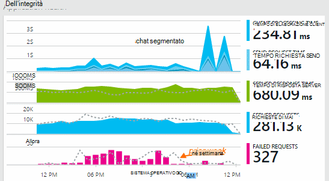

<properties 
    pageTitle="Esplorazione metriche di applicazione approfondimenti | Microsoft Azure" 
    description="Come interpretare i grafici in Esplora risorse metriche e come personalizzare pale metriche Esplora risorse." 
    services="application-insights" 
    documentationCenter=""
    authors="alancameronwills" 
    manager="douge"/>

<tags 
    ms.service="application-insights" 
    ms.workload="tbd" 
    ms.tgt_pltfrm="ibiza" 
    ms.devlang="na" 
    ms.topic="article" 
    ms.date="10/15/2016" 
    ms.author="awills"/>
 
# Esplorazione metriche di applicazione approfondimenti

Metriche di [Applicazione approfondimenti] [ start] sono valori misurati e i conteggi relativi eventi che vengono inviati in telemetria dall'applicazione in uso. Consentono di rilevare i problemi di prestazioni e guardare le tendenze in utilizzo dell'applicazione. Esiste una vasta gamma di metriche standard ed è anche possibile creare il proprio metriche personalizzate e gli eventi.

Conteggi metriche ed eventi vengono visualizzati nei grafici dei valori aggregati, ad esempio somme, medie o conteggi.

Ecco un grafico di esempio:

Alcuni grafici sono attestati: l'altezza totale del grafico in qualsiasi momento è la somma dei metriche visualizzate. La legenda per impostazione predefinita mostra le quantità più grande.

Linee tratteggiate riportano il valore della metrica di una settimana in precedenza.

## Intervallo di tempo

È possibile modificare l'intervallo di tempo rientrano il grafico o una griglia in qualsiasi blade.

Se si aspetta alcuni dati che non è ancora disponibile, fare clic su Aggiorna. Grafici aggiornamento intervalli, ma gli intervalli sono più per gli intervalli di tempo più grandi. In modalità di rilascio, può richiedere un po' di tempo per i dati in arrivo nella pipeline di analisi in un grafico.

Per applicare lo zoom in parte di un grafico, trascinare su di esso:

Fare clic sul pulsante Annulla Zoom per ripristinarlo.

## Valori granularità e punto

Posizionare il puntatore del mouse sul grafico per visualizzare i valori dei criteri di misurazione a questo punto.

Il valore di unità di misura metriche in un determinato è aggregato nell'intervallo di esempio precedente. 

L'intervallo di campioni o "granularità" viene visualizzata nella parte superiore e il. 

È possibile regolare la granularità e l'intervallo di tempo:

Granularità disponibili dipendono dell'intervallo di tempo selezionato. Granularità espliciti sono alternative a granularità "automatica" per l'intervallo di tempo. 

## Esplora metriche

Fare clic sui grafici in e il Panoramica per visualizzare un set di informazioni più dettagliato di grafici correlati e griglie. È possibile modificare questi grafici e le griglie per concentrarsi su dettagli che interessa.

O può fare clic sul pulsante di Explorer metriche nell'intestazione della stessa e Panoramica.

Ad esempio, fare clic su tramite grafico richieste non riuscite dell'applicazione web:

## Che cosa significano le cifre?

La legenda sul lato per impostazione predefinita indica in genere il valore aggregato durante il periodo del grafico. Se si passa il mouse sopra il grafico, viene visualizzato il valore a questo punto.

Ogni punto dati del grafico è un'aggregazione dei valori dei dati ricevuti dell'intervallo di esempio precedente "granularità". La granularità viene visualizzata nella parte superiore e il e varia in base alla scala cronologica complessiva del grafico.

Metrica può essere aggregata in diversi modi: 

 * **Somma** somma i valori dei punti dati ricevuti tramite l'intervallo di campioni o il punto del grafico.
 * **Media** divide la somma del numero di punti dati ricevuti nell'intervallo.
 * **Valore univoco** conteggi vengono utilizzati per conteggi degli account utente e. Nell'intervallo di campioni o nel periodo del grafico, la figura mostra il numero di utenti diversi visualizzate in quel momento.

È possibile modificare il metodo di aggregazione:

Il metodo predefinito per ogni unità di misura metriche viene visualizzato quando si crea un nuovo grafico o quando sono deselezionate metriche tutti:

## Modifica di grafici e griglie

Per aggiungere un nuovo grafico a e il:

Scegliere **Modifica** in un grafico di nuovo o esistente per modificare viene illustrato:

Se esistono restrizioni sulle combinazioni di che possono essere visualizzate insieme, è possibile visualizzare più unità di misura metriche in un grafico. Non appena si sceglie una sola unità di misura metriche, alcuni degli altri sono disabilitati. 

Se si codificati [metriche personalizzate] [ track] in un'applicazione (chiamate a TrackMetric e TrackEvent) saranno elencati qui.

## Segmento dei dati

È possibile dividere una metrica dalla proprietà, ad esempio, per confrontare le visualizzazioni di pagina nei client con sistemi operativi diversi. 

Selezionare un grafico o una griglia, passare raggruppamento e selezionare una proprietà per Raggruppa per:

> [AZURE.NOTE] Quando si utilizza il raggruppamento, i tipi di grafici ad Area e di grafico a barre forniscono una visualizzazione in pila. Questa caratteristica è adatto in cui il metodo di aggregazione Somma. Ma in cui il tipo di aggregazione Media, scegliere i tipi di visualizzazione di riga o una griglia. 

Se si codificati [metriche personalizzate] [ track] in un'applicazione e includono valori di proprietà, sarà possibile selezionare la proprietà nell'elenco.

Il grafico è troppo piccolo per segmentata dei dati? Regolare l'altezza:

## Filtrare i dati

Per visualizzare solo le metriche per un set di valori di proprietà selezionato:

Se non si seleziona tutti i valori per una determinata proprietà, è diverso da quello di selezionarli tutti: non c'è alcun filtro su tale proprietà.

Notare il numero di eventi insieme a ogni valore di proprietà. Quando si selezionano i valori di una proprietà, i conteggi insieme a altri valori di proprietà vengono modificati.

Filtri si applicano a tutti i grafici nel blade. Se si vuole diversi filtri applicati a diversi grafici, creare e salvare pale metriche diverse. Se si desidera, è possibile aggiungere grafici dai diversi pale al dashboard, in modo da poterli vedere insieme a tra loro.

### Rimuovere il traffico di test bot e web

Utilizzare il filtro **il traffico reale o sintetico** e controllare **reali**.

È inoltre possibile filtrare **dall'origine del traffico sintetico**.

### Per aggiungere proprietà all'elenco del filtro

Si desidera filtrare telemetria su una categoria di propria scelta? Ad esempio, forse si divide un utenti in categorie diverse e si desidera segmento i dati da queste categorie.

[Creare proprietà personalizzate](app-insights-api-custom-events-metrics.md#properties). Impostarlo in un [Inizializzatore di telemetria](app-insights-api-custom-events-metrics.md#telemetry-initializers) affinché venga visualizzato in tutti telemetria - inclusi telemetria standard provenienti dai diversi moduli SDK.

## Modificare il tipo di grafico

Si noti che è possibile passare tra le griglie e grafici:

## Salvare il blade metriche

Dopo avere creato alcuni grafici, salvarli come preferito. Se si desidera condividere con altri membri del team, è possibile scegliere se si utilizza un account dell'organizzazione.

Per vedere e il nuovo, **passare a e il Panoramica** e aprire Preferiti:

Se si è scelto di intervallo di tempo relativo al momento del salvataggio, e il verrà aggiornato con le metriche più recente. Se si è scelto di intervallo di tempo assoluto, verrà visualizzato gli stessi dati ogni volta.

## Reimpostazione e il

Se si modifica una pala ma quindi che si desidera tornare alla cella originale salvata set, basta fare clic su Reimposta.

## Flusso metriche Live: immediate metriche per il monitoraggio Chiudi

Flusso metriche Live viene dai parametri di applicazione a questo momento, con una latenza in tempo reale più vicino di 1 secondo. Si tratta estremamente utile quando si sta rilasciando una nuova compilazione e si desidera verificare che tutto sia funzionare come previsto, o dell'analisi di un incidente in tempo reale.

Diversamente da quanto succede metriche Esplora Live metriche flusso Visualizza una serie fissa di metriche. I dati vengono conservati solo per, purché sia del grafico e viene eliminata. 

Non è disponibile con SDK approfondimenti applicazione per la versione 2.1.0 ASP.NET Live metriche flusso o versione successiva.

## Impostare avvisi

Per ricevere una notifica tramite posta elettronica di insolito valori di qualsiasi metrica, aggiungere un avviso. È possibile scegliere l'opzione per inviare il messaggio di posta elettronica per gli amministratori di account o gli indirizzi di posta elettronica specifico.

[Altre informazioni sugli avvisi][alerts].

## Esporta in Excel

È possibile esportare dati metrici che viene visualizzati in unità di misura metriche soluzioni in un file di Excel. I dati esportati includono i dati da tutti i grafici e tabelle visto nel portale. 

I dati relativi a ogni grafico o tabella viene esportati in un foglio separato nel file di Excel.

Che cos' vedere cosa viene esportato. Modificare l'intervallo di tempo o filtri se si desidera modificare l'intervallo di dati esportati. Per le tabelle, se viene visualizzato il comando **caricare più** , è possibile scegliere prima di scegliere Esporta, per ottenere ulteriori dei dati esportati.

*Esportare funziona solo per Internet Explorer e Chrome attualmente. Stiamo lavorando sull'aggiunta di supporto per altri browser.*

## Esportazione continuo

Se si vuole dati continuamente esportati in modo che possano essere elaborati esternamente, è preferibile [esportare continua](app-insights-export-telemetry.md).

### Power BI

Se si desidera arricchire visualizzazioni dei dati, è possibile [esportare in Power BI](http://blogs.msdn.com/b/powerbi/archive/2015/11/04/explore-your-application-insights-data-with-power-bi.aspx).

## Analitica

[Analitica](app-insights-analytics.md) è un modo più versatile per analizzare il telemetria utilizzando un linguaggio di query avanzate. Da usare se si desidera combinare o calcolare i risultati dalle metriche oppure eseguire un'esplorazione in deph delle prestazioni recenti dell'applicazione. Usare Esplora metriche mano, se si desidera che l'aggiornamento automatico, grafici del dashboard e avvisi.

## Risoluzione dei problemi

*Non è visualizzato uno qualsiasi dei dati nel grafico.*

* Filtri si applicano a tutti i grafici e il. Assicurarsi che, mentre sta concentrarsi su un grafico, non è stato impostato un filtro che esclude tutti i dati in un altro. 

    Se si desidera impostare i filtri diversi per diversi grafici, crearli nello pale diversi, salvarli come separate Preferiti. Se si desidera, è possibile aggiungerli al dashboard in modo da poterli vedere insieme a tra loro.

* Se si raggruppa un grafico da una proprietà non è definita nella metrica, quindi verrà alcun elemento del grafico. Provare a cancellare "Raggruppa per" o scegliere una proprietà di raggruppamento diverso.
* Dati sulle prestazioni (CPU, frequenza IO e così via) è disponibile per Java servizi web, Windows App desktop, [IIS web App e servizi se si installa controllo dello stato](app-insights-monitor-performance-live-website-now.md)e [Servizi Cloud Windows Azure](app-insights-azure.md). Non è disponibile per i siti Web Azure.

## Passaggi successivi

* [Monitorare l'utilizzo con informazioni dettagliate sui applicazione](app-insights-overview-usage.md)
* [Funzionalità di ricerca diagnostica](app-insights-diagnostic-search.md)

<!--Link references-->

[alerts]: app-insights-alerts.md
[start]: app-insights-overview.md
[track]: app-insights-api-custom-events-metrics.md

 