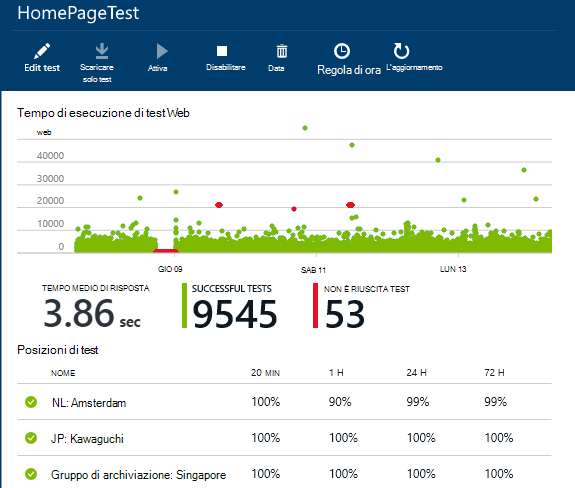
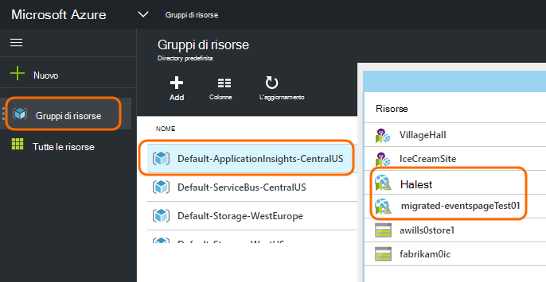
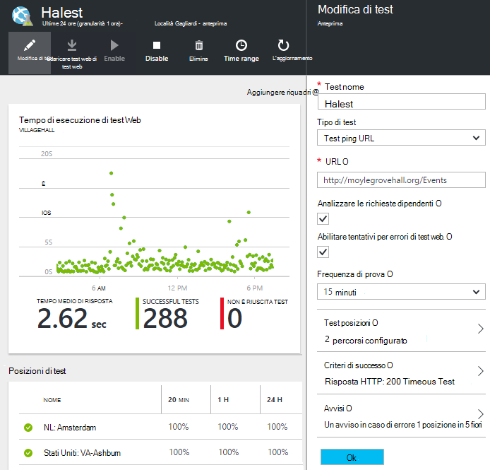

<properties 
    pageTitle="Eseguire la migrazione di Azure Endpoint applicazione approfondimenti disponibilità test" 
    description="Migrazione di test di Azure Endpoint monitoraggio classico in applicazione approfondimenti disponibilità verifica da 31 ottobre 2016."
    services="application-insights" 
    documentationCenter=""
    authors="soubhagyadash" 
    manager="douge"/>

<tags 
    ms.service="application-insights" 
    ms.workload="tbd" 
    ms.tgt_pltfrm="ibiza" 
    ms.devlang="na" 
    ms.topic="article" 
    ms.date="07/25/2016" 
    ms.author="awills"/>
 
# Spostamento da Endpoint Azure monitoraggio ai test la disponibilità di informazioni approfondite applicazione

Si utilizza [il monitoraggio Endpoint](https://blogs.msdn.microsoft.com/mast/2013/03/03/windows-azure-portal-update-configure-web-endpoint-status-monitoring-preview/) per le app di Azure? Tramite *il 31 ottobre 2016*, è verranno sostituite con i nuovi e più potenti [test disponibilità](app-insights-monitor-web-app-availability.md). È già stata creata alcuni dei nuovi test, anche se è disabilitate finché il 31 ottobre 2016. 

È possibile modificare i nuovi test ed eseguire il parametro personalmente se si desidera. Loro [portale Azure](https://portal.azure.com) sono disponibili nel gruppo di risorse CentralUS di ApplicationInsights predefinito.

## Quali sono i test di disponibilità?

Il test della disponibilità è una funzionalità di Azure che verifica continuamente che qualsiasi servizio o il sito web sia alto e in esecuzione inviando richieste per il (ping singola o Visual Studio web prove) da un massimo di 16 posizioni in tutto il mondo. 

Nel [portale di Azure classico](https://manage.windowsazure.com), questi test chiamati Endpoint monitoraggio. Era più limitato nell'ambito. Nuovi test di disponibilità sono un notevole miglioramento:

* Fino a 10 Visual Studio web o ping prove per risorsa approfondimenti applicazione. 
* Fino a 16 posizioni in tutto il mondo di inviare richieste di test a un'applicazione web. Maggiore controllo di criteri di successo di test. 
* Testare qualsiasi servizio - non appena Azure web App o un sito web.
* Test tentativi: ridurre gli avvisi di falso positivo a causa di problemi di rete temporanei. 
* Webhooks possibile ricevere notifiche tramite HTTP POST per gli avvisi.

Per ulteriori informazioni su [Verifica disponibilità qui](app-insights-monitor-web-app-availability.md).

Verifica disponibilità fanno parte di [Visual Studio applicazione approfondimenti](app-insights-overview.md), che è un servizio analitica extensible per tutte le applicazioni web.

## Cosa succede al mio endpoint test così?

* È stata copiata l'endpoint monitoraggio test per i nuovi test la disponibilità di informazioni approfondite dell'applicazione.
* Nuovi test di disponibilità sono disabilitati e i test Endpoint precedenti sono ancora in esecuzione.
* Invio di avvisi di regole *non* sono stati migrati. Nuovi test inizialmente impostati con una regola predefinita:
 * Trigger quando più di 1 punto segnalati errori 5 minuti.
 * Invia messaggio di posta elettronica per gli amministratori di sottoscrizione.

Nel [portale di Azure](https://portal.azure.com), è possibile trovare i test migrati nel gruppo di risorse "CentralUS di ApplicationInsights predefinito". I nomi di test sono prefisso "Migrated-". 

## Che cos'è necessario eseguire?

* Notato è in esecuzione della migrazione di test, i nuovi test di disponibilità sono [facili da configurare](app-insights-monitor-web-app-availability.md).

### Opzione a: eseguire alcuna operazione. Lasciare la casella a Microsoft.

**In 31 ottobre 2016,** è necessario:

* Disabilitare i test endpoint precedente.
* Abilitare i test di disponibilità migrati.

### Opzione b: È gestire e/o abilitare i test di nuovi.

* Rivedere e modificare la disponibilità di nuovi test nel nuovo [portale Azure](https://portal.azure.com). 
 * Esaminare i criteri di trigger
 * Rivedere i destinatari del messaggio di posta elettronica
* Abilitare i test di nuovi
* Verrà disabilitata l'endpoint legacy monitoraggio prove su 31 ottobre 2016 

### Opzione c: rifiutare esplicitamente l'

Se non si desidera utilizzare i test di disponibilità, è possibile eliminarli nel [portale di Azure](https://portal.azure.com). È inoltre disponibile un collegamento nella parte inferiore dei messaggi di posta elettronica di notifica.

È ancora verranno eliminati i test endpoint vecchio su 31 ottobre 2016. 

## Come modificare nuovi test?

Accedere al [portale di Azure](https://portal.azure.com) e cercare i test web 'Migrated-': 

Modifica e/o di attivare il test:

## Cosa è dovuto?

Servizio migliore. Il servizio endpoint precedente non è più ristretto. È possibile fornire solo due URL per il test di ping semplici da 3 posizioni geografico un'App web o macchine Virtuali di Azure. Nuovi test è possibile eseguire test di più passaggi web da tutte le 16 posizioni ed è possibile specificare fino a 10 test per un'applicazione. È possibile testare qualsiasi URL: non è necessario essere un sito di Azure.

Nuovi test sono configurati separatamente dal web app o macchine Virtuali che si sta verificando. 

Migrazione avviene test per assicurarsi che continui ad avere controllo su di esse durante l'uso di nuovo portale. 

## Che cos'è approfondimenti applicazione?

I nuovi test disponibilità fanno parte di [Visual Studio applicazione approfondimenti](app-insights-overview.md). Ecco un [video 2 minuti](http://go.microsoft.com/fwlink/?LinkID=733921).

## Sto pagando nuovi test?

Test migrati siano configurati in una risorsa applicazione approfondimenti nel piano del gratuito predefinito. In questo modo insieme fino a 5 milioni di punti di dati. Che copre facilmente il volume di dati che test utilizzerà attualmente. 

Naturalmente, se come applicazione approfondimenti e creare ulteriori test di disponibilità o adottare più il monitoraggio delle prestazioni e le funzionalità di diagnostica, è necessario generare ulteriori punti di dati.  Tuttavia, il risultato verrebbe che potrebbero raggiunto la quota per il piano gratuito. Non si riceveranno un effetto a meno che non si scelga di piani Standard o Premium. 

[Ulteriori informazioni sull'applicazione informazioni dettagliate sui prezzi e il monitoraggio delle quote](app-insights-pricing.md). 

## Che cos'è e non viene eseguita la migrazione?

Mantenuti da test endpoint precedente:

* URL di endpoint da testare.
* Geografico posizioni da cui vengono inviate le richieste.
* Frequenza di prova rimane 5 minuti.
* Timeout test rimane 30 secondi. 

Non viene eseguita la migrazione:

* Regola di trigger avviso. La regola che e abbiamo impostato trigger quando 1 percorso segnalati errori 5 minuti.
* Destinatari degli avvisi. Messaggi di posta elettronica notifica verrà inviate per l'abbonamento a proprietari e CO. 

## Come è possibile trovare nuovi test?

Se si desidera, è possibile modificare uno dei nuovi test a questo punto. Accedere al [portale di Azure](https://portal.azure.com), aprire **Gruppi di risorse** e selezionare **CentralUS di ApplicationInsights predefinito**. Nel gruppo, sono disponibili nuovi test web. [Informazioni sui nuovi test di disponibilità](app-insights-monitor-web-app-availability.md).

Si noti che i nuovi messaggi di posta elettronica degli avvisi verranno inviati da questo indirizzo: App approfondimenti avvisi(ai-noreply@microsoft.com)

## Cosa succede se non eseguire alcuna operazione?

Opzione A verrà applicata. Si verrà abilitare i test migrati e configurare le regole di avviso predefinito come descritto in precedenza. È necessario aggiungere le regole di avviso personalizzate, i destinatari come descritto in precedenza. Verrà disabilitata l'endpoint legacy monitoraggio test. 

## Nel punto in cui è possibile inviare commenti e suggerimenti su questo? 

Grazie per i commenti. Effettuare [l'e-mail](mailto:vsai@microsoft.com). 

