<properties
    pageTitle="Diagnosticare i problemi di prestazioni in un sito Web IIS in esecuzione | Microsoft Azure"
    description="Monitoraggio delle prestazioni di un sito Web senza distribuirlo nuovamente. Utilizzare autonoma o con applicazione approfondimenti SDK per ottenere telemetria dipendenza."
    services="application-insights"
    documentationCenter=".net"
    authors="alancameronwills"
    manager="douge"/>

<tags
    ms.service="application-insights"
    ms.workload="tbd"
    ms.tgt_pltfrm="ibiza"
    ms.devlang="na"
    ms.topic="get-started-article"
    ms.date="10/24/2016"
    ms.author="awills"/>

# Strumento web App in fase di esecuzione con informazioni dettagliate sui applicazione

*Informazioni dettagliate sui applicazione è in anteprima.*

È possibile dotare un'app web live con Visual Studio applicazione approfondimenti, senza dover modificare o ridistribuire il codice. Nelle applicazioni ospitate da un server IIS locale, l'installazione di Monitor di stato. oppure se Azure web App o esecuzione in una macchina virtuale Azure, è possibile installare l'estensione approfondimenti applicazione. (Sono disponibili anche separati articoli relativi a Strumentazione [live J2EE web App](app-insights-java-live.md) e [Servizi Cloud Windows Azure](app-insights-cloudservices.md).)

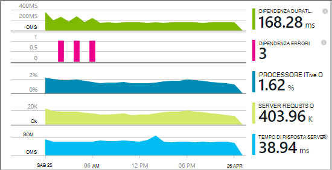

È possibile scegliere di tre route applicare approfondimenti applicazione alle applicazioni web .NET:

* **Ora compilazione:** [Aggiungere le informazioni approfondite applicazione SDK] [greenbrown] al codice web app. 
* **Fase di esecuzione:** Dotare un'applicazione web sul server, come descritto di seguito, senza ricompilare e ridistribuire il codice.
* **Entrambi:** Creare SDK nel codice web app e applicare anche le estensioni in fase di esecuzione. Ottenere il massimo di entrambe le opzioni. 

Di seguito è riportato un riepilogo di ottenere da ogni route:

||Creare ora|Fase di esecuzione|
|---|---|---|
|Le richieste ed eccezioni|Sì|Sì|
|[Eccezioni più dettagliate](app-insights-asp-net-exceptions.md)||Sì|
|[Diagnostica dipendenza](app-insights-asp-net-dependencies.md)|In .NET 4.6 +|Sì|
|[Contatori delle prestazioni di sistema](app-insights-performance-counters.md)||IIS o Azure servizio cloud, non Azure web app|
|[API per telemetria personalizzato][api]|Sì||
|[Integrazione di traccia dei log](app-insights-asp-net-trace-logs.md)|Sì||
|[Dati di visualizzazione e utente della pagina](app-insights-javascript.md)|Sì||
|Non è necessario rigenerare codice|No||

## Dotare un'applicazione web in fase di esecuzione

È necessario un abbonamento a [Microsoft Azure](http://azure.com) .

### Se l'app è un'app web Azure o un servizio Cloud

* Selezionare applicazione approfondimenti nel Pannello di controllo dell'applicazione in Azure. 

    [Altre informazioni](app-insights-azure.md).

### Se l'app viene ospitato nel server IIS

1. Nel server web IIS, accedere con le credenziali di amministratore.
2. Scaricare ed eseguire il [programma di installazione di controllo dello stato](http://go.microsoft.com/fwlink/?LinkId=506648).
4. Nell'installazione guidata, accedere a Microsoft Azure.

    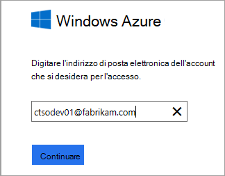

    *Errori di connessione? Vedere [risoluzione dei problemi](#troubleshooting).*

5. Selezionare l'applicazione web installati o sito Web che si desidera eseguire il monitoraggio e quindi configurare la risorsa in cui si desidera visualizzare i risultati nel portale di informazioni approfondite dell'applicazione.

    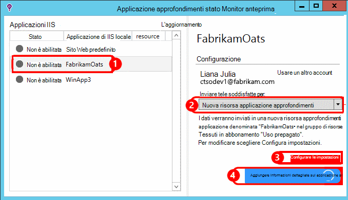

    In genere si sceglie di configurare una nuova risorsa e un [gruppo di risorse][roles].

    In caso contrario, utilizzare una risorsa esistente se è già stato configurato [test web] [ availability] per un sito o [monitoraggio dei client web][client].

6. Riavviare IIS.

    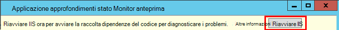

    Verrà interrotto il servizio web per un po' di tempo breve.

6. Si noti che ApplicationInsights.config è stato inserito in web App che si desidera eseguire il monitoraggio.

    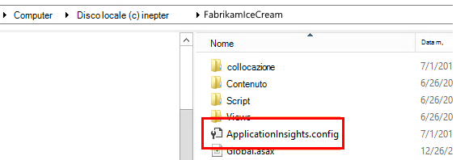

   Esistono alcune modifiche relative alla config.

#### Se si vuole (re) configurare in un secondo momento?

Dopo aver completato la procedura guidata, è possibile configurare nuovamente l'agente di ogni volta che vuole. È anche possibile utilizzare questo se è stato installato l'agente ma si è verificato un caso di problemi con l'installazione e configurazione iniziali.

## Visualizzazione delle prestazioni telemetria

Accedere al [portale di Azure](https://portal.azure.com), l'esplorazione approfondimenti applicazione e aprire la risorsa è stato creato.

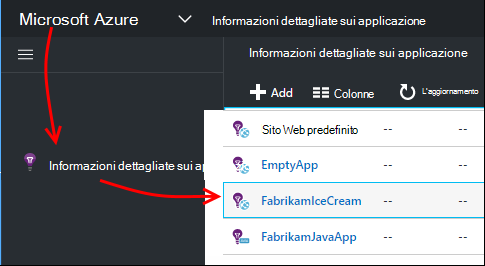

Aprire e il prestazioni la richiesta, il tempo di risposta, dipendenza e altri dati.

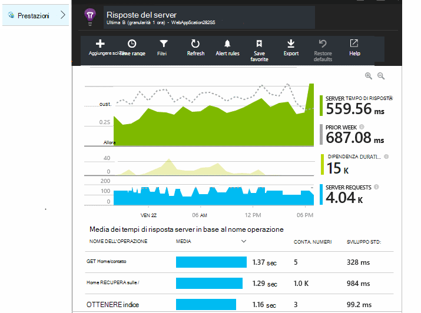

Fare clic su uno di essi per aprire una visualizzazione più dettagliata.

È possibile [Modifica, ridisporre, salvare](app-insights-metrics-explorer.md), e aggiungere grafici o elementi grafici e il tutto a un [dashboard](app-insights-dashboards.md).

## Dipendenze

Durata relazione Mostra il tempo impiegato dal chiamate dell'App a componenti esterni, ad esempio database, API REST o archiviazione blob Azure.

Per segmento del grafico da chiamate a dipendenze diverse: modificare il grafico, attivare il raggruppamento e quindi raggruppare per dipendenza, tipo di relazione o dipendenza prestazioni.

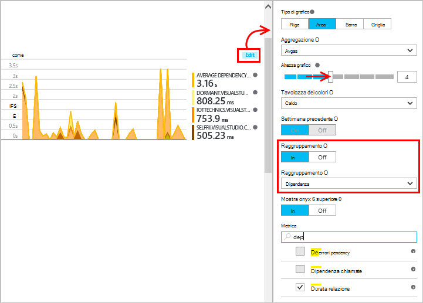

## Contatori delle prestazioni 

(Non per le applicazioni web Azure.) Fare clic su server in e il Panoramica per visualizzare grafici server contatori delle prestazioni, ad esempio l'utilizzo della CPU memoria e all'occupazione finale.

Se si dispone di più istanze di server, è consigliabile modificare i tipi di grafici per il raggruppamento istanza del ruolo.

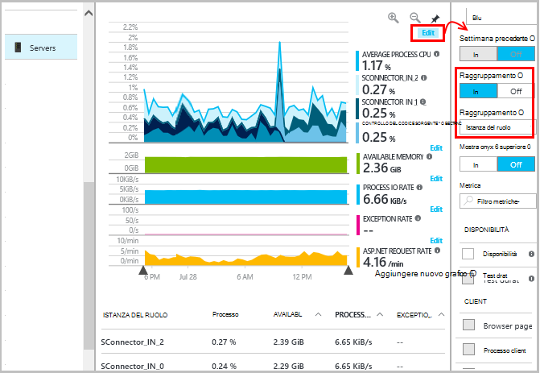

È inoltre possibile [modificare il set di contatori che vengono segnalati da SDK](app-insights-configuration-with-applicationinsights-config.md#nuget-package-3). 

## Eccezioni

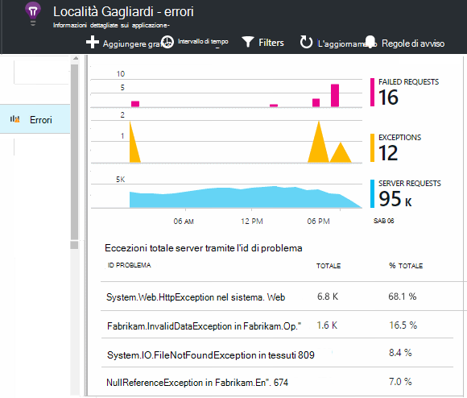

È possibile eseguire il drill-down eccezioni specifiche (negli ultimi sette giorni) e ottenere analisi dello stack e dati di contesto.

## Esempio

Se l'applicazione invia una grande quantità di dati e si utilizza SDK approfondimenti di applicazione per ASP.NET versione 2.0.0-beta3 o versioni successive, la caratteristica di adattamento campioni potrebbe funzionare e inviare solo una percentuale del telemetria. [Ulteriori informazioni su campioni.](app-insights-sampling.md)

## Risoluzione dei problemi

### Errori di connessione

È necessario aprire [alcune porte in uscita](app-insights-ip-addresses.md#outgoing-ports) nei firewall del server per consentire il controllo dello stato per l'uso.

### Nessun telemetria?

  * Utilizzare il sito per generare alcuni dati.
  * Attendere alcuni minuti per consentire i dati vengono inseriti, quindi fare clic su **Aggiorna**.
  * Aprire la ricerca diagnostica (il riquadro di ricerca) per visualizzare i singoli eventi. Eventi spesso sono visibili nella ricerca diagnostica prima che venga visualizzato aggregare i dati nei grafici.
  * Aprire controllo dello stato e selezionare l'applicazione nel riquadro sinistro. Verificare se sono presenti tutti i messaggi di diagnostica per questa applicazione nella sezione "Configurazione notifiche":

  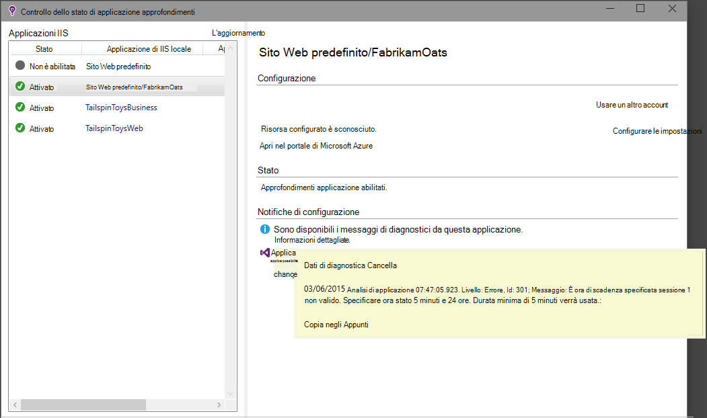

  * Verificare che il firewall server consenta il traffico in uscita sulle porte sopra elencati.
  * Sul server, se viene visualizzato un messaggio relativo "autorizzazioni sufficienti", provare a eseguire le operazioni seguenti:
    * In Gestione IIS, selezionare il pool di applicazioni, aprire **Impostazioni avanzate**e nel **Modello di processo** nota sull'identità.
    * Nel Pannello di controllo di gestione dei Computer, aggiungere l'identità al gruppo Performance Monitor Users.
  * Se si dispone MMA/SCOM installato sul server, alcune versioni possono generare conflitti. Disinstallare SCOM e monitorare lo stato e reinstallare le versioni più recenti.
  * Vedere [risoluzione dei problemi][qna].

## Requisiti di sistema

Sistemi operativi supportati per applicazione approfondimenti stato Monitor nel Server:

- Windows Server 2008
- Windows Server 2008 R2
- Windows Server 2012
- Server di Windows 2012 R2

con SP e .NET Framework 4.0 e 4.5 più recenti

Sul lato client Windows 7, 8 e 8.1, con .NET Framework 4.0 e 4.5

Il supporto di IIS: IIS 7 7.5, 8, 8.5 (IIS è necessario)

## Automazione con PowerShell

È possibile avviare e arrestare il monitoraggio tramite PowerShell sul server IIS.

Prima di tutto importare il modulo approfondimenti applicazione:

`Import-Module 'C:\Program Files\Microsoft Application Insights\Status Monitor\PowerShell\Microsoft.Diagnostics.Agent.StatusMonitor.PowerShell.dll'`

Scoprire quali App sono che si sta controllando:

`Get-ApplicationInsightsMonitoringStatus [-Name appName]`

* `-Name`(Facoltativo) Il nome di un'app web.
* Visualizza le informazioni approfondite applicazione monitoraggio stato per ogni web app (o app denominato) in questo server IIS.

* Restituisce `ApplicationInsightsApplication` per ogni app:
 * `SdkState==EnabledAfterDeployment`: App si sta controllando e stato strumentazione in fase di esecuzione per lo strumento di controllo dello stato o per `Start-ApplicationInsightsMonitoring`.
 * `SdkState==Disabled`: Per informazioni dettagliate sui applicazione non strumentazione l'app. È non stato mai strumentazione o in fase di esecuzione monitoraggio disabilitato con lo strumento di controllo dello stato o con `Stop-ApplicationInsightsMonitoring`.
 * `SdkState==EnabledByCodeInstrumentation`: L'app è stata strumentazione aggiungendo SDK al codice sorgente. Il SDK non è aggiornato o interrotto.
 * `SdkVersion`Mostra la versione in uso per il monitoraggio dell'app.
 * `LatestAvailableSdkVersion`Mostra la versione attualmente disponibile nella raccolta di NuGet. Per aggiornare l'app in questa versione, utilizzare `Update-ApplicationInsightsMonitoring`.

`Start-ApplicationInsightsMonitoring -Name appName -InstrumentationKey 00000000-000-000-000-0000000`

* `-Name`Il nome dell'applicazione in IIS
* `-InstrumentationKey`Ikey della risorsa applicazione approfondimenti in cui si desidera i risultati da visualizzare.

* Questo cmdlet riguarda solo le applicazioni che non sono già strumentazione - vale a dire SdkState = = NotInstrumented.

    Il cmdlet non ha alcun effetto un'app già strumentazione, in fase di compilazione mediante l'aggiunta di SDK al codice o in fase di esecuzione da una precedente utilizzare questo cmdlet.

    La versione SDK utilizzata per dotare l'app è la versione più recente è stata scaricata per questo server.

    Per scaricare la versione più recente, utilizzare ApplicationInsightsVersion di aggiornamento.

* Restituisce `ApplicationInsightsApplication` successo. In caso contrario, registrare una traccia stderr.

    
          Name                      : Default Web Site/WebApp1
          InstrumentationKey        : 00000000-0000-0000-0000-000000000000
          ProfilerState             : ApplicationInsights
          SdkState                  : EnabledAfterDeployment
          SdkVersion                : 1.2.1
          LatestAvailableSdkVersion : 1.2.3

`Stop-ApplicationInsightsMonitoring [-Name appName | -All]`

* `-Name`Il nome di un'app in IIS
* `-All`Interrompe il monitoraggio di tutte le App in questo server IIS per il quale`SdkState==EnabledAfterDeployment`

* Interrompe il monitoraggio delle App specificate e rimuove strumentazione. Funziona solo app gestiti in fase di esecuzione utilizzando lo strumento di monitoraggio dello stato o ApplicationInsightsApplication Start. (`SdkState==EnabledAfterDeployment`)

* Restituisce ApplicationInsightsApplication.

`Update-ApplicationInsightsMonitoring -Name appName [-InstrumentationKey "0000000-0000-000-000-0000"`]

* `-Name`: Il nome di un'app web di IIS.
* `-InstrumentationKey`(Facoltativo). Consente di modificare la risorsa a cui viene inviato telemetria dell'applicazione.
* Questo cmdlet:
 * Gli aggiornamenti più recentemente scaricata app denominato alla versione di SDK al computer in uso. (Funziona solo se `SdkState==EnabledAfterDeployment`)
 * Se si specifica un tasto di strumentazione, denominato app è riconfigurare per l'invio di telemetria per la risorsa con tale tasto. (Funziona se `SdkState != Disabled`)

`Update-ApplicationInsightsVersion`

* Scarica SDK approfondimenti più recente di applicazione nel server.

## Passaggi successivi

* [Creare test web] [ availability] per assicurarsi che il sito rimane attivo.
* [Eseguire una ricerca eventi e registri] [ diagnostic] di diagnosticare i problemi.
* [Aggiunta di telemetria di client web] [ usage] per vedere eccezioni dal codice della pagina web e consentono di inserire chiamate di analisi.
* [Aggiungere codice del servizio web applicazione approfondimenti SDK] [ greenbrown] in modo che è possibile inserire individua e registro chiamate nel codice server.

<!--Link references-->

[api]: app-insights-api-custom-events-metrics.md
[availability]: app-insights-monitor-web-app-availability.md
[client]: app-insights-javascript.md
[diagnostic]: app-insights-diagnostic-search.md
[greenbrown]: app-insights-asp-net.md
[qna]: app-insights-troubleshoot-faq.md
[roles]: app-insights-resources-roles-access-control.md
[usage]: app-insights-web-track-usage.md
