<properties
    pageTitle="Eseguire il monitoraggio delle disponibilità e la velocità di risposta di qualsiasi sito web | Microsoft Azure"
    description="Impostare i test web nell'applicazione approfondimenti. Ricevere avvisi se non è disponibile un sito Web o si risponde lentamente."
    services="application-insights"
    documentationCenter=""
    authors="alancameronwills"
    manager="douge"/>

<tags
    ms.service="application-insights"
    ms.workload="tbd"
    ms.tgt_pltfrm="ibiza"
    ms.devlang="na"
    ms.topic="get-started-article"
    ms.date="09/07/2016"
    ms.author="awills"/>

# Eseguire il monitoraggio delle disponibilità e la velocità di risposta di qualsiasi sito web

Dopo aver distribuito l'app web o il sito web a tutti i server, è possibile impostare test web per controllare la disponibilità e la velocità di risposta. [Visual Studio applicazione approfondimenti](app-insights-overview.md) invia richieste web per l'applicazione a intervalli regolari da punti in tutto il mondo. Avvisa è se l'applicazione non risponde o risponde lentamente.

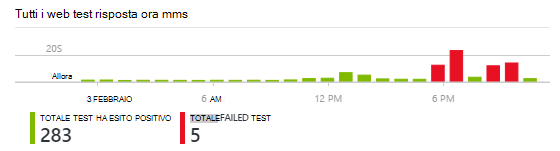

È possibile impostare i test web per qualsiasi endpoint HTTP o HTTPS accessibile da internet pubblica.

Esistono due tipi di test web:

* [Test ping URL](#create): un test semplice che è possibile creare nel portale di Azure.
* [Test web più passaggi](#multi-step-web-tests): da creare in Visual Studio Ultimate o Enterprise di Visual Studio e caricare al portale.

È possibile creare fino a 10 test web per risorsa dell'applicazione.

## 1. creare una risorsa per i report di test

Ignorare questo passaggio se è già stato [configurato una risorsa applicazione approfondimenti] [ start] per questa applicazione e si desidera visualizzare i report di disponibilità nella stessa posizione.

Iscriversi a [Microsoft Azure](http://azure.com), accedere al [portale di Azure](https://portal.azure.com)e creazione di una risorsa approfondimenti applicazione.

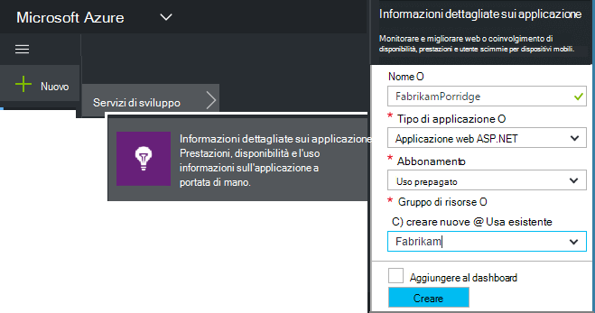

Fare clic su **tutte le risorse** per aprire e il Panoramica per la nuova risorsa.

## 2. creare un test di ping URL

In risorsa applicazione approfondimenti, cercare il riquadro di disponibilità. Fare clic su essa per aprire e il test Web per l'applicazione e aggiungere un test web.

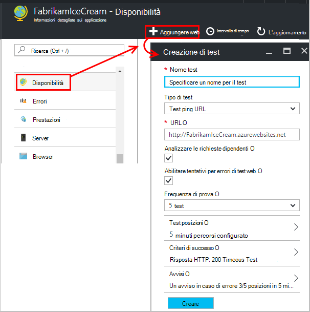

- **L'URL** deve essere visibile da internet pubblica. È possibile includere una stringa di query e #151; affermativo, ad esempio, è possibile esercitare un database leggermente. Se l'URL si risolve in un reindirizzamento, è seguire fino a 10 reindirizzamenti.
- **Analizzare le richieste dipendenti**: immagini, script, file di stile e altre risorse della pagina vengono richiesti come parte del test e l'ora di risposta registrato include queste ore. Il test ha esito negativo se tutte queste risorse non possono essere scaricate entro il timeout per l'intera prova.
- **Abilitare tentativi**: quando il test ha esito negativo, viene ripetuta dopo un breve intervallo. Solo se tre successivi tentativi hanno esito negativo, viene segnalato un errore. Test successivi vengono quindi eseguiti per la frequenza di prova comune. Riprova temporaneamente è sospesa fino al completamento successivo. Questa regola viene applicata in modo indipendente in ogni posizione di test. (È consigliabile questa impostazione. Media, circa l'80% di errori vengono rimosse in Riprova.)
- **Frequenza di test**: imposta la frequenza di esecuzione del test da ogni posizione di test. Con una frequenza di cinque minuti e prova cinque posizioni, il sito viene verificato in Media ogni minuto.
- **Posizioni di test** sono le posizioni nel punto in cui i server di inviano di richieste web per l'URL. Scegliere più monitor, in modo da poter distinguere i problemi del sito Web da problemi di rete. È possibile selezionare fino a 16 posizioni.

- **Criteri di successo**:

    **Timeout di test**: ridurre questo valore per essere informati sulle risposte lente. Il test viene conteggiato come un errore se non è state ricevute le risposte dal sito durante questo periodo. Se si seleziona **Analizza richieste dipendenti**, tutte le immagini, file di stile, script e altre risorse dipendenti devono sono state ricevute durante questo periodo.

    **Risposta HTTP**: il codice di stato restituito da viene conteggiato come successo. 200 è il codice che indica che sono stati restituiti una pagina web normale.

    **Il contenuto corrisponde**: una stringa, ad esempio "Welcome!" Viene eseguito il test che si verifica in ogni risposta. Deve trattarsi di una stringa semplice, senza i caratteri jolly. Non dimenticare che se le modifiche al contenuto pagina potrebbe essere necessario aggiornarla.

- **Gli avvisi** sono, per impostazione predefinita, inviato all'utente se sono presenti errori in tre posizioni più di cinque minuti. Un errore in un'unica posizione è probabile che sia un problema di rete e non un problema con il sito. È possibile modificare la soglia più o meno le in modo ma è anche possibile modificare che è necessario inviare i messaggi di posta elettronica.

    È possibile impostare [webhook](../monitoring-and-diagnostics/insights-webhooks-alerts.md) chiamata quando viene generato un avviso. (Ma si noti che, attualmente, parametri della query non vengono passati come proprietà).

### Altri URL del test

Aggiungere più test. Per esempio, nonché verificare la pagina home, è possibile verificare che il database sia installato verificando l'URL per una ricerca.

## 3. vedere il sito web risultati dei test

1-2 minuti, i risultati verranno visualizzati nel e Test Web.

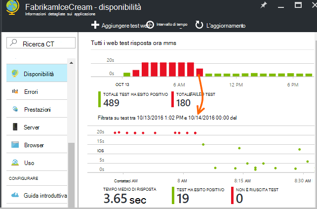

Fare clic su barre del grafico di riepilogo per informazioni più dettagliate del periodo di tempo specificato.

Questi grafici combinano i risultati per tutti i test web dell'applicazione.

## Se si errori

Fare clic su un punto rosso.

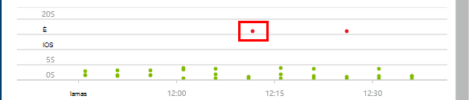

Oppure scorrere verso il basso e fare clic su un test in cui viene visualizzato minore di 100% completamento.

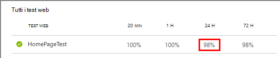

I risultati ottenuti aperto.

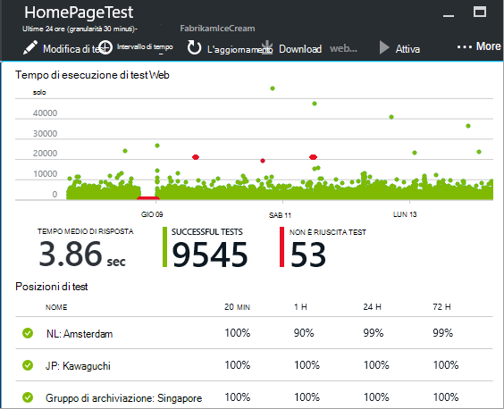

Il test da diverse posizioni & #151, selezionarne uno nel punto in cui i risultati sono meno di 100%.

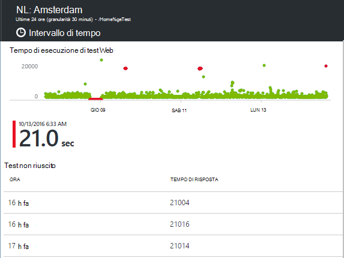

Scorrere fino a **non riuscito di test** e selezionare un risultato.

Fare clic sul risultato per valutare nel portale e verificare il motivo dell'errore.

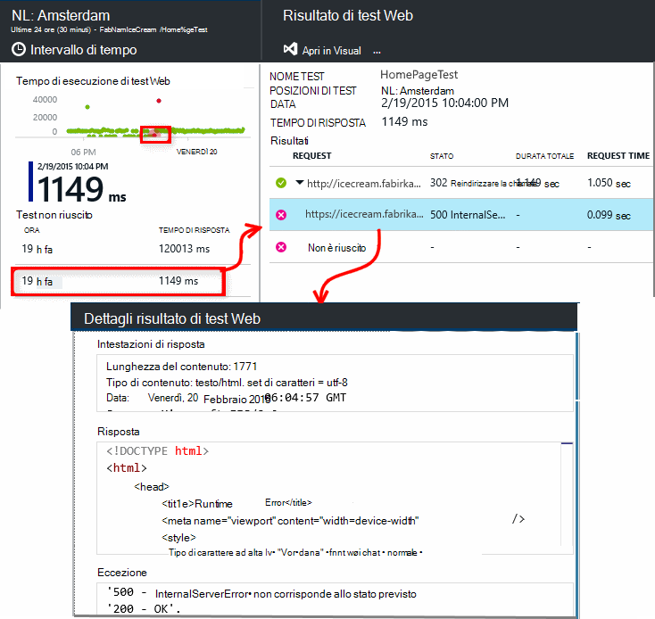

In alternativa, è possibile scaricare il file di risultato e controllare se in Visual Studio.

*Sia corretto, ma segnalato come un errore?* Selezionare tutte le immagini, script, fogli di stile e i file caricati dalla pagina. Se uno di questi non riesce, il test viene segnalato come non è riuscita, anche se la pagina html principale carica OK.

## Test web più passaggi

È possibile monitorare uno scenario che include una sequenza di URL. Ad esempio, se si sta controllando un sito Web di vendita, è possibile verificare che aggiungere elementi al carrello carrello funziona correttamente.

Per creare un test più passaggio, registrare lo scenario utilizzando Visual Studio e quindi caricare la registrazione a informazioni dettagliate sui applicazione. Informazioni dettagliate sui applicazione riproduce lo scenario intervalli e verifica le risposte.

Si noti che non è possibile usare codificati funzioni di test: passaggi dello scenario devono essere contenuti come script nel file webtest.

#### 1. record uno scenario

Utilizzare Visual Studio Enterprise o Ultimate per registrare una sessione web.

1. Creare un progetto di test prestazioni web.

    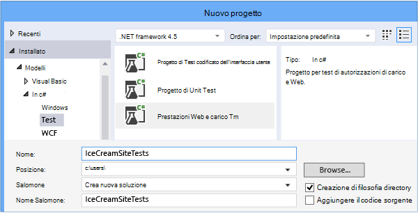

2. Aprire il file webtest e avviare la registrazione.

    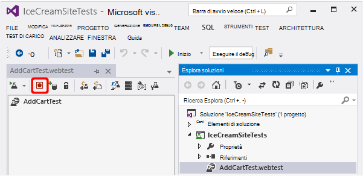

3. Eseguire le azioni utente che si desidera simulare nel test: aprire il sito Web, aggiungere un prodotto al carrello e così via. Arrestare il test.

    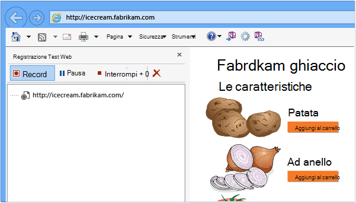

    Non apportare uno scenario di tempo. È previsto un limite di 100 passaggi e 2 minuti.

4. Modificare il test per:
 - Aggiungere la convalida per verificare se sono i codici di testo e le risposte ricevuti.
 - Rimuovere tutte le interazioni superflue. È anche possibile rimuovere le richieste dipendenti per le immagini o in Active Directory o tengono traccia dei siti.

    Tenere presente che è possibile modificare solo lo script di test, è possibile aggiungere codice personalizzato o chiamare altri test web. Non inserire cicli del test. È possibile utilizzare il plug-in di test web standard.

5. Eseguire il test in Visual Studio per verificarne che il funzionamento.

    I test web viene aperto un web browser e ripetere azioni registrata. Verificare se che funziona come previsto.

    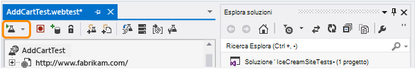

#### 2. caricare il test web a informazioni dettagliate sui applicazione

1. Nel portale di applicazione approfondimenti, creare un nuovo test web.

    

2. Selezionare più passaggi test e caricare il file webtest.

    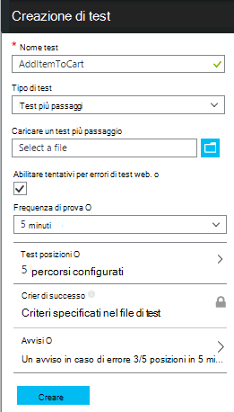

    Impostare i percorsi di test, frequenza e parametri di avviso nello stesso modo per test ping.

Visualizzare i risultati del test e gli eventuali errori nello stesso modo per singolo url test.

Il motivo dell'errore comune è che il test verrà eseguito troppo lungo. Non eseguire più di due minuti.

Non dimenticare che tutte le risorse di una pagina necessario caricare correttamente per il test ha esito positivo, inclusi gli script, fogli di stile, immagini e così via.

Si noti che il test web deve essere interamente contenuto nel file webtest: non è possibile utilizzare funzioni codificate del test.

### Collegare ora e numeri casuali a test più passaggi

Si supponga di testata uno strumento che ottiene dati dipendenti dal tempo, ad esempio le scorte di un feed esterno. Quando si registra il test web, è necessario utilizzare orari specifici, ma si impostarli come parametri del test, ora di inizio e fine.

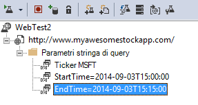

Quando si esegue il test, si preferisce fine sempre l'ora attuale e ora di inizio deve essere 15 minuti.

Plug-in Test Web consentono di aggiungere un parametro a volte.

1. Aggiungere un test web plug-in per ogni valore di parametro variabile desiderato. Nella barra degli strumenti prova web, scegliere **Aggiungi plug-in Test Web**.

    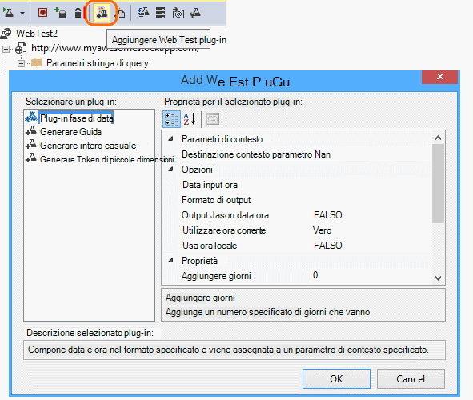

    In questo esempio viene utilizzata due istanze del plug-in fase di Data. È un'istanza di "15 minuti" e un altro per "oggi".

2. Aprire le proprietà di ogni plug-in. Assegnare un nome e impostare, è possibile utilizzare l'ora corrente. Per uno di essi, impostare minuti aggiungere = -15.

    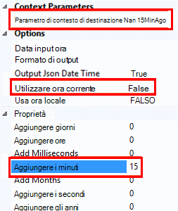

3. Nel web testare i parametri, utilizzare {{nome plug-in}} per fare riferimento a un nome plug-in.

    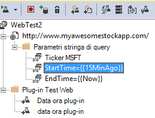

A questo punto, caricare il test al portale. Utilizza valori dinamici in ogni fase di esecuzione del test.

## Relativi all'accesso

Se gli utenti non accedere all'app, si dispone di diverse opzioni per la simulazione accesso in modo che è possibile testare pagine dietro sign in. È utilizzato dipende dal tipo di protezione tramite l'app.

In tutti i casi, è necessario creare un account dell'applicazione solo ai fini del test. Se possibile, limitare le autorizzazioni degli account di prova in modo che non vi è alcuna possibilità di test web che interessano gli utenti reali.

### Semplice nome utente e password

Registrare un test web nel modo consueto. Prima di tutto, eliminare i cookie.

### Autenticazione SAML

Utilizzare il plug-in SAML che è disponibile per i test web.

### Segreto del client

Se l'app include una route di accesso che prevede un segreto client, utilizzare tale percorso. Azure Active Directory (AAD) è un esempio di un servizio che fornisce un client accessohttp segreta. In AAD, il segreto del client è la chiave di App.

Ecco test di un'app web Azure mediante una chiave di app web di un esempio:

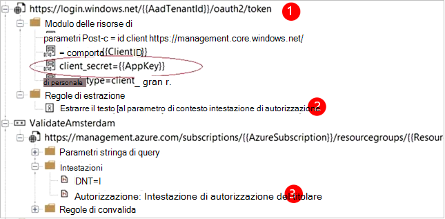

1. È possibile ottenere token da AAD utilizzando segreto del client (AppKey).
2. Estrarre token del titolare dalla risposta.
3. Chiamare API di utilizzo del token del titolare nell'intestazione di autorizzazione.

Verificare che il test web è un client effettivo: vale a dire è il proprio app in AAD - e utilizzare il clientId + appkey. Il servizio da testare è installato anche il proprio app in AAD: appID URI di questa app viene visualizzata nel test web nel campo "risorsa".

### Autenticazione aperta

Esempio di autenticazione aperta è l'accesso con l'account Microsoft o Google. Molte applicazioni che utilizzano OAuth forniscono al client segreta alternativo, in modo che la prima strategia dovrebbe essere per provare a utilizzare tale possibilità.

Se il test è necessario accedere con OAuth, l'approccio generale è:

 * Utilizzare uno strumento, ad esempio Fiddler per esaminare il traffico tra il web browser, il sito di autenticazione e l'app.
 * Eseguire due o più accessi con diversi computer o browser, o intervalli di tempo (per consentire i token scadenza).
 * Confrontando diverse sessioni, identificare il token passato nuovamente dal sito di autenticazione, che viene quindi passato al server app dopo l'accesso.
 * Registrare un test web tramite Visual Studio.
 * Aggiungere un parametro token, l'impostazione del parametro quando viene restituito il token da autenticatore e l'utilizzo nella query al sito.
 (Visual Studio tenta di aggiungere un parametro il test, ma non i parametri per correttamente i token.)

## Modificare o disattivare un test

Aprire un singolo test per modificare o disattivarlo.

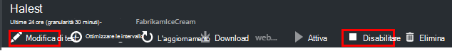

È consigliabile disabilitare i test web durante l'esecuzione di manutenzione del servizio.

## Test

È possibile eseguire un test di carico nel sito Web. Ad esempio il test di disponibilità, è possibile inviare richieste semplici o le richieste di più passaggi dai punti in tutto il mondo. A differenza di un test di disponibilità, vengono inviate richieste molti, simulazione più utenti contemporaneamente.

Aprire **le impostazioni di** **Test**e il Panoramica. Quando si crea un test, sono invitati a connettersi o creare un account di Visual Studio Team Services.

Una volta completato il test, si vengono visualizzati i tempi di risposta e percentuali di successo.

## Automazione

* [Script di PowerShell usare per configurare un test web](https://azure.microsoft.com/blog/creating-a-web-test-alert-programmatically-with-application-insights/) automaticamente.
* Configurare un [webhook](../monitoring-and-diagnostics/insights-webhooks-alerts.md) chiamata quando viene generato un avviso.

## Domande? Problemi?

* *È possibile chiamare codice dal test web?*

    No. Passaggi del test devono essere nel file webtest. E non è possibile chiamare altri test web o utilizzare cicli. Esistono diversi plug-in che possono risultare utili.

* *HTTPS è supportato?*

    È supportato TLS 1.1 e 1.2 TLS.

* *Esiste una differenza tra "web test" e "disponibilità"?*

    Serve in modo intercambiabile due termini.

* *Desidera utilizzare i test disponibili in un server interno che esegue un firewall.*

    Configurare il firewall per consentire le richieste di [agenti di test di indirizzi IP di web](app-insights-ip-addresses.md#availability).

* *Errore di caricamento di un test web più passaggi*

    Esiste un limite di 300 K.

    Cicli non sono supportati.

    I riferimenti agli altri test web non sono supportati.

    Origini dati non sono supportate.

* *Non eseguire il test più passaggi*

    È previsto un limite di 100 richieste al test.

    Il test viene interrotta se non si verifica più di due minuti.

* *Come è possibile eseguire un test con certificati client?*

    Non è possibile che, non puoi.

## Video

> [AZURE.VIDEO monitoring-availability-with-application-insights]

## Passaggi successivi

[Ricerca dei registri diagnostici][diagnostic]

[Risoluzione dei problemi][qna]

[Indirizzi IP di agenti di test web](app-insights-ip-addresses.md)

<!--Link references-->

[azure-availability]: ../insights-create-web-tests.md
[diagnostic]: app-insights-diagnostic-search.md
[qna]: app-insights-troubleshoot-faq.md
[start]: app-insights-overview.md
