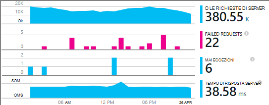
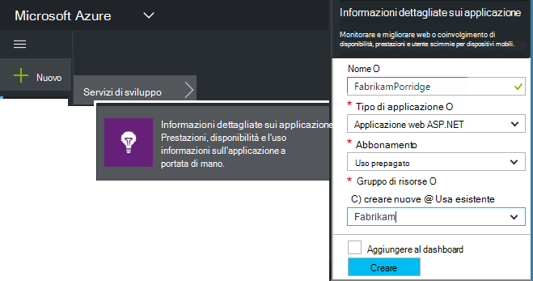
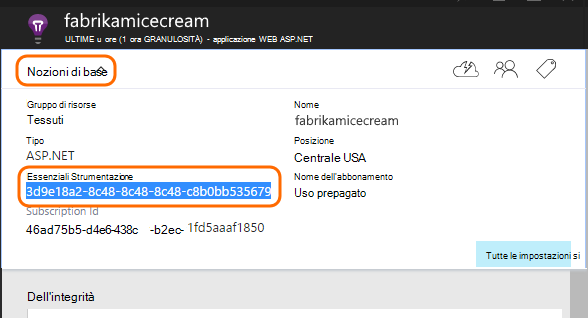
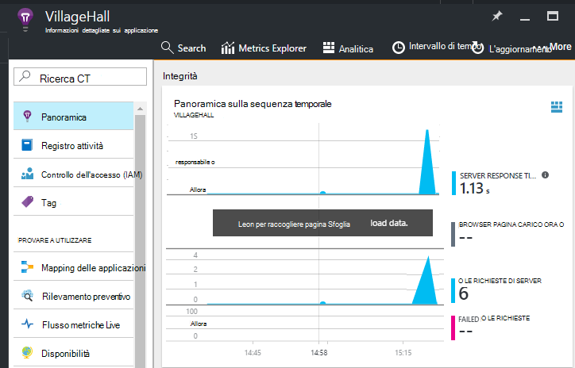

<properties
    pageTitle="Aggiungere applicazione approfondimenti SDK per monitorare l'app Node | Microsoft Azure"
    description="Analisi utilizzo, la disponibilità e le prestazioni del locale o applicazione web di Microsoft Azure con informazioni dettagliate sui applicazione."
    services="application-insights"
    documentationCenter=""
    authors="alancameronwills"
    manager="douge"/>

<tags
    ms.service="application-insights"
    ms.workload="tbd"
    ms.tgt_pltfrm="ibiza"
    ms.devlang="na"
    ms.topic="get-started-article"
    ms.date="08/30/2016"
    ms.author="awills"/>


# <a name="add-application-insights-sdk-to-monitor-your-nodejs-app"></a>Aggiungere applicazione approfondimenti SDK per monitorare l'app Node

*Informazioni dettagliate sui applicazione è in anteprima.*

[Visual Studio applicazione approfondimenti](app-insights-overview.md) esegue il monitoraggio dell'applicazione live per [rilevare e diagnosticare i problemi di prestazioni ed eccezioni](app-insights-detect-triage-diagnose.md)e [individuare il modo in cui viene utilizzato l'app](app-insights-overview-usage.md). Funziona per App ospitati su server IIS locale o su macchine virtuali di Azure, nonché Azure web app.


SDK fornisce automatica insieme di velocità di richiesta HTTP in ingresso e le risposte, contatori (CPU, memoria, RPS) e le eccezioni non gestite. Inoltre, è possibile aggiungere personalizzate chiamate per tenere traccia delle dipendenze, metriche o altri eventi.




#### <a name="before-you-start"></a>Prima di iniziare

Hai bisogno:

* Visual Studio 2013 o versione successiva. In un secondo momento è migliore.
* Una sottoscrizione a [Microsoft Azure](http://azure.com). Se il team o l'organizzazione ha un abbonamento a Azure, il proprietario possibile aggiungervi si, con il proprio [account Microsoft](http://live.com).

## <a name="add"></a>Creazione di una risorsa applicazione approfondimenti

Accedere al [portale di Azure][portal]e creare una nuova risorsa approfondimenti applicazione. Una [risorsa] [ roles] in Azure è un'istanza di un servizio. Questa risorsa è nel punto in cui verrà analizzato e visualizzato in telemetria dell'app.



Scegliere altro come tipo di applicazione. La scelta del tipo di applicazione imposta il contenuto predefinito del pale delle risorse e le proprietà visualizzato in [Esplora risorse metriche][metrics].

#### <a name="copy-the-instrumentation-key"></a>Copiare la chiave Strumentazione

Il tasto identifica la risorsa e si verrà installarlo breve in SDK per inviare i dati alla risorsa.




## <a name="sdk"></a>Installare SDK nell'applicazione

```
npm install applicationinsights --save
```

## <a name="usage"></a>Uso

In questo modo sarà richiesta monitoraggio, eccezione non gestita verifica e le prestazioni del sistema il monitoraggio (della memoria CPU/metadati).

```javascript

var appInsights = require("applicationinsights");
appInsights.setup("<instrumentation_key>").start();
```

Il tasto strumentazione possa anche essere impostato nella variabile di ambiente APPINSIGHTS_INSTRUMENTATIONKEY. Se questa operazione, non è necessario alcun argomento quando si chiama `appInsights.setup()` o `appInsights.getClient()`.

È possibile provare SDK senza inviare telemetria: impostare la chiave strumentazione in una stringa non vuoto.


## <a name="run"></a>Eseguire il progetto

Eseguire l'applicazione e provare: aprire pagine diverse per generare alcuni telemetria.


## <a name="monitor"></a>Visualizzare il telemetria

Per tornare al [portale di Azure](https://portal.azure.com) e individuare la risorsa approfondimenti applicazione.


Cercare dati nella pagina Panoramica. Prima, verrà visualizzato uno o due punti. Per esempio:



Fare clic sui grafici per visualizzare informazioni più dettagliate la metrica. [Ulteriori informazioni sulle metriche.][perf]

#### <a name="no-data"></a>Nessun dato?

* Usare l'applicazione, apertura di pagine differenti in modo che generi alcuni telemetria.
* Aprire il riquadro di [ricerca](app-insights-diagnostic-search.md) , per visualizzare i singoli eventi. A volte è necessario eseguire eventi leggermente mentre più tempo per ottenere attraverso la pipeline di metriche.
* Attendere alcuni secondi e fare clic su **Aggiorna**. Grafici a se stessi aggiornare periodicamente, ma è possibile aggiornare manualmente se si sta attendendo per alcuni dati per la visualizzazione.
* Vedere [risoluzione dei problemi][qna].

## <a name="publish-your-app"></a>Pubblicare l'app

Ora distribuire l'applicazione in IIS o in Azure e controllare i dati si accumulano.


#### <a name="no-data-after-you-publish-to-your-server"></a>Nessun dato dopo la pubblicazione nel server?

Aprire le porte per il traffico in uscita nel firewall del server:

+ `dc.services.visualstudio.com:443`
+ `f5.services.visualstudio.com:443`


#### <a name="trouble-on-your-build-server"></a>Problemi nel server di compilazione?

Vedere [questo elemento di risoluzione dei problemi](app-insights-asp-net-troubleshoot-no-data.md#NuGetBuild).


## <a name="customized-usage"></a>Utilizzo personalizzati. 

### <a name="disabling-auto-collection"></a>Disattivazione della raccolta di automatico

```javascript
import appInsights = require("applicationinsights");
appInsights.setup("<instrumentation_key>")
    .setAutoCollectRequests(false)
    .setAutoCollectPerformance(false)
    .setAutoCollectExceptions(false)
    // no telemetry will be sent until .start() is called
    .start();
```

### <a name="custom-monitoring"></a>Monitoraggio personalizzato

```javascript
import appInsights = require("applicationinsights");
var client = appInsights.getClient();

client.trackEvent("custom event", {customProperty: "custom property value"});
client.trackException(new Error("handled exceptions can be logged with this method"));
client.trackMetric("custom metric", 3);
client.trackTrace("trace message");
```

[Altre informazioni sull'API di telemetria](app-insights-api-custom-events-metrics.md).

### <a name="using-multiple-instrumentation-keys"></a>Utilizzo di più chiavi Strumentazione

```javascript
import appInsights = require("applicationinsights");

// configure auto-collection with one instrumentation key
appInsights.setup("<instrumentation_key>").start();

// get a client for another instrumentation key
var otherClient = appInsights.getClient("<other_instrumentation_key>");
otherClient.trackEvent("custom event");
```

## <a name="examples"></a>Esempi

### <a name="tracking-dependency"></a>Verifica delle dipendenze

```javascript
import appInsights = require("applicationinsights");
var client = appInsights.getClient();

var startTime = Date.now();
// execute dependency call
var endTime = Date.now();

var elapsedTime = endTime - startTime;
var success = true;
client.trackDependency("dependency name", "command name", elapsedTime, success);
```


### <a name="manual-request-tracking-of-all-get-requests"></a>Verifica manuale richiesta di tutte le richieste di "OTTIENI"

```javascript
var http = require("http");
var appInsights = require("applicationinsights");
appInsights.setup("<instrumentation_key>")
    .setAutoCollectRequests(false) // disable auto-collection of requests for this example
    .start();

// assign common properties to all telemetry sent from the default client
appInsights.client.commonProperties = {
    environment: process.env.SOME_ENV_VARIABLE
};

// track a system startup event
appInsights.client.trackEvent("server start");

// create server
var port = process.env.port || 1337
var server = http.createServer(function (req, res) {
    // track all "GET" requests
    if(req.method === "GET") {
        appInsights.client.trackRequest(req, res);
    }

    res.writeHead(200, { "Content-Type": "text/plain" });
    res.end("Hello World\n");
}).listen(port);

// track startup time of the server as a custom metric
var start = +new Date;
server.on("listening", () => {
    var end = +new Date;
    var duration = end - start;
    appInsights.client.trackMetric("StartupTime", duration);
});
```

## <a name="next-steps"></a>Passaggi successivi

* [Monitorare il telemetria nel portale](app-insights-dashboards.md)
* [Sovrascrivere le telemetria query Analitica](app-insights-analytics-tour.md)


<!--Link references-->

[knowUsers]: app-insights-overview-usage.md
[metrics]: app-insights-metrics-explorer.md
[perf]: app-insights-web-monitor-performance.md
[portal]: http://portal.azure.com/
[qna]: app-insights-troubleshoot-faq.md
[roles]: app-insights-resources-roles-access-control.md
