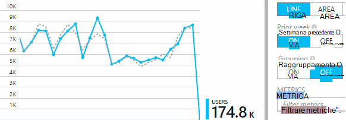

<properties
    pageTitle="Analisi di utilizzo con informazioni dettagliate sui applicazione"
    description="Panoramica delle analitica l'uso con informazioni dettagliate sui applicazione"
    services="application-insights"
    documentationCenter=""
    authors="alancameronwills"
    manager="douge"/>

<tags
    ms.service="application-insights"
    ms.workload="tbd"
    ms.tgt_pltfrm="ibiza"
    ms.devlang="multiple"
    ms.topic="article" 
    ms.date="04/08/2016"
    ms.author="awills"/>

# Analisi di utilizzo con informazioni dettagliate sui applicazione

Conoscere la modalità di utilizzo dell'applicazione consente di focalizzare l'attenzione dell'ufficio di sviluppo sugli scenari che più importante e ottenere informazioni approfondite negli obiettivi che si trova più facile o più difficile da eseguire.

Informazioni dettagliate sui applicazione può fornire una visione chiara di utilizzo dell'applicazione, consentono di migliorare l'esperienza degli utenti e obiettivi dell'azienda.

Informazioni dettagliate sui applicazione funziona per sia App autonomo (in iOS, Android e Windows) e per web apps (ospitato su .NET o J2EE). 

## Aggiungere informazioni dettagliate sui applicazione al progetto

Per iniziare, è possibile ottenere un account gratuito con [Microsoft Azure](https://azure.com). (Dopo il periodo di valutazione, è possibile continuare con il livello del servizio gratuito.)

Nel [portale di Azure](https://portal.azure.com), creare una risorsa approfondimenti applicazione. Si tratta in cui verrà visualizzato dati di utilizzo e le prestazioni sull'app.

**Se l'app è un'app di dispositivo,** aggiungere SDK approfondimenti applicazione al progetto. La procedura esatta varia in base al [IDE e la piattaforma](app-insights-platforms.md). Per le applicazioni di Windows, è sufficiente fare clic sul progetto di Visual Studio e scegliere "Aggiungi applicazione approfondimenti."

**Se si tratta di un'app web,** aprire e l'avvio rapido e ottenere il frammento di codice per aggiungere alle pagine web. Pubblicarli con questo frammento di codice.

È inoltre possibile aggiungere approfondimenti applicazione [ASP.NET](app-insights-asp-net.md) o [J2EE](app-insights-java-get-started.md) codice server in modo da combinare telemetria dal client e server.

### Eseguire il progetto e visualizzare i risultati prima

Eseguire il progetto in modalità di debug per alcuni minuti, quindi passare al [portale di Azure](https://portal.azure.com) e passare alla risorsa di progetto nell'applicazione approfondimenti.

Pubblicare l'app per ottenere ulteriori telemetria e vedere cosa stanno facendo gli utenti con l'app.

## Analitica all'esterno della casella

Fare clic sul riquadro di visualizzazioni pagina per visualizzare i dettagli relativi all'uso.

Passare il mouse nell'area vuota sopra un grafico per visualizzare i conteggi in un determinato momento. In caso contrario, i numeri riportano il valore aggregato nel periodo, ad esempio una media, un totale o un numero di utenti distinti nel periodo.

Nelle applicazioni web, gli utenti vengono contati utilizzando i cookie. Una persona che utilizza vari browser, consente di cancellare i cookie o utilizza la caratteristica di privacy verrà contata più volte.

Una sessione web viene conteggiata dopo 30 minuti di inattività. Una sessione in un telefono o un altro dispositivo viene conteggiata quando l'app è sospesa per più di alcuni secondi.

Fare clic sui grafici per visualizzare più dettagli. Per esempio:

(In questo esempio è stata inviata da un sito Web, ma i tipi di grafici simile per le app che vengono eseguite sui dispositivi).

Confronto tra e la settimana precedente per verificare se cose da modificare:

Confrontare due metriche, ad esempio utenti e i nuovi utenti:

Raggruppare (segmento) i dati da una proprietà come Browser, sistema operativo o città:

## Utilizzo delle pagine

Fare clic su visualizzazioni pagine affiancate per ottenere una suddivisione delle pagine più diffusi:

L'esempio precedente è stata inviata da un sito Web giochi. Del file è possibile vedere immediatamente:

* L'uso non è stato migliorato nell'ultima settimana. Forse bisogna considerare ottimizzazione del motore di ricerca?
* Molte persone meno individuare le pagine giochi rispetto alla Home page. Perché non Home page accattivante giocare?
* 'Crossword' è il gioco più popolari. Abbiamo bisogna assegnare priorità a nuove idee e sono descritti i miglioramenti.

## Rilevamento personalizzato

Si supponga che anziché l'implementazione di ogni gioco in una pagina web separato, si decide di Effettua refactoring tutti nella stessa applicazione di una pagina, con la maggior parte delle funzionalità codificato come Javascript nella pagina web. In questo modo all'utente di spostarsi rapidamente tra un gioco e un altro o avere giochi diverse in un'unica pagina.

Ma si preferisce comunque approfondimenti applicazione per registrare il numero di volte in cui ogni gioco viene aperto, in esattamente come quando si trattasse di pagine web separato. È facile: inserire solo una chiamata al modulo di telemetria in JavaScript in cui si vuole record in cui è aperta una nuova 'pagina':

    telemetryClient.trackPageView(game.Name);

## Eventi personalizzati

È possibile utilizzare telemetria in diversi modi per comprendere l'utilizzo dell'applicazione. Ma non sempre desidera confondere i messaggi con le viste di pagina. Utilizzare invece gli eventi personalizzati. È possibile inviare loro da dispositivo App, pagine web o un server web:

(JavaScript)

    telemetryClient.trackEvent("GameEnd");

(C#)

    var tc = new Microsoft.ApplicationInsights.TelemetryClient();
    tc.TrackEvent("GameEnd");

(VB)

    Dim tc = New Microsoft.ApplicationInsights.TelemetryClient()
    tc.TrackEvent("GameEnd")

Eventi personalizzati più frequenti sono elencati nella e Panoramica.

Fare clic su intestazione della tabella per visualizzare il numero totale di eventi. È possibile suddividere il grafico da vari attributi, ad esempio il nome dell'evento:

La caratteristica particolarmente utile degli indicatori cronologici è in grado di correlare le modifiche con altre metriche e gli eventi. Ad esempio, quando più giochi, avrebbe dovuto essere visualizzato un aumento anche giochi con abbandoni. Ma si desidera scoprire se le condizioni di carico elevato causa problemi che gli utenti trovano accettabile luogo giochi con abbandoni è sproporzionata.

## Drill-down eventi specifici

Per ottenere maggiori informazioni sui come una tipica sessione passa, è consigliabile per concentrarsi su una sessione di utenti specifici che contiene un determinato tipo di evento.

In questo esempio abbiamo codificati un evento personalizzato "NoGame" chiamata se l'utente si disconnette senza effettivamente avviare un gioco. Perché un utente farebbe che? Forse si drill-down alcune occorrenze specifiche, si ottiene un'indicazione.

Eventi personalizzati ricevuti dall'app sono elencati in base al nome in e il Panoramica:

Fare clic su tramite l'evento di interesse e selezionare un'occorrenza specifica recente:

Diamo un'occhiata tutti di telemetria per la sessione in cui si è verificato l'evento NoGame specifico.

Si sono verificati senza eccezioni, in modo che l'utente non è stato impedito la riproduzione di un errore.

È possibile filtrare tutti i tipi di telemetria ad eccezione delle visualizzazioni di una pagina per questa sessione:

E a questo punto è possibile vedere che l'utente eseguito l'accesso è sufficiente per controllare i punteggi più recente. Forse si bisogna valutare la possibilità di sviluppo di una storia utente che rendono più semplice per farlo. (E abbiamo bisogna implementare un evento personalizzato al report quando si verifica questa storia specifica).

## Filtrare, eseguire una ricerca e segmento i dati con il comando proprietà
È possibile allegare tag non autorizzato e valori numerici per gli eventi.

JavaScript client

    appInsights.trackEvent("WinGame",
        // String properties:
        {Game: currentGame.name, Difficulty: currentGame.difficulty},
        // Numeric measurements:
        {Score: currentGame.score, Opponents: currentGame.opponentCount}
    );

C# nel server

    // Set up some properties:
    var properties = new Dictionary <string, string>
        {{"game", currentGame.Name}, {"difficulty", currentGame.Difficulty}};
    var measurements = new Dictionary <string, double>
        {{"Score", currentGame.Score}, {"Opponents", currentGame.OpponentCount}};

    // Send the event:
    telemetry.TrackEvent("WinGame", properties, measurements);

Aggiornare l'album nel server

    ' Set up some properties:
    Dim properties = New Dictionary (Of String, String)
    properties.Add("game", currentGame.Name)
    properties.Add("difficulty", currentGame.Difficulty)

    Dim measurements = New Dictionary (Of String, Double)
    measurements.Add("Score", currentGame.Score)
    measurements.Add("Opponents", currentGame.OpponentCount)

    ' Send the event:
    telemetry.TrackEvent("WinGame", properties, measurements)

Allegare proprietà alle visualizzazioni di pagina nello stesso modo:

JavaScript client

    appInsights.trackPageView("Win",
        {Game: currentGame.Name},
        {Score: currentGame.Score});

Nella ricerca diagnostica, visualizzare le proprietà, fare clic su tramite una singola occorrenza di un evento.

Utilizzare il campo di ricerca per visualizzare le occorrenze di evento con un valore specifico della proprietà.

## RISPOSTE | Test B

Se non si conosce variante di una caratteristica sarà maggiori possibilità di successo, rilasciare entrambi gli elementi, effettuare ogni accessibili per diversi utenti. Valutare il successo di ogni e quindi passare a una versione unificata.

Per questa tecnica, si allega tag distinti a tutti di telemetria inviato da ogni versione dell'app. È possibile farlo mediante la definizione di proprietà in TelemetryContext attivo. Queste proprietà predefinite vengono aggiunti a ogni messaggio telemetria che l'applicazione invia - non solo ai messaggi personalizzati, ma anche di telemetria standard.

Nel portale approfondimenti applicazione, quindi sarà possibile per filtrare e raggruppare (segmento) i dati sui tag, in modo da confrontare le diverse versioni.

C# nel server

    using Microsoft.ApplicationInsights.DataContracts;

    var context = new TelemetryContext();
    context.Properties["Game"] = currentGame.Name;
    var telemetry = new TelemetryClient(context);
    // Now all telemetry will automatically be sent with the context property:
    telemetry.TrackEvent("WinGame");

Aggiornare l'album nel server

    Dim context = New TelemetryContext
    context.Properties("Game") = currentGame.Name
    Dim telemetry = New TelemetryClient(context)
    ' Now all telemetry will automatically be sent with the context property:
    telemetry.TrackEvent("WinGame")

Singoli telemetria possibile ignorare i valori predefiniti.

È possibile impostare un inizializzatore universale in modo che tutti i nuovi TelemetryClients usare automaticamente il contesto.

    // Telemetry initializer class
    public class MyTelemetryInitializer : ITelemetryInitializer
    {
        public void Initialize (ITelemetry telemetry)
        {
            telemetry.Properties["AppVersion"] = "v2.1";
        }
    }

Nell'inizializzatore di app, ad esempio Global.asax.cs:

    protected void Application_Start()
    {
        // ...
        TelemetryConfiguration.Active.TelemetryInitializers
        .Add(new MyTelemetryInitializer());
    }

## Compilazione - misura - informazioni

Quando si utilizza analitica, diventa una parte integrante del ciclo di sviluppo, non appena destinati si ritiene che per risolvere problemi. Ecco alcuni suggerimenti:

* Determinare l'unità di misura metriche chiave dell'applicazione. Si desidera tutti gli utenti possibili o è preferibile un piccolo gruppo di utenti molto soddisfatti? Si desidera ingrandire visite o vendita?
* Piano per misurare ogni brano. Quando si schizzi una storia utente nuovo o caratteristica o piano per aggiornare uno esistente, sempre considerare come verrà misurato il successo della modifica. Prima di codifica avvii, chiedere "Qual è l'effetto delle prestazioni sulla nostro metriche se funziona? Bisogna è tenere traccia di tutti i nuovi eventi?"
E naturalmente, quando la caratteristica è attivo, accertarsi di esaminare l'analitica e agire sui risultati.
* Le relazioni tra e altre metriche l'unità di misura metriche chiave. Ad esempio, se si aggiunge la funzionalità "Preferiti", si vuole sapere con quale frequenza gli utenti aggiungono a Preferiti. Ma è probabilmente più interessante sapere con quale frequenza vengono tornare a Preferiti. E, soprattutto, i clienti che utilizzano Preferiti infine acquistare più del prodotto?
* Canarie test. Impostare un'opzione di funzionalità che consente di impostare una nuova caratteristica visibile solo per alcuni utenti. Consente di vedere se la nuova caratteristica viene utilizzata in modo che previste approfondimenti applicazione. Apportare modifiche, quindi rilasciare a un pubblico più ampio.
* Comunicare con gli utenti. Analitica non è sufficiente autonomamente, ma complementare per conservare una relazione clienti.

## Ulteriori informazioni

* [Rilevare, valutare e diagnosticare i problemi di prestazioni nell'app e anomalo](app-insights-detect-triage-diagnose.md)
* [Guida introduttiva a informazioni dettagliate sui applicazione piattaforme molti](app-insights-detect-triage-diagnose.md)

## Video

> [AZURE.VIDEO usage-monitoring-application-insights]

 
