<properties 
    pageTitle="Esercitazione approfondimenti applicazione | Microsoft Azure" 
    description="Tenere traccia di utilizzo e le prestazioni dell'applicazione web live.  Rilevare, valutare e diagnosticare i problemi. Continuamente monitorare e migliorare successo con altri utenti." 
    services="application-insights" 
    documentationCenter=""
    authors="alancameronwills" 
    manager="douge"/>

<tags 
    ms.service="application-insights" 
    ms.workload="tbd" 
    ms.tgt_pltfrm="ibiza" 
    ms.devlang="na" 
    ms.topic="article" 
    ms.date="10/15/2016" 
    ms.author="awills"/>
 
# Informazioni dettagliate sui applicazione - introduzione

Visual Studio applicazione approfondimenti è un servizio extensible analitica che esegue il monitoraggio dell'applicazione web live. È possibile rilevare e diagnosticare i problemi di prestazioni e comprendere gli utenti effettivamente operazioni con l'app. Progettato per gli sviluppatori, che consentono di migliorare continuamente le prestazioni e facilità di utilizzo. Funziona per le App in una vasta gamma di piattaforme, tra cui .NET, Node e J2EE, ospitato in locale o nel cloud. 

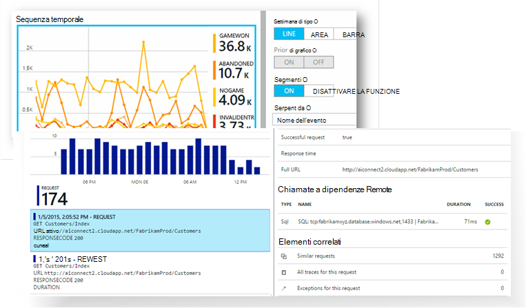

[Da un'occhiata l'animazione introduttivo](https://www.youtube.com/watch?v=fX2NtGrh-Y0).

## Come funziona?

Installa un pacchetto strumentazione small nell'applicazione e configurare una risorsa applicazione approfondimenti nel portale di Microsoft Azure. La strumentazione controlla l'app e invia dati di telemetria al portale. Il portale Mostra grafici statistici e offre potenti strumenti di ricerca che consentono di diagnosticare i problemi.

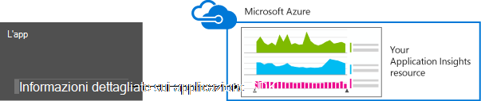

Informazioni dettagliate sui applicazione sono diversi [moduli strumentazione standard](app-insights-configuration-with-applicationinsights-config.md) che raccogliere tipi diversi di telemetria, ad esempio i tempi di risposta convocazione, le eccezioni e dipendenza chiamate. È inoltre possibile [scrivere codice per l'invio di telemetria personalizzato](app-insights-api-custom-events-metrics.md) al portale.

### Che cos'è il sovraccarico?

L'impatto sulle prestazioni dell'applicazione è molto piccolo. Verifica chiamate sono senza blocco e sono in blocco e inviate in un thread separato. 

## Cosa?

Informazioni dettagliate sui applicazione è destinato il team di sviluppo, per comprendere le prestazioni dell'applicazione e la modalità di utilizzo. Sono disponibili:

Tipi di telemetria:

* Frequenza di richieste HTTP, i tempi di risposta, successo.
* Dipendenza (HTTP & SQL) chiamare tariffe, i tempi di risposta, successo.
* Tracce di eccezione dal client e server.
* Tracce log diagnostici.
* Visualizzazione pagina Conta numeri utente e sessione, i tempi di caricamento del browser, eccezioni.
* AJAX chiamata tariffe, i tempi di risposta e percentuali di successo.
* Contatori delle prestazioni server.
* Personalizzato telemetria client e server.
* Segmentazione percorso client, versione del browser, versione del sistema operativo, istanza server, dimensioni personalizzate e altro ancora.
* Verifica disponibilità

Strumenti di diagnostica e analitici:

* Smart e manuali avvisi riuscite e altre metriche e sulla disponibilità.
* Grafici nel tempo di metriche aggregate.
* Ricerca di diagnostica su istanze di richieste, eccezioni, gli eventi personalizzati, tracce di log, visualizzazioni, dipendenza e AJAX chiamate. 
* Analitica - un linguaggio di query avanzate sopra il telemetria
* Dashboard - comporre i tipi di grafici è necessario monitorare tutti i componenti di app.

## Come Usa?

### Monitor

Installare l'applicazione approfondimenti nelle applicazioni web, configurare la disponibilità i test web, e:

* Configurare un dashboard per il proprio ambiente di team tenere sotto controllo carico, la velocità di risposta e le prestazioni di dipendenze, caricamenti di pagina e le chiamate AJAX. 
* Individuare la maggior parte delle richieste di errore e quali sono le più lenta.
* Guardare flusso Live quando si distribuisce una nuova versione, conoscere immediatamente qualsiasi riduzione del.

### Diagnosticare

Quando si riceve un avviso o individua un problema:

* Correlare errori con le eccezioni, le chiamate dipendenza e tracce.
* Esaminare stack immagini e i registri di analisi.

### Valutare

Misurare l'efficacia di ogni nuova caratteristica che si distribuisce.

* Piano per misurare modalità di utilizzo dell'esperienza utente nuovo o caratteristiche di business.
* Scrivere telemetria personalizzato nel codice di registrare utilizzo.
* Basare evidenza difficile da telemetria ogni ciclo di sviluppo.

## Guida introduttiva

Informazioni dettagliate sui applicazione corrisponde a uno dei molti servizi ospitati all'interno di Microsoft Azure e telemetria viene inviato sono per l'analisi e presentazione. Prima di eseguire qualsiasi altro elemento, sarà necessario un abbonamento a [Microsoft Azure](http://azure.com). È gratuito per iscriversi e si sceglie il gratuito [prezzi livello](https://azure.microsoft.com/pricing/details/application-insights/) di applicazione approfondimenti. Se l'organizzazione ha già un abbonamento, è Impossibile aggiungere l'account Microsoft. 

Esistono diversi modi per iniziare. Iniziare con qualunque funziona meglio dell'utente. È possibile aggiungere altri in un secondo momento.

* **In fase di esecuzione: dotare un'app web nel server.** Consente di evitare qualsiasi aggiornamento al codice. È necessario accesso dell'amministratore del server.
 * [**IIS locale o in una macchina virtuale**](app-insights-monitor-performance-live-website-now.md)
 * [**Azure web app o macchine Virtuali**](app-insights-monitor-performance-live-website-now.md#if-your-app-runs-as-an-azure-web-app)
 * [**J2EE**](app-insights-java-live.md)
* **In fase di sviluppo: aggiungere informazioni dettagliate sui applicazione al codice.** Consente di scrivere telemetria personalizzato e per strumento back-end e le applicazioni desktop.
 * Aggiornamento di 2013 [Visual Studio](app-insights-asp-net.md) 2 o versione successiva.
 * Linguaggio [Eclisse](app-insights-java-eclipse.md) o [altri strumenti](app-insights-java-get-started.md)
 * [Node](app-insights-nodejs.md)
 * [Altre piattaforme](app-insights-platforms.md)
* **[Dotare le pagine web](app-insights-javascript.md)** per la visualizzazione pagina, AJAX e altre telemetria lato client.
* **[Verifica disponibilità](app-insights-monitor-web-app-availability.md)** - effettuare il ping del sito Web periodicamente dai propri server.

> [AZURE.NOTE]  A questo punto, forse si vuole semplicemente accedere nei e verificarne l'effetto. Ma se si desidera visualizzare informazioni dettagliate sui applicazione possibili, continuare a leggere.

## Esplorare le metriche

Eseguire l'app - in modalità di debug nel computer di sviluppo, oppure distribuirlo in un server - e usarlo per un po' di tempo. Quindi accedere al [portale di Azure](https://portal.azure.com).

Passare alla blade di panoramica dell'app approfondimenti applicazione:

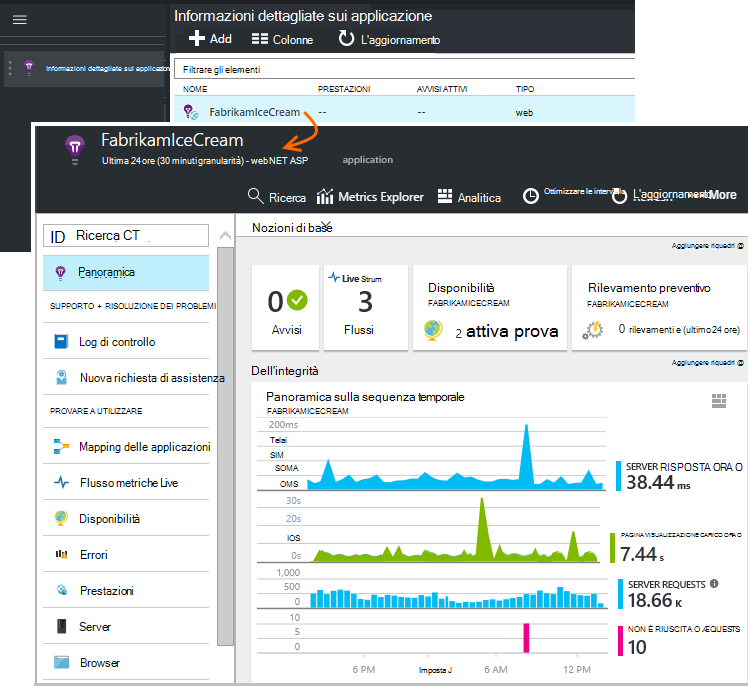

La panoramica consente di vedere immediatamente le prestazioni dell'applicazione. È possibile confrontare carico (in termini di frequenza delle richieste) con il tempo l'app anche per rispondere alle richieste. Se esiste un aumento sproporzionato tempi di risposta quando il carico aumenta, è consigliabile allocare altre risorse per l'app. Se viene visualizzato più a destra delle risposte non riuscito dopo aver distribuito una nuova compilazione, è consigliabile ripristinare.

#### Ulteriori informazioni

Fare clic sui grafici per ottenere un set di grafici più dettagliato. Ad esempio, il grafico tempi di risposta Server conduce ai grafici che mostrano frequenza richieste, i tempi di risposta e i tempi di risposta delle dipendenze (, ovvero i servizi che l'app chiama).  

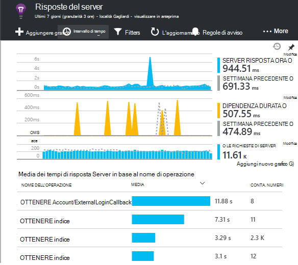

Grafico dipendenze è utile perché consente di verificare se il database e le API REST che usa l'app sta rispondendo anche o stanno causando ritardi.

#### Personalizzare un grafico

Provare a modificare uno di questi grafici. Ad esempio, se l'applicazione web viene eseguito su un insieme di istanze di server, è possibile confrontare i tempi di risposta su istanze server diverso:

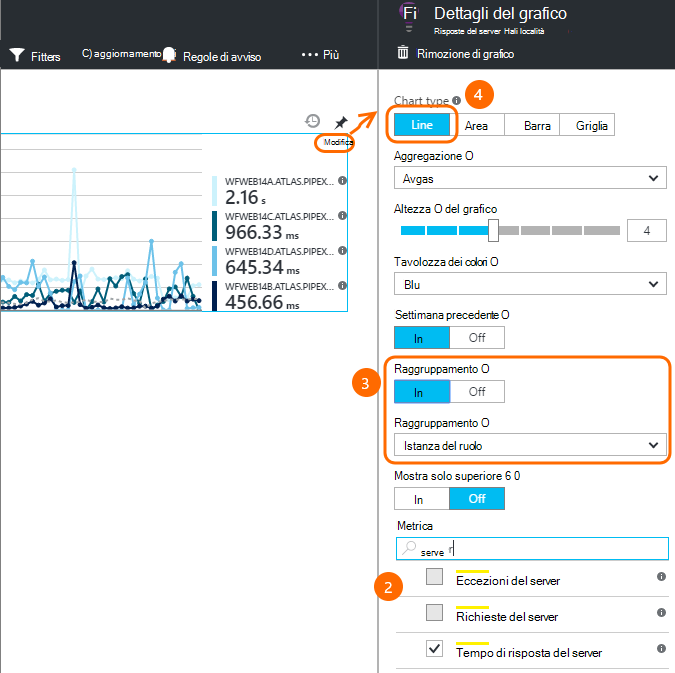

1. Passare il mouse sopra il grafico e fare clic su Modifica.
2. Scegliere una metrica. Più metriche possono essere visualizzate in un grafico, ma solo in alcune combinazioni: potrebbe essere necessario deselezionare una sola unità di misura metriche prima di selezionare quello desiderato.
3. Utilizzare Group By per segmento una metrica da una proprietà. In questo esempio abbiamo visualizzare righe separate per i tempi di risposta diverso. 

    Si noti che è necessario selezionare una proprietà valida per le unità di misura metriche o sul grafico non verrà visualizzati tutti i dati.
4. Selezionare un tipo di grafico. Grafici a barre e area di visualizzazione in pila adatto quando l'aggregazione è di tipo "Sum".

[Altre informazioni, vedere metriche di esplorazione](app-insights-metrics-explorer.md).

## Dati di istanza di ricerca

Per esaminare un problema, può essere utile esaminare le istanze di evento specifico.

Fare clic su tramite un grafico metrico di ricerche rapide negli dati istanza con i filtri e l'intervallo di tempo. Ad esempio, fare clic su tramite richiesta server conta per visualizzare le relazioni singola richiesta. 

È possibile oppure passare direttamente ai dati dell'istanza dalla ricerca nella pagina Panoramica:

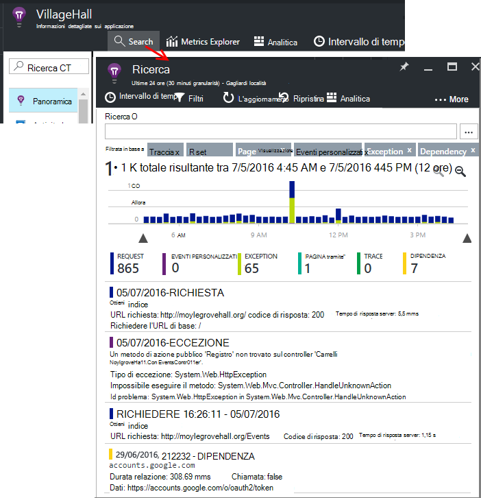

Utilizzare filtri per lo stato attivo sui particolari tipi di eventi e sui valori di proprietà scelta:

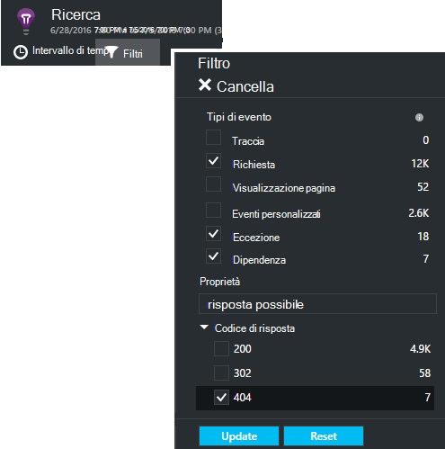

Fare clic su "…" per visualizzare un elenco completo delle proprietà o aprire altri eventi associati alla stessa richiesta. In questo esempio, la richiesta non riuscita è un rapporto di eccezione associata:

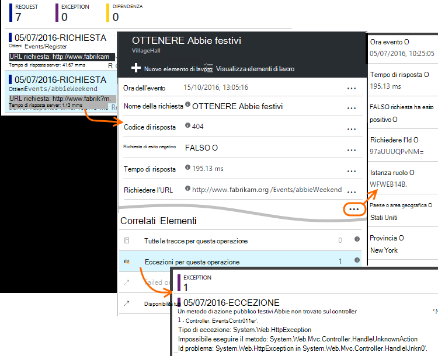

Aprire un evento, in questo esempio, l'eccezione correlato - ed è possibile creare un elemento di lavoro (se si utilizza Visual Studio Team Services per tenere traccia delle attività). 
 
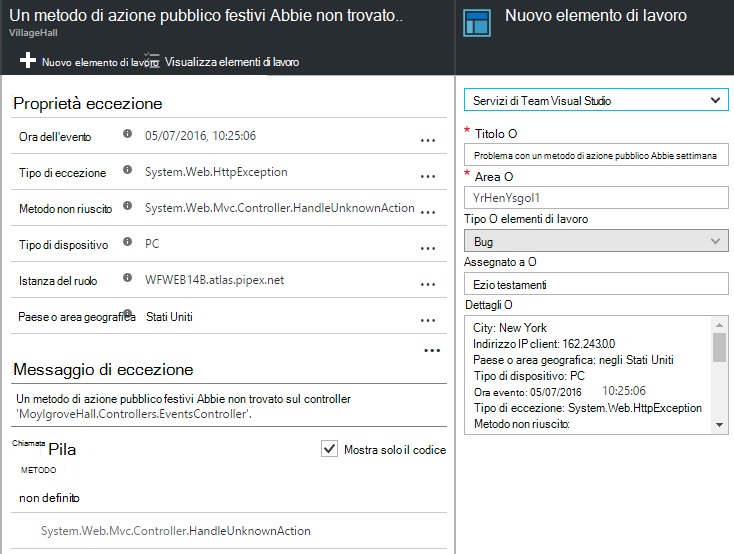

## Analitica

[Analitica](app-insights-analytics.md) è una funzionalità di ricerca e analisi ancora più potente, in cui è possibile scrivere query SQL sopra i dati di telemetria di cercare i problemi specifici o per compilare le informazioni statistiche.

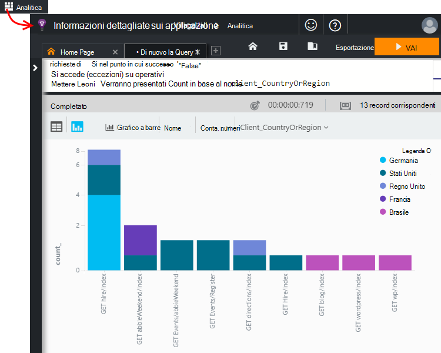

Aprire la finestra esercitazione per vedere ed eseguire esempi di query sui dati o per saperne di più [dettagliata dell'esercitazione](app-insights-analytics-tour.md). Viene richiesto con le query che è possibile utilizzare e c'è un [riferimento al linguaggio completo](app-insights-analytics-reference.md). 

Le query in genere iniziano con il nome di un flusso di telemetria, ad esempio le richieste, eccezioni o dipendenze. POP aprire la barra dello schema a sinistra per visualizzare un elenco dei flussi di telemetria disponibili. La query è una pipeline di [operazioni di query](app-insights-analytics-reference.md#queries-and-operators) , ad esempio `where` - un filtro booleano - o `project` -che calcola nuove proprietà. `summarize`[le istanze di aggregazioni](app-insights-analytics-tour.md#aggregate-groups-of-rows), raggrupparle dalle funzioni che è possibile definire e quindi applicare le funzioni di aggregazione sui dati raggruppati.

Risultati possono essere [visualizzata in tabelle o diversi tipi di grafico in](app-insights-analytics-tour.md#charting-the-results).

## Telemetria personalizzato

Telemetria predefinito che viene visualizzato solo installando approfondimenti applicazione consente di analizzare i conteggi, percentuali di successo e tempi di risposta sia per le richieste web alle chiamate app e le dipendenze, vale a dire dell'App per SQL, API REST. Viene visualizzato anche le tracce di eccezione e (con stato Monitor nel server) contatori delle prestazioni di sistema. Se si aggiunge il frammento di client per le pagine web, viene visualizzato conteggi visualizzazione pagina e i tempi di caricamento, le eccezioni di client e AJAX chiamare tassi di successo e le risposte. 

Analisi tutti questa telemetria possono indicare molto sulle prestazioni e l'utilizzo dell'app. Ma a volte non è sufficiente. È possibile monitorare la lunghezza di una coda in modo che è possibile ottimizzare le prestazioni. o contare le vendite e li segmento in base all'ubicazione; In alternativa, sul lato client per scoprire spesso utenti fare clic su un pulsante in modo che è possibile ottimizzare l'esperienza utente.

L' [Applicazione approfondimenti API](app-insights-api-custom-events-metrics.md) fornisce chiamate `TrackEvent(name)` e `TrackMetric(name, value)` in modo che sia possibile inviare i propri eventi personalizzati e metriche. Sono disponibili le chiamate equivalente per il lato client.

Se, ad esempio, la pagina web è un'app di gioco pagina singola, si potrebbe inserire una riga nelle posizioni appropriate agli utenti di accedere quando l'utente wins o si perde una partita:

    
    appInsights.trackEvent("WinGame");
    ...
    appInsights.trackEvent("LoseGame");

È quindi possibile grafico conteggi evento personalizzato, loro segmenti dal nome evento:

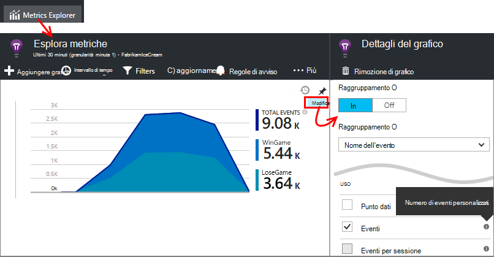

### Log tracce

A tale scopo, c'è un evento personalizzato `TrackTrace(message)` che è possibile utilizzare per le tracce di esecuzione. Nelle funzionalità di ricerca e Analitica, è possibile cercare il contenuto del messaggio, che può essere più di un nome dell'evento. 

Se si usa già una struttura di registrazione, ad esempio Log4Net, NLog, Log4J o System.Diagnostic.Trace, le chiamate traccia acquisire per informazioni dettagliate sui applicazione e verranno visualizzato insieme a altri telemetria. Gli strumenti di Visual Studio aggiunge automaticamente il modulo SDK appropriato.

## Dashboard

Molte applicazioni è costituito da diversi componenti, ad esempio un servizio web e uno o più back-end processori. Ogni componente verrà controllate da una risorsa applicazione approfondimenti separata. Se il sistema viene eseguito su Azure, si potrebbe - e monitoraggio - servizi, ad esempio hub di eventi e apprendimento automatico anche. 

Per controllare l'intero sistema, è possibile selezionare i tipi di grafici più interessanti da varie App e aggiungerli a un [dashboard](app-insights-dashboards.md)di Azure, che consente di tenere sotto controllo l'intero sistema continuamente. 

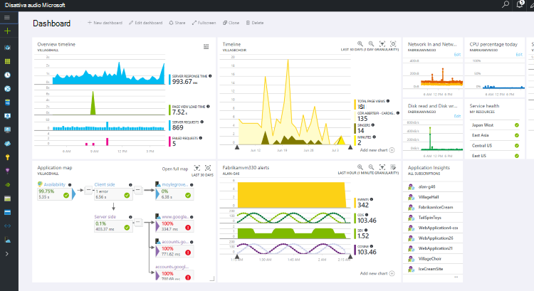

Infatti, è possibile creare più dashboard - ad esempio un dashboard di chat room di team per monitorare l'integrità del sistema generale; un dashboard di progettazione per l'utilizzo delle caratteristiche; un dashboard distinto per i componenti da testare; E così via.  

Dashboard, ad esempio risorse, possono essere condivisi tra i membri del team.

## Sviluppo in Visual Studio

Se si sta utilizzando Visual Studio per sviluppare l'app, sono disponibili diversi strumenti di applicazione approfondimenti incorporati. 

### Ricerca di diagnostica

Finestra di ricerca Mostra gli eventi che sono stati eseguiti. (Se connesso al Azure quando si configura applicazione approfondimenti, sarà possibile eseguire la ricerca gli stessi eventi nel portale.)

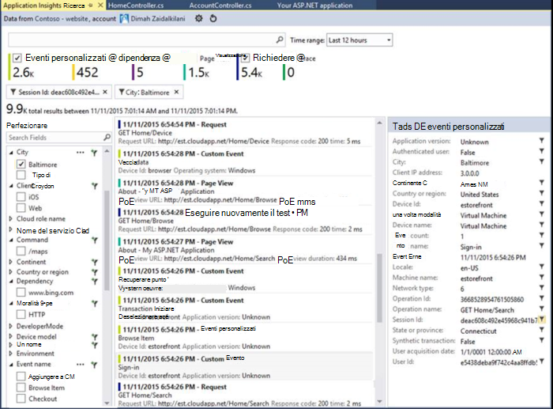

La ricerca di testo libero funziona in tutti i campi in eventi. Ad esempio, cercare parte dell'URL di una pagina. o il valore di una proprietà, ad esempio città client; o parole specifiche in un file di log di analisi.

Fare clic su un evento per visualizzare le proprietà dettagliate.

È anche possibile aprire la scheda elementi correlati per diagnosticare più facilmente le richieste non riuscite o eccezioni.

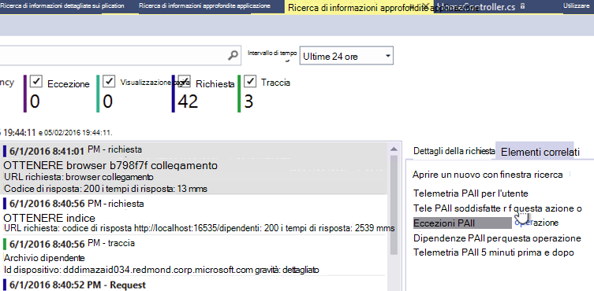

### Hub di diagnostica

Hub diagnostica, in Visual Studio 2015 o in un secondo momento, Mostra telemetria di server approfondimenti applicazione viene generato. Questo metodo funziona anche se si è scelto solo per installare SDK, senza la connessione a una risorsa nel portale di Azure.

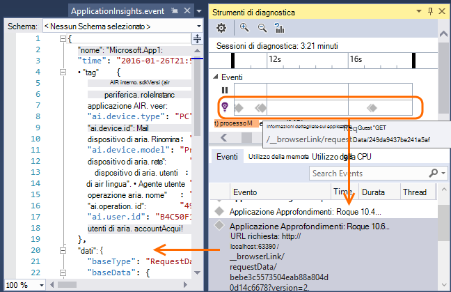

### Eccezioni

Se sono stati [configurati eccezione monitoraggio](app-insights-asp-net-exceptions.md), eccezione report verrà visualizzato nella finestra di ricerca. 

Fare clic su un'eccezione per ottenere una traccia dello stack. Se il codice dell'applicazione non è aperto in Visual Studio, è possibile fare clic su tramite dalla traccia dello stack alla riga pertinenti del codice.

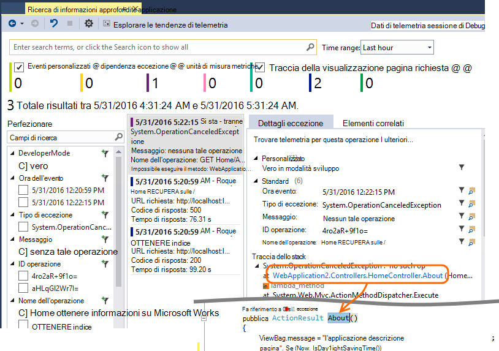

Nella riga di codice Lens sopra ogni metodo, inoltre, verrà visualizzato un conteggio delle eccezioni eseguito l'accesso per informazioni dettagliate sui applicazione ultime 24 ore.

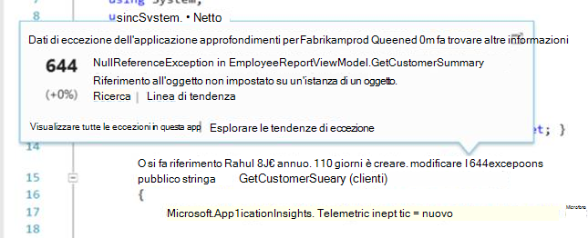

### Monitoraggio locale

(Da Visual Studio 2015 Update 2) Se non è stato configurato SDK per l'invio di telemetria al portale di applicazione approfondimenti (in modo che non esiste nessuna chiave strumentazione in ApplicationInsights.config) nella finestra di diagnostica verrà visualizzato telemetria dalla sessione di debug più recenti. 

Questo è utile se è già stato pubblicato una versione precedente dell'app. Non si desidera di telemetria dalle sessioni di debug per combinare con telemetria nel portale di applicazione approfondimenti dall'app pubblicato.

È inoltre utile se si dispone di alcuni [telemetria personalizzato](app-insights-api-custom-events-metrics.md) che si desidera eseguire il debug prima dell'invio di telemetria al portale.

* *Inizialmente configurato completamente approfondimenti applicazione per l'invio di telemetria al portale. Ma ora vogliono vedere telemetria solo in Visual Studio.*

 * Nella sezione Impostazioni della finestra di ricerca, esiste un'opzione per la ricerca di diagnostica locale anche se l'app invia telemetria al portale.
 * Per smettere di telemetria inviato al portale, commento la riga `<instrumentationkey>...` da ApplicationInsights.config. Quando si è pronti a inviare telemetria al portale di nuovo, rimuovere il commento.

## Tendenze

Tendenze è uno strumento in Visual Studio per la visualizzazione comportamento l'app nel tempo. 

Scegliere **Le tendenze di telemetria esplorare** la finestra di ricerca di informazioni approfondite applicazione o un pulsante Approfondimenti applicazione. Scegliere una delle cinque query comuni per iniziare. È possibile analizzare diversi set di dati in base a tipi di telemetria, gli intervalli di tempo e altre proprietà. 

Per trovare alterazioni dei dati, scegliere una delle opzioni anomalia sotto l'elenco a discesa "Tipo visualizzazione". Le opzioni di filtro nella parte inferiore della finestra rendono più semplice concentrarsi su sottoinsiemi del telemetria specifici.

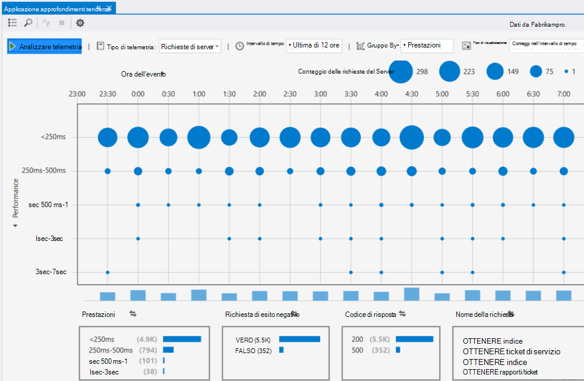

## Rilasciare una nuova compilazione

### Flusso metriche Live

Flusso metriche Live viene dai parametri di applicazione a questo momento, con una latenza in tempo reale più vicino di 1 secondo. Si tratta estremamente utile quando si sta rilasciando una nuova compilazione e si desidera verificare che tutto sia funzionare come previsto, o dell'analisi di un incidente in tempo reale.

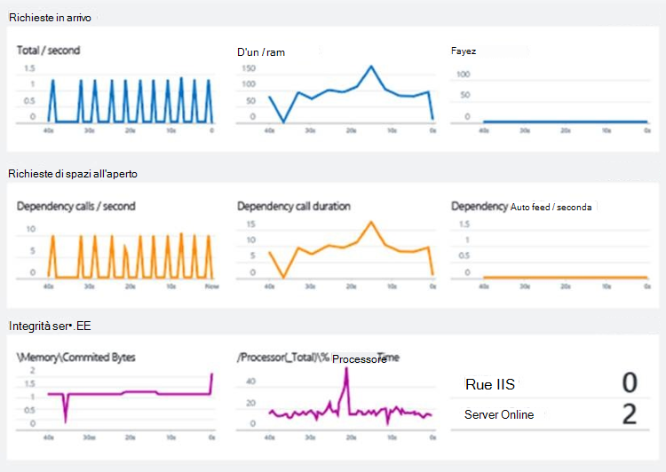

Diversamente da quanto succede metriche Esplora Live metriche flusso Visualizza una serie fissa di metriche. I dati vengono conservati solo per, purché sia del grafico e viene eliminata. 

### Annotazioni

[Annotazioni di rilascio](app-insights-annotations.md) nei grafici metriche Mostra in cui è stato distribuito una nuova compilazione. Semplificano le operazioni verificare se le modifiche ha alcun effetto sulle prestazioni dell'applicazione. Possono essere creati automaticamente da [Visual Studio Team Services creare sistema](https://www.visualstudio.com/en-us/get-started/build/build-your-app-vs)ed è anche possibile [creare direttamente dal PowerShell](#create-annotations-from-powershell).

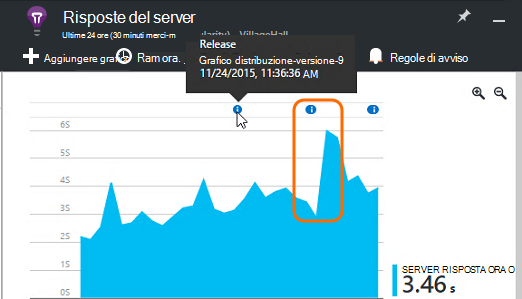

Annotazioni di rilascio sono una caratteristica di compilazione basate su cloud e rilasciare servizio di Visual Studio Team Services. 

## Avvisi

Se si verifichino problemi con l'app, è necessario sapere affrontarlo immediatamente. 

Informazioni dettagliate sui applicazione offre tre tipi di avviso, che vengono inviati tramite posta elettronica.

### Diagnostica preventiva 

[Diagnostica per priorità](app-insights-proactive-failure-diagnostics.md) è impostata automaticamente, non è necessario configurarlo. Purché il sito sia sufficiente il traffico, viene visualizzato un messaggio di posta elettronica se esiste un aumento di richieste non riuscite è insolito per l'ora del giorno o richiesta tasso. L'avviso contiene informazioni di diagnostica. 

Ecco un esempio di avviso. 

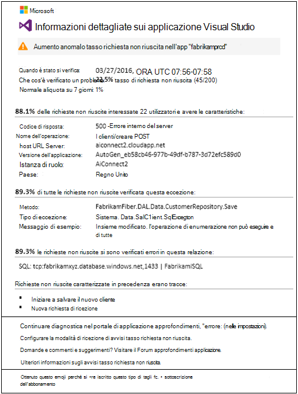

Un secondo tipo rilevamento preventivo individua correlazioni tra errori e alcuni fattori, come posizione, sistema operativo del client o il tipo di browser.

### Metrici avvisi

È possibile configurare [avvisi metrici](app-insights-alerts.md) per stabilire quando le unità di misura metriche supera un valore di soglia per un determinato periodo, ad esempio numero di errori, memoria o visualizzazioni di pagina.

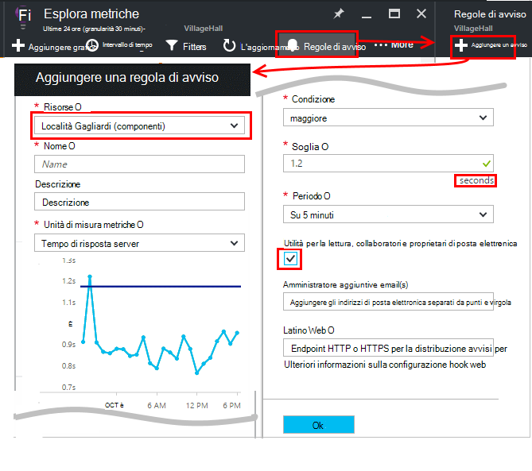

### Disponibilità

[Test web disponibilità](app-insights-monitor-web-app-availability.md) inviare richieste al sito dai server in diverse posizioni in tutto il mondo. Essi indicano quando il sito è disponibile su internet o risponde lentamente. 

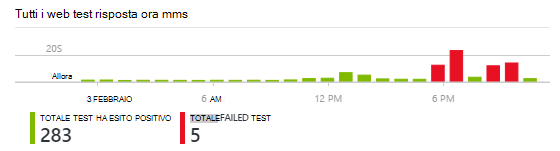

## Esportazione

Esistono diversi modi per ottenere i dati di telemetria fuori portale approfondimenti applicazione:

* [Esportare continua](app-insights-export-telemetry.md) è ideale se si desidera mantenere gran parte del telemetria per maggiore del periodo di conservazione standard.
* [Metriche di](app-insights-metrics-explorer.md#export-to-excel) tabelle, i risultati di ricerca e risultati [Analitica](app-insights-analytics.md) possono essere esportati in un foglio di calcolo di Excel. 
* All'API REST di Access dati può essere utilizzato per cercare ed estrarre i dati, incluse l'esecuzione di query Analitica. L'API è attualmente in anteprima privato. [Informazioni su come partecipare all'anteprima](https://visualstudio.uservoice.com/forums/357324-application-insights/suggestions/4999529-make-data-accessible-via-apis-for-custom-processin).
* È possibile esportare i dashboard [query Analitica a Power BI](app-insights-export-power-bi.md) e visualizzare i risultati nelle visualizzazioni di Power BI, possono essere aggiornate automaticamente.

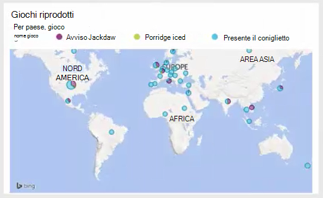
 
## Gestione dei dati

Esistono limiti sull'utilizzo delle informazioni dettagliate sui applicazione, dipendenti in una certa misura la combinazione di prezzo che si è scelto di. I limiti principali siano presenti:

* Tasso di telemetria al minuto
* Numero di punti dati al mese
* Periodo di conservazione per i dati

[Il campionamento](app-insights-sampling.md) è un meccanismo per ridurre i costi ed evitare la limitazione. Ignora una percentuale del telemetria, mantenere un campione representative. Gli elementi associati (ad esempio eccezioni e le richieste che li ha) vengono mantenuti o eliminati insieme. Per le applicazioni ASP.NET, campioni automatica e viene applicato nell'app; in caso contrario, è possibile impostare per essere applicati a acquisizione al portale.

## Passaggi successivi

Per iniziare in fase di esecuzione con:

* [Server IIS](app-insights-monitor-performance-live-website-now.md)
* [Server J2EE](app-insights-java-live.md)

Per iniziare in fase di sviluppo con:

* [ASP.NET](app-insights-asp-net.md)
* [Java](app-insights-java-get-started.md)
* [Node](app-insights-nodejs.md)

## Supporto e commenti

* Domande e problemi:
 * [Risoluzione dei problemi][qna]
 * [Forum MSDN](https://social.msdn.microsoft.com/Forums/vstudio/home?forum=ApplicationInsights)
 * [StackOverflow](http://stackoverflow.com/questions/tagged/ms-application-insights)
 * [Ottenere supporto per sviluppatori](app-insights-get-dev-support.md)
* Suggerimenti:
 * [Uservoicehttp](https://visualstudio.uservoice.com/forums/357324)
* Blog:
 * [Applicazione informazioni dettagliate sui blog](https://azure.microsoft.com/blog/tag/application-insights)

## Video

[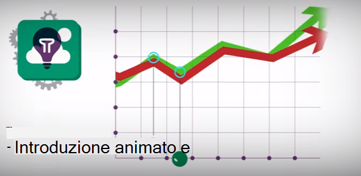](https://www.youtube.com/watch?v=fX2NtGrh-Y0)

> [AZURE.VIDEO 218]

> [AZURE.VIDEO usage-monitoring-application-insights]

> [AZURE.VIDEO performance-monitoring-application-insights]

> [Animazione introduttivo](https://www.youtube.com/watch?v=fX2NtGrh-Y0)

<!--Link references-->

[android]: https://github.com/Microsoft/ApplicationInsights-Android
[azure]: ../insights-perf-analytics.md
[client]: app-insights-javascript.md
[desktop]: app-insights-windows-desktop.md
[detect]: app-insights-detect-triage-diagnose.md
[greenbrown]: app-insights-asp-net.md
[ios]: https://github.com/Microsoft/ApplicationInsights-iOS
[java]: app-insights-java-get-started.md
[knowUsers]: app-insights-overview-usage.md
[platforms]: app-insights-platforms.md
[portal]: http://portal.azure.com/
[qna]: app-insights-troubleshoot-faq.md
[redfield]: app-insights-monitor-performance-live-website-now.md

 