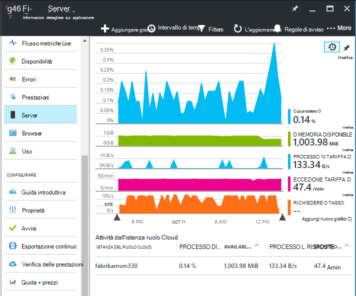
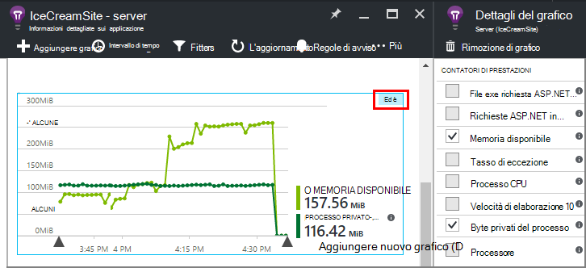
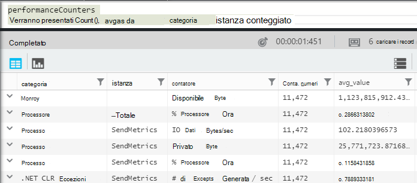
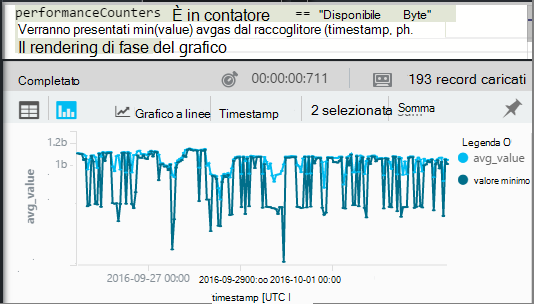
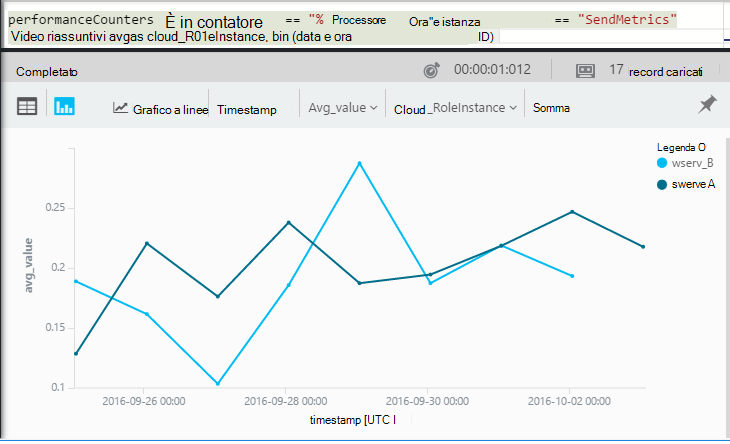

<properties 
    pageTitle="Contatori nell'applicazione approfondimenti | Microsoft Azure" 
    description="Sistema Monitor e contatori delle prestazioni .NET personalizzati nell'applicazione approfondimenti." 
    services="application-insights" 
    documentationCenter=""
    authors="alancameronwills" 
    manager="douge"/>

<tags 
    ms.service="application-insights" 
    ms.workload="tbd" 
    ms.tgt_pltfrm="ibiza" 
    ms.devlang="na" 
    ms.topic="article" 
    ms.date="10/11/2016" 
    ms.author="awills"/>
 
# <a name="system-performance-counters-in-application-insights"></a>Contatori delle prestazioni del sistema nell'applicazione approfondimenti


Windows offre una vasta gamma di [contatori](http://www.codeproject.com/Articles/8590/An-Introduction-To-Performance-Counters) , ad esempio all'occupazione finale CPU, memoria, disco e l'utilizzo della rete. È inoltre possibile definire il proprio. [Applicazione che](app-insights-overview.md) è possibile visualizzare tali contatori se l'applicazione è in esecuzione in IIS su un host locale o la macchina virtuale a cui si ha accesso amministrativo. I tipi di grafici indicare le risorse disponibili per l'applicazione live e consente di identificare bilanciato carico tra le istanze di server.

Contatori verranno visualizzati nella e server, che include una tabella che segmenti dall'istanza server.



(Contatori non sono disponibili per Azure Web Apps. Ma è possibile [inviare diagnostica Azure a informazioni dettagliate sui applicazione](app-insights-azure-diagnostics.md)).

## <a name="configure"></a>Configurare

Se l'applicazione approfondimenti stato Monitor non è ancora stato installato nel computer server, è necessario installare in modo da vedere contatori delle prestazioni.

Scaricare ed eseguire [programma di installazione di controllo dello stato](http://go.microsoft.com/fwlink/?LinkId=506648) in ogni istanza server. Se è già installata, non è necessario eseguire nuovamente l'installazione.

* *È [installato il SDK approfondimenti applicazione dell'app](app-insights-asp-net.md) in fase di sviluppo. Controllo dello stato è sempre necessario?*

    Sì, controllo dello stato è necessario per raccogliere contatori per le applicazioni web ASP.NET. Come già noto, controllo dello stato utilizzabile anche a [monitoraggio App web che sono già live](app-insights-monitor-performance-live-website-now.md), senza l'installazione di SDK in fase di sviluppo.


## <a name="view-counters"></a>Visualizzazione contatori

E il server Mostra un insieme di contatori predefinito. 

Per visualizzare altri contatori, modificare i tipi di grafici e il server o aprire una nuova pala [Explorer metriche](app-insights-metrics-explorer.md) e aggiungere nuovi grafici. 

Contatori disponibili sono elencati come metriche durante la modifica di un grafico.



Per visualizzare tutti i grafici più utili in un'unica posizione, creare un [dashboard](app-insights-dashboards.md) e aggiungerli a tale.

## <a name="add-counters"></a>Aggiungere contatori

Se il contatore delle prestazioni desiderato non è visualizzato nell'elenco dei criteri di misurazione, significa che l'applicazione approfondimenti SDK non raccolta nel server web. È possibile configurarlo per eseguire questa operazione.

1. Sapere quali contatori sono disponibili sul server tramite questo comando di PowerShell nel server:

    `Get-Counter -ListSet *`

    (See [`Get-Counter`](https://technet.microsoft.com/library/hh849685.aspx).)

1. Aprire ApplicationInsights.config.

 * Se è stato aggiunto applicazione approfondimenti all'app durante lo sviluppo, modificare ApplicationInsights.config del progetto e quindi distribuirlo nuovamente il server.
 * Se è stato Monitor per dotare un'app web in fase di esecuzione, trovare ApplicationInsights.config nella directory principale dell'applicazione in IIS. Aggiornare sono in ogni istanza del server.

2. Modificare l'istruzione Raccoglitore prestazioni:

 ```XML

    <Add Type="Microsoft.ApplicationInsights.Extensibility.PerfCounterCollector.PerformanceCollectorModule, Microsoft.AI.PerfCounterCollector">
      <Counters>
        <Add PerformanceCounter="\Objects\Processes"/>
        <Add PerformanceCounter="\Sales(photo)\# Items Sold" ReportAs="Photo sales"/>
      </Counters>
    </Add>

```

È possibile acquisire ai contatori standard e a quelli che è stata implementata se stessi. `\Objects\Processes`è illustrato un esempio di un contatore standard, disponibile in tutti i sistemi di Windows. `\Sales(photo)\# Items Sold`è un esempio di un contatore personalizzato che potrebbe essere implementato in un servizio web. 

Il formato è `\Category(instance)\Counter"`, o per le categorie che non dispongono di istanze, solo `\Category\Counter`.

`ReportAs`è necessario per i nomi dei contatori che non corrispondono a `[a-zA-Z()/-_ \.]+` -vale a dire contengono caratteri non presenti i seguenti: lettere, arrotondare tra parentesi quadre, barra (/), segno meno, sottolineatura, spazio, punto.

Se si specifica un'istanza, verranno raccolti come dimensione "CounterInstanceName" di metrica segnalata.

### <a name="collecting-performance-counters-in-code"></a>La raccolta contatori nel codice

Per raccogliere contatori delle prestazioni di sistema e inviarli a informazioni dettagliate sui applicazione, è possibile adattare il frammento di codice riportata di seguito:

    var perfCollectorModule = new PerformanceCollectorModule();
    perfCollectorModule.Counters.Add(new PerformanceCounterCollectionRequest(
      @"\.NET CLR Memory([replace-with-application-process-name])\# GC Handles", "GC Handles")));
    perfCollectorModule.Initialize(TelemetryConfiguration.Active);

Oppure è possibile eseguire la stessa operazione per metriche personalizzate creato:

    var perfCollectorModule = new PerformanceCollectorModule();
    perfCollectorModule.Counters.Add(new PerformanceCounterCollectionRequest(
      @"\Sales(photo)\# Items Sold", "Photo sales"));
    perfCollectorModule.Initialize(TelemetryConfiguration.Active);

## <a name="performance-counters-in-analytics"></a>Contatori delle prestazioni in Analitica

È possibile eseguire ricerche e visualizzare report sulle prestazioni del contatore in [Analitica](app-insights-analytics.md).


Lo schema **contatori di prestazioni** espone il `category`, `counter` nome e `instance` nome di ogni contatore delle prestazioni.  In telemetria per ogni applicazione, verrà visualizzato solo i contatori per tale applicazione. Ad esempio, per vedere quali contatori sono disponibili: 



("Istanza" di seguito si riferisce a istanza del contatore prestazioni non all'istanza di computer server o ruolo. Il nome dell'istanza contatore prestazioni segmenti in genere contatori, ad esempio tempo processore in base al nome del processo o dell'applicazione.)

Per inserire un grafico di memoria disponibile nel periodo di recente: 




Ad esempio altri telemetria **contatori di prestazioni** è installato anche una colonna `cloud_RoleInstance` che indica l'identità dell'istanza di host server che esegue l'app. Ad esempio, per confrontare le prestazioni dell'app su computer diversi: 




## <a name="aspnet-and-application-insights-counts"></a>ASP.NET e i conteggi approfondimenti applicazione

*Che cos'è la differenza tra il tasso di eccezione e metriche eccezioni?*

* *Tasso di eccezione* è un contatore di prestazioni di sistema. CLR conta tutte le gestite e non gestite eccezioni generate e divide il totale in un intervallo di esempio per la durata dell'intervallo. Applicazione approfondimenti SDK raccoglie questo risultato e invia al portale.
* *Eccezioni* indica il conteggio dei report TrackException ricevuto tramite il portale nell'intervallo di campioni del grafico. Includa solo le eccezioni gestite nel punto in cui è stato scritto TrackException chiama del codice e non include tutte [le eccezioni non gestite](app-insights-asp-net-exceptions.md). 

## <a name="alerts"></a>Avvisi

Quali altre misure, è possibile [impostare un avviso](app-insights-alerts.md) per un messaggio di avviso se un contatore delle prestazioni passa all'esterno di un limite specificato. Aprire e l'avvisi e fare clic su Aggiungi avviso.


## <a name="next"></a>Passaggi successivi

* [Tenere traccia delle dipendenze](app-insights-asp-net-dependencies.md)
* [Eccezione rilevamento modifiche](app-insights-asp-net-exceptions.md)