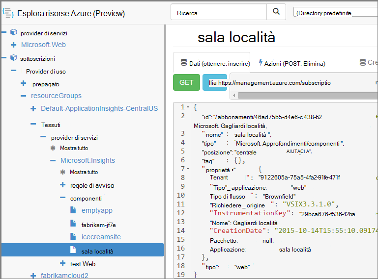

<properties 
    pageTitle="Creazione di risorse approfondimenti applicazione tramite PowerShell" 
    description="Creare a livello di programmazione risorse applicazione approfondimenti durante la compilazione." 
    services="application-insights" 
    documentationCenter=""
    authors="alancameronwills" 
    manager="douge"/>

<tags 
    ms.service="application-insights" 
    ms.workload="tbd" 
    ms.tgt_pltfrm="ibiza" 
    ms.devlang="na" 
    ms.topic="article" 
    ms.date="03/02/2016" 
    ms.author="awills"/>
 
# <a name="create-application-insights-resources-using-powershell"></a>Creazione di risorse approfondimenti applicazione tramite PowerShell

In questo articolo viene illustrato come creare automaticamente una risorsa [Applicazione approfondimenti](app-insights-overview.md) in Azure. Potrebbe, ad esempio, non come parte del processo di compilazione. Insieme alla risorsa applicazione approfondimenti base, è possibile creare [test web disponibilità](app-insights-monitor-web-app-availability.md), [configurare avvisi](app-insights-alerts.md)e creare altre risorse Azure.

Il tasto per la creazione di queste risorse è modelli JSON per la [Gestione di risorse di Azure](../powershell-azure-resource-manager.md). In breve, la procedura è: scaricare le definizioni di JSON di risorse esistenti. aggiungere un parametro alcuni valori, ad esempio nomi. e quindi eseguire il modello ogni volta che si desidera creare una nuova risorsa. È possibile raggruppare più risorse, per crearle solo passare - ad esempio un monitor app con i test di disponibilità, avvisi e lo spazio di archiviazione per l'esportazione continua. Esistono alcune sfumature ad alcune delle parametrizzazioni, che verrà spiegato di seguito.

## <a name="one-time-setup"></a>Iniziali di configurazione

Se non è stato usato PowerShell con l'abbonamento Azure prima di:

Installare il modulo di Azure Powershell nel computer in cui si vuole eseguire gli script:

1. Installare [installazione guidata piattaforma Web Microsoft (v5 o versioni successive)](http://www.microsoft.com/web/downloads/platform.aspx).
2. Utilizzata per l'installazione di Microsoft Azure Powershell.

## <a name="copy-the-json-for-existing-resources"></a>Copia JSON per le risorse esistenti

1. Configurare [Applicazione approfondimenti](app-insights-overview.md) per un progetto simili a quelli che si desidera generare automaticamente. Se si desidera, aggiungere test web e avvisi.
2. Creare un nuovo file .json - è possibile definirlo `template1.json` in questo esempio. Copiare il contenuto al suo interno:


    ```JSON

        {
          "$schema": "https://schema.management.azure.com/schemas/2015-01-01/deploymentTemplate.json#",
          "contentVersion": "1.0.0.0",
          "parameters": {
            "appName": { "type": "string" },
            "webTestName": { "type": "string" },
            "url": { "type": "string" },
            "text": { "type" : "string" }
          },
          "variables": {
            "testName": "[concat(parameters('webTestName'), 
               '-', toLower(parameters('appName')))]"
            "alertRuleName": "[concat(parameters('webTestName'), 
               '-', toLower(parameters('appName')), 
               '-', subscription().subscriptionId)]"
          },
          "resources": [
            {
              // component JSON file contents
            },
            {
              //web test JSON file contents
            },
            {
              //alert rule JSON file contents
            }
 
            // Any other resources go here
          ]
        }
    
    ```

    Questo modello verrà impostata la disponibilità di un test oltre la risorsa principale.


2. Aprire [Gestione risorse di Azure](https://resources.azure.com/). Spostarsi verso il basso tramite `subscriptions/resourceGroups/<your resource group>/providers/Microsoft.Insights/components`, alla risorsa di applicazione. 

    

    *Componenti* sono le risorse di base informazioni dettagliate sui applicazione per la visualizzazione delle applicazioni. Sono disponibili risorse distinte per le regole di avviso associate disponibilità web test.

3. Copiare JSON del componente nella posizione appropriata nel `template1.json`.
6. Eliminazione di queste proprietà:
  * `id`
  * `InstrumentationKey`
  * `CreationDate`
4. Aprire le sezioni utilizzata e alertrules e copiare JSON per i singoli elementi nel modello. (Non copiare i nodi utilizzata o alertrules: passare negli elementi di sotto di essi.)

    Ogni test web sono una regola di avviso associata, pertanto è necessario copiare entrambi gli elementi.

    Il test web devono essere inseriti prima la regola di avviso.

5. Per soddisfare lo schema, inserire la riga di ogni risorsa:

    `"apiVersion": "2014-04-01",`

    (Lo schema segnala anche sull'uso delle maiuscole dei nomi di tipo risorsa `Microsoft.Insights/*` , ma *non* modificarle.)


## <a name="parameterize-the-template"></a>Impostare i parametri del modello

A questo punto è necessario sostituire i nomi specifici con parametri. Per [aggiungere un parametro a un modello](../resource-group-authoring-templates.md), scrivere le espressioni utilizzando un [set di funzioni di supporto](../resource-group-template-functions.md). 

Non è possibile impostare i parametri solo una parte di una stringa, quindi usare `concat()` per creare stringhe.

Ecco alcuni esempi di sostituzioni che è consigliabile verificare. Esistono diverse occorrenze di ogni sostituzione. Potrebbe essere necessario ad altri utenti nel modello scelto. In questi esempi vengono utilizzano i parametri e variabili che è stata definita nella parte superiore del modello.

Trova | Sostituire con
---|---
`"hidden-link:/subscriptions/.../components/MyAppName"`| `"[concat('hidden-link:',`<br/>` resourceId('microsoft.insights/components',` <br/> ` parameters('appName')))]"`
`"/subscriptions/.../alertrules/myAlertName-myAppName-subsId",` | `"[resourceId('Microsoft.Insights/alertrules', variables('alertRuleName'))]",`
`"/subscriptions/.../webtests/myTestName-myAppName",` | `"[resourceId('Microsoft.Insights/webtests', parameters('webTestName'))]",`
`"myWebTest-myAppName"` | `"[variables(testName)]"'`
`"myTestName-myAppName-subsId"` | `"[variables('alertRuleName')]"`
`"myAppName"` | `"[parameters('appName')]"`
`"myappname"`(minuscole) | `"[toLower(parameters('appName'))]"`
`"<WebTest Name=\"myWebTest\" ...`<br/>` Url=\"http://fabrikam.com/home\" ...>"`|`[concat('<WebTest Name=\"',` <br/> `parameters('webTestName'),` <br/> `'\" ... Url=\"', parameters('Url'),` <br/> `'\"...>')]" `


## <a name="set-dependencies-between-the-resources"></a>Impostare dipendenze tra le risorse

Azure deve configurare le risorse in restrittive dell'ordine. Per assicurarsi che una configurazione viene completata prima che inizi il successivo, aggiungere linee di relazione:

* In risorse di test web:

    `"dependsOn": ["[resourceId('Microsoft.Insights/components', parameters('appName'))]"],`

* Nell'avviso risorsa:

    `"dependsOn": ["[resourceId('Microsoft.Insights/webtests', variables('testName'))]"],`

## <a name="create-application-insights-resources"></a>Creare approfondimenti applicazione risorse

1. In PowerShell, accedere a Azure

    `Login-AzureRmAccount`

2. Eseguire un comando alla seguente:

    ```PS

        New-AzureRmResourceGroupDeployment -ResourceGroupName Fabrikam `
               -templateFile .\template1.json `
               -appName myNewApp `
               -webTestName aWebTest `
               -Url http://myapp.com `
               -text "Welcome!"
               -siteName "MyAzureSite"

    ``` 

    * -ResourceGroupName è il gruppo in cui si desidera creare nuove risorse.
    * -templateFile devono precedere i parametri personalizzati.
    * -NomeApplicazione il nome della risorsa da creare.
    * -webTestName il nome del test web per creare.
    * -Url l'url dell'applicazione web.
    * -stringa di testo che viene visualizzata nella pagina web.
    * -NomeSito - utilizzato se si tratta di un sito Web di Azure


## <a name="define-metric-alerts"></a>Definire gli avvisi metrici

Esiste un [metodo di PowerShell dell'impostazione degli avvisi](app-insights-alerts.md#set-alerts-by-using-powershell).


## <a name="an-example"></a>Un esempio

Ecco il componente completa, test web e test avviso modello web creati:

``` JSON

{
  "$schema": "https://schema.management.azure.com/schemas/2015-01-01/deploymentTemplate.json#",
  "contentVersion": "1.0.0.0",
  "parameters": {
    "webTestName": { "type": "string" },
    "appName": { "type": "string" },
    "URL": { "type": "string" },
    "text": { "type" : "string" }
  },
  "variables": {
    "alertRuleName": "[concat(parameters('webTestName'), '-', toLower(parameters('appName')), '-', subscription().subscriptionId)]",
    "testName": "[concat(parameters('webTestName'), '-', toLower(parameters('appName')))]"
  },
  "resources": [
    {
      //"id": "[resourceId('Microsoft.Insights/components', parameters('appName'))]",
      "apiVersion": "2014-04-01",
      "kind": "web",
      "location": "Central US",
      "name": "[parameters('appName')]",
      "properties": {
        "TenantId": "9122605a-471fc50f8438",
        "Application_Type": "web",
        "Flow_Type": "Brownfield",
        "Request_Source": "VSIX3.3.1.0",
        "Name": "[parameters('appName')]",
        //"CreationDate": "2015-10-14T15:55:10.0917441+00:00",
        "PackageId": null,
        "ApplicationId": "[parameters('appName')]"
      },
      "tags": { },
      "type": "microsoft.insights/components"
    },
    {
      //"id": "[resourceId('Microsoft.Insights/webtests', variables('testName'))]",
      "name": "[variables('testName')]",
      "apiVersion": "2014-04-01",
      "type": "microsoft.insights/webtests",
      "location": "Central US",
      "tags": {
        "[concat('hidden-link:', resourceId('microsoft.insights/components', parameters('appName')))]": "Resource"
      },
      "properties": {
        "provisioningState": "Succeeded",
        "Name": "[parameters('webTestName')]",
        "Description": "",
        "Enabled": true,
        "Frequency": 900,
        "Timeout": 120,
        "Kind": "ping",
        "RetryEnabled": true,
        "Locations": [
          {
            "Id": "us-va-ash-azr"
          },
          {
            "Id": "emea-nl-ams-azr"
          },
          {
            "Id": "emea-gb-db3-azr"
          }
        ],
        "Configuration": {
          "WebTest": "[concat(
             '<WebTest   Name=\"', 
                parameters('webTestName'), 
              '\"  Id=\"32cfc791-aaad-4b50-9c8d-993c21beb218\"   Enabled=\"True\"         CssProjectStructure=\"\"    CssIteration=\"\"  Timeout=\"120\"  WorkItemIds=\"\"         xmlns=\"http://microsoft.com/schemas/VisualStudio/TeamTest/2010\"         Description=\"\"  CredentialUserName=\"\"  CredentialPassword=\"\"         PreAuthenticate=\"True\"  Proxy=\"default\"  StopOnError=\"False\"         RecordedResultFile=\"\"  ResultsLocale=\"\">  <Items>  <Request Method=\"GET\"         Guid=\"a6f2c90b-61bf-b28hh06gg969\"  Version=\"1.1\"  Url=\"', 
              parameters('Url'), 
              '\" ThinkTime=\"0\"  Timeout=\"300\" ParseDependentRequests=\"True\"         FollowRedirects=\"True\" RecordResult=\"True\" Cache=\"False\"         ResponseTimeGoal=\"0\"  Encoding=\"utf-8\"  ExpectedHttpStatusCode=\"200\"         ExpectedResponseUrl=\"\" ReportingName=\"\" IgnoreHttpStatusCode=\"False\" />        </Items>  <ValidationRules> <ValidationRule  Classname=\"Microsoft.VisualStudio.TestTools.WebTesting.Rules.ValidationRuleFindText, Microsoft.VisualStudio.QualityTools.WebTestFramework, Version=10.0.0.0, Culture=neutral, PublicKeyToken=b03f5f7f11d50a3a\" DisplayName=\"Find Text\"         Description=\"Verifies the existence of the specified text in the response.\"         Level=\"High\"  ExectuionOrder=\"BeforeDependents\">  <RuleParameters>        <RuleParameter Name=\"FindText\" Value=\"', 
              parameters('text'), 
              '\" />  <RuleParameter Name=\"IgnoreCase\" Value=\"False\" />  <RuleParameter Name=\"UseRegularExpression\" Value=\"False\" />  <RuleParameter Name=\"PassIfTextFound\" Value=\"True\" />  </RuleParameters> </ValidationRule>  </ValidationRules>  </WebTest>')]"
        },
        "SyntheticMonitorId": "[variables('testName')]"
      }
    },
    {
      //"id": "[resourceId('Microsoft.Insights/alertrules', variables('alertRuleName'))]",
      "name": "[variables('alertRuleName')]",
      "apiVersion": "2014-04-01",
      "type": "microsoft.insights/alertrules",
      "location": "East US",
      "dependsOn": [
        "[resourceId('Microsoft.Insights/components', parameters('appName'))]",
        "[resourceId('Microsoft.Insights/webtests', variables('testName'))]"
      ],
      "tags": {
        "[concat('hidden-link:', resourceId('Microsoft.Insights/components', parameters('appName')))]": "Resource",
        "[concat('hidden-link:', resourceId('Microsoft.Insights/webtests', variables('testName')))]": "Resource"
      },
      "properties": {
        "name": "[variables('alertRuleName')]",
        "description": "",
        "isEnabled": true,
        "condition": {
          "$type": "Microsoft.WindowsAzure.Management.Monitoring.Alerts.Models.LocationThresholdRuleCondition, Microsoft.WindowsAzure.Management.Mon.Client",
          "odata.type": "Microsoft.Azure.Management.Insights.Models.LocationThresholdRuleCondition",
          "dataSource": {
            "$type": "Microsoft.WindowsAzure.Management.Monitoring.Alerts.Models.RuleMetricDataSource, Microsoft.WindowsAzure.Management.Mon.Client",
            "odata.type": "Microsoft.Azure.Management.Insights.Models.RuleMetricDataSource",
            "resourceUri": "[resourceId('microsoft.insights/webtests', variables('testName'))]",
            "metricName": "GSMT_AvRaW"
          },
          "windowSize": "PT15M",
          "failedLocationCount": 2
        },
        "action": {
          "$type": "Microsoft.WindowsAzure.Management.Monitoring.Alerts.Models.RuleEmailAction, Microsoft.WindowsAzure.Management.Mon.Client",
          "odata.type": "Microsoft.Azure.Management.Insights.Models.RuleEmailAction",
          "sendToServiceOwners": true,
          "customEmails": [ ]
        },
        "provisioningState": "Succeeded",
        "actions": [ ]
      }

    }
  ]
}

```

## <a name="see-also"></a>Vedere anche

Altri articoli di automazione:

* [Creare una risorsa applicazione approfondimenti](app-insights-powershell-script-create-resource.md) - metodo rapido senza utilizzare un modello.
* [Impostare avvisi](app-insights-powershell-alerts.md)
* [Creare test web](https://azure.microsoft.com/blog/creating-a-web-test-alert-programmatically-with-application-insights/)
* [Inviare diagnostica Windows Azure a informazioni dettagliate sui applicazione](app-insights-powershell-azure-diagnostics.md)
* [Creare le annotazioni di rilascio](https://github.com/Microsoft/ApplicationInsights-Home/blob/master/API/CreateReleaseAnnotation.ps1)
