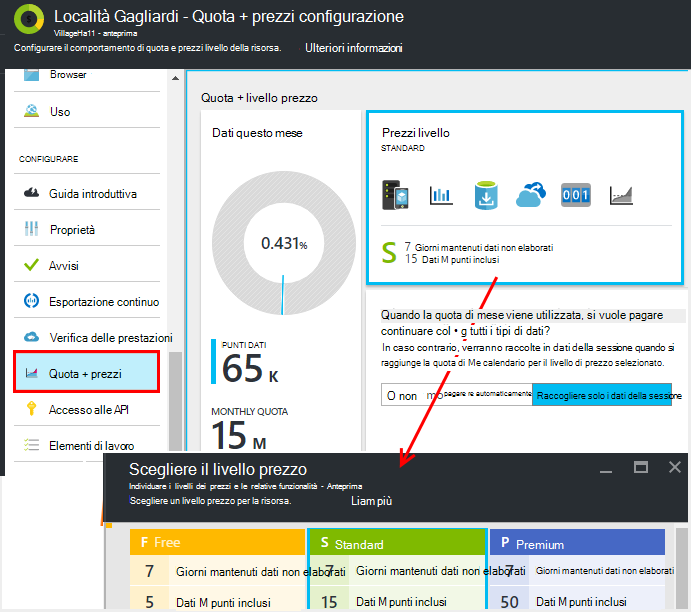
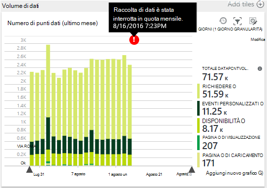
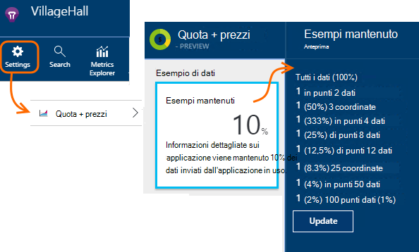
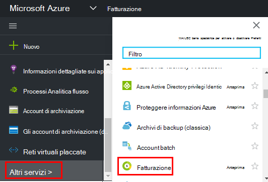

<properties 
    pageTitle="Gestire i prezzi e le quote per informazioni dettagliate sui applicazione | Microsoft Azure" 
    description="Scegliere il piano di prezzo che è necessario gestire i volumi di telemetria" 
    services="application-insights" 
    documentationCenter=""
    authors="alancameronwills" 
    manager="douge"/>

<tags 
    ms.service="application-insights" 
    ms.workload="tbd" 
    ms.tgt_pltfrm="ibiza" 
    ms.devlang="na" 
    ms.topic="article" 
    ms.date="10/13/2016" 
    ms.author="awills"/>

# Gestire i prezzi e le quote per informazioni dettagliate sui applicazione

*Informazioni dettagliate sui applicazione è in anteprima.*

[Prezzi] [ pricing] per [Visual Studio applicazione approfondimenti] [ start] dipende dal volume di dati per ogni applicazione. Esiste un sostanziale livello libero in cui viene visualizzato la maggior parte delle caratteristiche con alcune limitazioni.

Ogni risorsa applicazione approfondimenti addebitato come servizio separato e contribuisce alla fattura per l'abbonamento in Azure.

[Vedere la combinazione dei prezzi][pricing].

## Rivedere la quota e il prezzo del piano per la risorsa applicazione approfondimenti

È possibile aprire la Quota + prezzi blade dalle impostazioni della risorsa dell'applicazione.

Corrispondente a prezzi combinazione influisce su:

* [Quota mensile](#monthly-quota) - la quantità di telemetria che è possibile analizzare ogni mese.
* [Velocità](#data-rate) : velocità massima in cui è possono elaborare dati dell'app.
* [Esportare continua](#continuous-export) - se è possibile esportare dati in altri strumenti e i servizi.

Questi limiti sono impostati separatamente per ogni risorsa approfondimenti applicazione.

### Versione di valutazione gratuita Premium

Quando si crea una nuova risorsa applicazione approfondimenti, viene avviato nel livello gratuito.

In qualsiasi momento, è possibile passare la versione di valutazione gratuita con Premium a 30 giorni. In questo modo i vantaggi del livello Premium. Dopo 30 giorni, verrà automaticamente ripristinata a qualsiasi livello è utilizzato nella prima, a meno che non si scelga esplicitamente un altro livello. Si seleziona il livello desiderato in qualsiasi momento durante il periodo di valutazione, ma viene ancora visualizzato il periodo di valutazione gratuita fino alla fine del periodo di 30 giorni.

## Quota mensile

* In ogni mese, l'applicazione di inviare a una quantità specificata di telemetria a informazioni dettagliate sui applicazione. La quota per il livello di prezzo gratuito è al momento 5 milioni di punti di dati per ogni mese e in modo sostanziale altro per le altre combinazioni; è possibile acquistare altre se si raggiunge la quota.  Vedere i [prezzi combinazione] [ pricing] per i valori effettivi. 
* La quota dipende dal livello prezzo che si è scelto.
* La quota viene conteggiata da mezzanotte UTC il primo giorno di ogni mese.
* Il grafico di punti dati mostra la questo mese quantità della quota della utilizzato.
* La quota misurata in *coordinate.* Un unico punto dati è una chiamata a uno dei metodi traccia se chiamato in modo esplicito nel codice o da uno dei moduli di telemetria standard. Può avere più proprietà associate e metriche.
* Punti dati generati da:
 * [Moduli SDK](app-insights-configuration-with-applicationinsights-config.md) che automaticamente raccogliere dati, ad esempio per segnalare una richiesta o un arresto anomalo o migliorare le prestazioni.
 * [API](app-insights-api-custom-events-metrics.md) `Track...` le chiamate a cui è stato scritto, ad esempio `TrackEvent` o `trackPageView`.
 * [Test web disponibilità](app-insights-monitor-web-app-availability.md) che è stata configurata.
* Mentre si esegue il debug, è possibile visualizzare i punti dati inviati dell'App nella finestra di output Visual Studio. Eventi client possono essere visti aprendo che la scheda di rete nel browser del debug riquadro (in genere F12).
* *Dati della sessione* non viene contata della quota. Sono inclusi i conteggi relativi utenti, sessioni, ambiente e dati di dispositivo.
* Se si desidera contare i punti di dati dal controllo, è possibile trovarle in varie posizioni:
 * Ogni elemento viene visualizzato nella [ricerca diagnostica](app-insights-diagnostic-search.md), che include le richieste, eccezioni, tracce log, visualizzazioni delle pagine, gli eventi di dipendenza ed eventi personalizzati HTTP.
 * Ogni misura non elaborato di un' [unità di misura metriche](app-insights-metrics-explorer.md) , ad esempio un contatore delle prestazioni. (Punti che viene visualizzato nei tipi di grafici sono in genere le aggregazioni di più punti di dati non elaborati)
 * Ogni punto in un grafico di disponibilità web è un'aggregazione di punti dati diversi.
* È anche possibile esaminare singoli punti dati origine durante il debug:
 * Se si esegue l'app in modalità di debug in Visual Studio, le coordinate verranno registrate nella finestra di Output. 
 * Per visualizzare le coordinate client, aprire il riquadro debug del browser (in genere F12) e aprire la scheda di rete.
* La velocità dei dati può essere (per impostazione predefinita) ridotta per [adattata sondaggio](app-insights-sampling.md). Questo errore indica che, come l'utilizzo della aumenta app, non è possibile aumentare la velocità di telemetria come ci si potrebbe aspettare.

### Eccesso di dosaggio

Se l'applicazione invia più la quota mensile, è possibile:

* Non pagare dati aggiuntivi. Vedere i [prezzi combinazione] [ pricing] per informazioni dettagliate. È possibile scegliere questa opzione in anticipo. Questa opzione non è disponibile in gratuito prezzi livello.
* Aggiornare il livello dei prezzi.
* Non eseguire alcuna operazione. Dati della sessione continueranno a essere registrati, ma altri dati non compariranno nella ricerca diagnostica o in Esplora metriche.

## La quantità di dati si sta inviando?

Il grafico nella parte inferiore dei prezzi blade Mostra volume del punto dati dell'applicazione, raggruppati in base al tipo di dati decimale. (È possibile anche creare il grafico in unità di misura metriche Esplora.)

Fare clic sul grafico per informazioni dettagliate, o trascinare su di esso e fare clic su (+) per i dati di dettaglio di un intervallo di tempo.

Il grafico mostra il volume dei dati che arrivano a partire nel servizio applicazione approfondimenti dopo [campioni](app-insights-sampling.md).

Se il volume di dati raggiunge la quota mensile, un'annotazione viene visualizzata nel grafico.

## Tasso di dati

Oltre la quota mensile, esistono limiti limitazioni la velocità dei dati. Per gratuito [prezzi livello] [ pricing] il limite è 200 dati punti/secondo Media in 5 minuti e per il pagamento livelli 500/s calcolare la media supera 1 minuto. 

Esistono tre intervalli che vengono contati separatamente:

* [Chiamate TrackTrace](app-insights-api-custom-events-metrics.md#track-trace) e [acquisizione dei log](app-insights-asp-net-trace-logs.md)
* [Eccezioni](app-insights-api-custom-events-metrics.md#track-exception), limitato a 50 punti/s.
* Tutti gli altri telemetria (visualizzazioni pagine, sessioni, richieste, dipendenze, metriche, eventi personalizzati, i risultati dei test web).

*Cosa succede se app supera la frequenza al secondo?*

* Il volume dei dati che invia l'app viene valutato ogni minuto. Se supera al secondo il minuto come Media, il server rifiuta alcune richieste. SDK di buffer i dati e quindi si tenta di inviare di nuovo, la distribuzione di un aumento in alcuni minuti. Se l'app in modo coerente invia dati immediatamente sopra il tasso di limitazione, alcuni dati verranno rimosse. (La ASP.NET, Java e JavaScript SDK provare a inviare di nuovo in questo modo; altri SDK potrebbe semplicemente i dati di elenco a discesa limitato).

Se la limitazione si verifica, si verrà visualizzata una notifica di avviso che si è verificato.

*Sapere come numero di punti dati l'invio di app*

* Aprire Impostazioni/Quota e prezzi per visualizzare il grafico Volume di dati.
* Oppure in Esplora metriche, aggiungere un nuovo grafico e scegliere **volume del punto dati** come l'unità di misura metriche. Attivare il raggruppamento e Raggruppa per **tipo di dati**.

## Per ridurre la velocità dei dati

Se si verificano i limiti di limitazioni, ecco alcune operazioni che è possibile eseguire:

* Utilizzare [campioni](app-insights-sampling.md). Questa tecnologia riduce velocità dati senza inclinazione le metriche e senza interrompere la possibilità di spostarsi tra gli elementi correlati nella ricerca.
* [Limitare il numero di chiamate Ajax che possono essere inserite](app-insights-javascript.md#detailed-configuration) in ogni visualizzazione pagina o cambia disattivare Ajax reporting.
* Disattivare i moduli di raccolta che non è necessario modificando [ApplicationInsights.config](app-insights-configuration-with-applicationinsights-config.md). Ad esempio, è possibile che siano inessential contatori o dati sulle dipendenze.
* Pre-aggregare metriche. Se è stato inserito chiamate a TrackMetric nell'app, è possibile ridurre il traffico utilizzando l'overload che accetta il calcolo della media e la deviazione standard di un batch di unità di misura. È possibile utilizzare un [pacchetto pre-aggregazione](https://www.myget.org/gallery/applicationinsights-sdk-labs). 

## Esempio

[Il campionamento](app-insights-sampling.md) è un metodo per ridurre il tasso di cui telemetria viene inviato all'applicazione in uso, mantenendo la possibilità di individuare gli eventi correlati durante le ricerche di diagnostiche e mantenendo corretto evento esegue il conteggio. 

Esempio è un modo efficace per ridurre i costi e non superare la quota mensile. Algoritmo di campioni conserva elementi correlati di telemetria, in modo che, quando si utilizza ricerca, ad esempio, è possibile trovare la richiesta correlata a una determinata eccezione. Algoritmo di mantiene anche conteggi corretti, in modo da visualizzare i valori corretti in unità di misura metriche soluzioni per frequenza richieste, eccezione tariffe e altri conteggi.

Sono disponibili diverse forme di esempio.

* [Adattamento campioni](app-insights-sampling.md) è il valore predefinito per SDK ASP.NET, che vengono regolate automaticamente per il volume di telemetria che invia l'app. Funziona automaticamente in SDK nelle applicazioni web in modo che il traffico di telemetria sulla rete verrà ridotte. 
* *Esempio di acquisizione* costituisce un'alternativa che opera in corrispondenza del punto in cui telemetria dell'App viene posizionato in un servizio approfondimenti applicazione. E non influisce il volume di telemetria inviato dell'App, ma riduce il volume conservato dal servizio. È possibile utilizzare per ridurre la quota utilizzata telemetria dal browser e altri SDK.

Per impostare campioni di acquisizione, impostare il controllo in quote + prezzi blade:

> [AZURE.WARNING] Il valore visualizzato sul riquadro esempi mantenuti indica solo il valore impostato per campioni di acquisizione. Questo non viene visualizzato il tasso di campioni che opera SDK nell'app. 
> 
> Se telemetria in arrivo è già stato campionato SDK, esempio di acquisizione non viene applicata.
 
Per individuare il tasso effettivo campioni indipendentemente da dove è stato applicato, utilizzare una [query Analitica](app-insights-analytics.md) , ad esempio seguente:

    requests | where timestamp > ago(1d)
  	| summarize 100/avg(itemCount) by bin(timestamp, 1h) 
  	| render areachart 

In ogni record, mantenuti `itemCount` indica il numero di record originale che rappresenta, uguale a 1 + il numero di record ignorati precedente. 

## Esaminare la fattura per l'abbonamento a Azure

In base alle tariffe approfondimenti applicazione viene aggiunto alla fattura Azure. È possibile visualizzare i dettagli del Azure distinta sulla sezione fatturazione del portale di Azure o nel [Portale di fatturazione di Azure](https://account.windowsazure.com/Subscriptions). 

## Limiti dei nomi

1.  Numero massimo di 200 nomi metrici univoci e 200 nomi di proprietà univoche per l'applicazione. Metriche di includono i dati inviati tramite TrackMetric, nonché le misurazioni di altri tipi di dati, ad esempio gli eventi.  [I nomi dei parametri e proprietà] [ api] sono globali per chiave strumentazione.
2.  [Proprietà] [ apiproperties] possono essere usati per i filtri e raggruppamento solo se hanno meno di 100 valori univoci per ogni proprietà. Dopo il numero di valori univoci supera 100, è possibile comunque cercare la proprietà, ma non è più utilizzare per i filtri o Raggruppa per.
3.  Proprietà standard, ad esempio richiedere nome e l'URL di pagina sono limitate a 1000 valori univoci per settimana. Dopo aver 1000 valori univoci, altri valori vengono segnati come "Altri valori". I valori originali ancora utilizzabile per ricerca full-text e il filtro.

Se si trova che l'applicazione è superiore a questi limiti, considerare la divisione dei dati tra chiavi strumentazione diversi -, [creare nuove risorse applicazione approfondimenti](app-insights-create-new-resource.md) e inviare alcuni dei dati per le nuove chiavi strumentazione. È possibile che il risultato è meglio strutturato. È possibile utilizzare [i dashboard](app-insights-dashboards.md#dashboards) per visualizzare le diverse metriche nella stessa schermata in modo che questo approccio non limita la possibilità di confrontare metriche diverse. 

## Riepilogo limiti

[AZURE.INCLUDE [application-insights-limits](../../includes/application-insights-limits.md)]

<!--Link references-->

[api]: app-insights-api-custom-events-metrics.md
[apiproperties]: app-insights-api-custom-events-metrics.md#properties
[start]: app-insights-overview.md
[pricing]: http://azure.microsoft.com/pricing/details/application-insights/

 