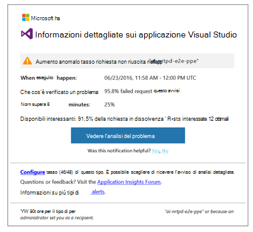
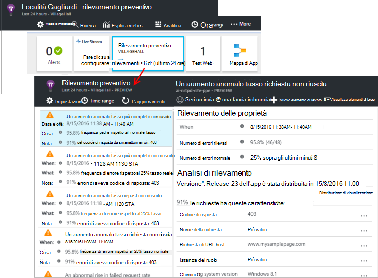

<properties 
    pageTitle="Preventiva diagnostica nell'applicazione approfondimenti | Microsoft Azure" 
    description="Informazioni dettagliate sui applicazione esegue analisi completa automatica di telemetria l'app e avvisa sui problemi potenziali." 
    services="application-insights" 
    documentationCenter="windows"
    authors="rakefetj" 
    manager="douge"/>

<tags 
    ms.service="application-insights" 
    ms.workload="tbd" 
    ms.tgt_pltfrm="ibiza" 
    ms.devlang="na" 
    ms.topic="article" 
    ms.date="08/15/2016" 
    ms.author="awills"/>

#  In applicazione approfondimenti diagnostica preventiva

 Diagnostica preventiva avvisa automaticamente potenziali problemi di prestazioni nell'applicazione web. Consente di eseguire analisi smart di telemetria che l'app Invia a [Informazioni dettagliate sui applicazione di Visual Studio](app-insights-overview.md). Se esiste un aumento inaspettato riuscite o motivi anomale prestazioni client o server, viene visualizzato un avviso. Questa caratteristica non richiede alcuna configurazione. Funziona se l'applicazione invia abbastanza telemetria.

È possibile accedere avvisi di rilevamento preventivo da messaggi di posta elettronica ricevuti e da e il rilevamento preventivo.

## Esaminare i preventivo rilevamenti

È possibile individuare rilevamenti in due modi:

* **Viene visualizzato un messaggio di posta elettronica** da approfondimenti applicazione. Ecco un esempio tipico:

    

    Fare clic sul pulsante per aprire dettagliatamente più avanti nel portale.

* **Rilevamento attivo il riquadro** su blade panoramica dell'app Mostra un conteggio degli avvisi recenti. Fare clic sul riquadro per visualizzare un elenco di avvisi recenti.

Selezionare un avviso per visualizzarne i dettagli.

## Vengono rilevati problemi?

Esistono tre tipi di rilevamento:

* [Diagnostica tasso di errore preventivo](app-insights-proactive-failure-diagnostics.md). Serve correlazione con carico e altri fattori di apprendimento impostare il tasso di richieste non riuscite per l'app previsto. Se il numero di errori va di fuori della busta prevista, viene inviato un avviso.
* [Diagnostica prestazioni preventivo](app-insights-proactive-performance-diagnostics.md). Ricerca modelli anomale tempi di risposta e riuscite ogni giorno. Abbiamo correlare questi problemi con il comando proprietà, ad esempio posizione, browser e client del sistema operativo, istanza server e l'ora del giorno.
* [Servizi Cloud azure](https://azure.microsoft.com/blog/proactive-notifications-on-cloud-service-issues-with-azure-diagnostics-and-application-insights/). Ricevere avvisi se l'app è ospitato in servizi Cloud Windows Azure e un'istanza del ruolo sono previsti gli errori di avvio, riciclaggio frequenti o arresto del runtime.

(La Guida ogni notifica include collegamenti ad articoli pertinenti.)

## Passaggi successivi

Strumenti di diagnostica seguenti consentono di verificare la presenza di telemetria dell'App:

* [Esplora metrica](app-insights-metrics-explorer.md)
* [Soluzioni di ricerca](app-insights-diagnostic-search.md)
* [Analitica - linguaggio di query avanzate](app-insights-analytics-tour.md)

Diagnostica preventiva è completamente automatica. Ma forse si vuole configurare alcuni altri avvisi?

* [Avvisi metrici configurati manualmente](app-insights-alerts.md)
* [Test web disponibilità](app-insights-monitor-web-app-availability.md) 

