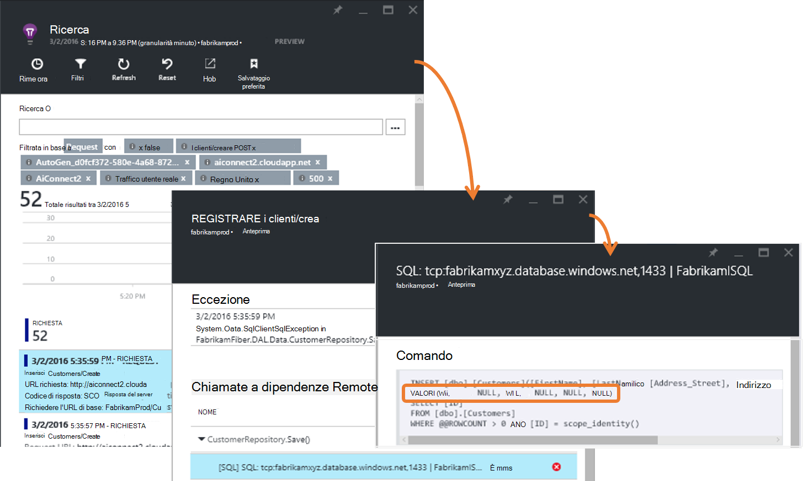

<properties 
    pageTitle="Errore preventivo tasso diagnostica nell'applicazione approfondimenti | Microsoft Azure" 
    description="Notifica l'esistenza di alle modifiche insolite il tasso di richieste non riuscite per un'applicazione web e fornisce analisi diagnostica. È necessaria alcuna configurazione." 
    services="application-insights" 
    documentationCenter=""
    authors="yorac" 
    manager="douge"/>

<tags 
    ms.service="application-insights" 
    ms.workload="tbd" 
    ms.tgt_pltfrm="ibiza" 
    ms.devlang="na" 
    ms.topic="article" 
    ms.date="10/12/2016" 
    ms.author="awills"/>
 
# Errore preventivo tasso diagnostica

[Informazioni dettagliate sui applicazione di Visual Studio](app-insights-overview.md) verrà automaticamente avvisati quasi in tempo reale in caso di un'app web di un aumento anomalo il tasso di errori. Rileva un aumento insolito la frequenza di richieste HTTP segnalato come non è riuscita. Si tratta in genere quelle ottenute con codici di risposta in intervalli 400 e 500. Per valutare e identificare il problema, viene fornita un'analisi delle caratteristiche di richieste non riuscite e telemetria correlato nel messaggio di notifica. Sono disponibili anche i collegamenti al portale di informazioni dettagliate sui applicazione per la diagnosi ulteriormente. La caratteristica non deve alcuna installazione o configurazione, in quanto utilizza algoritmi risorse machine per prevedere il numero di errori normale.

Questa caratteristica funziona per Java e ASP.NET web apps, ospitato nel cloud o nel server. Vale anche per le app che genera telemetria richiesta, ad esempio, se si dispone di un ruolo di lavoro che chiama [TrackRequest()](app-insights-api-custom-events-metrics.md#track-request). 

Dopo la configurazione [Dell'applicazione approfondimenti per il progetto](app-insights-overview.md)e fornito le app genera una certa quantità minime di telemetria, errore preventivo diagnostica accetta 24 ore per apprendere il comportamento normale dell'app, prima che sia attivata e può inviare gli avvisi.

Ecco un esempio di avviso. 

> [AZURE.NOTE] Per impostazione predefinita, viene visualizzato un messaggio di formato più breve rispetto a questo esempio. Ma è possibile [passare a questo formato dettagliato](#configure-alerts).

Si noti che indica che:

* Il numero di errori rispetto alla situazione app normale.
* Quanti utenti sono interessati – per sapere quanto è il rischio.
* Motivo caratteristico associato gli errori. In questo esempio è un codice di risposta particolare, il nome di richiesta (operazione) e la versione di app. Che immediatamente indica la posizione in cui inizia la ricerca nel codice. Altre possibilità può essere un sistema operativo specifico browser o client.
* L'eccezione, tracce di log e problema di dipendenze (database o altri componenti esterni) che vengono visualizzati da associare il caratterizzata richieste non riuscite.
* Collegamenti direttamente alle ricerche pertinenti in telemetria in approfondimenti applicazione.

## Vantaggi di avvisi preventivo

Normale [avvisi metrici](app-insights-alerts.md) indicare potrebbe essersi verificato un problema. Ma diagnostica di errore preventivo viene avviato il lavoro diagnostico per l'utente, eseguire un numero elevato di analisi in caso contrario è necessario eseguire manualmente. Si ottengono i risultati ben disponibili, consentono di ottenere rapidamente nella radice del problema.

## Come funziona

Accanto alla monitor diagnostica preventivo in tempo reale di telemetria ricevuti dell'App in particolare il tasso di richiesta non riuscita. Questa metrica viene contato il numero di richieste per il quale la `Successful request` è false. Per impostazione predefinita, `Successful request== (resultCode < 400)` (a meno che non è stato scritto codice personalizzato a [filtro](app-insights-api-filtering-sampling.md#filtering) o generare chiamate [TrackRequest](app-insights-api-custom-events-metrics.md#track-request) ). 

Prestazioni dell'applicazione presenta un motivo tipico del comportamento. Alcune richieste sarà più soggetti all'errore rispetto ad altri; e il numero di errori generali può salire come carico aumenta. Diagnostica di errore preventivo Usa apprendimento automatico trovare questi alterazioni. 

Come telemetria entra in applicazione approfondimenti da un'applicazione web, diagnostica di errore preventivo confronta il comportamento corrente con i modelli rilevati in pochi giorni precedenti. Se si osserva un aumento anomalo Frequenza errori rispetto prestazioni precedente, viene attivata un'analisi.

Quando viene avviata un'analisi, il servizio esegue un'analisi cluster su richiesta non riuscita, per tentare di identificare un modello di valori che caratterizzare gli errori. Nell'esempio precedente, l'analisi ha scoperto che maggior parte degli errori disponibili su un codice risultato specifico, nome richiesta, host URL del Server e istanza del ruolo. Se invece l'analisi ha scoperto che la proprietà del sistema operativo client viene distribuito con più valori, e pertanto non è elencato.

Quando il servizio Strumentazione con questi telemetria, l'analizzatore trova un'eccezione e un problema di dipendenze associate le richieste di cluster che è stato individuato, insieme a un esempio di tutti i registri traccia associati a tali richieste.

I risultati dell'analisi viene inviato all'utente come avviso, a meno che non è stato configurato non a.

Ad esempio gli [avvisi che impostare manualmente](app-insights-alerts.md), è possibile esaminare lo stato dell'avviso e configurarlo in e l'avvisi della risorsa approfondimenti applicazione. Ma a differenza di altri avvisi, non è necessario configurare o configurare la diagnostica errore preventivo. Se si desidera, è possibile disabilitarlo o modificare gli indirizzi di posta elettronica di destinazione.

## Configurazione di avvisi 

Disattivare diagnostica preventiva, modificare i destinatari del messaggio di posta elettronica, creare un webhook o aderire a messaggi di avviso più dettagliati.

Aprire la pagina avvisi. Diagnostica preventiva viene fornita insieme a tutti gli avvisi impostati manualmente e si può verificare se si trova attualmente nello stato avviso.

Fare clic sull'avviso per configurarlo.

Si noti che è possibile disabilitare la diagnostica per priorità, ma non è possibile eliminare (oppure crearne uno nuovo).

#### Avvisi dettagliati

Se si seleziona "Ricevere analisi dettagliata" messaggio di posta elettronica contiene altre informazioni di diagnostica. In alcuni casi sarà possibile identificare il problema solo dai dati nel messaggio di posta elettronica. 

Esiste un rischio leggero di avviso più dettagliato potrebbe contenere informazioni riservate, poiché include eccezione e traccia messaggi. Tuttavia, questo accadrebbe solo se il codice può consentire a informazioni riservate in questi messaggi. 

## Valutazione e la diagnosi un avviso

Un avviso indica che è stato rilevato un aumento anomalo il tasso di richiesta non riuscita. È probabile che esiste un problema con l'app o il relativo ambiente.

Dalla percentuale di richieste e il numero di utenti interessati, è possibile decidere il problema è il livello di priorità. Nell'esempio precedente, il numero di errori di 22.5% confronta con una velocità normale dell'1%, indica che un elemento non valido è il problema. Mano, sono interessati solo 11 utenti. Se si trattasse l'app, sarà valutare la gravità è.

In molti casi, sarà possibile identificare il problema rapidamente dal nome della richiesta, eccezione, dipendenza errore e analisi dati specificati. 

Esistono alcune altre indicazioni. Ad esempio, il numero di errori di dipendenza in questo esempio è uguale il tasso di eccezione (89.3%). Suggerisce che l'eccezione si verifica direttamente in caso di errore di dipendenza - fornisce un'idea del punto in cui inizia la ricerca nel codice.

Per esaminare ulteriormente, i collegamenti in ogni sezione richiederà è direttamente in una [pagina di ricerca](app-insights-diagnostic-search.md) filtrata in base ai pertinenti richieste, eccezione, dipendenza o tracce. Oppure aprire il [portale di Azure](https://portal.azure.com), passare alla risorsa applicazione approfondimenti per l'app e aprire e l'errori.

In questo esempio, facendo clic sul collegamento 'Visualizzare i dettagli degli errori di dipendenza' apre pala ricerca applicazione approfondimenti sull'istruzione SQL con la causa principale: LastVacationDate dove forniti campi obbligatori e non ha superato la convalida durante il salvataggio operazione.

## Rivedere gli avvisi recenti

Per esaminare gli avvisi nel portale, aprire **impostazioni, i log di controllo**.

Fare clic su un avviso per visualizzare i dettagli completi.

Oppure fare clic su **rilevamento preventivo** per ottenere subito l'avviso più recente:

## Qual è la differenza...

Errore il tasso di diagnostica integra altri simili ma distinti caratteristiche dell'applicazione approfondimenti. 

* [Gli avvisi di unità di misura metriche](app-insights-alerts.md) siano impostati dall'utente e monitorare un'ampia gamma di metriche, ad esempio CPU all'occupazione finale, frequenza richieste, i tempi di caricamento pagina e così via. È possibile utilizzare le per un messaggio di avviso, ad esempio, se è necessario aggiungere altre risorse. Se invece diagnostica di errore preventivo copertina breve intervallo di parametri fondamentali (al momento solo richiesta non riuscita tasso_int), progettato per ricevere una notifica è in vicino in tempo reale modo dopo l'applicazione web non è possibile richiedere il tasso aumenta in modo significativo rispetto alla situazione normale dell'applicazione web.

    Errore il tasso di diagnostica vengono regolate automaticamente la soglia in risposta a più condizioni.

    Errore il tasso di diagnostica iniziare il lavoro diagnostico. 
* [Diagnostica preventivo prestazioni](app-insights-proactive-performance-diagnostics.md) ottimali anche intelligence computer per scoprire modelli insoliti in dai parametri di ed è richiesta alcuna configurazione dall'utente. Ma a differenza di diagnostica di frequenza errore preventivo, lo scopo di diagnostica prestazioni preventivo per trovare segmenti del collettore di utilizzo che può essere rappresentate in modo errato, ad esempio, per pagine specifiche in un tipo specifico del browser. L'analisi viene eseguita ogni giorno, e se è presente alcun risultato, è probabile essere molto meno urgente di un avviso. Al contrario, viene eseguita l'analisi per diagnostica errore preventivo continuamente nella posta in arrivo telemetria e verrà visualizzato in pochi minuti se riuscite server sono maggiore del previsto.

## Se si riceve un avviso di diagnostica tasso errore preventivo

*Perché è stato ricevuto questo avviso?*

*   È stato rilevato un aumento anomalo frequenza richieste non riuscite rispetto al normale previsto del periodo precedente. Dopo l'analisi dei errori e telemetria associato, è pensare che si verifica un problema che avrà un aspetto in. 

*La notifica significa che il problema è stato sicuramente?*

*   Si tenta di un avviso in disservizi app o riduzione del, anche se solo è possibile comprendere la semantica e del relativo impatto sull'app o gli utenti.

*E quindi si Guy esaminare i dati?*

*   No. Il servizio è interamente automatico. Viene visualizzato solo le notifiche. I dati sono [privati](app-insights-data-retention-privacy.md).

*È necessario eseguire la sottoscrizione a questo avviso?* 

*   No. Questa regola avviso ogni telemetria richiesta invio dell'applicazione.

*È possibile annullare la sottoscrizione o ottenere notifiche invece inviati ai colleghi?*

*   Sì, le regole di avviso, fare clic su regola di diagnostica preventivo per configurarlo. È possibile disattivare gli avvisi o modificare i destinatari dell'avviso. 

*Perdita messaggio di posta elettronica. Dove reperibili le notifiche nel portale*

*   Nel log di controllo. Fare clic su impostazioni, i log di controllo, quindi qualsiasi un avviso per visualizzare l'occorrenza, ma con visualizzazione dettagliata limitato.

*Alcuni degli avvisi sono dei problemi noti e non si desidera che vengano ricevuti.*

*   Abbiamo eliminazione degli avvisi nel backlog.

## Passaggi successivi

Strumenti di diagnostica seguenti consentono di verificare la presenza di telemetria dell'App:

* [Esplora metrica](app-insights-metrics-explorer.md)
* [Soluzioni di ricerca](app-insights-diagnostic-search.md)
* [Analitica - linguaggio di query avanzate](app-insights-analytics-tour.md)

Rilevamenti preventivo sono completamente automatici. Ma forse si vuole configurare alcuni altri avvisi?

* [Avvisi metrici configurati manualmente](app-insights-alerts.md)
* [Test web disponibilità](app-insights-monitor-web-app-availability.md) 

