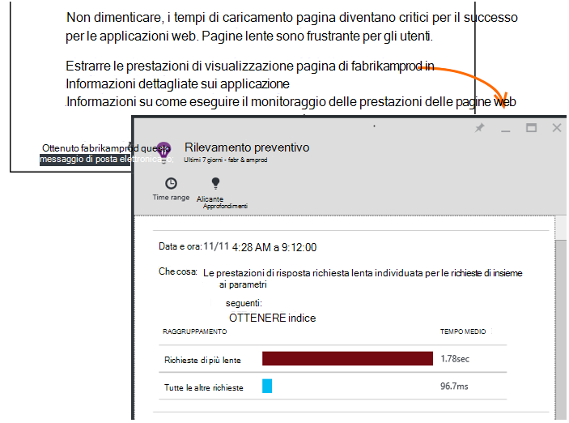

<properties 
    pageTitle="Applicazione Approfondimenti: Diagnostica prestazioni preventivo | Microsoft Azure" 
    description="Approfondimenti applicazione esegue analisi completa di telemetria l'app e avvisa sui problemi potenziali." 
    services="application-insights" 
    documentationCenter="windows"
    authors="antonfrMSFT" 
    manager="douge"/>

<tags 
    ms.service="application-insights" 
    ms.workload="tbd" 
    ms.tgt_pltfrm="ibiza" 
    ms.devlang="na" 
    ms.topic="article" 
    ms.date="08/31/2016" 
    ms.author="awills"/>

#  Diagnostica prestazioni preventivo

*Informazioni dettagliate sui applicazione è in anteprima.*

[Visual Studio applicazione approfondimenti](app-insights-overview.md) esegue analisi completa di telemetria l'app e possibile segnalare potenziali problemi di prestazioni. Si sta essere leggendo probabilmente perché hai ricevuto uno dei preventivo avvisi tramite posta elettronica. 

Questa caratteristica non richiede alcuna impostazione ed è attiva automaticamente quando l'app genera abbastanza telemetria.

## Quali sono diagnostica prestazioni preventivo?

Diagnostica prestazioni preventivo individua insoliti motivi di prestazioni nell'app, l'analisi di telemetria che l'app Invia a informazioni dettagliate sui applicazione. 

In particolare, trova problemi di prestazioni che interessano solo alcuni utenti o solo interessano gli utenti in alcuni casi.

Ad esempio, può effettuare la notifica se le pagine di app caricare molto più lentamente su un tipo di browser rispetto ad altri o se le richieste vengono assegnate più lentamente da un determinato server. Inoltre possibile scoprire problemi relativi a combinazioni di proprietà, ad esempio pagina lenta carica in un'area geografica in determinati momenti del giorno.

Alterazioni questi sono molto difficile da rilevare solo tramite l'analisi dei dati, ma sono più comune di quanto si potrebbe pensare. Spesso vengono generate solo quando i clienti lamentano. Per un'ora specifica, è troppo tardi: gli utenti interessati siano già passando a concorrenti!

Attualmente, il nostro algoritmi osservare tempi di caricamento delle pagine, i tempi di risposta convocazione nel server e i tempi di risposta dipendenza.  

Non è necessario impostare le soglie o configurare le regole. Apprendimento e algoritmi di data mining vengono utilizzati per rilevare motivi anomale. 

Siamo non per i commenti e suggerimenti. Indicare come si può essere utile, su come migliorare il rilevamento e quali funzionalità aggiuntive si desidera aggiungere. È possibile fornire commenti e suggerimenti tramite invia smile/faccia imbronciata nel portale di o inviare tramite posta elettronica di AppInsightsML@microsoft.com. 

## Avviso attivo

* *Perché è stato ricevuto questo messaggio di posta elettronica?*
 * Rilevamento preventivo analizzati telemetria applicazione inviati a informazioni dettagliate sui applicazione e rilevato un problema di prestazioni dell'applicazione. 
* *La notifica significa che il problema è stato sicuramente?*
 * No. Si tratta semplicemente un suggerimento sulle modifiche apportate da prendere osservare più da vicino. 
* *Cosa dovrei fare?*
 * [Esaminare i dati presentati](#responding-to-an-alert). Utilizzare Esplora metriche per esaminare le prestazioni nel tempo ed eseguire il drill-per statistiche aggiuntive. Utilizzare la ricerca per filtrare eventi specifici che consentono di individuare la causa principale. 
* *E quindi si Guy esaminare i dati?*
 * No. Il servizio è interamente automatico. Viene visualizzato solo le notifiche. I dati sono [privati](app-insights-data-retention-privacy.md).

## Il processo di rilevamento

* *Vengono rilevati tipi di alterazioni prestazioni?*
 * Motivi che si otterrebbe richiede molto tempo controllare per se stessi. Ad esempio lentezza di una combinazione specifica del luogo, ora del giorno e piattaforma.
* *Per analizzare tutti i dati raccolti dal approfondimenti applicazione?*
 * Non al momento. Attualmente è analizzare richiesta fase di caricamento di pagina, i tempi di risposta dipendenza e tempi di risposta. Analisi delle statistiche aggiuntive è disponibile a breve. 
* *È possibile creare il proprio anomalia regole di rilevamento?*
 * Non ancora. Ma è possibile:
 * [Impostare avvisi](app-insights-alerts.md) che indicano quando una metrica supera una soglia).
 * [Esportazione di telemetria](app-insights-export-telemetry.md) in un [database](app-insights-code-sample-export-sql-stream-analytics.md) o [per ottenere informazioni](app-insights-export-power-bi.md) o [altri](app-insights-code-sample-export-telemetry-sql-database.md) strumenti nel punto in cui è possibile analizzarli se stessi.
* *Con quale frequenza viene eseguita l'analisi?*
 * Eseguire l'analisi giornaliera su telemetria del giorno precedente.
* * In modo questo sostituisce [gli avvisi metrici](app-insights-alerts.md)?
 * No.  Abbiamo non eseguire il commit per rilevare ogni comportamento è consigliabile anomala.

## Come esaminare i problemi rilevati

Aprire il rapporto di diagnostica dal messaggio di posta elettronica o dall'elenco di alterazioni.

* **Quando si** illustra il tempo che è stato rilevato il problema.
* **Quali** descrive
 * Il problema rilevato;
 * Le caratteristiche della serie di eventi che sono stati rilevati visualizzato il comportamento del problema.
* La tabella confronta insieme scarse con il comportamento Media di tutti gli altri eventi.

Fare clic sul collegamento per aprire Esplora risorse di unità di misura metriche e ricerca nei report pertinenti, filtrato sulla proprietà del set di prestazioni lente e l'ora.

Modificare l'intervallo di tempo e i filtri per esplorare il telemetria.

## Come è possibile migliorare le prestazioni?

Le risposte lente e non sono una delle proprie frustrazioni principali per gli utenti del sito web, come descritto in precedenza dal proprio ambiente. È importante risolvere i problemi.

### Valutazione

Prima di tutto, è importante? Se una pagina è sempre lenta da caricare, ma solo 1% degli utenti del sito è mai necessario consultarla, ad esempio si dispone di più importanti da considerare. Mano, se solo 1% di utenti aprirlo, ma genera eccezioni ogni volta, che può essere utile esaminare.

Utilizzare la dichiarazione di impatto nel messaggio di posta elettronica come guida generale, ma tenere presente che non è tutto. Raccogliere altre prove per confermare.

Prendere in considerazione i parametri del problema. Se si tratta geography dipendente, impostare i [test di disponibilità](app-insights-monitor-web-app-availability.md) inclusa tale area: sono può essere problemi di rete in tale area. 

### Diagnosticare i carichi di pagina lenta 

Dove si trova il problema? Lento nel server di rispondere, è molto lungo la pagina o browser è necessario eseguire numerose operazioni per visualizzarlo?

Aprire e metrico il browser. Mostra [visualizzazione segmentato della fase di caricamento di pagina del browser](app-insights-javascript.md#explore-your-data) in cui sarà l'ora. 

* Se **Inviare tempo richiesta** sia sufficientemente alto, il server risponde lentamente o la convocazione è un post con una grande quantità di dati. Esaminare le [misure delle prestazioni](app-insights-web-monitor-performance.md#metrics) per analizzare i tempi di risposta. 
* Configurare la [dipendenza verifica](app-insights-dependencies.md) se la lentezza è a causa del database o servizi esterni.
* Se **La ricezione di risposta** è diffuso, la pagina e le parti dipendenti - JavaScript, CSS, immagini e così via (ma non è stato caricato in modo asincrono dati) sono lunghe. Configurare un [verificare la disponibilità](app-insights-monitor-web-app-availability.md)e assicurarsi che sia impostata l'opzione per caricare parti dipendenti. Quando viene visualizzato tra i risultati, aprire i dati di dettaglio di un risultato ed espandere per verificarne i tempi di caricamento di file diversi.
* Alta **tempi di elaborazione Client** suggerisce lento script. Se il motivo non è più evidente, è consigliabile aggiungere codice intervallo e inviare le ore in trackMetric chiamate.

### Migliorare le pagine lente

Esiste un web pieno di suggerimenti su come migliorare le risposte del server e i tempi di caricamento delle pagine, pertanto abbiamo non è possibile provare a ripetere tutte in questo articolo. Ecco alcuni suggerimenti che è probabile che sia già conoscere, per poter pensare:

* Lente caricamento a causa di file di grandi dimensioni: caricare in modo asincrono gli script e altre parti. Usare script aggregazione. Interruzione di pagina principale in widget che caricano i dati separatamente. Non inviare normale HTML precedente per le tabelle lunghe: utilizzare uno script per richiedere i dati come JSON o un altro formato compatto e quindi compilare la definizione della tabella. Sono disponibili interessanti Framework per agevolare la tutto ciò. (Anche richiedono una grande script, naturalmente.)
* Ridurre la velocità di dipendenze server: prendere in considerazione le aree geografiche dei componenti. Ad esempio, se si usa Azure, verificare che il server web e il database siano presenti nell'area stessa. Query recuperano più informazioni di quelle necessarie? Sarebbe la memorizzazione nella cache o il batch di assistenza?
* Problemi di capacità: esaminare le metriche di server dei tempi di risposta e conta richiesta. Se i tempi di risposta picco in modo non proporzionale con picchi nei conteggi richiesta, è probabile che il server viene allungato. 

## Messaggi di notifica

* *È necessario eseguire la sottoscrizione al servizio per ricevere notifiche?*
 * No. Il nostro bot periodicamente i dati da tutti gli utenti di applicazione approfondimenti i sondaggi e invia notifiche se vengono rilevati problemi.
* *È possibile annullare la sottoscrizione o ottenere notifiche invece inviati ai colleghi?*
 * Fare clic sul collegamento Annulla sottoscrizione dell'avviso di posta elettronica. 
 
    Attualmente vengono inviate a coloro che hanno [accesso scrittura alla risorsa approfondimenti applicazione](app-insights-resources-roles-access-control.md).

    È anche possibile modificare l'elenco di destinatari impostazioni in e il rilevamento preventivo.
* *Non vuole essere di questi messaggi.*
 * Sono limitati a uno per ogni giorno con il problema più importanti è non segnalare riguardo ancora. Non è possibile ottenere ripetizione di un messaggio.
* *Se non si nulla, viene visualizzato un promemoria?*
 * No, viene visualizzato un messaggio relativo a ogni problema una sola volta. 
* *Perdita messaggio di posta elettronica. Dove reperibili le notifiche nel portale*
 * Cenni preliminari applicazione approfondimenti dell'app, fare clic sul riquadro **Rilevamento preventivo** . Ci sarà possibile trovare tutte le notifiche su a 7 giorni precedenti.

## Passaggi successivi

Strumenti di diagnostica seguenti consentono di verificare la presenza di telemetria dell'App:

* [Esplora metrica](app-insights-metrics-explorer.md)
* [Soluzioni di ricerca](app-insights-diagnostic-search.md)
* [Analitica - linguaggio di query avanzate](app-insights-analytics-tour.md)

Rilevamenti preventivo sono completamente automatici. Ma forse si vuole configurare alcuni altri avvisi?

* [Avvisi metrici configurati manualmente](app-insights-alerts.md)
* [Test web disponibilità](app-insights-monitor-web-app-availability.md) 

