<properties
    pageTitle="Note sulla versione di estensione di Visual Studio per Analitica per sviluppatori"
    description="Gli aggiornamenti più recenti per Visual Studio tools per sviluppo Analitica."
    services="application-insights"
    documentationCenter=""
    authors="acearun"
    manager="douge"/>
<tags
    ms.service="application-insights"
    ms.workload="tbd"
    ms.tgt_pltfrm="ibiza"
    ms.devlang="na"
    ms.topic="article"
    ms.date="06/09/2016"
    ms.author="acearun"/>

# Note sulla versione di sviluppo Analitica strumenti
Quali sono le novità: applicazione approfondimenti e HockeyApp analitica in Visual Studio.
## Versione 7.0
### Visual Studio applicazione approfondimenti tendenze
Visual Studio applicazione approfondimenti è un nuovo strumento Visual Studio che è possibile utilizzare per analizzare il funzionamento dell'applicazione nel tempo. Per iniziare, sul pulsante della barra degli strumenti **Applicazione approfondimenti** o nella finestra di ricerca di informazioni approfondite applicazione, scegliere **Le tendenze di telemetria esplorare**. O, nel menu **Visualizza** fare clic su **Altre finestre**e quindi fare clic su **Applicazione approfondimenti tendenze**. Scegliere una delle cinque query comuni per iniziare. È possibile analizzare diversi set di dati in base a tipi di telemetria, gli intervalli di tempo e altre proprietà. Per trovare alterazioni dei dati, scegliere una delle opzioni anomalie nell'elenco **Tipo di visualizzazione** . Le opzioni di filtro nella parte inferiore della finestra rendono più semplice concentrarsi su sottoinsiemi del telemetria specifici.

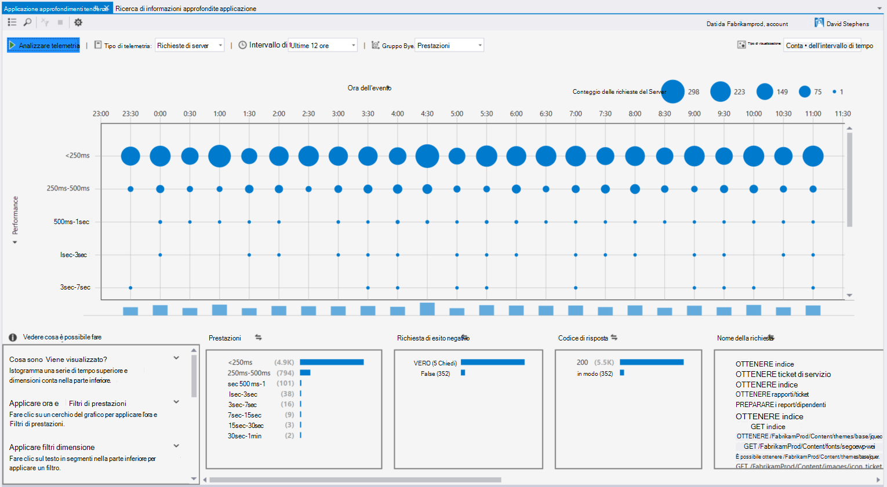

### Eccezioni in CodeLens
Telemetria eccezione visualizzato in CodeLens. Se è già collegato il progetto per il servizio di applicazione approfondimenti, verrà visualizzato il numero di eccezioni che si sono verificati in ogni metodo di produzione nelle ultime 24 ore. Da CodeLens, è possibile passare a ricerca o le tendenze per esaminare le eccezioni in modo più dettagliato.

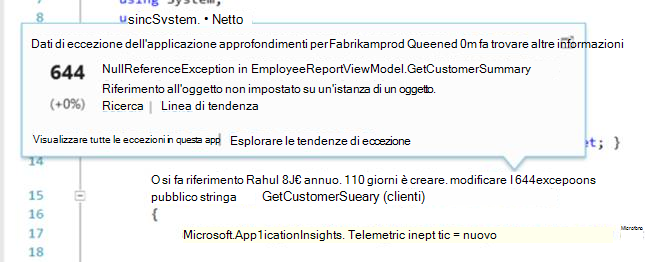

### Supporto di base di ASP.NET
Applicazione che supporta ora ASP.NET Core RC2 progetti in Visual Studio. È possibile aggiungere nuovi progetti ASP.NET Core RC2 approfondimenti applicazione dalla finestra di dialogo **Nuovo progetto** , come illustrato nella schermata seguente. Oppure è possibile aggiungere a un progetto esistente, fare clic sul progetto in Esplora soluzioni e quindi fare clic su **Aggiungi applicazione approfondimenti telemetria**.

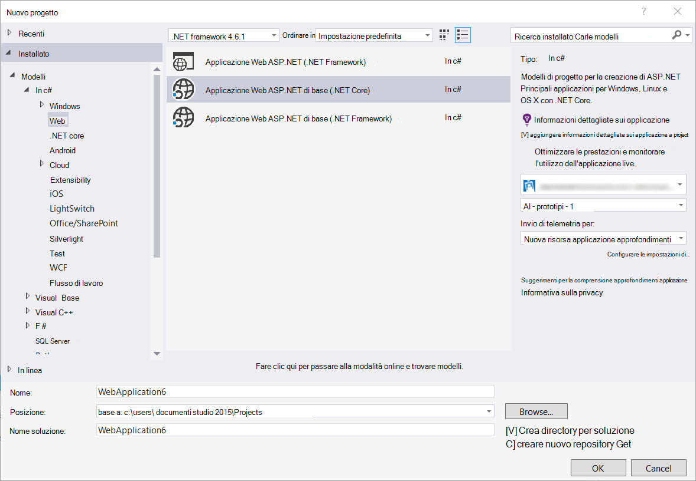

ASP.NET 5 RC1 e RC2 Core ASP.NET progetti dovranno supporto per il nuovo nella finestra Strumenti di diagnostica. Verranno visualizzati gli eventi di applicazione approfondimenti come eccezioni e le richieste dell'App ASP.NET durante il debug in locale nel PC. Da ogni evento, fare clic su **Cerca** per eseguire il drill-per altre informazioni.

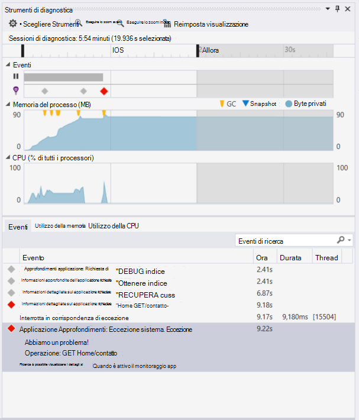

### HockeyApp per le applicazioni di Windows universale
Oltre ai commenti di distribuzione e utente beta, HockeyApp fornisce un arresto anomalo symbolicated Reporting Services per le applicazioni di Windows universale. Sono state apportate persino più semplice aggiungere SDK HockeyApp: pulsante destro del mouse sul progetto universale Windows e quindi fare clic su **App hockey su ghiaccio - abilitare Analitica arrestarsi in modo anomalo**. Questo viene installato il SDK, imposta la raccolta di un arresto anomalo ed esegue il provisioning di una risorsa HockeyApp nel cloud, senza caricare l'app per il servizio di HockeyApp.

Altre nuove caratteristiche:

* Sono state apportate l'esperienza di ricerca di informazioni approfondite applicazione più veloce e più intuitivo. A questo punto, gli intervalli di tempo e dettaglio filtri vengono applicati automaticamente quando si seleziona.
* Anche nell'applicazione approfondimenti ricerca, verrà visualizzata un'opzione per passare al codice direttamente da telemetria richiesta.
* Sono state apportate miglioramenti all'esperienza di accesso di HockeyApp.
* In strumenti di diagnostica, vengono visualizzate informazioni di telemetria di produzione per le eccezioni.

## Versione 5.2
Siamo contenti di annunciare l'introduzione di scenari HockeyApp in Visual Studio. L'integrazione prima è nella distribuzione beta delle App universale Windows e le applicazioni di Windows Forms da Visual Studio.

Distribuzione beta, caricare le versioni precedenti delle applicazioni a HockeyApp per la distribuzione a un sottoinsieme selezionato di clienti o tester. Distribuzione beta, combinata con HockeyApp arresto anomalo utente e Raccolta commenti e suggerimenti caratteristiche, può fornire informazioni utili l'app prima di apportare rilascio di grandi dimensioni. È possibile utilizzare queste informazioni per risolvere i problemi con l'app in modo che è possibile evitare o ridurre a icona problemi in futuri, ad esempio valutazioni app bassa, feedback negativo e così via.

Estrazione obbligatoria quanto sia semplice per caricare Compila per la distribuzione beta dall'interno di Visual Studio.
### App universale di Windows
Menu di scelta rapida per un nodo del progetto app universale Windows ora include un'opzione per caricare la compilazione HockeyApp.

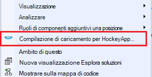

Scegliere l'elemento e HockeyApp viene visualizzata la finestra di dialogo Carica. È necessario un account HockeyApp per caricare la compilazione. Se si è un nuovo utente, non è importante. Creazione di un account è un processo semplice.

Quando si è connessi, verrà visualizzato il modulo Carica nella finestra di dialogo.

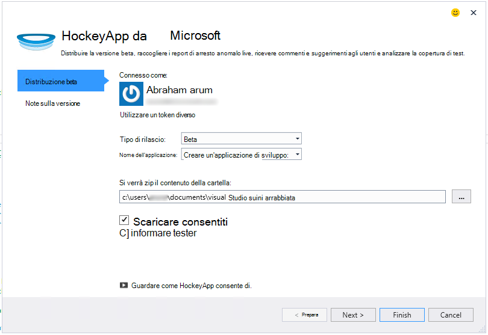

Selezionare il contenuto da caricare (un file .appxbundle o portali) e quindi scegliere Opzioni di rilascio della procedura guidata. Facoltativamente, è possibile aggiungere note alla pagina successiva. Scegliere **Fine** per iniziare il caricamento.

Una volta completato il caricamento, verrà visualizzata una notifica HockeyApp con un collegamento all'app nel portale di HockeyApp e conferma.

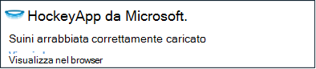

Questo è tutto! Appena caricati compilazione per la distribuzione beta con pochi clic.

È possibile gestire l'applicazione in vari modi nel portale di HockeyApp. Sono inclusi invitando gli utenti, la visualizzazione dei report di arresto anomalo e commenti e suggerimenti, la modifica dei dettagli e così via.

Vedere l' [articolo della Knowledge Base HockeyApp](http://support.hockeyapp.net/kb/app-management-2) per altri dettagli sulla gestione di app.

### App di Windows Form
Menu di scelta rapida per un nodo del progetto modulo Windows ora include un'opzione per caricare la compilazione HockeyApp.

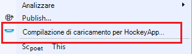

Verrà aperta la finestra di dialogo di caricamento di HockeyApp, simile a quello di un'app di Windows universale.

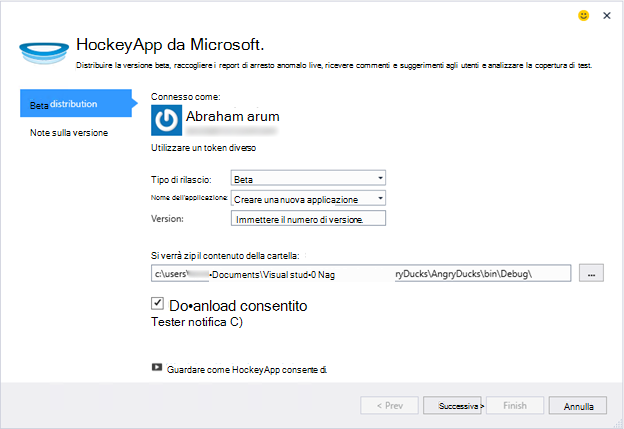

Nota un nuovo campo nella procedura guidata per specificare la versione dell'app. Per le applicazioni di Windows universale, le informazioni vengono inserite i manifesto. Le applicazioni di Windows Forms, purtroppo non sono un equivalente a questa caratteristica. È necessario specificarle manualmente.

Il resto del flusso di è simile alle applicazioni di Windows universale: scegliere Genera e rilasciare opzioni, aggiungere release note, caricare e gestire il portale di HockeyApp.

È semplice come quella. Provatelo adesso e indicare opinioni.
## Versione 4.3
### Ricerca di telemetria durante le sessioni di debug locale
Con questa versione, è ora possibile cercare telemetria approfondimenti applicazione ha generato la sessione di debug Visual Studio. Prima di, è possibile utilizzare ricerca solo se l'app è stato registrato con informazioni dettagliate sui applicazione. A questo punto, è solo l'app deve avere installato per cercare telemetria locale il SDK di informazioni approfondite dell'applicazione.

Se si ha un'applicazione ASP.NET con SDK approfondimenti applicazione, eseguire la procedura seguente per utilizzare la ricerca.

1. Il debug dell'applicazione.
2. Ricerca di informazioni dettagliate sui applicazione aperta in uno dei modi seguenti:
    - Nel menu **Visualizza** fare clic su **Altre finestre**e quindi fare clic su **Cerca approfondimenti applicazione**.
    - Fare clic sul pulsante della barra degli strumenti **Applicazione approfondimenti** .
    - In Esplora soluzioni espandere **ApplicationInsights.config**e quindi fare clic su **telemetria sessione debug di ricerca**.
3. Se è stato ancora iscrizione con informazioni dettagliate sui applicazione, la finestra ricerca verrà aperto in modalità di telemetria di debug sessione.
4. Fare clic sull'icona di **ricerca** per visualizzare il telemetria locale.

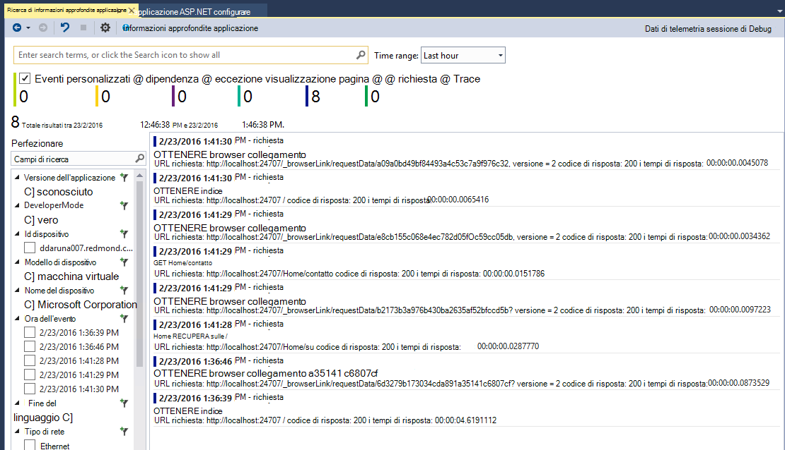

## Versione 4.2
In questa versione sono aggiunte le caratteristiche per semplificare la ricerca dei dati nel contesto di eventi, la possibilità di passare al codice da altri eventi di dati e un ambiente facile per inviare i dati di registrazione a informazioni dettagliate sui applicazione. Questa estensione viene aggiornata ogni mese. Se si dispone di commenti e suggerimenti o richieste, inviarlo a aidevtools@microsoft.com.
### Esperienza di registrazione fare clic su No
Se si usa già NLog, log4net o System.Diagnostics.Tracing, non è necessario spostare tutte le tracce a informazioni dettagliate sui applicazione. In questa versione, si ha integrato le schede di registrazione di informazioni dettagliate sui applicazione con l'esperienza di configurazione normale.
Se si dispone già di tali Framework registrazione configurato, la sezione seguente descrive come ottenerlo.
**Se è già stato aggiunto approfondimenti applicazione:**
1. Rapida nodo del progetto e quindi fare clic su **Informazioni dettagliate sui applicazione**e quindi fare clic su **Configura approfondimenti applicazione**. Assicurarsi che sia visualizzata l'opzione per aggiungere la scheda corretta nella finestra di configurazione.
2. In alternativa, quando si creazione la soluzione, tenere presente la finestra popup che viene visualizzata nella parte superiore destra dello schermo e fare clic su **Configura**.

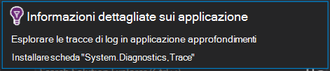

Quando sono presenti schede di registrazione, eseguire l'applicazione e verificare che sia disponibile i dati nella scheda Strumenti di diagnostica, come segue:

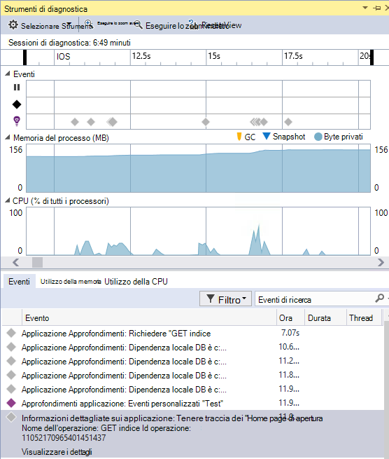

### Passare a o trovare il codice in cui si verifica la proprietà di evento di telemetria
Con la nuova versione utente può fare clic su un valore qualsiasi nel dettaglio e ciò cercherà una stringa corrispondente nella soluzione corrente. Risultati appariranno nel Visual Studio "Risultati di ricerca" elenco come illustrato di seguito:

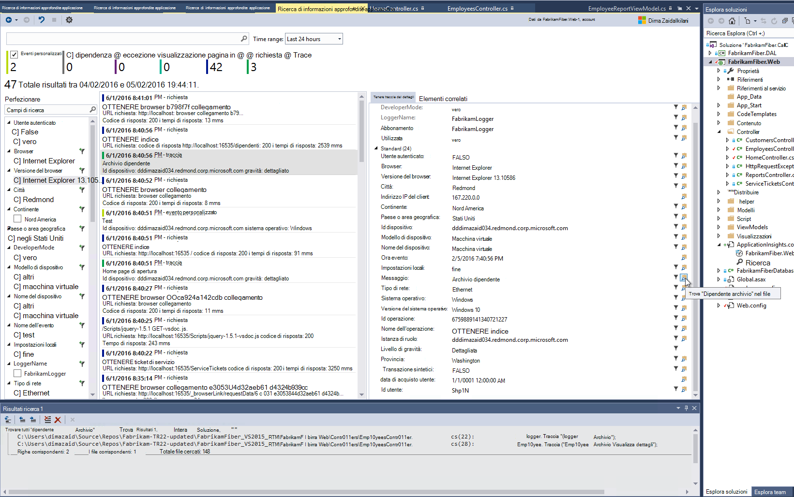

### Nuova finestra di ricerca per quando non sei
Abbiamo modificato l'aspetto della finestra dell'applicazione approfondimenti Cerca per eseguire ricerche i dati durante l'app di produzione.

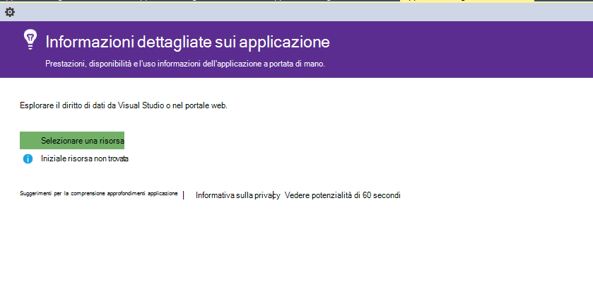

### Visualizzare tutti gli eventi di telemetria associati all'evento
È stata aggiunta una nuova scheda con query predefinite per tutti i dati correlati all'evento di telemetria che l'utente sta visualizzando, accanto alla scheda per i dettagli dell'evento. Ad esempio una richiesta di un campo denominato **ID operazione**. Tutti gli eventi associati alla richiesta ha lo stesso valore per **l'ID di operazione**. Se si verifica un'eccezione durante l'operazione di elaborazione della richiesta, l'eccezione viene assegnato lo stesso ID operazione richiesta per rendere più semplice trovare. Se sta esamina una richiesta, fare clic su **tutti telemetria per l'operazione** per aprire una nuova scheda che consente di visualizzare i nuovi risultati di ricerca.

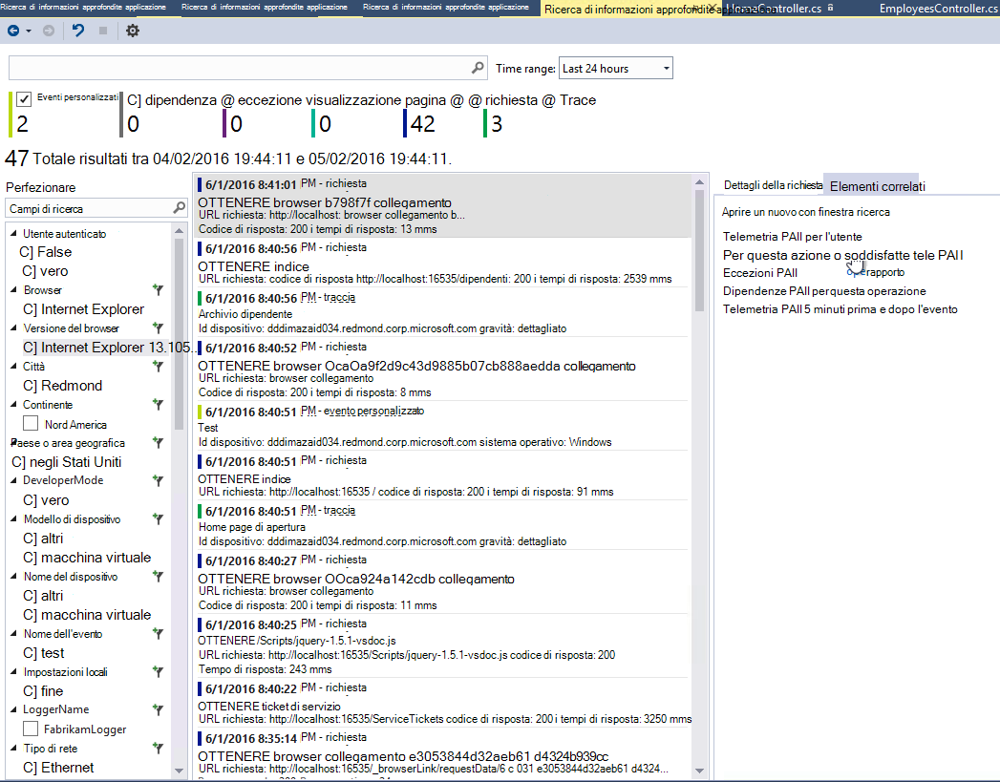

### Avanti e indietro della cronologia di ricerca
A questo punto è possibile passare avanti e indietro tra i risultati della ricerca.

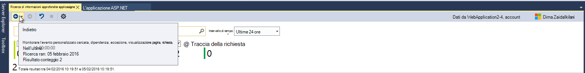

## Versione 4.1
In questa versione è disponibili numerose nuove funzionalità e aggiornamenti. È necessario disporre di aggiornamento 1 per installare questa versione.

### Passare da un'eccezione al metodo nel codice sorgente
A questo punto, se si visualizzano le eccezioni dell'app di produzione nella finestra di ricerca di informazioni approfondite applicazione, è possibile passare al metodo nel codice in cui si verifica l'eccezione. È necessario che il progetto corretto caricato e applicazione approfondimenti farà il resto! (Per altre informazioni sulla finestra dell'applicazione approfondimenti ricerca, vedere le note sulla versione per versione 4.0 nelle sezioni seguenti).

Come funziona? È possibile utilizzare le applicazioni approfondimenti ricerca anche quando una soluzione non è aperta. Nell'area di traccia dello stack viene visualizzato un messaggio informativo e numero di voci nella traccia dello stack non sono disponibili.

Se sono disponibili informazioni di file, alcuni elementi possono essere collegamenti, ma l'elemento di informazioni soluzione continuerà a essere visibile.

Se si fa clic sul collegamento ipertestuale, è necessario passare al percorso del metodo selezionato nel codice. È possibile che sia una differenza nella casella numero di versione, ma la caratteristica per passare alla versione corretta del codice, venga recapitata nelle versioni successive.

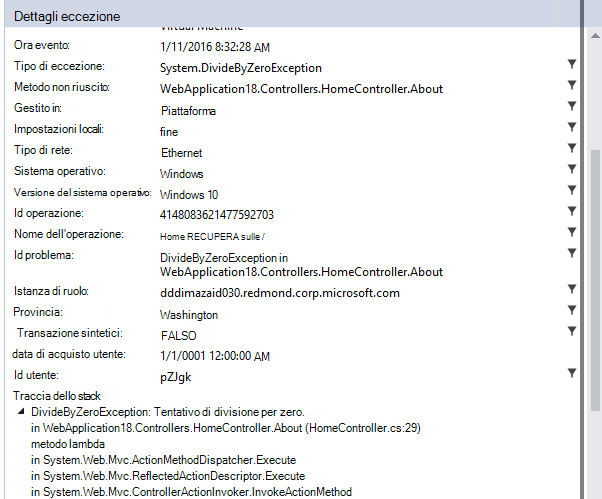

### Esperienza utente nuovi punti di ingresso per la ricerca in Esplora soluzioni
A questo punto è possibile accedere ricerca mediante Esplora soluzioni.

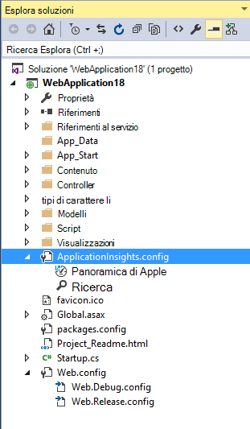

### Viene visualizzata una notifica quando pubblica, viene completata
Viene visualizzata una finestra di dialogo popup quando il progetto viene pubblicato in linea, in modo che è possibile visualizzare i dati dell'applicazione approfondimenti in produzione.

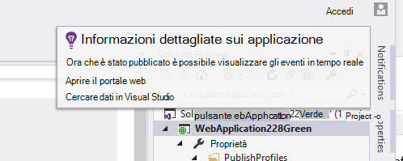

## Versione 4.0

### Cercare dati approfondimenti applicazione da Visual Studio
Ad esempio la funzione Cerca il portale di applicazione approfondimenti, ora in Visual Studio è possibile filtrare e tipi di eventi, i valori di proprietà e testo di ricerca e quindi esaminare singoli eventi.

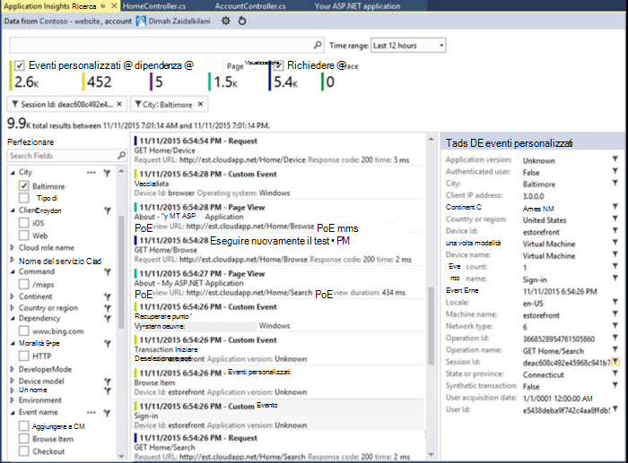

### Visualizzare dati provenienti da un computer locale in strumenti di diagnostica

È possibile visualizzare il telemetria, oltre ad altri dati debug nella pagina Strumenti di diagnostica Visual Studio. È supportata solo ASP.NET 4.5.

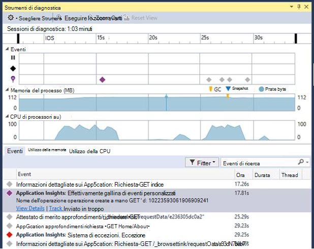

### Aggiungere il SDK al progetto senza eseguire l'accesso a Azure

Non è effettuare l'accesso a Azure per aggiungere informazioni dettagliate sui applicazione pacchetti al progetto tramite la finestra di dialogo **Nuovo progetto** o dal menu di scelta rapida di progetto. Se si effettua l'accesso, il SDK verrà installato e configurato per l'invio di telemetria al portale di come prima. Se non eseguire l'accesso, verrà generato telemetria per diagnostica hub SDK verrà aggiunti al progetto. È possibile configurarlo in un secondo momento se si desidera.

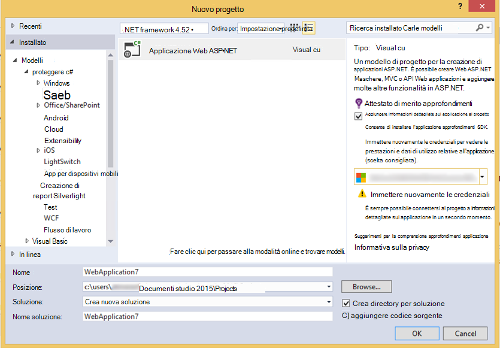

### Dispositivi supportati

In *Connect ();* 2015, viene [annunciato](https://azure.microsoft.com/blog/deep-diagnostics-for-web-apps-with-application-insights/) che esperienza mobile per sviluppatori per dispositivi HockeyApp. HockeyApp consente di distribuire build beta per i tester, raccogliere e analizzare tutti anomalo dell'App e raccogliere commenti e suggerimenti direttamente da parte dei clienti.
HockeyApp supporta l'app in qualunque piattaforma si sceglie di creare, sia che iOS, Android o Windows o una soluzione multipiattaforma e su come Xamarin, Cordova o verità.

In futuro le versioni di estensione applicazione approfondimenti, verranno illustrati brevemente un'esperienza integrata tra HockeyApp e Visual Studio. Per ora, è possibile iniziare con HockeyApp semplicemente aggiungendo il riferimento NuGet. Vedere la [documentazione](http://support.hockeyapp.net/kb/client-integration-windows-and-windows-phone) per ulteriori informazioni.
