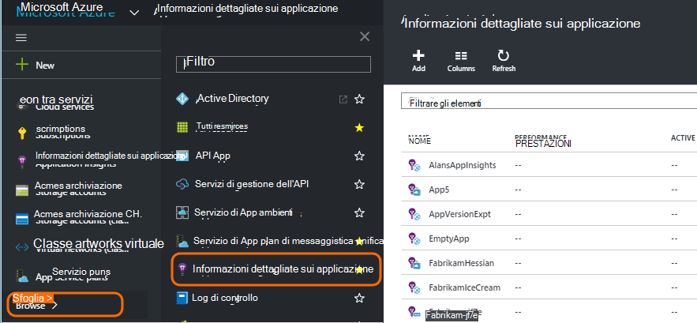
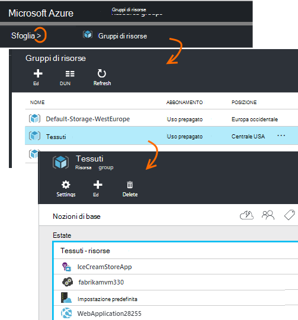
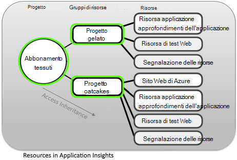
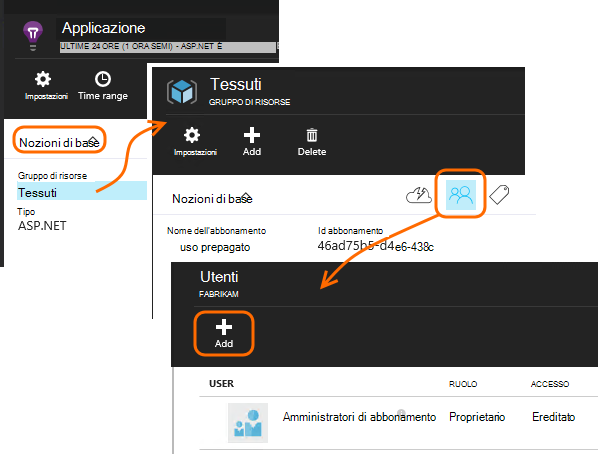
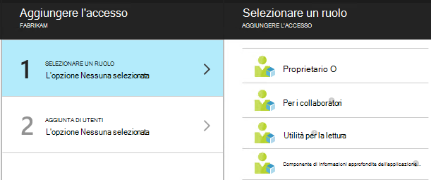
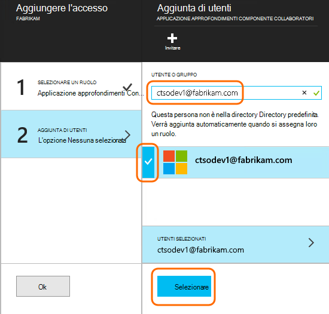

<properties
    pageTitle="Risorse, ruoli e controllo dell'accesso in applicazione approfondimenti"
    description="Proprietari, collaboratori e utilità per la lettura di informazioni approfondite dell'organizzazione."
    services="application-insights"
    documentationCenter=""
    authors="alancameronwills"
    manager="douge"/>

<tags
    ms.service="application-insights"
    ms.workload="tbd"
    ms.tgt_pltfrm="ibiza"
    ms.devlang="na"
    ms.topic="article"
    ms.date="05/07/2016"
    ms.author="awills"/>

# Risorse, ruoli e controllo dell'accesso in applicazione approfondimenti

È possibile controllare chi ha leggere e aggiornare l'accesso ai dati in Visual Studio [Approfondimenti applicazione][start], tramite [controllo dell'accesso basato sui ruoli in Microsoft Azure](../active-directory/role-based-access-control-configure.md).

> [AZURE.IMPORTANT] Assegnare l'accesso agli utenti nel **gruppo di risorse o l'abbonamento** a cui appartiene la risorsa applicazione - non la risorsa stessa. Assegnare il ruolo di **Collaboratore componente approfondimenti applicazione** . In questo modo uniforme controllo dell'accesso a test web e gli avvisi e le risorse dell'applicazione. [Altre informazioni](#access).

## Risorse, gruppi e le sottoscrizioni

Prima di tutto, alcune definizioni:

* **Risorsa** - un'istanza di un servizio di Microsoft Azure. La risorsa applicazione approfondimenti raccoglie, analizza e visualizza i dati di telemetria inviati dall'applicazione in uso.  Altri tipi di risorse Azure includono web apps, database e macchine virtuali.

    Per visualizzare tutte le risorse, passare al [Portale di Azure][portal], accedere e fare clic su Sfoglia.

    

* [**Gruppo di risorse** ] [ group] -ogni risorsa appartiene a un gruppo. Un gruppo è utile per gestire le risorse correlate, in particolare per il controllo di accesso. In un gruppo di risorse, ad esempio, è possibile inserire un'App Web, una risorsa applicazione approfondimenti per monitorare l'app e una risorsa di archiviazione per mantenere i dati esportati.

    

* [**Abbonamento**](https://manage.windowsazure.com) - per l'utilizzo dell'applicazione approfondimenti o altre risorse Azure, si accede a un abbonamento a Azure. Ogni gruppo di risorse appartiene a un abbonamento di Azure, in cui si sceglie il pacchetto di prezzo e, se si tratta di una sottoscrizione dell'organizzazione, scegliere i membri e le relative autorizzazioni di accesso.
* [**Account Microsoft** ] [ account] -il nome utente e password utilizzati per accedere a Microsoft Azure abbonamenti, XBox Live, Outlook.com e altri servizi Microsoft.

## Controllare l'accesso nel gruppo di risorse

È importante tenere presente che oltre la risorsa creata per l'applicazione, esistono anche risorse nascoste distinte per gli avvisi e i test web. Sono collegati allo stesso [gruppo di risorse](#resource-group) dell'applicazione. Anche potrebbe avere inserire altri servizi di Azure in tale posizione, ad esempio siti Web o lo spazio di archiviazione.

Per controllare l'accesso a queste risorse è pertanto consigliabile:

* Controllare l'accesso a livello di **gruppo di risorse o l'abbonamento** .
* Assegnare il ruolo di **Collaboratore applicazione approfondimenti componente** agli utenti. In questo modo possono modificare test web, avvisi e le risorse applicazione approfondimenti, senza fornire l'accesso a tutti gli altri servizi nel gruppo.

## Per consentire l'accesso a un altro utente

È necessario disporre dei diritti di proprietario per l'abbonamento o il gruppo di risorse.

L'utente deve avere un [Account Microsoft][account], o l'accesso al proprio [Account Microsoft dell'organizzazione](..\active-directory\sign-up-organization.md). È possibile fornire l'accesso a utenti e ai gruppi di utenti definiti in Azure Active Directory.

#### Passare al gruppo di risorse

Aggiungere l'utente non esiste.

Oppure è possibile salire di un altro livello e aggiungere l'utente all'abbonamento.

#### Selezionare un ruolo

Ruolo | Nel gruppo di risorse
---|---
Proprietario | Può modificare qualsiasi, inclusi l'accesso degli utenti
Per i collaboratori | Possibile apportare modifiche, incluse tutte le risorse
Per i collaboratori approfondimenti componente applicazione | Può modificare risorse applicazione approfondimenti, test web e avvisi
Utilità per la lettura | Possono visualizzare ma non modificare elementi

"Modifica" include creazione, eliminazione e aggiornamento:

* Risorse
* Test Web
* Avvisi
* Esportazione continuo

#### Selezionare l'utente

Se l'utente da non è nella directory, è possibile invitare altri utenti con un account Microsoft.
(Se si utilizzano i servizi come Outlook.com, OneDrive, Windows Phone o XBox Live, hanno un account Microsoft.)

## Utenti e ruoli

* [Controllo dell'accesso in Azure basato sui ruoli](../active-directory/role-based-access-control-configure.md)

<!--Link references-->

[account]: https://account.microsoft.com
[group]: ../resource-group-overview.md
[portal]: https://portal.azure.com/
[start]: app-insights-overview.md
