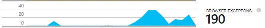

<properties 
    pageTitle="Procedura dettagliata: Monitorare Microsoft Dynamics CRM con informazioni dettagliate sui applicazione" 
    description="È possibile ottenere telemetria da Microsoft Dynamics CRM Online con informazioni dettagliate sui applicazione. Procedura dettagliata del programma di installazione, recupero dei dati, visualizzazione ed Esporta." 
    services="application-insights" 
    documentationCenter=""
    authors="mazharmicrosoft" 
    manager="douge"/>

<tags 
    ms.service="application-insights" 
    ms.workload="tbd" 
    ms.tgt_pltfrm="ibiza" 
    ms.devlang="na" 
    ms.topic="article" 
    ms.date="11/17/2015" 
    ms.author="awills"/>
 
# Procedura dettagliata: Abilitazione di telemetria per Microsoft Dynamics CRM Online tramite l'applicazione approfondimenti

In questo articolo viene illustrato come ottenere i dati di telemetria da [Microsoft Dynamics CRM Online](https://www.dynamics.com/) utilizzando [Visual Studio applicazione approfondimenti](https://azure.microsoft.com/services/application-insights/). Verrà esaminato il processo di completamento dell'aggiunta di script applicazione approfondimenti per l'applicazione, l'acquisizione di dati e la visualizzazione dei dati.

>[AZURE.NOTE] [Individuare la soluzione di esempio](https://dynamicsandappinsights.codeplex.com/).

## Aggiungere informazioni dettagliate sui applicazione nuovo o esistente istanza CRM Online 

Per controllare l'applicazione, aggiungere un SDK approfondimenti applicazione all'applicazione. SDK invia telemetria al [portale applicazione approfondimenti](https://portal.azure.com), in cui è possibile utilizzare il nostro analisi potenti e strumenti di diagnostica o esportare i dati allo spazio di archiviazione.

### Creare una risorsa applicazione approfondimenti in Azure

1. È possibile ottenere [un account di Microsoft Azure](http://azure.com/pricing). 
2. Accedere al [portale di Azure](https://portal.azure.com) e aggiungere una nuova risorsa approfondimenti applicazione. Si tratta in cui verranno elaborati e visualizzati i dati.

    

    Scegliere ASP.NET come tipo di applicazione.

3. Aprire la scheda Quick Start e lo script di codice.

    

**Tenere aperta la pagina di codice** mentre si svolgono successivo passaggio in un'altra finestra del browser. È necessario il codice breve. 

### Creare una risorsa web JavaScript in Microsoft Dynamics CRM

1. Aprire l'istanza CRM Online e accedere con privilegi di amministratore.
2. Aprire Microsoft Dynamics CRM impostazioni, le personalizzazioni, personalizzare il sistema

    
    
    

    

3. Creare una risorsa JavaScript.

    

    Assegnare un nome, selezionare **Script (JScript)** e aprire l'editor di testo.

    
    
4. Copiare il codice approfondimenti applicazione. Durante la copia assicurarsi di ignorare tag script. Fare riferimento di sotto di schermata:

    

    Il codice include la chiave strumentazione che identifica la risorsa approfondimenti dell'applicazione.

5. Salvare e pubblicare.

    

### Strumento moduli

1. In Microsoft CRM Online, aprire il modulo Account

    

2. Aprire la maschera di proprietà

    

3. Aggiungere la risorsa web JavaScript creato

    

    

4. Salvare e pubblicare le personalizzazioni modulo.

## Metrica acquisita

A questo punto impostati acquisizione di telemetria per la maschera. Ogni volta che viene utilizzato, i dati verranno inviati alla risorsa di informazioni approfondite dell'applicazione.

Di seguito sono esempi dei dati che verrà visualizzato.

#### Dell'integrità

Eccezioni browser:

Fare clic sul grafico per ulteriori informazioni:

#### Uso

#### Browser

#### Georilevazione

#### Richiesta di visualizzazione all'interno della pagina

## Codice di esempio

[Individuare il codice di esempio](https://dynamicsandappinsights.codeplex.com/).

## Power BI

È possibile eseguire un'analisi più approfondita anche se è [esportare i dati da Microsoft Power BI](app-insights-export-power-bi.md).

## Soluzione di esempio Microsoft Dynamics CRM

[Qui è la soluzione di esempio implementata in Microsoft Dynamics CRM] (https://dynamicsandappinsights.codeplex.com/).

## Ulteriori informazioni

* [Che cos'è approfondimenti applicazione?](app-insights-overview.md)
* [Informazioni dettagliate sui applicazione per le pagine web](app-insights-javascript.md)
* [Ulteriori esempi e procedure dettagliate](app-insights-code-samples.md)

 
