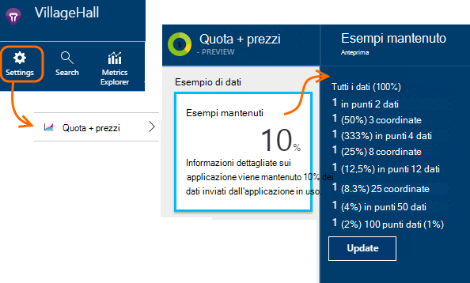

<properties 
    pageTitle="Campioni di telemetria negli approfondimenti applicazione | Microsoft Azure" 
    description="Informazioni su come mantenere il volume di telemetria sotto controllo." 
    services="application-insights" 
    documentationCenter="windows"
    authors="vgorbenko" 
    manager="douge"/>

<tags 
    ms.service="application-insights" 
    ms.workload="tbd" 
    ms.tgt_pltfrm="ibiza" 
    ms.devlang="na" 
    ms.topic="article" 
    ms.date="08/30/2016" 
    ms.author="awills"/>

#  <a name="sampling-in-application-insights"></a>Esempio di applicazione approfondimenti

*Informazioni dettagliate sui applicazione è in anteprima.*


Esempio è che una caratteristica di [Visual Studio applicazione approfondimenti](app-insights-overview.md) è il modo consigliato per ridurre il traffico di telemetria e lo spazio di archiviazione mantenendo un'analisi corretta dei dati dell'applicazione. Il filtro consente di selezionare gli elementi correlati in modo che consente di spostarsi tra le voci quando si esegue indagini diagnostiche.
Quando conteggi metriche vengono presentati all'utente nel portale, essi vengono rinormalizzati per prendere in considerazione il sondaggio, per ridurre al minimo alcun effetto sulle statistiche.

Campioni riduce il traffico, consentono di rispettare le quote di dati mensile ed evitare la limitazione.

## <a name="in-brief"></a>In breve:

* Campioni mantiene 1 nei record *n* e viene eliminato il resto. Ad esempio ritenga 1 in 5 eventi, un tasso di campioni di 20%. 
* Esempio si verifica automaticamente se l'applicazione invia numerose telemetria, nelle applicazioni di server web ASP.NET.
* È inoltre possibile impostare campionamento manualmente, nel portale della pagina prezzi. o SDK ASP.NET nel file config anche ridurre il traffico di rete.
* Se si accede eventi personalizzati e si desidera assicurarsi che una serie di eventi viene mantenuta o eliminata insieme, assicurarsi che hanno lo stesso valore OperationId.
* Il divisore campioni *n* viene segnalato in ogni record nella proprietà `itemCount`, che in ricerca viene visualizzato sotto il nome descrittivo "richieste count" o "conteggio di evento". Quando campioni non sono in esecuzione, `itemCount==1`.
* È possibile scrivere query Analitica, è necessario [prendere in considerazione campioni](app-insights-analytics-tour.md#counting-sampled-data). In particolare, anziché semplicemente conteggio dei record, è necessario utilizzare `summarize sum(itemCount)`.


## <a name="types-of-sampling"></a>Tipi di esempio


Esistono tre metodi alternativi campioni:

* **Esempio di adattamento** vengono regolate automaticamente il volume di telemetria inviato dal SDK nell'app ASP.NET. Predefinito da SDK v 2.0.0-beta3. Attualmente disponibile per telemetria solo di ASP.NET sul lato server. 
* **Tasso fisso campioni** consente di ridurre il volume di telemetria inviato dal server sia ASP.NET e dal browser degli utenti. Impostare la velocità. Il client e server verranno sincronizzati i campioni in modo che, in ricerca, è possibile spostarsi tra le visualizzazioni pagina correlati e le richieste di.
* **Esempio di acquisizione** consente di ridurre il volume di telemetria conservato dal servizio applicazione approfondimenti, una velocità impostate. Non ridurre il traffico di telemetria, ma consente di mantenere la quota mensile. 

Se fisso o adattata campioni tasso in operazione, esempio di acquisizione viene disabilitato.

## <a name="ingestion-sampling"></a>Esempio di acquisizione

Questo modulo di esempio funziona in corrispondenza del punto in cui telemetria dal server web, browser e dispositivi raggiunge l'endpoint del servizio di informazioni approfondite dell'applicazione. Anche se non ridurre il traffico di telemetria inviato dall'applicazione, ridurre la quantità di elaborazione e mantenuti (e addebitate) per informazioni dettagliate sui applicazione.

Utilizzare questo tipo di esempio se l'app spesso passa al superamento della quota mensile e non hanno la possibilità di usare uno dei tipi di base SDK dei campioni. 

Impostare la velocità di esempio in quote e prezzi blade:



Gli altri tipi di campioni di algoritmo conserva gli elementi di telemetria correlati. Ad esempio, quando si verifica telemetria risultati di ricerca, sarà possibile trovare la richiesta correlata a una determinata eccezione. Unità di misura metriche conta, ad esempio frequenza richieste e tasso eccezione vengono mantenute correttamente.

Punti dati che vengono eliminati per sondaggio non sono disponibili in qualsiasi caratteristica approfondimenti applicazione, ad esempio [Esportare continua](app-insights-export-telemetry.md).

Esempio di acquisizione non funzionano durante l'operazione di esempio di adattamento o tasso fisso SDK. Se la frequenza campioni SDK è inferiore al 100%, il tasso di campioni di acquisizione impostate verrà ignorato.

> [AZURE.WARNING] Il valore visualizzato nel riquadro indica il valore impostato per campioni di acquisizione. Non non rappresentare il tasso effettivo campioni se campioni SDK sono in esecuzione.


## <a name="adaptive-sampling-at-your-web-server"></a>Esempio di adattamento al server web

Adattamento campioni sono disponibile per informazioni dettagliate sui applicazione SDK per ASP.NET v 2.0.0-beta3 e versioni successive e attivata per impostazione predefinita. 


Esempio di adattamento viene applicata al volume di telemetria inviato da un'app web di server per il servizio di applicazione approfondimenti. Il volume viene regolato automaticamente per mantenere all'interno di una velocità massima del traffico.

Non funzionare bassi volumi di telemetria, pertanto un'app debug o non è possibile applicare un sito Web con un basso utilizzo.

Per ottenere il volume di destinazione, alcune delle telemetria generato vengono eliminati. Mantenendo gli altri tipi di campioni di algoritmo di elementi di telemetria correlati. Ad esempio, quando si verifica telemetria risultati di ricerca, sarà possibile trovare la richiesta correlata a una determinata eccezione. 

Unità di misura metriche conta, ad esempio frequenza richieste e tasso eccezione sono regolate per compensa la frequenza di esempio, in modo da visualizzarle circa i valori corretti in unità di misura metriche soluzioni.

**Aggiornamento NuGet del progetto** pacchetti all'ultima versione *non definitiva* dell'applicazione Approfondimenti: fare clic sul progetto in Esplora soluzioni, scegliere Gestisci pacchetti NuGet, selezionare **Includi preliminare** e cercare Microsoft.ApplicationInsights.Web. 

In [ApplicationInsights.config](app-insights-configuration-with-applicationinsights-config.md), è possibile modificare diversi parametri nel `AdaptiveSamplingTelemetryProcessor` nodo. Le cifre indicate sono i valori predefiniti:

* `<MaxTelemetryItemsPerSecond>5</MaxTelemetryItemsPerSecond>`

    Il tasso di destinazione che algoritmo adattata l'obiettivo per **ogni host server**. Se l'applicazione web viene eseguito in molti degli host, ridurre questo valore in modo da rispettare la velocità di destinazione del traffico portale approfondimenti applicazione.

* `<EvaluationInterval>00:00:15</EvaluationInterval>` 

    Intervallo in cui il numero totale di telemetria venga rivalutato. Valutazione viene eseguita come una media mobile. È possibile ridurre questo intervallo se il telemetria è soggetta a picchi inaspettate.

* `<SamplingPercentageDecreaseTimeout>00:02:00</SamplingPercentageDecreaseTimeout>`

    Se lo si usa le modifiche del valore percentuale, dopo quanto tempo dopo stiamo è consentiti abbassare Percentuale campioni nuovamente per acquisire meno dati.

* `<SamplingPercentageIncreaseTimeout>00:15:00</SamplingPercentageIncreaseTimeout>`

    Se lo si usa le modifiche del valore percentuale, dopo quanto tempo dopo stiamo sono autorizzati ad aumentare Percentuale campioni per acquisire più dati.

* `<MinSamplingPercentage>0.1</MinSamplingPercentage>`

    Come percentuale di campionamento varia che cos'è il valore minimo che sia possibile impostare.

* `<MaxSamplingPercentage>100.0</MaxSamplingPercentage>`

    Come percentuale di campionamento varia che cos'è il valore massimo che è possibile impostare.

* `<MovingAverageRatio>0.25</MovingAverageRatio>` 

    Nel calcolo della media mobile, il peso assegnato il valore più recente. Utilizzare un valore uguale o minore di 1. I valori più bassi modificare l'algoritmo meno riattivare a inaspettata.

* `<InitialSamplingPercentage>100</InitialSamplingPercentage>`

    Valore assegnato quando l'app è appena iniziato. Non ridurre il numero mentre si esegue il debug. 

### <a name="alternative-configure-adaptive-sampling-in-code"></a>Alternativa: configurare campioni adattata nel codice

Invece di regolazione campioni nel file config, è possibile utilizzare codice. In questo modo è possibile specificare una funzione di callback richiamato ogni volta che viene rivalutata la frequenza di esempio. È possibile utilizzare la verifica, ad esempio, per scoprire quali tasso campioni è in uso.

Rimuovere il `AdaptiveSamplingTelemetryProcessor` nodo dal file config.


*C#*

```C#

    using Microsoft.ApplicationInsights;
    using Microsoft.ApplicationInsights.Extensibility;
    using Microsoft.ApplicationInsights.WindowsServer.Channel.Implementation;
    using Microsoft.ApplicationInsights.WindowsServer.TelemetryChannel;
    ...

    var adaptiveSamplingSettings = new SamplingPercentageEstimatorSettings();

    // Optional: here you can adjust the settings from their defaults.

    var builder = TelemetryConfiguration.Active.TelemetryProcessorChainBuilder;
    
    builder.UseAdaptiveSampling(
         adaptiveSamplingSettings,

        // Callback on rate re-evaluation:
        (double afterSamplingTelemetryItemRatePerSecond,
         double currentSamplingPercentage,
         double newSamplingPercentage,
         bool isSamplingPercentageChanged,
         SamplingPercentageEstimatorSettings s
        ) =>
        {
          if (isSamplingPercentageChanged)
          {
             // Report the sampling rate.
             telemetryClient.TrackMetric("samplingPercentage", newSamplingPercentage);
          }
      });

    // If you have other telemetry processors:
    builder.Use((next) => new AnotherProcessor(next));

    builder.Build();

```

([Informazioni sui processori di telemetria](app-insights-api-filtering-sampling.md#filtering)).


<a name="other-web-pages"></a>
## <a name="sampling-for-web-pages-with-javascript"></a>Dati campione per le pagine web con JavaScript

È possibile configurare le pagine web per campioni tasso fisso da qualsiasi server. 

Quando si [Configura le pagine web per informazioni dettagliate sui applicazione](app-insights-javascript.md), modificare il frammento che viene visualizzato dal portale di informazioni approfondite dell'applicazione. (Nelle applicazioni ASP.NET, il frammento di codice in genere sono visualizzate nelle cshtml.)  Inserire una riga come `samplingPercentage: 10,` prima del tasto strumentazione:

    <script>
    var appInsights= ... 
    }({ 


    // Value must be 100/N where N is an integer.
    // Valid examples: 50, 25, 20, 10, 5, 1, 0.1, ...
    samplingPercentage: 10, 

    instrumentationKey:...
    }); 
    
    window.appInsights=appInsights; 
    appInsights.trackPageView(); 
    </script> 

Per la percentuale di campioni, scegliere una percentuale che si avvicina a 100/N dove N è un numero intero.  Campionamento attualmente non supporta gli altri valori.

Se è necessario attivare anche campioni tasso fisso nel server, il client e server verranno sincronizzate in modo che, in ricerca, è possibile spostarsi tra le visualizzazioni pagina correlati e le richieste di.


## <a name="fixed-rate-sampling-for-aspnet-web-sites"></a>Tasso fisso campioni per i siti web ASP.NET

Tasso fisso campioni riduce il traffico inviato dal server web e web browser. Diversamente da quanto succede adattata sondaggio, riduce telemetria un tasso fisso scelto dall'utente. Sincronizza inoltre il client e campioni di server in modo che gli elementi correlati vengono mantenuti, ad esempio, in modo che se osserva visualizzazione di una pagina di ricerca, è possibile trovare la richiesta correlata.

Algoritmo di campioni mantiene elementi correlati. Per ogni richiesta HTTP evento, essa e gli eventi correlati vengono eliminati o trasmesse. 

In Esplora metriche tariffe, ad esempio conteggi richiesta e l'eccezione vengono moltiplicate per un fattore di compensa la frequenza di esempio, in modo che siano corrette circa.

1. **Aggiornare i pacchetti NuGet del progetto** per l'ultima versione *non definitiva* di applicazione approfondimenti. Fare clic sul progetto in Esplora soluzioni, scegliere Gestisci pacchetti NuGet, selezionare **Includi preliminare** e cercare Microsoft.ApplicationInsights.Web. 

2. **Disabilitare campioni adattata**: In [ApplicationInsights.config](app-insights-configuration-with-applicationinsights-config.md), rimuovere o commento il `AdaptiveSamplingTelemetryProcessor` nodo.

    ```xml

    <TelemetryProcessors>
    <!-- Disabled adaptive sampling:
      <Add Type="Microsoft.ApplicationInsights.WindowsServer.TelemetryChannel.AdaptiveSamplingTelemetryProcessor, Microsoft.AI.ServerTelemetryChannel">
        <MaxTelemetryItemsPerSecond>5</MaxTelemetryItemsPerSecond>
      </Add>
    -->
    

    ```

2. **Abilitare il modulo di esempio tasso fisso.** Aggiungere il frammento di [ApplicationInsights.config](app-insights-configuration-with-applicationinsights-config.md):

    ```XML

    <TelemetryProcessors>
     <Add  Type="Microsoft.ApplicationInsights.WindowsServer.TelemetryChannel.SamplingTelemetryProcessor, Microsoft.AI.ServerTelemetryChannel">

      <!-- Set a percentage close to 100/N where N is an integer. -->
     <!-- E.g. 50 (=100/2), 33.33 (=100/3), 25 (=100/4), 20, 1 (=100/100), 0.1 (=100/1000) -->
      <SamplingPercentage>10</SamplingPercentage>
      </Add>
    </TelemetryProcessors>

    ```

> [AZURE.NOTE] Per la percentuale di campioni, scegliere una percentuale che si avvicina a 100/N dove N è un numero intero.  Campionamento attualmente non supporta gli altri valori.


### <a name="alternative-enable-fixed-rate-sampling-in-your-server-code"></a>Alternativa: abilitare campioni tasso fisso nel codice server


Anziché impostare il parametro campioni nel file config, è possibile utilizzare codice. 

*C#*

```C#

    using Microsoft.ApplicationInsights.Extensibility;
    using Microsoft.ApplicationInsights.WindowsServer.TelemetryChannel;
    ...

    var builder = TelemetryConfiguration.Active.GetTelemetryProcessorChainBuilder();
    builder.UseSampling(10.0); // percentage

    // If you have other telemetry processors:
    builder.Use((next) => new AnotherProcessor(next));

    builder.Build();

```

([Informazioni sui processori di telemetria](app-insights-api-filtering-sampling.md#filtering)).


## <a name="when-to-use-sampling"></a>Quando utilizzare campioni?

Esempio di adattamento viene abilitata automaticamente se si usa il 2.0.0-beta3 versione di ASP.NET SDK o versione successiva. Indipendentemente dalla versione SDK si usa, è possibile utilizzare campioni di acquisizione (al nostro server).

Non è necessario campioni per la maggior parte delle applicazioni di piccole e medie dimensioni. Le informazioni di diagnostiche più utili e le statistiche più precise sono ottenute mediante la raccolta di dati in tutte le attività dell'utente. 

 
Vantaggi principali di campioni sono:

* Applicazione approfondimenti servizio gocce ("Limita") punti dati quando l'app invia un valore molto elevato di telemetria in breve intervallo di tempo. 
* Per mantenere la [quota](app-insights-pricing.md) di punti dati per il livello dei prezzi. 
* Per ridurre il traffico di rete dalla raccolta di telemetria. 

### <a name="which-type-of-sampling-should-i-use"></a>Il tipo di esempio è utile usare?


**Utilizzare acquisizione campionamento se:**

* Spesso elaborata la quota di telemetria mensile.
* Si usa una versione di SDK che non supporta campioni - ad esempio, il linguaggio SDK o ASP.NET versioni precedenti a 2.
* Si ricevono moltissimi telemetria dal browser web degli utenti.

**Utilizzare il campionamento tasso fisso se:**

* Si usa il SDK approfondimenti applicazione per la versione di servizi web ASP.NET 2.0.0 o versioni successive, e
* Si desidera campionamento sincronizzati tra client e server, in modo che, quando si sta analisi di eventi di [ricerca](app-insights-diagnostic-search.md), è possibile spostarsi tra gli eventi correlati nel client e server, ad esempio le visualizzazioni di pagina e le richieste http.
* Si è sicuri della percentuale di esempio appropriato per l'app. Dovrebbe essere sufficiente per ottenere precise misurazioni, ma sotto il tasso che supera la quota di prezzo e i limiti di limitazioni. 


**Utilizzare campioni adattata:**

In caso contrario, è consigliabile campioni adattata. Questa opzione è attivata per impostazione predefinita nel server di ASP.NET SDK, versione 2.0.0-beta3 o versione successiva. Essa non ridurre il traffico fino a un determinato tasso minimo, in modo che non influisce su un sito di basso utilizzo.


## <a name="how-do-i-know-whether-sampling-is-in-operation"></a>Come si sapere se campioni sono in esecuzione?

Per individuare il tasso effettivo campioni indipendentemente da dove è stato applicato, utilizzare una [query Analitica](app-insights-analytics.md) , ad esempio seguente:

    requests | where timestamp > ago(1d)
  	| summarize 100/avg(itemCount) by bin(timestamp, 1h) 
  	| render areachart 

In ogni record, mantenuti `itemCount` indica il numero di record originale che rappresenta, uguale a 1 + il numero di record ignorati precedente. 


## <a name="how-does-sampling-work"></a>Funzionamento di esempio

Tasso fisso e adattata campioni sono una caratteristica di SDK nelle versioni ASP.NET da 2.0.0 in poi. Esempio di acquisizione è una funzionalità del servizio di applicazione approfondimenti e può essere in operazione se il SDK non vengono eseguiti campioni. 

Algoritmo di campioni decide gli elementi di telemetria da eliminare e quelli da conservare (se è in SDK o nel servizio di applicazione approfondimenti). Decisione campioni nei più regole che consentono di mantenere tutti i punti dati correlati intatto, la gestione di un ambiente di diagnostica in approfondimenti applicazione con funzioni specifiche e affidabile anche con un set di dati ridotto. Ad esempio, se per una richiesta non riuscita l'app invia gli elementi di telemetria aggiuntive (ad esempio eccezione e tracce registrate dalla richiesta), campioni non verranno suddivisi la richiesta e altri telemetria. Esso continua o rifiutate tutte insieme. Di conseguenza, quando esaminare i dettagli della richiesta di applicazione approfondimenti, è sempre possibile verificare la richiesta insieme i relativi elementi telemetria associato. 

Per le applicazioni che definiscono "utente" (vale a dire applicazioni web più comune), la decisione campioni si basa sull'hash l'id utente, il che significa che tutti telemetria per qualsiasi utente viene mantenuto o eliminato. Per i tipi di applicazioni che non definiscono gli utenti (ad esempio servizi web) decisione campioni è in base all'operazione id della richiesta. Infine, per gli elementi di telemetria che non dispongono di un id utente né operazione impostato (ad esempio gli elementi di telemetria segnalati da thread asincrono senza contesto http) campioni acquisisce semplicemente una percentuale di elementi di telemetria di ogni tipo. 

Eseguire una presentazione di telemetria al mittente, il servizio di applicazione che consente di regolare le metriche la stessa percentuale campioni utilizzato al momento dell'insieme, per compensa i punti dati mancanti. Quindi, quando si telemetria in applicazione approfondimenti, gli utenti vedono approssimazioni corrette che sono molto vicino numeri reali.

Maggiore precisione dell'approssimazione ampiamente varia in base alla percentuale di campioni configurato. Inoltre, la precisione aumenta per le applicazioni che gestiscono un volume elevato di richieste simili da molti degli utenti. Mano, per le applicazioni non compatibili con un carico significativo, campioni non è necessario come queste applicazioni in genere possano inviare tutti i telemetria pur essendo la quota senza perdita di dati da limitazione. 

Si noti che approfondimenti applicazione non di esempio i tipi di telemetria metriche e sessioni, poiché per questi tipi, riduzione della precisione può essere molto indesiderata. 

### <a name="adaptive-sampling"></a>Esempio di adattamento

Esempio di adattamento aggiunge un componente che controlla il numero totale di trasmissione da SDK e consente di regolare la percentuale di esempio per provare a non superare la velocità massima di destinazione. L'adeguamento viene ricalcolato a intervalli regolari e basato su una media mobile in uscita velocità di trasmissione.

## <a name="sampling-and-the-javascript-sdk"></a>Campioni e SDK JavaScript

Sul lato client (JavaScript) SDK partecipa campioni tasso fisso in combinazione con SDK sul lato server. Le pagine strumentazione verranno inviati solo lato client telemetria dagli utenti stesso per il quale lato server creato decisione di "esempio in". Questa logica è progettata per mantenere l'integrità della sessione utente su lato client e server. Di conseguenza, da qualsiasi elemento di telemetria particolare nelle applicazioni che è possibile trovare tutti gli altri elementi di telemetria per l'utente o la sessione. 

*Il client e lato server telemetria non mostrare esempi coordinati come descritto sopra.*

* Verificare che è attivato tasso fisso campioni sia sul client e server.
* Assicurarsi che la versione SDK 2.0 o versione successiva.
* Impostare la stessa percentuale di campioni in client e server il controllo.


## <a name="frequently-asked-questions"></a>Domande frequenti 

*Perché non è campionamento un semplice "raccogliere X percentuale di ogni tipo di telemetria"?*

 *  Durante questo approccio campioni fornisce con una precisione molto elevata in approssimazioni metriche, comporta l'interruzione possibilità di correlare i dati di diagnostica per utente, sessione e richiesta, che è fondamentale per diagnostica. Di conseguenza, campionamento funziona meglio con "raccogliere tutti telemetria gli elementi per X percentuale di utenti app" o "raccogliere tutte telemetria per X percentuale di richieste di app" logica. Per gli elementi di telemetria non associati a richieste (ad esempio asincronia sfondo), autunno indietro consiste nel "raccogliere X % di tutti gli elementi per ogni tipo di telemetria." 

*La percentuale di campioni può cambiare nel tempo?*

 * Sì, campioni adattata cambia gradualmente la percentuale di esempio, in base al osservati attualmente volume di telemetria.

 

*Se Usa campioni tasso fisso, come è possibile stabilire quali campioni percentuale adatti alle app?*

* Un modo è adattata al sondaggio, scoprire cosa classificare compensare (vedere la domanda precedente) e quindi passare a tasso fisso campionamento con che frequenza. 

    In caso contrario, è necessario indovinare. Analizzare l'utilizzo di telemetria corrente in AI, osservare qualsiasi limitazione che si sta verificando e stimare il volume di telemetria raccolto. Questi tre input, insieme a livello di prezzi selezionato, è possibile suggerire quantità desiderato per ridurre il volume di telemetria raccolto. Tuttavia, aumenta il numero di utenti o alcuni altri MAIUSC il volume di telemetria potrebbe invalidate la stima.

*Cosa succede se Configura Percentuale campioni troppo basso?*

* Percentuale campioni troppo basso (campioni over-aggressive) consente di ridurre la precisione di approssimazioni, quando approfondimenti applicazione tenta di compensare la visualizzazione dei dati per la riduzione del volume di dati. Inoltre, esperienza diagnostica potrebbe influire negativamente, come alcune delle richieste raramente lente o in errore potrebbe campionati indietro.

*Cosa succede se Configura Percentuale campioni eccessivo?*

* Configurazione di percentuale di campioni troppo alto (non aggressive sufficientemente) restituisce come risultato una riduzione insufficiente per il volume di telemetria raccolto. È possibile sperimentare ancora perdite di dati di telemetria correlata alla limitazione e il costo dell'utilizzo approfondimenti applicazione potrebbe non essere superiore a è pianificato a causa di elaborazione in base alle tariffe.

*Quali piattaforme è possibile utilizzare campioni?*

* Esempio di acquisizione può verificarsi automaticamente per qualsiasi telemetria sopra un certo volume se SDK non vengono eseguiti campioni. Questo sarà efficaci, ad esempio, se l'app Usa un server di linguaggio o se si utilizza una versione precedente di SDK ASP.NET.

* Se si utilizzano versioni ASP.NET SDK 2.0.0 e versioni successive (ospitato in Azure o sul proprio server), viene visualizzato adattata campionamento per impostazione predefinita, ma è possibile passare a tasso fisso come descritto in precedenza. Con campione tasso fisso, il browser SDK Sincronizza automaticamente gli eventi correlati di esempio. 

*Esistono determinati eventi rari che desidera visualizzare sempre. Come è possibile ottenerle oltre il modulo di esempio?*

 * Inizializzare un'istanza separata di TelemetryClient con un nuovo TelemetryConfiguration (non attivo quello predefinito). Utilizzare per inviare gli eventi rari.


## <a name="next-steps"></a>Passaggi successivi

* [Filtro](app-insights-api-filtering-sampling.md) offrono un maggiore controllo restrittive delle quali il SDK Invia.
