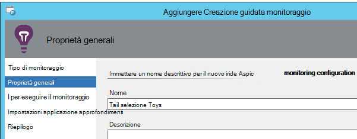
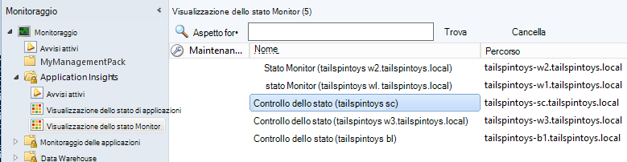

<properties 
    pageTitle="Integrazione di SCOM con informazioni dettagliate sui applicazione | Microsoft Azure" 
    description="Se si è un utente SCOM, monitoraggio delle prestazioni e diagnosticare i problemi con informazioni dettagliate sui applicazione. Dashboard completo, allarmi smart, potenti strumenti di diagnostica e analisi query." 
    services="application-insights" 
    documentationCenter=""
    authors="alancameronwills" 
    manager="douge"/>

<tags 
    ms.service="application-insights" 
    ms.workload="tbd" 
    ms.tgt_pltfrm="ibiza" 
    ms.devlang="na" 
    ms.topic="article" 
    ms.date="08/12/2016" 
    ms.author="awills"/>
 
# Monitoraggio delle prestazioni dell'applicazione con informazioni dettagliate sui applicazione per SCOM

Se si utilizza System Center Operations Manager (SCOM) la gestione dei server, è possibile eseguire il monitoraggio delle prestazioni e diagnosticare i problemi di prestazioni con l'aiuto di [Visual Studio applicazione approfondimenti](app-insights-asp-net.md). Informazioni dettagliate sui applicazione controlla le richieste in arrivo dell'applicazione web, in uscita resto e le chiamate SQL, eccezioni e tracce di log. Fornisce dashboard con grafici metrici e smart avvisi, nonché potente ricerca diagnostica e query analitiche su questo telemetria. 

È possibile passare in applicazione approfondimenti monitoraggio utilizzando un SCOM management pack.

## Prima di iniziare

Si supponga di:

* Ha familiarità con SCOM e utilizzare SCOM 2012 R2 o 2016 per gestire il IIS server web.
* È già stato installato sui server di un'applicazione web che si desidera eseguire il monitoraggio con informazioni dettagliate sui applicazione.
* Versione framework App è .NET 4.5 o versioni successive.
* È possibile accedere a un abbonamento a [Microsoft Azure](https://azure.com) e possono accedere al [portale di Azure](https://portal.azure.com). L'organizzazione potrebbe avere un abbonamento e possibile aggiungere l'account Microsoft.

(Il team di sviluppo potrebbe creare l' [Applicazione approfondimenti SDK](app-insights-asp-net.md) nell'app web. Questa fase di compilazione strumentazione loro offre maggiore flessibilità nella scrittura di telemetria personalizzato. Tuttavia, non è importante: è possibile seguire la procedura descritta di seguito con o senza SDK incorporate.)

## (Una volta) Installare applicazioni approfondimenti management pack

Nel computer in cui viene eseguito Operations Manager:

2. Disinstallare una versione precedente del management pack:
 1. In Operations Manager, aprire Amministrazione, Management Pack. 
 2. Eliminare la versione precedente.
1. Scaricare e installare il management pack dal catalogo.
2. Riavviare Operations Manager.

## Creare un management pack

1. In Operations Manager, aprire **creazione condivisa**, **.NET … con informazioni dettagliate sui applicazione**, **Monitoraggio installazione guidata**e scegliere di nuovo **.NET … con informazioni dettagliate sui applicazione**.

    

2. Nome configurazione dopo l'applicazione. (È necessario dotare uno app alla volta.)
    
    

3. Nella stessa pagina della procedura guidata crea un nuovo management pack oppure selezionare un pacchetto creato in precedenza per informazioni dettagliate sui applicazione.

     (L' applicazione approfondimenti [management pack di](https://technet.microsoft.com/library/cc974491.aspx) è un modello, da cui si crea un'istanza. È possibile riutilizzare la stessa istanza in un secondo momento.)

    

4. Scegliere un'applicazione che si desidera eseguire il monitoraggio. La funzionalità di ricerca Cerca tra App installate nel server.

    

    Il campo di ambito monitoraggio facoltativo può essere utilizzato per specificare un sottoinsieme dei server, se non si desidera eseguire il monitoraggio delle app in tutti i server.

5. Nella pagina successiva della procedura guidata, è innanzitutto necessario specificare le credenziali per accedere a Microsoft Azure.

    In questa pagina è scegliere la risorsa applicazione approfondimenti in cui si desidera analizzare e visualizzare i dati di telemetria. 

 * Se l'applicazione è stata configurata per informazioni dettagliate sui applicazione durante lo sviluppo, selezionare la risorsa esistente.
 * In caso contrario, creare una nuova risorsa denominata per l'app. Se sono presenti altre applicazioni che fanno parte di sistema stesso, inserirli nello stesso gruppo di risorse, per facilitare l'accesso a di telemetria gestire.

    È possibile modificare queste impostazioni in un secondo momento.

    

6. Completare la procedura guidata.

    
    
Ripetere questa procedura per ogni app che si desidera eseguire il monitoraggio.

Se è necessario modificare le impostazioni in un secondo momento, aprire nuovamente le proprietà del monitor nella finestra di modifica.

## Verificare il monitoraggio

Il monitor che sia installato ricerche per l'app in tutti i server. Nel punto in cui viene trovata l'app viene configurato applicazione approfondimenti stato Monitor per monitorare l'app. Se necessario, prima di tutto controllo dello stato viene installata nel server.

È possibile verificare quali istanze dell'app che è stata rilevata:

## Visualizzazione di telemetria in applicazione approfondimenti

Nel [portale di Azure](https://portal.azure.com), passare alla risorsa per un'app. Viene [visualizzato grafici con telemetria](app-insights-dashboards.md) dell'app. (Se non è visualizzata pagina principale ancora, fare clic su flusso metriche Live).

## Passaggi successivi

* [Configurare un dashboard](app-insights-dashboards.md) per raggruppare i tipi di grafici più importanti monitoraggio questa e altre applicazioni.
* [Informazioni sulle metriche](app-insights-metrics-explorer.md)
* [Impostare avvisi](app-insights-alerts.md)
* [Diagnosticare i problemi di prestazioni](app-insights-detect-triage-diagnose.md)
* [Query Analitica efficaci](app-insights-analytics.md)
* [Test web disponibilità](app-insights-monitor-web-app-availability.md)
