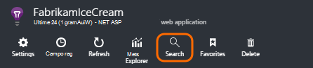
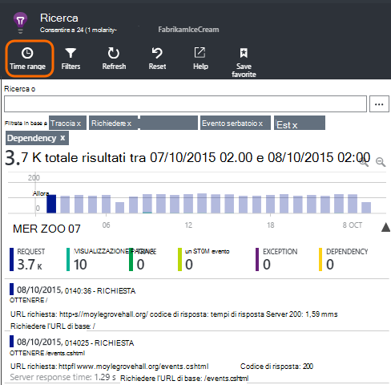
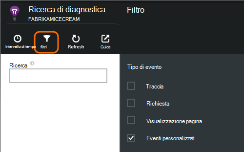
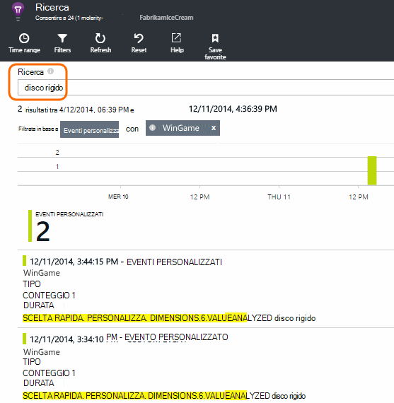
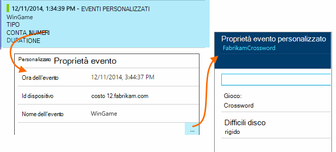
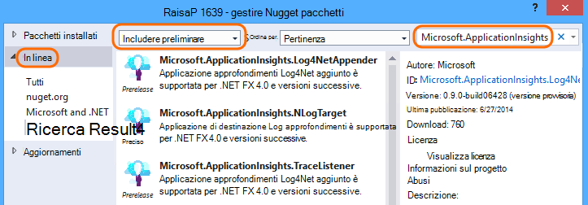
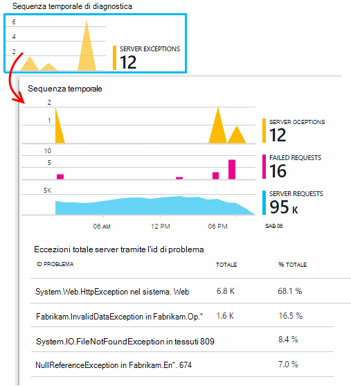
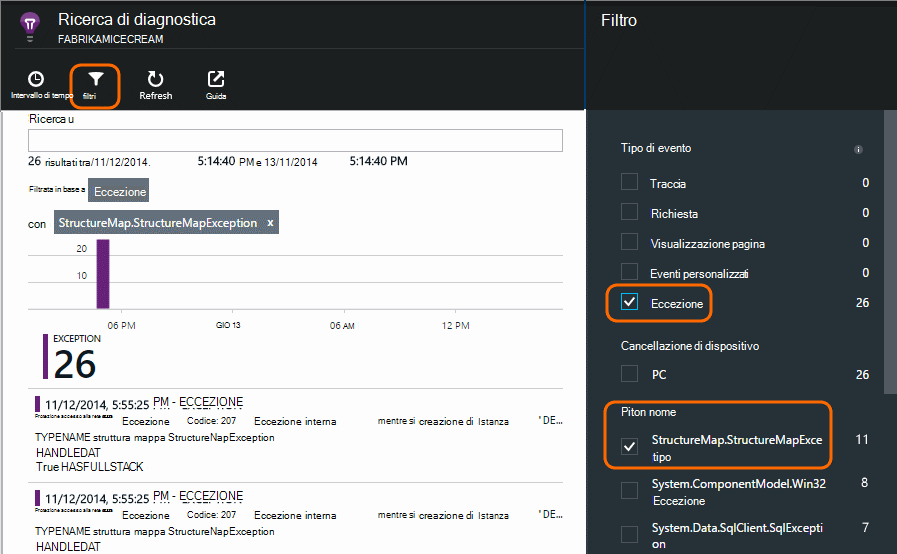

<properties 
    pageTitle="Log, eccezioni e diagnostica personalizzata per ASP.NET nell'applicazione approfondimenti" 
    description="Diagnosticare i problemi di applicazioni web ASP.NET cercando registri generati con traccia, NLog o Log4Net, eccezioni e le richieste." 
    services="application-insights" 
    documentationCenter=""
    authors="alancameronwills" 
    manager="douge"/>

<tags 
    ms.service="application-insights" 
    ms.workload="tbd" 
    ms.tgt_pltfrm="ibiza" 
    ms.devlang="na" 
    ms.topic="article" 
    ms.date="04/08/2016" 
    ms.author="awills"/>
 
# Log, eccezioni e diagnostica personalizzata per ASP.NET nell'applicazione approfondimenti

[Informazioni dettagliate sui applicazione] [ start] include una potente [Ricerca diagnostica] [ diagnostic] strumento che consente di esplorare ed eseguire il drill-di telemetria inviato da SDK approfondimenti applicazione dall'applicazione in uso. Molti eventi, ad esempio visualizzazioni pagina utente vengono automaticamente inviati da SDK.

È inoltre possibile scrivere codice per inviare eventi personalizzati, eccezione report e analisi. E se si usa già una struttura di registrazione, ad esempio log4J, log4net, NLog o System.Diagnostics.Trace, è possibile raccogliere i registri e includerli nella ricerca. In questo modo facile correlare log tracce con le azioni dell'utente, le eccezioni e altri eventi.

## Prima di scrivere telemetria personalizzato

Se non è ancora [configurare approfondimenti applicazione per il progetto][start], farlo adesso.

Quando si esegue l'applicazione, verrà inviato alcuni telemetria che verrà visualizzato nella ricerca diagnostica, incluse le richieste ricevute dal server, pagina visualizzazioni registrate il client non intercettata eccezioni.

Aprire la ricerca diagnostica per visualizzare il telemetria SDK invia automaticamente.

I dettagli variano da un'applicazione tipo a altro. È possibile passare da un singolo evento per ottenere maggiori dettagli.

## Esempio 

Se l'applicazione invia una grande quantità di dati e si utilizza SDK approfondimenti di applicazione per ASP.NET versione 2.0.0-beta3 o versioni successive, la caratteristica di adattamento campioni potrebbe funzionare e inviare solo una percentuale del telemetria. [Ulteriori informazioni su campioni.](app-insights-sampling.md)

##Eventi personalizzati

Eventi personalizzati è compaiano entrambi nella [Ricerca diagnostica] [ diagnostic] e in [Unità di misura metriche Explorer][metrics]. È possibile inviare loro di dispositivi, pagine web e applicazioni server. Possono essere utilizzati per diagnostica e per [ottenere informazioni sui modelli di utilizzo][track].

Un evento personalizzato con un nome e può inoltre includere le proprietà che è possibile filtrare, insieme a unità di misura numerici.

JavaScript client

    appInsights.trackEvent("WinGame",
         // String properties:
         {Game: currentGame.name, Difficulty: currentGame.difficulty},
         // Numeric measurements:
         {Score: currentGame.score, Opponents: currentGame.opponentCount}
         );

C# nel server

    // Set up some properties:
    var properties = new Dictionary <string, string> 
       {{"game", currentGame.Name}, {"difficulty", currentGame.Difficulty}};
    var measurements = new Dictionary <string, double>
       {{"Score", currentGame.Score}, {"Opponents", currentGame.OpponentCount}};

    // Send the event:
    telemetry.TrackEvent("WinGame", properties, measurements);

Aggiornare l'album nel server

    ' Set up some properties:
    Dim properties = New Dictionary (Of String, String)
    properties.Add("game", currentGame.Name)
    properties.Add("difficulty", currentGame.Difficulty)

    Dim measurements = New Dictionary (Of String, Double)
    measurements.Add("Score", currentGame.Score)
    measurements.Add("Opponents", currentGame.OpponentCount)

    ' Send the event:
    telemetry.TrackEvent("WinGame", properties, measurements)

### Eseguire l'app e visualizzare i risultati.

Aprire la ricerca diagnostica.

Selezionare Custom Event e selezionare un nome specifico dell'evento.

Filtrare i dati più immettendo un termine di ricerca un valore di proprietà.  

Drill-down un singolo evento per visualizzare le proprietà dettagliate.

##Visualizzazioni di una pagina

Telemetria visualizzazione pagina viene inviata dalla chiamata trackPageView() nel [frammento di codice JavaScript inserire nelle pagine web][usage]. Lo scopo principale è di collaborazione per il conteggio delle visualizzazioni di pagina che viene visualizzato nella pagina Panoramica.

In genere si tratta di una volta in ogni pagina HTML, ma è possibile inserire altre chiamate, ad esempio, se si dispone di un'app di pagine singole e si desidera registrare una nuova pagina ogni volta che l'utente ottiene più dati.

    appInsights.trackPageView(pageSegmentName, "http://fabrikam.com/page.htm"); 

A volte è utile allegare proprietà che è possibile utilizzare come filtri nella ricerca diagnostica:

    appInsights.trackPageView(pageSegmentName, "http://fabrikam.com/page.htm",
     {Game: currentGame.name, Difficulty: currentGame.difficulty});

##Tenere traccia dei telemetria

Traccia telemetria è codice che si inserisce specificamente per creare registri diagnostici. 

Ad esempio, è possibile inserire le chiamate di questo:

    var telemetry = new Microsoft.ApplicationInsights.TelemetryClient();
    telemetry.TrackTrace("Slow response - database01");

####  Installare una scheda per il framework di registrazione

È inoltre possibile cercare i registri generati con una struttura di registrazione - log4Net NLog o System.Diagnostics.Trace. 

1. Se si prevede di utilizzare log4Net o NLog, installarlo in un progetto. 
2. In Esplora soluzioni mouse sul progetto e scegliere **Gestisci pacchetti NuGet**.
3. Seleziona Online > tutte, selezionare **Includi preliminare** e cercare "Microsoft.ApplicationInsights"

    

4. Selezionare il pacchetto appropriato - uno dei:
  + Microsoft.ApplicationInsights.TraceListener (per acquisire System.Diagnostics.Trace chiamate)
  + Microsoft.ApplicationInsights.NLogTarget
  + Microsoft.ApplicationInsights.Log4NetAppender

Pacchetto NuGet installa assembly necessari e consente di modificare anche config o App.

#### Inserire le chiamate del log diagnostici

Se si usa System.Diagnostics.Trace, dovrebbero essere una tipica chiamata:

    System.Diagnostics.Trace.TraceWarning("Slow response - database01");

Se si preferisce log4net o NLog:

    logger.Warn("Slow response - database01");

Eseguire l'app in modalità debug o distribuirla.

I messaggi in ricerca diagnostica verrà visualizzato quando si seleziona il filtro di analisi.

### Eccezioni

Acquisizione eccezione report nella approfondimenti applicazione offre un'esperienza molto potente, in particolare perché è possibile spostarsi tra le eccezioni e le richieste non riuscite e leggere lo stack dell'eccezione.

In alcuni casi, è necessario [inserire alcune righe di codice] [ exceptions] per assicurarsi che le eccezioni sono che venga rilevate automaticamente.

È anche possibile scrivere codice esplicito per l'invio di telemetria eccezione:

JavaScript

    try 
    { ...
    }
    catch (ex)
    {
      appInsights.TrackException(ex, "handler loc",
        {Game: currentGame.Name, 
         State: currentGame.State.ToString()});
    }

C#

    var telemetry = new TelemetryClient();
    ...
    try 
    { ...
    }
    catch (Exception ex)
    {
       // Set up some properties:
       var properties = new Dictionary <string, string> 
         {{"Game", currentGame.Name}};

       var measurements = new Dictionary <string, double>
         {{"Users", currentGame.Users.Count}};

       // Send the exception telemetry:
       telemetry.TrackException(ex, properties, measurements);
    }

VISUAL BASIC

    Dim telemetry = New TelemetryClient
    ...
    Try
      ...
    Catch ex as Exception
      ' Set up some properties:
      Dim properties = New Dictionary (Of String, String)
      properties.Add("Game", currentGame.Name)

      Dim measurements = New Dictionary (Of String, Double)
      measurements.Add("Users", currentGame.Users.Count)
  
      ' Send the exception telemetry:
      telemetry.TrackException(ex, properties, measurements)
    End Try

I parametri di proprietà e le misure sono facoltativi, ma sono utili per il filtraggio e aggiunta di informazioni aggiuntive. Se si dispone di un'app che è possibile eseguire giochi diversi, ad esempio, è possibile trovare tutti i report di eccezione correlati a un determinato gioco. È possibile aggiungere tutti gli elementi in una tabella per ciascun dizionario.

#### Eccezioni di visualizzazione

Verrà visualizzato un riepilogo delle eccezioni segnalato per e il Panoramica ed è possibile scorrere per visualizzare ulteriori dettagli. Per esempio:

[]

Fare clic su qualsiasi tipo di eccezione per visualizzare le occorrenze specifiche:

[]

È anche possibile aprire ricerca diagnostica direttamente, applicare il filtro eccezioni e scegliere il tipo di eccezione che si desidera visualizzare.

### Creazione di report eccezioni non gestite

Applicazione report approfondimenti eccezioni non gestite in cui è possibile, da dispositivi, [browser][usage], o server web, se forniti dal [Controllo dello stato] [ redfield] o [Applicazione approfondimenti SDK][greenbrown]. 

Tuttavia, non è sempre possibile eseguire questa operazione in alcuni casi perché .NET framework rileva le eccezioni.  Per verificare che sia disponibile tutte le eccezioni, è necessario pertanto scrivere un gestore eccezione piccole. La procedura migliore varia con la tecnologia. Vedere [telemetria eccezione per ASP.NET] [ exceptions] per informazioni dettagliate. 

### Correlazione con una generazione

Quando si leggono registri diagnostici, è probabile che il codice sorgente verrà modificati da codice attivo è stato distribuito.

Pertanto è utile inserire una proprietà insieme a ogni eccezione o traccia le informazioni, ad esempio l'URL della versione corrente. 

Invece di aggiungere la proprietà separatamente per ogni chiamata eccezione, è possibile impostare le informazioni nel contesto predefinito. 

    // Telemetry initializer class
    public class MyTelemetryInitializer : ITelemetryInitializer
    {
        public void Initialize (ITelemetry telemetry)
        {
            telemetry.Properties["AppVersion"] = "v2.1";
        }
    }

Nell'inizializzatore di app, ad esempio Global.asax.cs:

    protected void Application_Start()
    {
        // ...
        TelemetryConfiguration.Active.TelemetryInitializers
        .Add(new MyTelemetryInitializer());
    }

###Richieste di server Web

Richiesta di telemetria viene inviata automaticamente quando si [Installa controllo dello stato sul server web][redfield], o quando l' [aggiunta di informazioni dettagliate sui applicazione al progetto web][greenbrown]. Anche feed nei grafici di tempo richiesta e risposta in Esplora unità di misura metriche e nella pagina Panoramica.

Se si desidera inviare eventi aggiuntivi, è possibile utilizzare l'API TrackRequest().

## Domande e risposte

### Viene visualizzato un messaggio di errore "strumentazione chiave non può essere vuota"

Simile è installato il pacchetto di Nuget scheda registrazione senza installare approfondimenti applicazione.

In Esplora soluzioni fare doppio clic `ApplicationInsights.config` e scegliere **Aggiorna applicazione approfondimenti**. Si riceverà una finestra di dialogo che richiede di accedere a Azure e creare una risorsa applicazione approfondimenti o riutilizzare uno esistente. Che deve risolvere il problema.

### Viene mantenuta la quantità di dati?

Fino a 500 eventi al secondo da ogni applicazione. Eventi vengono conservati per sette giorni.

### Alcune delle eventi o tracce non vengono visualizzati

Se l'applicazione invia una grande quantità di dati e si utilizza SDK approfondimenti di applicazione per ASP.NET versione 2.0.0-beta3 o versioni successive, la caratteristica di adattamento campioni potrebbe funzionare e inviare solo una percentuale del telemetria. [Ulteriori informazioni su campioni.](app-insights-sampling.md)

## Passaggi successivi

* [Configurare la disponibilità e i test di velocità di risposta][availability]
* [Risoluzione dei problemi][qna]

<!--Link references-->

[availability]: app-insights-monitor-web-app-availability.md
[diagnostic]: app-insights-diagnostic-search.md
[exceptions]: app-insights-asp-net-exceptions.md
[greenbrown]: app-insights-asp-net.md
[metrics]: app-insights-metrics-explorer.md
[qna]: app-insights-troubleshoot-faq.md
[redfield]: app-insights-monitor-performance-live-website-now.md
[start]: app-insights-overview.md
[track]: app-insights-api-custom-events-metrics.md
[usage]: app-insights-web-track-usage.md

 
